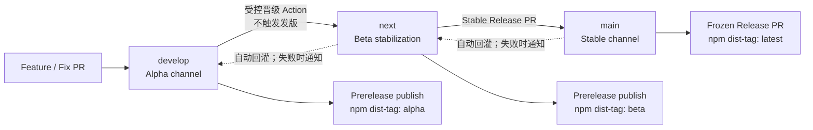
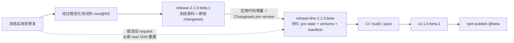
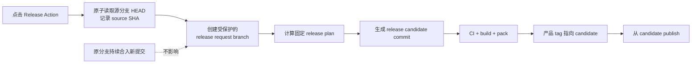
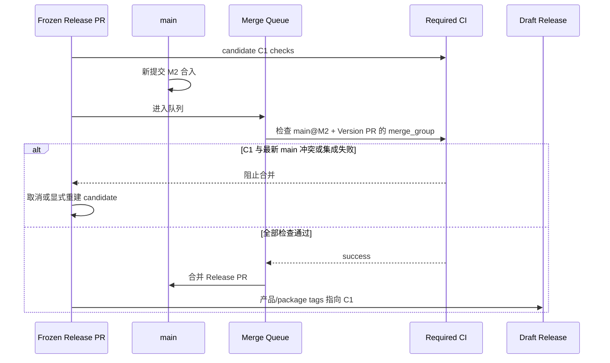
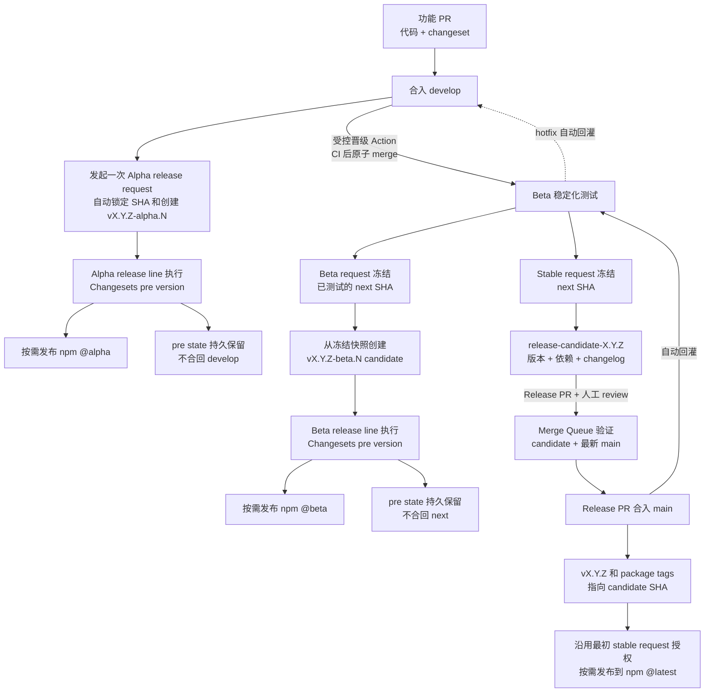
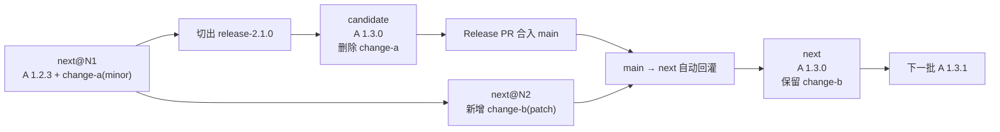
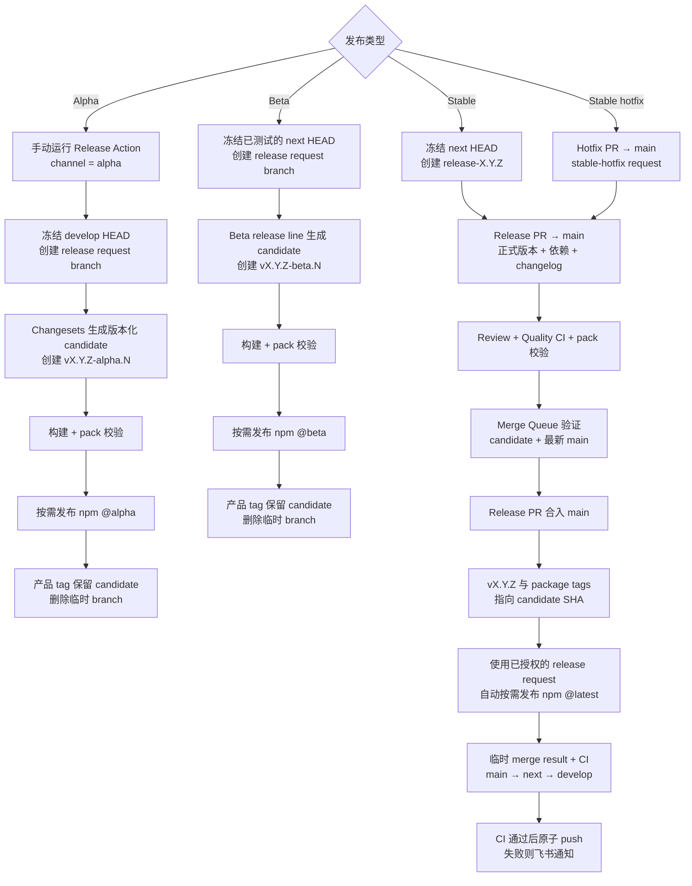

# Branch and Release

> 状态：提案。本文描述 NocoBase 3 的目标流程；对应 Changesets 配置和 GitHub Actions 尚未落地。

## 背景

NocoBase 2 使用三条长期分支承载三个发布渠道：

| 分支      | 发布阶段 | npm dist-tag |
| --------- | -------- | ------------ |
| `main`    | 稳定版   | `latest`     |
| `next`    | Beta     | `beta`       |
| `develop` | Alpha    | `alpha`      |

代码通常在 `develop` 或 `next` 开发，并按 `develop -> next -> main` 的方向逐步晋级。稳定分支上的修复则按 `main -> next -> develop` 的方向回灌。

NocoBase 2 的实现同时耦合了以下操作：

- `release.sh` 根据当前分支计算 alpha、beta 或稳定版本。
- Lerna 通过 `forcePublish` 给所有 workspace package 写入同一个版本。
- release workflow 在多个仓库和多条长期分支之间直接执行 `git merge` 和 `git push`。
- 版本提交、Git tag、分支同步、全仓构建和 npm publish 位于同一条长工作流中。
- 发布全部 package 后，再根据 Git tag 中的 alpha/beta 字样选择 npm dist-tag。

这种设计能保持所有包和分支版本一致，但也带来了几个问题：

1. 任意小改动都需要重新版本化、构建和发布全部 package。
2. package 数量增加后，发布越来越慢，单包失败也会使整批发布难以恢复。
3. workflow 会直接修改并推送长期分支；发布期间的新提交可能改变构建输入或造成 CI、merge 冲突。
4. 版本号既表达产品发布阶段，又被用来同步整个 monorepo，无法反映单个 package 的真实兼容性。
5. 预发布版本提交会在 `main`、`next`、`develop` 之间传播，持续制造 package.json 和 lockfile 冲突。

NocoBase 3 保留团队熟悉的三条渠道分支，但需要解除“分支同步、版本计算、制品发布”之间的绑定。

## 目标

- 保留 `main`、`next`、`develop` 对应 stable、beta、alpha 的认知。
- package 默认使用独立版本，只发布实际变化的 package 和必要的依赖方。
- 发布输入必须是不可变的 Git commit/tag，不能在发布期间跟随分支移动。
- Alpha/Beta 发布不能在长期分支中留下临时版本修改。
- 稳定版本号、changelog 和内部依赖范围必须经过可审阅的 Pull Request。
- npm publish 保持人工触发，但版本计算、构建顺序和上传由 CI 执行。
- 部分发布失败后可以从同一 release ref 幂等重试。
- 长期分支之间的晋级和回灌与发版解耦；Bot 在临时 ref 验证 merge result，通过 CI 后使用带 lease 的原子 push 更新目标分支。

## 非目标

- 不要求所有 package 使用相同版本号。
- 不要求每次产品发布都重新发布全部 package。
- 不使用分支名代替 package 兼容性声明。
- 不在第一阶段同时重构 Docker、商业插件和外部仓库的全部发布流程；这些制品后续可以消费同一个不可变 release ref。

## 核心决策

### 保留三条长期分支，但只负责代码成熟度

| 分支      | 代码含义        | 版本落库策略          | npm dist-tag |
| --------- | --------------- | --------------------- | ------------ |
| `develop` | 最新集成代码    | Alpha prerelease line | `alpha`      |
| `next`    | Beta 稳定化代码 | Beta prerelease line  | `beta`       |
| `main`    | 稳定代码        | Frozen Release PR     | `latest`     |

分支决定“从哪一份代码发布”，Changesets 决定“哪些 package 发布以及各自是什么版本”。

三条分支并没有使用三套 package 发布机制：它们都根据同一批 changeset 计算 release plan，也都只构建和发布计划内的 package。区别仅在版本是否写回 Git：

- Alpha/Beta 在独立 release line 中使用 Changesets prerelease mode 持久记录预发布消费状态，不把预发布版本写回长期分支。
- Stable 是对用户的正式版本承诺，因此通过可审阅的 Frozen Release PR 持久化版本、依赖范围和 changelog。



实线表示代码从不稳定渠道向稳定渠道晋级；虚线表示稳定修复和正式版本元数据向不稳定分支自动回灌。`develop -> next` 只改变 Beta 稳定化范围，不创建产品 tag，也不发布 npm。代码进入 `next` 后可以测试数天或数周，维护者确认某个 `next` SHA 已完成验证时，再单独发起 Beta release request。

### package 默认独立版本

Changesets 使用 independent versioning：

- `fixed: []`
- `linked: []`
- 每个 package 独立选择 patch、minor 或 major。
- 内部依赖的新版本超出当前 SemVer range 时，Changesets 自动更新依赖方并至少发布一个 patch。
- 一次重大变更可以在同一个 changeset 中声明多个 package，但不要求它们的新版本号相同。

只有存在强制同步兼容约束的小型 package 集合，未来才考虑加入 `fixed`。不能仅因为两个 package 当前版本相同就将它们设置为 fixed。

### 产品版本与 package 版本分层

NocoBase 3 使用两层独立版本：

- **产品版本**：主仓库 GitHub Release/tag，对用户表达一次完整的 NocoBase 发布，例如 `v2.1.0-alpha.1`、`v2.1.0-beta.1`、`v2.1.0`。
- **package 版本**：每个 npm package 按自身 SemVer 独立演进，例如同一次 `v2.1.0` 产品发布包含 `@nocobase/portal-sdk@2.2.0` 和 `@nocobase/database@0.2.0`。

三条分支使用同一条产品版本线：

```text
develop  v2.1.0-alpha.1 -> v2.1.0-alpha.2
next     v2.1.0-beta.1  -> v2.1.0-beta.2
main     v2.1.0
```

主仓库根 package.json 的 `version` 作为不发布到 npm 的产品稳定版本，只在 Stable Release PR 中更新。Alpha/Beta 产品版本、package prerelease versions 和 pre state 都不写回长期分支。

发起新产品版本线的第一次 Alpha release request 时，维护者输入目标产品版本，例如 `2.1.0`。后续阶段自动继承：

1. 后续 Alpha 从 `develop` 可达的最新 `v2.1.0-alpha.N` 推导产品版本并递增 N。
2. 第一次 Beta release request 继承当前 Alpha 产品线的 `2.1.0`，从 `v2.1.0-beta.1` 开始；如果同时存在多条活跃产品线，维护者需要明确选择目标版本。
3. Stable release request 继承 Beta 的 `2.1.0`，最终创建 `v2.1.0`。
4. Stable hotfix 可以从根稳定版本自动执行 patch bump，也允许维护者显式指定目标版本。

workflow 必须校验产品版本单调递增、渠道与分支匹配，并禁止同一个产品 tag 指向不同 commit。

例如 `main` 发布产品 `v2.0.1` 并同步到 `next` 后，`next` 根 package.json 的稳定基线会更新为 `2.0.1`，但正在进行的 `v2.1.0-beta.N` 产品线不会丢失。它记录在 `next` 可达的产品 prerelease tags 和 active release request metadata 中；下一次 Beta 继续创建 `v2.1.0-beta.N+1`。这与单个 package 的“稳定基线 + 未消费 changeset”计算方式一致。

### 点击发布时冻结源码快照

`release-packages.yml` 启动后的第一步不是继续在移动的长期分支上工作，而是原子地读取渠道对应的分支 HEAD SHA，并创建不可变的 batch source ref：

```text
alpha   develop@D1 -> release-2.1.0-alpha.1
beta    next@N2    -> release-2.1.0-beta.1
stable  next@N1    -> release-2.1.0
```

从这一刻开始，`develop`、`next` 或 `main` 的新提交都不会改变本批发布的源码输入。所有 release plan、构建、测试、pack 和 publish 都显式 checkout 已记录的 candidate SHA，不再读取分支 HEAD。

release request 保存三个锚点：

- `sourceSha`：点击 Action 后读取到的原分支 commit，后续永不改变。
- `releaseHeadSha`：release source branch 的当前 head。Alpha/Beta source ref 默认不可人工修改，因此它与 `sourceSha` 相同；Stable 允许维护者按后文规则追加经过审阅的特殊修复，每次变化都会更新该值。
- `candidateSha`：Bot 从当前 `releaseHeadSha` 重新生成版本文件后的发布 commit；只有最新 generation 通过全部检查后才 seal。

release branch 的命名直接表达产品版本和渠道：

```text
release-2.1.0-alpha.1
release-2.1.0-beta.1
release-2.1.0
```

release source branch 与 Bot 生成的 candidate 分开：

```text
release-2.1.0-beta.1            # 从已测试 next SHA 创建的只读批次快照
release-line-2.1.0-beta         # Bot 持久维护该产品线 Beta pre state

release-2.1.0                   # Stable source snapshot
release-candidate-2.1.0         # Stable Release PR head
```

这样 Changesets 生成和移动 changeset 文件的操作不会污染长期分支或本批 source ref。Alpha/Beta release line 跨多个预发布批次保留 package prerelease versions 和 `.changeset/pre/`；Stable candidate 是单次发布分支。

两类分支的职责不同：

| 分支或 ref                  | 内容                                                                            | 谁可以修改               | 生命周期                                                       |
| --------------------------- | ------------------------------------------------------------------------------- | ------------------------ | -------------------------------------------------------------- |
| `release-2.1.0-beta.1`      | 从已测试 `next` SHA 冻结的业务源码和原始 changeset，不含生成版本文件            | 仅 Release Bot，人工只读 | 本批发布完成后删除                                             |
| `release-line-2.1.0-beta`   | Bot 持久维护的 Beta package versions、`.changeset/pre/`、lockfile 和 manifests  | 仅 Release Bot，人工只读 | 持续到该产品线 Stable 完成；每个产品 tag 指向对应 batch commit |
| `v2.1.0-beta.1` 对应 commit | 本批通过 CI 并 seal 的不可变 candidate，位于 `release-line-2.1.0-beta` 的历史中 | 无                       | 永久，由产品 tag 保持可达                                      |

source ref 回答“本批要带哪些代码”，release line 回答“该产品预发布线已经消费过哪些 changeset、当前各 package 是什么版本”。Beta 修复先进入 `next`，再自动回灌到 `develop`。request 冻结后如果还要纳入修复，维护者需要先把修复合入 `next`，然后在创建产品 tag 前取消旧 request，并从新的 `next` SHA 重建同一预留批次；不能只修改 source ref 或 release line，留下 `next` 不包含的 Beta 代码。

candidate 生成 workflow 同时提供自动和手动入口：

- 自动：`push` 到匹配 `release-*` 的 source branch 时触发，使用 Actions `concurrency` 取消同一 request 的旧 generation 并重建 candidate。
- 手动：`workflow_dispatch` 选择现有 release request，可执行 `rebuild`、`retry-checks` 或 `resume-publish`。手动模式仍从已记录的 `releaseHeadSha`/`candidateSha` 工作，不能偷偷改用最新长期分支。
- 两种入口调用同一个 reusable workflow 和同一套校验，避免自动、手动生成不同结果。

自动重建用于 Stable release branch 追加修复，以及 Bot 重新生成 Alpha/Beta batch source ref；手动入口用于 Actions 故障、外部 registry 暂时失败或需要审计式重跑，不用于绕过失败检查。



最终发布确实基于 candidate，而不是 source branch、长期分支 HEAD 或 PR merge commit：

```text
source ref       用于收集本批代码
candidate commit 用于生成并审阅发布产物；Alpha/Beta 位于 release line，Stable 位于 candidate branch
candidateSha     用于 build / pack / tags / npm publish / manifest
```

candidate 全部检查通过后被 seal。发布 workflow 校验当前 release line/candidate branch HEAD、release request 中的 `candidateSha`、tag target 和 manifest commit 四者完全一致，任何一项变化都会拒绝发布。

source ref 更新或 candidate 重试都必须保持可审计，自动化规则如下：

1. Bot 更新 release source ref 后，Actions `concurrency` 自动取消该 request 仍在运行的旧 candidate jobs。
2. Bot 从上一个已发布 candidate commit 创建临时 generation，重新应用本批 source 增量并生成 release manifest 和动态构建矩阵。
3. required checks 全部重跑；Stable Release PR 同时更新 head SHA。
4. 旧 candidate 没有发布权限，也不会创建正式产品 tag；只有最新 generation 可以 seal 和 publish。
5. Stable Release PR 已合并或产品 tag 已创建后，release branch 转为只读；后续修复必须创建新的 release request。

Alpha/Beta request 冻结后，普通 `develop`、`next` 提交不会自动进入本批。如果必须纳入长期分支上的新修复，维护者取消旧 request，再从新的渠道 HEAD 重建；只要产品 tag 尚未创建，就复用已经预留的产品批次序号，不额外消耗一个 `alpha.N`/`beta.N`。

Stable 的特殊修复可以通过 PR 合入 release source branch，也可以在 `release-packages.yml` 的“更新现有 request”模式中提供 commit SHA，由 Bot 自动 cherry-pick。无冲突时自动更新 branch 和 candidate；有冲突时创建待处理 PR并暂停发布，不能跳过冲突继续。Alpha/Beta 不走这条旁路，修复必须先进入 `develop`/`next`，避免预发布源码和后续 Stable 源码分叉。

Stable Release PR 的分支规则必须开启“新提交后撤销旧审批”。candidate 更新时 GitHub 会把 PR 移出 Merge Queue，等待新一轮 CI 和 review；不能沿用旧 candidate 的批准自动合并新内容。Alpha/Beta 没有晋级 PR，但重建 source ref 后同样必须撤销旧 candidate 的 seal 状态并重跑检查。

不同渠道对快照的处理如下：

- **Alpha**：将 `develop` 快照增量应用到 `release-line-X.Y.Z-alpha`；`vX.Y.Z-alpha.N` 指向本批 candidate commit。release line 持续保留 pre state，source batch branch 发布后可删除。
- **Beta**：`develop -> next` 已在发版前通过独立的受控晋级 Action 完成，`next` 可以继续稳定化测试并接收修复。Beta release request 只冻结维护者确认通过的 `next` SHA，并将相对上一批 Beta checkpoint 的增量应用到 `release-line-X.Y.Z-beta`。`vX.Y.Z-beta.N` 指向本批 candidate commit，release line 不合入 `next`。
- **Stable**：从 `next` 快照创建 `release-X.Y.Z` source branch；Bot 从它生成 `release-candidate-X.Y.Z`，运行 `changeset version` 并更新根产品版本。这条 candidate branch 是 Release PR 的 head，目标为 `main`。`vX.Y.Z` 和本批 package tags 都指向最终 candidate commit。

Alpha/Beta release line 是 Bot 管理的产品版本线状态，不属于长期开发分支；产品完成 Stable 后可以删除 branch，历史 batch commits 继续由产品 tags 保持可达。`develop`、`next`、`main` 始终只保存稳定 package versions 和原始 changesets，避免把 `*-alpha.N`、`*-beta.N` 或 `.changeset/pre/` 带入代码晋级和回灌。



如果 Stable Release PR 等待期间 `main` 发生变化，Merge Queue 负责验证 release candidate 与最新目标分支能否共存，但不能把 `main` 的新提交加入 npm 发布输入。Alpha/Beta request 冻结后，`develop` 或 `next` 的新提交同样不能静默进入本批；它们由后续 request 处理，或者在产品 tag 创建前取消当前 request 并从新 SHA 重建同一预留批次。出现冲突时暂停请求，维护者选择取消并从新 SHA 重建，或显式解决冲突后形成新的 candidate SHA 并重新跑完 CI。

### Alpha/Beta 使用 Changesets prerelease mode

长期 Alpha/Beta 渠道不使用 Snapshot。Snapshot 每次都会重新读取长期分支中全部未 Stable 的 changeset，无法知道某个 package 已在上一次 Alpha 发布过。NocoBase 的渠道发布需要“没有新 changeset 的 package 不重发”，因此使用 Changesets prerelease mode，并将状态持久化在产品版本线的 release line。

这是对早期 Snapshot 方案的修正。两种模式的差别是：

| 模式            | 是否持久记录已处理 changeset                        | 下次发布 A 没有新变化时       |
| --------------- | --------------------------------------------------- | ----------------------------- |
| Snapshot        | 否；每次从长期分支重新读取全部文件                  | A 会再次进入 release plan     |
| Prerelease mode | 是；release line 将已处理文件移入 `.changeset/pre/` | A 不进入 release plan，不重发 |

仅有 prerelease mode 状态还不够，workflow 同时记录 `lastSourceSha`。每一批只把长期分支从上一个 source checkpoint 到当前 source SHA 的 Git 增量应用到 release line：

```text
release line:
  package versions
  .changeset/pre/     # 已经预发布的 changeset IDs
  lastSourceSha       # 上一批已经吸收到了 develop/next 的哪个 commit

下一批：
  计算 lastSourceSha..currentSourceSha
  只应用新增代码和新增 changeset
  已存在于 .changeset/pre/ 的旧文件不会重新加入根 .changeset/
```

每条 release line 的 checkpoint 固定来自一条长期分支：

| Release line               | Canonical source | `lastSourceSha` 的含义                       |
| -------------------------- | ---------------- | -------------------------------------------- |
| `release-line-X.Y.Z-alpha` | `develop`        | 上一批 Alpha 已吸收的 `develop` commit       |
| `release-line-X.Y.Z-beta`  | `next`           | 上一批 Beta 已吸收并完成测试的 `next` commit |

Bot 必须验证 `lastSourceSha` 是当前 `sourceSha` 的祖先，再计算增量。`develop -> next` 晋级和 `next -> develop` 回灌都保留 merge ancestry，因此 Beta checkpoint 始终位于同一条 `next` 历史上。不能把短命 `release-X.Y.Z-beta.N` 的 head 或 squash commit 当作下一批 checkpoint；祖先校验失败时停止并通知，不能退回到 `merge-base` 猜测增量。

changeset 文件合入长期分支后不可原地修改，也是为了让这个增量同步保持确定性。

实现上不对 release line 执行 `git merge develop/next`，否则长期分支仍存在的旧 changeset 可能被重新加回根 `.changeset/`。Bot 只应用 `lastSourceSha..currentSourceSha` 之间的新 commits/diff，并校验 changeset ID：

- 新增且未出现在 `.changeset/pre/` 的文件进入根 `.changeset/`；
- 已记录在 `.changeset/pre/` 的 ID 不重新加入；
- 修改已记录 ID 视为非法，要求在 source branch 新建 changeset；
- 删除长期分支 changeset 时必须有明确取消记录，不能静默改写 pre state。

源码增量和生成状态的文件所有权不同，不能使用一次 `ours`/`theirs` 覆盖完成同步：

| 内容                                      | 同步规则                                                              |
| ----------------------------------------- | --------------------------------------------------------------------- |
| 业务源码和普通配置                        | 对 `lastSourceSha..sourceSha` 应用三方增量，真实冲突时停止            |
| 新 `.changeset/*.md`                      | 按 ID 加入根目录；已经存在于 `pre/` 的 ID 不得重新加入或修改          |
| `package.json`                            | 语义合并业务字段和依赖变化，保留 release line 的 prerelease `version` |
| `.changeset/pre.json`、`.changeset/pre/*` | 只由 release line 和 Changesets v3 维护，长期分支不能覆盖             |
| changelog                                 | 按版本段语义合并，再由 Changesets 追加本批记录                        |
| `pnpm-lock.yaml`                          | 不应用长期分支版本差异；完成语义合并和 version 后重新生成             |
| manifest、checkpoint                      | 只由 Release Bot 生成                                                 |

这层 path-aware/semantic overlay 是 NocoBase release workflow 的能力，不是 Changesets CLI 自带功能。生成结束后，Bot 还要校验业务源码投影与冻结 source 一致、pre state 未回退、checkpoint 单调前进，然后才能提交新的 candidate。

每个产品版本线分别维护 Alpha、Beta prerelease state：

```text
release-line-2.1.0-alpha
  .changeset/pre.json       { "mode": "pre", "tag": "alpha" }
  .changeset/pre/           已参与 Alpha 的 changesets
  package.json              已发布的 package prerelease versions

release-line-2.1.0-beta
  .changeset/pre.json       { "mode": "pre", "tag": "beta" }
  .changeset/pre/           已参与 Beta 的 changesets
  package.json              已发布的 package prerelease versions
```

这些文件只存在于 Bot 管理的 prerelease release line：

```text
develop                              无 pre.json、无 .changeset/pre/
next                                 无 pre.json、无 .changeset/pre/
main                                 无 pre.json、无 .changeset/pre/
release-X.Y.Z-alpha.N / beta.N       无 pre state；用于本批冻结代码快照
release-line-X.Y.Z-alpha/beta        持有 pre.json 和 .changeset/pre/
```

任何代码晋级、自动回灌或 Stable Release PR 都不得以 prerelease release line 为源码。面向 `develop`、`next`、`main` 的 PR/merge result 如果出现 `.changeset/pre.json` 或 `.changeset/pre/`，CI 直接失败。

#### 长期分支没有 pre state 时如何识别增量

识别过程由 Changesets state 和 workflow checkpoint 共同完成，不是只靠 Changesets：

```text
Changesets pre state  记录哪些 changeset IDs 已经参与预发布
lastSourceSha         记录 release line 已同步到长期分支的哪个 commit
```

例如 Alpha 1 完成后：

```text
develop@D10
  change-a.md                 # 长期分支仍保留

release-line-X.Y.Z-alpha
  A@1.2.0-alpha.0
  .changeset/pre/change-a.md  # Changesets 记为已处理
  lastSourceSha = D10         # workflow 记为已同步到 D10
```

随后 `develop@D11` 新增 B 的代码和 `change-b.md`。下一批不是把整个 D11 覆盖到 candidate，也不是重新执行一次完整 merge，而是：

```text
1. 从上一个 Alpha candidate commit 开始
2. 计算 Git diff D10..D11
3. 只应用这段增量中的业务代码和新 changeset IDs
4. 根 .changeset/ 得到 change-b.md
5. .changeset/pre/change-a.md 保持不变
6. Changesets version 只看到尚未处理的 change-b.md
7. 成功后将 lastSourceSha 更新为 D11
```

所以 A 不重发不是因为 `develop` 知道 A 已经发过，而是 release line 同时保留了 A 的 prerelease version 和 `change-a` 的消费记录。`develop` 只负责保存最终 Stable 仍需要的原始发布记录。

该增量应用是 NocoBase release workflow 的编排能力，不是 Changesets CLI 单独提供的功能。workflow 必须保证 checkpoint 单调前进、changeset ID 不重复，并在 Git diff 无法干净应用时停止，而不是退回到复制整个长期分支。

第一次进入渠道时执行：

```bash
pnpm changeset pre enter alpha # Beta 使用 beta
pnpm changeset version
CI=true pnpm install --no-frozen-lockfile
pnpm changeset publish --tag alpha
```

Changesets v3 在 prerelease version 时会把已应用文件从 `.changeset/*.md` 移到 `.changeset/pre/`。下一批只读取新进入根 `.changeset/` 的文件，因此不会仅因为旧 changeset 仍要在最终 Stable 使用，就重复发布没有变化的 package。

这里不需要 NocoBase 自己猜哪些 changeset 已经发布。Changesets 直接用文件 ID 记录状态。假设 release line 第一次运行前有：

```text
.changeset/
  fix-login.md
  add-sso.md
  pre.json             # { "mode": "pre", "tag": "alpha" }
```

执行 `pnpm changeset version` 后：

```text
.changeset/
  pre.json
  pre/
    fix-login.md       # 本批已经应用
    add-sso.md         # 本批已经应用
```

下一批同步进来一个新文件：

```text
.changeset/
  fix-session.md       # 尚未应用
  pre.json
  pre/
    fix-login.md       # 已应用
    add-sso.md         # 已应用
```

Changesets 读取 release line 时能够看到根目录和 `pre/` 两处文件，但在 `mode: pre` 下会把 `pre/` 中的 changeset 排除出本轮 release plan，因此本轮只处理 `fix-session.md`。处理成功后，它也会被移动到 `pre/`。

也就是说：

```text
文件仍在根 .changeset/  = 尚未在该 prerelease line 发布
文件已经位于 pre/       = 已经在该 prerelease line 发布
```

这个状态必须随 release line commit 并持久保存。如果每次都从长期分支重新创建状态，或删除 `.changeset/pre/`，Changesets 就会失去记忆并重复发布旧 package。

产品版本号和 package prerelease 序号是两层计数，不要求相同：

```text
产品 Release v2.1.0-alpha.1
  发布 A@1.2.0-alpha.0

产品 Release v2.1.0-alpha.2
  只有 B 出现新 changeset
  发布 B@3.0.1-alpha.0
  A 不重发，仍使用 A@1.2.0-alpha.0

产品 Release v2.1.0-alpha.3
  A 出现新 changeset
  发布 A@1.2.0-alpha.1
```

产品 tag 的 `.1/.2/.3` 表示全仓产品发布批次；package 的 prerelease counter 只在该 package 再次进入 release plan 时递增。GitHub Prerelease manifest 同时列出本批新发布的 delta 和当前产品版本线的完整 package mapping。

#### 完整例子

初始状态：

```text
develop@D10
A 的稳定基线：1.1.0
change-a.md：A minor
```

发布产品 `v2.1.0-alpha.1`：

```text
建立 Alpha release line
pnpm changeset pre enter alpha
pnpm changeset version

结果：
A = 1.2.0-alpha.0
change-a.md -> .changeset/pre/change-a.md
lastSourceSha = D10
```

随后 `develop@D11` 只增加了 B 和 `change-b.md`，A 没有变化。发布产品 `v2.1.0-alpha.2`：

```text
应用 D10..D11 增量
根 .changeset/ 只有 change-b.md
.changeset/pre/ 已记录 change-a.md

结果：
本批只发布 B
A 仍为 1.2.0-alpha.0，不重新发布
lastSourceSha = D11
```

随后 `develop@D12` 为 A 新增三个 patch changesets。发布产品 `v2.1.0-alpha.3`：

```text
应用 D11..D12 增量
Changesets 将 A 的三个 patch 合并为一个 release

结果：
A = 1.2.0-alpha.1
不是 alpha.4
三个新 changeset 移入 .changeset/pre/
lastSourceSha = D12
```

这里 `alpha.0 -> alpha.1` 是 A 自己的 prerelease counter；产品则从 `v2.1.0-alpha.1 -> alpha.2 -> alpha.3`。两者没有一一对应关系。

第一次从 Alpha 晋级 Beta 时，会建立独立的 Beta release line。因为 Beta 是一个新渠道，它会基于 `next` 的完整原始 changesets 生成首批 Beta，所以 A 可能发布一次 `1.2.0-beta.0`；之后的 Beta 批次同样只处理相对 Beta `lastSourceSha` 的新增 changesets。最终 Stable 不读取 Alpha/Beta 的 `.changeset/pre/`，而是从 `next` 的原始 changesets 一次性计算正式版本。

同一批里 A 有多个 patch changeset，只会产生一次 SemVer bump/一个新的 prerelease：

```text
A 当前为 1.2.0-alpha.1
本批新增 3 个 A patch changesets
结果为 1.2.0-alpha.2
```

不会因为三个 patch 直接跳到 `alpha.4`。若新 changeset 将下一稳定目标提升到更高 minor/major，Changesets会按合并后的最高 bump 计算新的预发布目标。

Alpha 与 Beta 使用独立 pre cycle。第一次 Beta 从已经晋级到 `next` 并完成稳定化测试的源码和原始 changesets 建立 `release-line-X.Y.Z-beta`，因此会生成完整的首批 Beta release set；后续 Beta 只发布新的 changesets。最终 Stable 从 `next` 的原始 changesets 运行普通 `changeset version`，一次性生成正式 versions/changelog 并删除长期分支中的已消费文件。

`develop`、`next` 长期分支仍保存稳定 package version 和原始 changesets；prerelease versions、`.changeset/pre/` 和预发布消费记录只存在于 release line，不自动回写长期分支。

#### Stable 不需要执行 `pre exit`

Changesets 的 `pre exit` 用于在同一个工作分支上从 prerelease 状态切回 stable。本方案没有让 `develop`、`next`、`main` 进入 pre mode，所以 Stable 不从 Alpha/Beta release line 退出，也不合并它们的 pre state。

Stable 独立计算：

```text
next
  package.json = 最近 Stable 版本
  .changeset/*.md = 本产品线全部原始 changesets
  无 pre.json
        ↓ 普通 changeset version（不是 pre exit）
release-candidate-X.Y.Z
  正式 package versions
  changelog
  删除已消费 changesets
        ↓ Release PR
main
```

例如 Beta candidate 已发布到 `A@1.2.0-beta.3`，而 `next` 仍是 `A@1.1.0 + A minor changeset`，Stable 普通 version 会计算出 `A@1.2.0`。

避免冲突依靠状态隔离，而不是自动合并 pre state：Alpha/Beta release lines 互不 merge，也永远不进入长期分支。产品完成 Stable 后可删除 release lines；产品 tags 和 release manifests 保留预发布历史。

Snapshot 只用于 PR preview、nightly 或 canary；它不承担正式 Alpha/Beta 渠道版本管理。

### 稳定版使用 Frozen Release PR

只有 `main` 会持久化正式版本号。

Stable release request 在点击时冻结 `next` 的 SHA，创建 `release-X.Y.Z` source branch，并在 Bot 管理的 `release-candidate-X.Y.Z` 上运行 `changeset version`。candidate branch 形成一次性的 Release PR，包含快照中尚未消费的 changeset，以及：

- 每个受影响 package 的新版本。
- 内部 workspace 依赖范围更新。
- package changelog。
- `pnpm-lock.yaml` 更新。
- 已消费 changeset 文件的删除。

一个 changeset 不会对应一个 Release PR；一次 Stable release request 对应一个冻结的 Release PR。该 PR 创建后，`next`、`main` 新增的提交不会自动加入。如果维护者希望纳入新变化，应取消当前请求并从新的 SHA 重建，而不是静默更新已经 review 的 candidate。

Release PR 合并后，`main` 中才正式出现新版本号。发布使用 release branch 上已经通过 CI 的 candidate SHA；PR 合并本身只触发后续 publish，不重新计算版本或构建输入。

#### Frozen Release PR 的并发保护

Release PR 不能使用“PR 分支检查通过后直接合并”的普通模式。假设 candidate 是 `C1`，在 CI 运行期间新代码 `M2` 进入 `main`；`M2` 不应被加入 npm 发布内容，但仍需要确认 `C1` 可以安全合入最新 `main`。

稳定发布使用 GitHub Merge Queue：

1. Release PR 的 candidate SHA 先完成自身 release plan、Quality、构建和 pack 检查。
2. review 完成后进入 Merge Queue。
3. GitHub 基于当时最新的 `main` 和 Release PR 创建临时 `merge_group` commit，运行集成 required checks。
4. 只有 candidate 检查和 merge group 检查都通过，GitHub 才允许合并。
5. workflow 必须先收到 Release PR `closed + merged=true` 事件，才获得 publish 权限；PR 冲突或合并失败时绝不创建正式 tag、不执行 npm publish。
6. 合并事件校验 PR head SHA 等于 request 中 seal 的 candidate SHA，然后创建产品/package tags并发布该 candidate。

产品 tag 和 package tags都基于 `candidateSha` 创建，不基于 PR 的 squash/merge commit。发布前必须同时满足：

```text
Release PR 已合入 main
AND merged PR head SHA == sealed candidateSha
AND candidate checks 全部通过
```

如果从 candidate 通过 CI 到 PR 合入之间，release source branch 又增加了提交，Bot 会生成新的 candidate、更新 PR head、撤销旧审批并重跑检查；旧 candidate 不能获得 tag 或 publish 权限。因此最终 tag 必然指向“实际合入前最后一版、且通过检查”的 candidate。

所以 Stable 的顺序固定为：

```text
冻结 release branch
  -> 生成 candidate
  -> Release PR CI/review
  -> Merge Queue
  -> Release PR 成功合入 main
  -> 创建 tags
  -> npm publish
```

支持团队现有的 squash merge 习惯。使用 squash 时，candidate SHA 不会成为 `main` 的祖先，但它的改动会被 squash commit 表达；产品 tag、package tags 和 npm publish 仍指向已验证的 candidate SHA，并由 tag 永久保存。workflow 在发布前同时记录：

- `candidateSha`：实际构建和发布的源码；
- `mergedSha`：Release PR 在 `main` 上的 squash commit；
- PR number 和 merge-group checks。

这样既能从 tag 还原准确制品源码，也能从 `main` 历史定位对应的 squash commit。如果希望产品 tag 必须位于 `main` 祖先链，则只能改用 merge commit；这不是正确发布所必需的约束。

`main` 的新提交是否有 changeset不影响本批 release plan，因为它们不属于冻结的 candidate：

- 它们会进入 merge group 的集成验证，确保 release branch 能合入最新 main。
- 它们不会进入 `vX.Y.Z` 的 package 清单，也不会改变 candidate SHA。
- 它们留待下一次 Stable release request 处理。

`release-plan-complete` 只验证 frozen candidate 自己的 changeset 是否全部进入版本计划，不要求消费 candidate 创建以后进入 `main` 的 changeset。



因此，`main` 在 CI 期间继续开发没有问题；真正的 npm 发布候选始终是点击发布后生成并验证过的 `C1`，Merge Queue 只负责验证它可以安全进入最新 `main`。



Alpha/Beta 和 Stable 使用同一批 changeset，但只有 Stable 会消费 changeset 并把正式版本写回 Git 历史。

## 分支规则

### 正常开发和代码晋级

默认开发方向：

```text
feature/* -> develop -> next -> main
```

规则如下：

1. 普通功能和修复默认向 `develop` 提交 PR。
2. 需要扩大 Beta 测试范围时，维护者单独运行 `promote-branches.yml`，选择 `develop-to-next`。这个动作与 Beta release request 无关，可以在发版前执行多次。
3. Bot 原子读取 `develop` 和 `next` HEAD，在临时 ref 创建保留双亲的 merge commit并运行 required CI。检查通过且 `next` 没有漂移时，使用 GitHub App 和带 lease 的原子 push 更新 `next`。
4. `develop -> next` 不使用 squash、cherry-pick 或 rebase。长期分支间保留真实 merge ancestry，确保 `next` hotfix 回灌后不会在下一轮晋级中被重复引入。
5. 代码进入 `next` 后可以测试数天或数周，也可以继续接收面向当前 Beta 的 hotfix；这些变化本身不触发产品 tag 或 npm publish。
6. `next` 的 hotfix 仍通过 PR 合入；合入后自动运行 `next -> develop` 回灌，确保修复进入后续开发。
7. Beta 测试完成后，维护者单独运行 `release-packages.yml` 并选择 `beta`。workflow 只冻结当时确认通过的 `next` SHA，不再执行 `develop -> next`。
8. Stable 仍通过从冻结 `next` SHA 生成的 Release PR 进入 `main`，因为正式版本号、依赖范围和 changelog 需要人工审阅。

`promote-branches.yml` 与 `sync-branches.yml` 使用同一个 reusable merge workflow。前者是人工触发的 `develop -> next` 晋级，后者是自动或手动执行的 `main -> next -> develop` 回灌；两者都必须在临时 ref 计算 merge result、运行 CI，并用 expected target SHA 做原子更新。Actions run summary 记录 source、target、merge result 和最终 push SHA。

发版 request 与代码晋级分开以后，`next` 可以包含多次 `develop` 晋级 merge 和多次 hotfix：

```text
next@N1  上一批 Beta checkpoint
   |
   +-- develop 晋级 merge
   +-- next hotfix
   +-- develop 晋级 merge
   +-- next hotfix
   v
next@N5  本轮测试通过
   |
   +-- Beta release request 冻结 N5
   v
vX.Y.Z-beta.N
```

中间每次 merge 只改变 `next` 的测试范围，不分配新的产品 Beta 序号。只有实际发起并成功完成 Beta release request，才创建新的 `vX.Y.Z-beta.N`。

Stable 的一次 `workflow_dispatch` 就是本次 npm publish 的人工授权。Frozen Release PR 仍需要 review，以确认最终源码快照、package 列表和版本计划；PR 经 Merge Queue 合并后自动继续 publish，不再增加 Environment 人工批准。GitHub Environment 只用于隔离 npm 凭据和限制 workflow 来源，不配置 required reviewers。

### 稳定分支修复和回灌

必要时可以直接向 `main` 或 `next` 提交 hotfix PR。合并后，机器人自动执行回灌：

```text
main -> next -> develop
```

默认不创建同步 PR。Bot 在临时 ref 中计算保留双亲的 merge result 并运行 required CI；检查通过、没有冲突且目标分支 HEAD 仍等于计算时记录的 SHA 时，使用有 Ruleset bypass 权限的 GitHub App 将 merge commit 原子 push 到目标分支。`main -> next` 成功后，再以同样方式执行 `next -> develop`。如果 hotfix 直接进入 `next`，则只执行 `next -> develop`。

以下情况直接失败，不修改目标分支：

- Git 冲突或 changeset modify/delete 冲突；
- 临时 merge result 的 required CI 失败；
- 验证期间目标分支发生新提交，带 lease 的原子 push 被拒绝；
- 分支规则或 GitHub App 权限不允许直接更新。

workflow 失败后调用现有 `scripts/feishu-notify.sh`，通知内容包含 source/target SHA、冲突或失败检查、Actions run URL 和手动重试命令。不会自动创建同步 PR；维护者修复分支状态后手动重跑 `sync-branches.yml`。这样保持 NocoBase 2 的“无需人工 PR”体验，也避免产生无人处理的 PR。原始 hotfix 仍应通过 PR 进入 `main`，因为它需要在影响稳定用户前完成 CI。

这样既保留“稳定修复自动向不稳定分支传播”的便利，也避免发布 workflow 和开发者同时修改长期分支。

### 分支保护

三条长期分支均应：

- 禁止 force push。
- 默认要求 Pull Request，不允许日常开发直接 push。
- 要求 Quality 和 Changeset Check 通过。
- `promote-branches.yml`、hotfix PR 和自动回灌 workflow 使用明确标识，便于 CI 采用对应规则。
- 只允许受保护的晋级/回灌 GitHub App 绕过 PR 要求更新 `develop` 或 `next`；`main` 的稳定版本仍必须通过 Release PR 和 Merge Queue。

为避免分支保护阻塞线上紧急修复，GitHub Ruleset 可以给少数 Release Maintainer / Incident Responder 配置可审计的 bypass。紧急路径允许直接 push，但必须满足：

1. 仅用于正在发生的生产事故，不能代替日常 PR。
2. 禁止 force push，提交必须签名并关联事故记录。
3. 修复提交应携带 changeset；来不及添加时，必须在发布前补一个 changeset-only PR。
4. push 后立即运行 Quality CI，并自动启动 `main -> next -> develop` 回灌。
5. 发布仍基于固定 GitHub Release tag；直接 push 不会改变已经开始的发布批次。

## Changeset 开发流程

### Changesets 如何计算版本

Changesets 不通过 Git tag 猜测单个 package 的当前版本。它的输入是 release candidate 中的三类数据：

1. 每个 package.json 当前提交的稳定版本。
2. candidate 中尚未消费的 `.changeset/*.md`。
3. workspace package 之间的 dependencies、optionalDependencies 和 peerDependencies 关系。

假设当前 package 版本为：

```text
A = 1.2.3
B = 2.0.0，依赖 A@^1.2.0
```

candidate 中积累了：

```yaml
# change-1.md
A: patch

# change-2.md
A: minor
```

Changesets 会按 package 取这一批声明中的最高 bump，因此 A 的 stable release plan 是 `1.3.0`，不是先 patch 再 minor。随后它检查依赖图：B 的 `^1.2.0` 仍覆盖 A@1.3.0，因此 B 不必发布；如果 A 变为 `2.0.0`、越出 B 的范围，Changesets 会更新 B 的依赖范围并把 B 加入 release plan。

执行 stable version step 后，candidate 中发生以下变化：

```text
packages/A/package.json      1.2.3 -> 1.3.0
packages/A/CHANGELOG.md      追加本批说明
.changeset/change-1.md       删除
.changeset/change-2.md       删除
pnpm-lock.yaml               按需更新
```

这里的“删除”就是消费标记。Changesets 没有单独的发布数据库；某个 changeset 文件还存在，就代表尚未进入 stable version；它在 Stable Release PR 中被删除，就代表已由该 candidate 消费。

Stable candidate 中的删除会作为普通 Git diff 包含在 Release PR 中：

```text
release-candidate-X.Y.Z
  packages/A/package.json      修改
  packages/A/CHANGELOG.md      修改
  .changeset/change-1.md       删除
  .changeset/change-2.md       删除
```

Release PR squash/merge 到 `main` 后，这些文件在 `main` 中也会被删除，表示 Stable 已消费。发布成功后，`sync-branches.yml` 再通过自动回灌传播相同删除，并保留 release cut 之后新增加的其他 changeset；自动 merge 无法安全完成时只报错并发送飞书通知，不创建同步 PR。

Alpha/Beta release line 不同：它们不会合入长期分支。prerelease mode 将已参与预发布的 changeset 移入 release line 的 `.changeset/pre/`，但不会回写 `develop` 或 `next`。长期分支原始 changeset 会继续等待 Stable 消费。

因此可以把长期分支的删除规则概括为：

```text
develop/next 中的 changeset
  -> 在每条 prerelease line 中只触发一次，长期分支不删除
  -> 被冻结进 Stable candidate
  -> Stable Release PR 成功合入 main，main 中删除
  -> 自动回灌到 next/develop，对应文件才从这些分支删除
```

只删除本次 Stable candidate 实际包含并消费的文件。若某个 changeset 只存在于 `develop`、尚未晋级到本次冻结的 `next`，它不会被删除；它会留给后续 Beta/Stable。

### Release cut 之后出现新 changeset

创建 Stable release source branch时会冻结当时的文件集合。例如：

```text
next@N1
  A@1.2.3
  .changeset/change-a.md  # A minor

release-2.1.0 从 N1 切出
  -> candidate 将 A 更新为 1.3.0
  -> candidate 删除 change-a.md
```

随后 `next` 继续开发：

```text
next@N2
  新增 .changeset/change-b.md  # A patch
```

`change-b.md` 不会自动进入已经冻结的 `release-2.1.0`，也不会阻塞本批发布。Stable Release PR 合入 `main` 并回灌 `next` 后，预期状态是：

```text
next
  A@1.3.0                    # 接收新 stable 基线
  change-a.md 已删除         # 已被 2.1.0 消费
  change-b.md 仍然存在       # 留给下一批
```

下一次 release plan 从 A@1.3.0 读取当前版本，再应用 `change-b.md`，得到 A@1.3.1。它不会把 `change-a.md` 再算一次，也不会遗漏 `change-b.md`。



如果业务上确实要把 `next@N2` 的新变化加入当前发布，不能让 workflow 静默吸收最新 `next`。维护者应把对应 commit 或 changeset 显式 cherry-pick/PR 到 `release-X.Y.Z` source branch；Bot 随后重建 candidate、更新 Release PR并重跑全部检查。

### 长期不发 Stable 时的累积行为

如果 `develop`、`next` 长期没有进入 Stable，原始 changeset 文件确实会一直累积，因为它们代表相对最近稳定版尚未正式发布的变化。Changesets prerelease mode 解决的是“预发布不要重复发包”，不是提前删除 Stable 所需的发布记录。

同一产品 prerelease line 中，已参与过 Alpha/Beta 的文件会被移动到 release line 的 `.changeset/pre/`，所以不会再次触发 package 发布：

```text
Stable 基线：A@1.0.0、B@1.0.0

Alpha 1：change-a(A minor)
  发布 A@1.1.0-alpha.0
  Alpha release line 将 change-a 移入 .changeset/pre/

Alpha 2：新增 change-b(B patch)
  只发布 B@1.0.1-alpha.0
  A 不发布

Alpha 3：新增 change-c(A patch)
  只发布 A@1.1.0-alpha.1
```

与此同时，`develop` 的原始 `change-a/change-b/change-c` 都继续保留。首次建立 Beta line 时，它从 `next` 的完整原始 changeset 集合计算首批 Beta；后续 Beta 再依靠自己的 `.changeset/pre/` 只处理增量。Stable 最终从 `next` 的完整原始集合计算正式版本和 changelog。

多个 changeset 不会让 stable 版本机械连加。例如 A 相对上次 Stable 累积三个 patch changeset，本次 Stable 仍只从 `1.0.0` bump 到 `1.0.1`，同时在 changelog 中列出三项；若其中有一个 minor，则结果为 `1.1.0`。

长期积累的成本主要是 changeset 文件数量和最终 changelog review，而不是每次预发布重复发布所有包。治理措施：

1. Actions summary 显示长期分支 pending changeset 数、涉及 package 数、最老日期。
2. 同时显示当前 prerelease line 根 `.changeset/` 中尚未预发布的增量数量。
3. 超过阈值时告警，提醒安排 Stable release train。
4. 已经不需要发布的 changeset必须通过 PR 明确删除并说明原因，不能由 CI猜测。
5. Stable 消费并自动回灌后，长期分支的累计集合才会缩小。

Changesets pre mode 的状态只保存在 release line。不能在 Alpha、Beta 两条 release line 间随意 merge `.changeset/pre/`，也不能把它回灌到 `develop/next`；每条渠道在自己的 pre cycle 中独立记录增量，Stable 始终以长期分支原始 changesets 为准。

### Changeset 冲突处理

changeset 文件并不是创建后立即删除。它的生命周期通常是：

```text
功能 PR 创建文件
  -> 合入 develop/next/main
  -> 等待数天或数周
  -> 被某次 Stable Release candidate 消费并删除
  -> 删除随 Release PR/自动回灌进入长期分支
```

“合入长期分支后不可修改”约束的是中间等待发版的阶段。原因是 Stable release cut 可能已经复制并消费了旧内容；此时再原地修改同一个文件，会让 Git 无法判断修改属于已发布部分还是下一批变化。

#### 场景一：两个 PR 都给 A 添加 changeset

PR 1 新增：

```text
.changeset/fix-login.md    A: patch
```

PR 2 新增：

```text
.changeset/add-sso.md      A: minor
```

这不是冲突。两个文件都保留，Changesets 在同一批发布时给 A 取最高 bump `minor`，并把两段说明都写进 changelog。

#### 场景二：两个 PR 碰巧创建了同名文件

如果两个人手写文件名，可能都新增：

```text
.changeset/update-auth.md
```

Git 会产生 add/add 内容冲突。不要选择 ours/theirs，也不要丢掉其中一个变更。处理方式是保留一个文件，并把另一个重命名：

```text
.changeset/update-auth.md
.changeset/update-auth-session.md
```

两个文件各自保留原 package bump 和说明。正常使用 `pnpm changeset` 会生成随机文件名，这类冲突非常少见。

#### 场景三：Stable 删除旧文件，next 修改了同一个文件

假设 release cut 时 `next@N1` 已有：

```md
---
"A": patch
---

Fix login redirect.
```

Stable candidate 将 A 从 `1.2.3` 更新为 `1.2.4`，把这段说明写进 changelog，并删除该文件。release cut 之后，有人在 `next` 上把同一个文件改成：

```md
---
"A": patch
---

Fix login redirect and refresh-token retry.
```

`main -> next` 同步时会出现 modify/delete conflict：Stable 一侧认为文件已消费并删除，next 一侧认为文件仍需保留。

正确处理取决于新增内容：

- `refresh-token retry` 对应 release cut 后的新代码：删除旧文件，再新增一个只描述新代码的文件，例如 `.changeset/fix-refresh-token.md`。下一批从 A@1.2.4 继续 bump。
- 只是修改已发布说明的措辞，没有新代码需要发版：保留删除，不创建新 changeset；如有必要，单独修正 GitHub Release notes。
- 原 Stable candidate 实际没有包含 login fix：停止自动同步/发布，检查 release manifest；不能靠保留旧文件猜测结果。

也就是说，不把两段文本机械合并回旧文件，因为这样会在下一批再次发布已经包含于 A@1.2.4 的 login fix。

#### 场景四：release branch 上需要补充变化

如果文件是在 release source branch 尚未 seal 时修改，Bot 会废弃旧 candidate并完整重建。新的 candidate 会使用更新后的 changeset，然后再次消费并删除它；这不会与长期分支同步混在一起。

团队约定：

1. 使用 `pnpm changeset` 生成随机文件名。
2. changeset 合入长期分支后不原地编辑；补充代码或说明时新增文件。
3. package version 和 Changesets 管理的 changelog 不在普通 PR 中手改。
4. 同名 add/add 冲突通过重命名保留两份语义；modify/delete 冲突通过“删除已消费文件 + 为未发布部分新增文件”解决。
5. sync workflow 遇到冲突只保留 PR并通知维护者，不能使用 `-X ours/theirs` 自动吞掉 changeset。

在这些约束下，`main -> next` 回灌是集合运算：删除本批冻结并已消费的文件，同时保留 release cut 后新增加的文件。

### 普通变更

修改可发布 package 时，在同一个功能 PR 中执行：

```bash
pnpm changeset
```

交互式选择受影响 package、SemVer 级别和变更说明，生成 `.changeset/<random-name>.md`：

```md
---
"@nocobase/portal-sdk": minor
"@nocobase/hub": patch
---

Add a new Portal extension API and update the built-in Hub integration.
```

changeset 描述的是本次代码变更的发布影响，不是一次实际发布操作。多个功能 PR 的 changeset 可以被同一个 alpha、beta 或 stable 发布批次消费。

changeset 的推荐粒度是“每个需要发布的 PR 一份”，不是每个 commit 一份。一个修复 PR 可以包含多个 commit，只需要在合并前补一份 patch changeset；一个复杂 PR 同时修改多个 package 时，也可以在同一份文件中声明多个 package。

开发者不修改 package.json 的 `version`。例如在 `main` 修复一个 bug，但计划跟随后续批次发布，只需要在该 hotfix PR 中记录：

```md
---
"@nocobase/portal-sdk": patch
---

Fix session refresh after the access token expires.
```

它可以在仓库中等待数天，并与其他 PR 的 changeset 一起被后续 Stable Release PR 汇总；添加 changeset 不等于立即发版。

`changeset-check` 不能仅靠“是否存在任意 `.changeset/*.md`”判断。它需要比较 PR base/head，并执行以下规则：

1. 将 `packages/<dir>/**` 变化映射到对应 package.json。
2. 忽略明确不影响产物的路径，例如 package 内纯测试和文档；规则不确定时按影响产物处理。
3. 对 `private: false` package 的源码、exports、构建配置或发布文件变化，检查 release plan 是否包含该 package；没有时给出非阻塞提醒。
4. 对 private 但会被 vendor 的 package，提醒实际发布它的 Template/聚合 package 可能需要 changeset。
5. 根构建配置、workspace 依赖策略等跨包文件使用显式影响规则，不能只按目录判断。
6. `release:skip` 可以用于主动关闭提醒，并在 CI summary 中记录“不发版”的决定和原因；不添加该 label 也不会导致检查失败。

CI 可以判断“哪些 package 很可能需要发布声明”，但不能可靠判断本次重构是否值得发版，也不能判断 patch、minor 或 major。因此缺少 changeset 的检测是 advisory check，始终以成功状态结束；无效 YAML、未知 package、非法 bump 等已经提交的 changeset 本身有错误时，validation check 才失败。

### 发版时自动补全遗漏 changeset

可以自动补，但这是 NocoBase 在 Changesets 之上的编排，不是 Changesets 原生命令自动理解源码语义。

release request 冻结 source branch 后，`prepare-release-plan` 比较发布基线与本批 source SHA：

```text
Alpha/Beta：lastSourceSha..currentSourceSha
Stable：上一个 Stable 产品 tag 对应源码..currentSourceSha
```

脚本生成 changed package set，并与本批人工 changesets覆盖的 package 做差集：

```text
changed packages       = A, B, C
manual changesets      = A minor, B patch
uncovered packages     = C
```

对于 C，Bot 在 release source branch 生成 synthetic changeset：

```md
---
"@nocobase/C": patch
---

Automated release entry for changes detected since <baseline-sha>.
```

随后 candidate 使用人工和 synthetic changesets一起计算版本。这样某个同学忘记提交 changeset时，只要他的代码已经进入本次冻结 source SHA，对应 package 仍会进入发布集合。

自动补全规则：

1. 只覆盖 `private: false` package，以及会影响聚合制品的 private/vendored package映射。
2. package 内测试、文档等明确不影响产物的路径不自动补。
3. `prepare-release-plan` 查询 baseline 以来合并 PR 的元数据；带 `release:skip` 的 PR 从自动补全输入中排除。无法关联 PR 的直接提交默认按需要发布处理。
4. 同一 package 同时被 skip PR 和普通 PR 修改时，只忽略 skip PR 的文件变化；普通 PR 的未覆盖变化仍会生成 synthetic changeset。
5. 人工 changeset优先；package 已被人工声明时不再生成 synthetic 文件。
6. 所有未覆盖 package 统一自动补 `patch`；工具不猜 minor 或 major。
7. TypeScript API diff、exports 删除、peer major 变化、迁移文件等高风险信号只在 Actions summary、飞书通知和 Release PR 中醒目标记，提醒维护者将 synthetic patch 替换为人工 minor/major；默认不阻止继续按 patch 发布。
8. synthetic changeset、检测依据、关联 PR、baseline/source SHA 和生成者显示在 Actions summary、candidate manifest 和 Stable Release PR 中。
9. 自动生成发生在 source/candidate 形成阶段，不反向提交到普通开发分支。Stable candidate 会正常消费 synthetic changeset 并把结果写入 changelog；Alpha/Beta release line 则将它记入 `.changeset/pre/`。

不同渠道的覆盖判断必须基于增量：A 已在 Alpha 1 被人工或 synthetic changeset覆盖，Alpha 2 中 A 没有新代码时，A 不在 `lastSourceSha..currentSourceSha` 的 changed set，不会重新生成 synthetic changeset，也不会重发。

这套机制让日常 PR 可以保持“缺 changeset只提醒”，而发版时保证所有可发布代码变化都有 release entry。代价是遗漏项默认只能安全地按 patch 处理，因此公共 API 的 minor/major 判断仍需要开发者或 Release Maintainer负责。

### 不需要发布的变更

纯文档、测试、内部工具或不影响发布产物的变更可以：

- 什么也不做，接受 changeset advisory；
- 添加 `release:skip` PR label 并记录原因，主动关闭提醒；或
- 提交 empty changeset。

CI 不应根据 diff 自动猜测 patch、minor 或 major。它可以自动发现缺少 changeset，但公开 API 是否 breaking 必须由开发者和 reviewer 决定。

### 多包协调变更

同一份 changeset 可以给不同 package 指定不同 bump：

```md
---
"@nocobase/app-template-default": major
"@nocobase/portal-sdk": major
"@nocobase/hub": minor
"@nocobase/database": minor
---

Prepare app-template-default 3.0 and its supporting runtime APIs.
```

Changesets 会合并同一发布批次中的所有声明，并按每个 package 的最高 bump 计算版本。

### 依赖方是否自动发布

假设 package B 依赖 package A，功能 PR 只给 A 添加 changeset：

| 场景                                           | Changesets release plan                                                      | 构建与验证                                                |
| ---------------------------------------------- | ---------------------------------------------------------------------------- | --------------------------------------------------------- |
| A 从 `1.2.0` patch 到 `1.2.1`，B 依赖 `^1.2.0` | 只发布 A；B 的范围仍满足，不需要新版本                                       | 构建 A 及其上游依赖；建议测试 B                           |
| A 从 `1.2.0` minor 到 `1.3.0`，B 依赖 `^1.2.0` | 通常只发布 A；B 的范围仍满足                                                 | 构建 A；测试 B 的兼容性                                   |
| A 从 `1.2.0` major 到 `2.0.0`，B 依赖 `^1.2.0` | A 超出 B 的范围，Changesets 自动更新 B 的依赖范围，并给 B 增加 patch release | 构建、pack、发布 A 和 B                                   |
| B vendor、bundle 或再导出 A 的代码/类型        | package.json 依赖图未必能识别                                                | 必须显式给 B 添加 changeset，或由 NocoBase 自定义检查补入 |

因此“只写 A”不保证 B 一定发布，也不应该保证。只要 B 已发布的依赖范围仍兼容 A，新消费者可以解析到新版 A，重新发布 B 只是制造无意义版本。A 越出 B 的范围时，Changesets 才自动把 B 加入 release plan。

如果 A 的新行为要求 B 修改代码，即使依赖范围没有越界，也应由开发者在同一 PR 中给 B 添加 changeset，否则对 B 的修改不会进入本次 release plan。工具无法仅凭 SemVer range 判断业务兼容性。

这不要求 B 的负责人提前知道每一次 A 的变化，但责任边界需要明确：

- Changesets 能自动处理的是 manifest 范围越界；这种情况下不需要开发者手工把 B 加入 release plan。
- A 的作者需要评估已知的行为、API 和类型影响；需要修改 B 时，在同一个 PR 中修改 B，并根据是否需要发布 B 决定是否添加 changeset，必要时请求 B 的 CODEOWNER review。
- CI 根据依赖图自动把 B 和其他 dependents 加入 Verification set。即使 A 的作者漏判，只要 B 的类型检查、测试或构建能覆盖该兼容关系，PR 就会因兼容问题失败；如果只是修改了 B 但没有 changeset，CI 给出非阻塞提醒。
- 如果依赖范围仍兼容、B 不需要改代码且验证通过，B 不发布是正确结果。
- 如果依赖范围仍兼容，但真实行为不兼容且测试也没有覆盖，Changesets 无法自动发现。需要通过契约测试、集成测试和关键 package 的 CODEOWNERS 逐步补足，而不是无条件重发 B；重发未修复的 B 也不能解决兼容问题。

## 发布流程



所有发布路径最终都从不可变的 release candidate commit 构建。维护者不手工创建 commit 或 tag：Action 在点击发布时冻结 source SHA，并自动生成 candidate 和产品 tag。`develop -> next` 晋级 merge commit 只负责确定 Beta 测试范围；Alpha/Beta 不改变长期分支中的版本文件，Stable/Stable hotfix 通过 Release PR 固化正式版本。

### Alpha

1. 功能 PR 合入 `develop`，changeset 随代码提交。
2. CI 验证代码和 changeset。
3. 维护者手动运行 `release-packages.yml`，选择 `alpha`；不需要手工创建 commit、tag 或 GitHub Release。
4. workflow 读取一次 `develop` HEAD，立即记录准确 SHA 并创建 release request branch。
5. workflow 在快照上生成 `*-alpha.N` 版本化 candidate commit，`vX.Y.Z-alpha.N` 指向该 commit。
6. 只构建并发布 release plan 中的 package，使用 npm dist-tag `alpha`。
7. 发布后删除临时 branch，不合回版本文件，也不创建 package tags；产品 tag 和 manifest永久保留。

### Beta

1. 维护者按需要运行 `promote-branches.yml`，将 `develop` 受控合入 `next`。代码晋级不触发 Beta 发布。
2. `next` 进入稳定化测试，可以继续接收 hotfix；hotfix 合入后自动回灌 `next -> develop`。测试期间是否再次晋级 `develop` 由维护者决定，每次晋级都会扩大测试范围并需要重新评估验证周期。
3. 维护者确认某个 `next` SHA 已通过测试后，运行一次 `release-packages.yml` 并选择 `beta`。
4. workflow 原子读取并冻结该 `next` HEAD，创建 `release-X.Y.Z-beta.N`，将相对上一批 Beta checkpoint 的新增业务代码和 changesets 应用到 `release-line-X.Y.Z-beta`。
5. Bot 在 release line 上执行 Changesets prerelease version、重新生成 lockfile 和 manifest，并从最新 generation 创建不可变 candidate。
6. candidate 通过 CI、build 和 pack 后被 seal；workflow 创建 `vX.Y.Z-beta.N` tag，并使用 npm dist-tag `beta` 发布计划内 package。临时版本 commit 不合入 `next`。
7. request 冻结后进入 `next` 的普通提交不改变本批制品，由下一次 Beta release request 处理。如果某个修复必须进入尚未创建产品 tag 的当前批次，则取消旧 request，从包含修复的新 `next` SHA 重建同一预留批次并重跑完整检查；不能只修改本批 source branch。

### Stable

1. 维护者只运行一次 `release-packages.yml` 并选择 `stable`。
2. workflow 立即从 `next` HEAD 创建 `release-X.Y.Z` source branch；Bot 生成只读 `release-candidate-X.Y.Z`，运行 `changeset version` 并更新根产品版本。
3. workflow 从 candidate branch 创建 Release PR 到 `main`；它同时承担代码晋级和正式 package 版本准备职责。
4. review Release PR 中的源码快照、package 列表、版本、依赖范围和 changelog。
5. Release source branch 的特殊修复会自动重建 candidate、更新 Release PR 并重跑检查；candidate SHA 执行 affected verification、构建和 pack，Merge Queue 验证它可以合入最新 `main`。
6. Release PR 必须先成功合入 `main`；合并事件自动续跑，并验证合入的 PR head 等于 seal 的 candidate SHA。
7. 合并成功后才创建 `vX.Y.Z`、package tags，并从 candidate 自动发布 registry 中尚不存在的新版本，使用 npm dist-tag `latest`。
8. publish 成功后自动发布 GitHub Release；不再要求 Environment 人工批准或再次运行 workflow。
9. 发布成功后，通过 `main -> next -> develop` 自动回灌传播稳定版本提交和 changeset 删除；失败则报错并发送飞书通知。

### Hotfix

Beta hotfix 是 `next` 稳定化流程的一部分，不需要单独的 `beta-hotfix` 发布类型。修复通过 PR 进入 `next` 后自动回灌 `develop`；需要对外发布时，维护者按普通 Beta 流程冻结当前已测试的 `next` SHA，创建下一个 `vX.Y.Z-beta.N`。

Stable hotfix 直接向 `main` 提交 PR，并携带 changeset：

1. 合并 hotfix PR。
2. Stable-hotfix Release PR 计算受影响 package 的 patch 版本。
3. 维护者需要发布时运行一次 `release-packages.yml` 并选择 `stable-hotfix`；workflow 从当时的 `main` SHA 创建冻结 release branch，并计算 patch 产品版本。
4. Release PR 成功 squash/merge 到 `main` 后，才从 candidate SHA 创建 `vX.Y.Z`、package tags 并发布。
5. 发布成功后，机器人自动回灌 `main -> next -> develop`，失败则发送飞书通知。

只有受 hotfix 影响的 package 和必要依赖方会发布，不重新发布全仓 package。

## `app-template-default` 3.0 示例

以下使用假设版本说明 independent versioning，不代表仓库当前版本。假设目标是 `@nocobase/app-template-default@3.0.0`，但其他 package 不要求跟随 3.0：

1. Template 3.0 开发在 `develop` 完成，每个功能 PR 添加 changeset。
2. 从 `develop` 运行多批 Alpha release request，Action 在 Alpha release line 增量发布 prerelease。
3. 进入稳定阶段后，通过受控晋级 Action 将 `develop` 合入 `next`，随后进行一段时间的 Beta 稳定化测试。
4. 测试期间的 Beta 修复进入 `next` 并自动回灌 `develop`；每次确认一个 `next` SHA 后，可以在 Beta release line 增量发布新的 prerelease 批次。
5. 准备正式版时，从冻结的 `next` SHA 创建 Stable Release PR 到 `main`。
6. Stable Release PR 可能生成如下版本：

   ```text
   @nocobase/app-template-default  2.8.4 -> 3.0.0
   @nocobase/portal-sdk           1.7.0 -> 2.0.0
   @nocobase/database             0.1.0 -> 0.2.0
   @nocobase/hub                  2.8.4 -> 2.9.0
   ```

7. package 版本不同，但在同一个 release commit 上完成构建、集成测试和发布。
8. 未变化且依赖范围仍然满足的 package 不发布。

## GitHub Release 与 npm dist-tag

需要区分三个概念：

- `v2.1.0-alpha.1` 是主仓库产品 Git tag/GitHub Prerelease。
- `2.2.0-alpha.1` 是某个 npm package version。
- `alpha` 是 npm dist-tag，决定 `pnpm add <package>@alpha` 安装哪个版本。

分支和 npm dist-tag 保持约定映射，但发布 workflow 根据 GitHub Release tag 类型决定通道：

| 产品 GitHub Release tag | 允许的 commit                                | package 版本形式 | npm dist-tag |
| ----------------------- | -------------------------------------------- | ---------------- | ------------ |
| `vX.Y.Z-alpha.N`        | 基于冻结的 `develop` source batch            | `*-alpha.M`      | `alpha`      |
| `vX.Y.Z-beta.N`         | 基于冻结且已经完成测试的 `next` source batch | `*-beta.M`       | `beta`       |
| `vX.Y.Z`                | 已合入 `main` 的 release candidate           | 稳定 SemVer      | `latest`     |

产品 GitHub Release tag 是一次发布批次的不可变标记和用户可见版本。Stable Changesets publish 还会为实际发布的每个 package 创建 package tag，例如：

```text
@nocobase/portal-sdk@3.0.0
@nocobase/database@0.2.0
```

Prerelease publish 使用 `--no-git-tag` 避免为每个 Alpha/Beta package 产生大量临时 Git tags。预发布时只创建一个主仓库产品 tag，例如 `v2.1.0-alpha.1` 或 `v2.1.0-beta.3`，它指向本批 candidate commit。

因此 `@nocobase/portal-sdk@2.2.0-alpha.1` 会作为 npm package name/version 出现，但不会创建同名 Git tag。workflow 在 GitHub Prerelease 和 manifest 中记录该批次实际产生的 package versions。

产品批次序号由主仓库分配，package prerelease counter 由 Changesets pre state 分别维护：

```text
1. release-packages.yml 获得产品版本线 + alpha 渠道互斥锁
2. 查询主仓库已有 vX.Y.Z-alpha.N，分配下一个产品批次 N
3. 将本批新代码/changesets 应用到持久 Alpha release line
4. 执行 changeset version；只处理尚未移入 .changeset/pre/ 的增量
5. 每个进入计划的 package 独立递增自己的 alpha.M
6. 在 candidate SHA 创建 vX.Y.Z-alpha.N，发布 delta package 并更新 manifest
```

例如主仓库的 `v2.1.0-alpha.4` 可以记录：

```json
{
  "productVersion": "2.1.0-alpha.4",
  "ref": "v2.1.0-alpha.4",
  "commit": "<full-git-sha>",
  "published": {
    "@nocobase/portal-sdk": "2.2.0-alpha.1"
  },
  "activePackages": {
    "@nocobase/portal-sdk": "2.2.0-alpha.1",
    "@nocobase/database": "0.2.0-alpha.0"
  }
}
```

这样仅凭主仓库的 GitHub Prerelease 就能回答“NocoBase 产品版本是多少、Alpha 几、基于哪个 commit、本批新发布了哪些 package、当前整条产品线使用哪些 package versions”。产品 `N` 与 package `M` 不要求相同；某个 package 没有新 changeset时不会发布，也不会递增自己的 `M`。

维护者和使用者从主仓库的 GitHub **Releases** 页面查看批次内容。`v2.1.0-beta.1` 对应一个标题为 `NocoBase 2.1.0 Beta 1` 的 GitHub Prerelease，正文由 workflow 自动生成，例如：

| Package                | Version        | Registry         | Status    |
| ---------------------- | -------------- | ---------------- | --------- |
| `@nocobase/portal-sdk` | `2.2.0-beta.0` | npm package link | Published |
| `@nocobase/database`   | `0.2.0-beta.0` | npm package link | Published |

每个 GitHub Prerelease 同时附加机器可读的 `release-manifest.json`，记录：

- batch tag 和完整 commit SHA；
- npm dist-tag；
- package name、version、registry 和 tarball integrity；
- publish 状态和对应 Actions run URL。

Actions 日志和 summary 只是诊断入口，不作为长期发布记录。发布生命周期为：

1. workflow 创建 `vX.Y.Z-beta.N` tag 和 Draft GitHub Prerelease；
2. 计算 release plan，将计划中的 package 写入 Draft 正文和 manifest；
3. 每个 package 发布成功后更新状态；
4. 全部成功才将 Draft 标记为正式 Prerelease；
5. 部分失败时 Draft 保持未发布状态，使用同一个 tag、manifest 和 release request 重试。

因此查看 `v2.1.0-beta.1` 的 GitHub Prerelease 页面，就能看到这批发布了哪些包；自动化工具则读取它附带的 manifest。

序号分配必须按“产品版本线 + 渠道”使用 Actions `concurrency` 串行化。失败重试复用原 release request 和 `vX.Y.Z-alpha.N`，不能再次分配新序号；只有明确开始新的发布批次时才递增。

Stable 发布则保留两类 tag：

- 一个主仓库产品 tag，例如 `v2.1.0`，用于定位整批发布的 release commit，并承载面向用户的产品更新日志。
- Changesets 为 Release set 中每个实际发布的 package 创建标准 package tag，例如 `@nocobase/portal-sdk@2.2.0`。

没有进入本次 Release set 的 package 不重新发布，也不会创建新 package tag。因此 Stable 不是给全仓所有 package 打 tag。

`v2.1.0` GitHub Release 正文会展示产品更新日志以及 package 版本映射，例如：

```text
NocoBase 2.1.0

- @nocobase/portal-sdk: 2.2.0
- @nocobase/database: 0.2.0
```

## GitHub Actions 设计

### 统一的手动接管原则

所有与发版有关的 workflow 都同时提供正常自动触发和 `workflow_dispatch` 手动入口，避免事件丢失、GitHub 故障或外部服务失败后只能修改代码才能恢复：

| Workflow             | 自动触发                       | 手动接管                                    |
| -------------------- | ------------------------------ | ------------------------------------------- |
| Quality              | PR、push、`merge_group`        | 对指定 commit/ref 重跑 affected 或完整检查  |
| Changeset Check      | PR                             | 指定 base/head 重新生成 validation/advisory |
| Branch Promotion     | 无；由维护者决定 Beta cut 范围 | `develop-to-next`                           |
| Candidate Build      | `release-*` source branch push | `rebuild`、`retry-checks`                   |
| Release Continuation | Stable Release PR merged       | 按 release request ID 执行 `resume-publish` |
| Branch Sync          | Stable 发布成功、稳定侧新提交  | `retry-auto`、指定同步方向                  |

手动接管必须满足：

- 使用已有 release request ID 或明确的 source/candidate SHA，不能默认读取最新长期分支。
- 调用与自动路径相同的 reusable workflow，不复制一套逻辑。
- 不能跳过 required CI、candidate seal、PR merged 等状态检查。
- 所有操作幂等：已成功的 package、tag、merge 不重复执行。
- workflow summary 记录触发人、模式、输入 SHA、原失败 run 和处理结果。

手动入口是恢复和重试能力，不是绕过发布安全门禁的后门。

### `changeset-check.yml`

触发条件：面向 `main`、`next`、`develop` 的 Pull Request。

职责：

- Validation：changeset 格式、package 名称和 bump 类型非法时阻止合并。
- Advisory：发布产物相关变更没有 changeset 时，通过 PR comment、annotation 和 Actions summary 提醒，但返回成功状态。
- `release:skip` 用于记录并关闭 advisory，不是合并所必需的豁免。
- Advisory 同时提示 NocoBase 特有的隐式依赖关系可能需要哪个聚合 package 的 changeset。
- 不执行版本修改或发布。

### `release-packages.yml`

触发条件：

- `workflow_dispatch`：维护者发起唯一一次人工 release request，选择 `alpha`、`beta` 或 `stable`；开始新产品版本线时输入目标产品版本，后续阶段默认自动继承。
- `push`：匹配 `release-*` 的 source branch 更新时，自动重建对应 candidate。
- `pull_request: closed`：带 release request ID 的 Stable Release PR 合并后，自动续跑同一次请求。
- 必要时使用内部 `repository_dispatch`/reusable workflow 连接长流程；不暴露第二个人工入口。

workflow 创建 Stable Release PR 时必须使用 GitHub App token，而不是默认 `GITHUB_TOKEN`，确保 bot 创建的 PR 能正常触发 required PR workflows 和后续事件。release request ID 存在 PR label/body 和 GitHub Release metadata 中，不依赖某个 runner 持续运行。

workflow 不使用 Actions 页面上可能变化的当前 checkout ref 来决定源码，而是按渠道解析并立即冻结明确分支：

```text
alpha          -> develop HEAD
beta           -> next HEAD
stable         -> next HEAD
stable-hotfix  -> main HEAD
```

解析出的 full SHA 会显示在 workflow summary 中，并在创建任何 PR、tag 或构建前写入 release request metadata。

职责：

- 启动时原子读取源分支 HEAD，创建受保护的 release request branch，并持久化 source/candidate SHA。
- 自动 push 触发与手动 `rebuild`/`retry-checks`/`resume-publish` 操作调用同一个 reusable candidate workflow。
- `prepare-release-plan` 比较 baseline/source SHA，自动为没有人工 changeset覆盖的 changed packages 生成 synthetic patch；高风险 API 信号则暂停并要求明确 bump。
- Alpha 将 `develop` 批次 source 增量应用到持久的 `release-line-X.Y.Z-alpha`，并创建不可变 `vX.Y.Z-alpha.N` tag。
- Beta 从经过稳定化测试的 `next` SHA 创建 `release-X.Y.Z-beta.N` source branch，将本批增量应用到持久的 `release-line-X.Y.Z-beta`，并创建 `vX.Y.Z-beta.N`。`release-packages.yml` 不执行 `develop -> next`。
- Stable 从 `next` 创建 `release-X.Y.Z` source branch；Bot 生成 `release-candidate-X.Y.Z`，执行 `changeset version`、更新根产品版本并创建 Release PR 到 `main`。
- Stable hotfix 以 `main` 为 source branch，其余规则相同。
- 最终 build、pack、产品/package tags、npm publish 和 manifest 全部使用 sealed candidate SHA。
- checkout 已记录的 source/candidate SHA，禁止在后续 job 中重新解析移动中的分支头或改用 Stable Release PR merge SHA。
- Alpha/Beta 在各自 release line 执行 Changesets prerelease version，Stable 在 candidate branch 执行普通 stable version；只有 Stable candidate 会通过 Release PR 写入长期分支。
- 生成 release manifest 和动态构建矩阵，展示计划发布、构建和验证的 package。
- 构建发布集合及必要的上游依赖闭包，只 pack release manifest 中的 package。
- stable 的初始 `workflow_dispatch` 记录发布授权和目标产品版本；后续 continuation run 校验 request ID、产品版本、渠道、发起人和固定 SHA 后，按依赖拓扑自动发布尚未存在的 `name@version`。
- 使用 GitHub Environment 隔离 npm 凭据，但不配置 required reviewers，不产生第二次人工确认。
- 保存成功清单，支持从同一 release ref 重试。
- 发布成功后创建或发布对应的 GitHub Release。

一次用户操作可能产生多个 Actions run，但不会产生第二次 Run workflow 操作：

```text
workflow_dispatch
  -> capture source SHA / create release branch
  -> Alpha/Beta: candidate checks -> publish
  -> Stable: create Release PR -> pull_request merged event -> publish
```

Quality workflow 必须监听 `pull_request` 和 `merge_group`。candidate 自身检查决定“将要发布的内容是否通过”，merge group 检查只决定“candidate 能否安全合入最新目标分支”；npm 发布输入始终是 candidate SHA。

### `promote-branches.yml`

触发条件：仅提供 `workflow_dispatch`，由维护者决定何时将一批 `develop` 代码纳入 `next` 的 Beta 测试范围。晋级完成后不触发 `release-packages.yml`。

职责：

- 只允许 `develop-to-next`，不承担 `next -> main`；Stable 仍通过 Release PR 进入 `main`。
- 原子读取 source/target SHA，在临时 ref 创建保留双亲的 merge commit并运行 required CI。
- 禁止 squash、cherry-pick、rebase 和 force push；长期分支之间依赖真实 merge ancestry识别已经双向同步的提交。
- 检查通过后使用 GitHub App 和 expected `next` SHA 原子 push；目标漂移时重新计算一次，连续漂移或冲突时失败并通知。
- 与 `sync-branches.yml` 复用同一个 merge/check/push 实现，并在 workflow summary 中记录 source、target、merge result 和最终 SHA。

### `sync-branches.yml`

触发条件：Stable 发布成功，或 `main`/`next` 获得需要向下游传播的新提交；同时提供 `workflow_dispatch` 手动接管。`next` hotfix 合入后自动执行 `next -> develop`，不需要等待 Beta 发布。`promote-branches.yml` 产生的 `develop -> next` merge 不再反向触发同步，避免仅传播 merge 元数据形成无意义的往返提交。

职责：

- 自动模式按顺序执行 `main -> next`、`next -> develop`。
- 根据触发来源区分需要回灌的 `next` 提交：hotfix PR 和 `main -> next` 结果需要继续传播；`develop -> next` 晋级结果跳过，因为其业务代码已经来自 `develop`。
- 在临时 ref 计算 merge result 并运行 required CI；通过后使用 GitHub App 和 expected target SHA 原子 push merge commit。
- 目标分支漂移时重新计算一次；冲突、检查失败或连续漂移时失败退出，不创建 PR。
- 失败时调用 `scripts/feishu-notify.sh`，发送 source/target SHA、失败原因、run URL 和重试提示。
- 手动模式支持选择 `main-to-next`、`next-to-develop`、`all` 和 `retry-auto`，但不能跳过 CI。
- 所有自动和手动路径调用同一个 reusable sync workflow，并记录 source/target SHA、merge result SHA 和最终 push 结果。

## package 发布边界

### 开源 package

准备发布到公共 npm 的 package：

```json
{
  "private": false,
  "publishConfig": {
    "access": "public"
  }
}
```

### 闭源但需要安装的 package

`private: true` 表示禁止 publish，不表示发布到私有 registry。闭源但需要交付的 package 应使用：

```json
{
  "private": false,
  "publishConfig": {
    "registry": "https://pkg.nocobase.com",
    "access": "restricted"
  }
}
```

公共 npm 和私有 registry 应使用不同的 GitHub Environment 和凭据。Changesets 负责统一计算版本，publish workflow 可以按 registry 分 job 执行。

### 不发布的内部 package

不形成独立制品的 package 保持：

```json
{
  "private": true
}
```

Changesets 默认不 version、不 tag、不 publish 这类 package。

## NocoBase 特殊依赖规则

### Vendored server package

`@nocobase/app-template-default` 的构建会把部分 workspace server package 复制到 `dist/vendor`，并写成 `file:` 依赖。这些关系在源码 package.json 中主要表现为 devDependencies，Changesets 不会自动将其视为需要发布的运行时 dependent。

如果 vendored package 的变化需要随 Template 发版，相关 PR 应同时给 `@nocobase/app-template-default` 添加 changeset。CI 根据 vendor 清单给出非阻塞提醒；如果确认只是重构且暂不发布，可以不添加。

### Portal SDK 兼容元数据

`@nocobase/portal-sdk` 使用 `supportedDefaultTemplateRange`，Template 和 Hub 使用 `defaultTemplateVersion`，Registry 配置中还包含 Portal SDK SemVer 范围。

Portal SDK major 或 Template major 变更时，CI 必须校验：

- SDK 与 Template 兼容范围。
- Template 和 Hub 的 `defaultTemplateVersion`。
- Registry 中的 SDK range。
- 是否需要给 Template、Hub 或迁移文档添加 changeset。

这些是文件级和协议级依赖，不能只依赖 Changesets 的 package.json 依赖图。

## 并发和版本冲突

package.json 版本只由 Stable Release PR 中的 Changesets version step 修改。开发者不得在功能 PR 中手工修改版本号。

发布始终使用 GitHub Release tag 指向的固定 commit：

```text
C1  从 next@N1 的 release-2.1.0 生成 candidate：package A = 1.3.0
N2  新功能继续合入 next：不改变 C1
M2  其他提交继续合入 main：不改变 C1
v2.1.0 与 package A@1.3.0：都指向并发布 C1
```

即使快照创建后有新代码合入长期分支，C1 的发布输入也不会变化。

约束：

- 同一 release ref 只允许一个 publish workflow，使用 Actions `concurrency` 防重。
- 同一产品版本线同一时间只允许一个 active release request。
- npm 中的 `name@version` 不可覆盖；部分失败时从原 ref 重试，不创建新版本规避失败。
- 发布前查询 registry，已存在的 `name@version` 记录为成功并跳过。
- release tag 必须指向准确 commit SHA，不能在 workflow 中重新解析最新分支头。

## 构建与验证

每个 publishable package 必须具备可靠的 `prepack` 或等价发布构建生命周期。release workflow 先生成机器可读的 manifest，并区分三个集合：

1. **Release set**：Changesets 计算出需要升版和 publish 的 package。
2. **Build set**：Release set 加上构建它们所需的上游 workspace dependency closure；这些上游依赖会参与构建，但不一定发布。
3. **Verification set**：Release set 的下游 dependents，以及 NocoBase 隐式依赖规则补充的 package；用于 typecheck/test/build 验证，不一定发布。

例如只发布 A，而 B 以兼容范围依赖 A：A 属于 Release set；A 的构建依赖进入 Build set；B 可以进入 Verification set 验证兼容性，但 B 不会被 pack 或 publish。如果 A major 越出 B 的依赖范围，Changesets 将 B 加入 Release set，此时 A、B 都会被 build、pack 和 publish。

实现时根据 manifest 生成 pnpm filter 或 job matrix：

```text
build:   pnpm --filter <release-package>... build
verify:  pnpm --filter ...<release-package> typecheck/test
pack:    仅对 Release set 中的 package 执行
publish: 仅对 Release set 中 registry 尚不存在的 name@version 执行
```

这里的 `...` 表示 pnpm 的 dependency/dependent 选择器，实际 workflow 由脚本生成参数，不拼接未经校验的用户输入。

因此 release Action 可以避免全仓构建，但“只构建 A 和 B”不是正确边界：为了得到 A、B 的产物可能必须先构建它们的内部依赖；为了确认兼容性也可能需要验证依赖 A、B 的下游 package。真正严格限制的是只有 Release set 会被 pack 和 publish。

质量门禁分为两层：

1. 普通 PR、受控晋级/自动回灌的临时 ref 和 Stable Release PR 至少运行 affected verification；Release PR 的 candidate 和 `merge_group` 分别运行发布内容门禁与最终集成门禁。
2. release workflow 从已通过 CI 的固定 ref 只处理 manifest 中的 Build/Verification/Release set，不重复无关 package 的测试和构建。

Template 等聚合产物仍需要构建其 vendored dependency closure，但这不意味着重新发布这些内部 package。

## 失败恢复

### package 部分发布成功

1. 保留原 GitHub Release 和 release ref。
2. 查询每个计划内 `name@version` 是否已存在。
3. 跳过已存在版本，只重试缺失版本。
4. 不重新运行 stable version 计算。
5. 不通过修改 package version 掩盖基础设施失败。

### 分支同步失败

自动回灌在任何检查失败时都不会改变目标分支。workflow 保留临时 merge 结果并发送飞书通知；维护者修复冲突或分支状态后，手动运行 `sync-branches.yml` 重试。这不影响已经绑定 immutable ref 的发布。

### 错误版本已发布

npm 版本不可覆盖。处理方式为：

- 发布更高的修复版本。
- 必要时 `npm deprecate` 错误版本。
- 必要时将 dist-tag 移回已知可用版本。

移动 dist-tag 不会让使用 SemVer range 和已有 lockfile 的消费者自动回滚，因此不能把它当作唯一恢复手段。

## 迁移步骤

### 阶段一：建立版本声明

1. 引入 Changesets 和 GitHub changelog adapter。
2. 添加 `.changeset/config.json` 和开发文档。
3. 添加 `changeset-check.yml`。
4. 梳理每个 package 的 public/private/registry 状态。
5. 未准备发布的 package 显式保持 `private: true`。

### 阶段二：启用 Alpha/Beta prerelease mode

1. 建立独立 Alpha/Beta release lines、`.changeset/pre/` 状态和产品批次校验。
2. 添加单入口 `release-packages.yml`、release request 状态和事件续跑机制。
3. 验证 prerelease versions 和 `.changeset/pre/` 不会被提交回长期分支。
4. 用单个低风险 package 完成首次发布和重试演练。

### 阶段三：启用 Stable Release PR

1. 对照 registry 检查所有当前 public `name@version` 的基线。
2. 在 `release-packages.yml` 中启用从冻结 `next` SHA 创建 `release-X.Y.Z` source/candidate 的流程。
3. 合并第一份 Stable Release PR，并确认 candidate commit 原样进入 `main` 历史。
4. 从准确 candidate SHA 自动创建 Stable Draft GitHub Release。
5. Release PR 合并后自动发布，验证 selective publish 和 package tags。

### 阶段四：建立受控的长期分支同步

1. 添加手动 `promote-branches.yml`，通过临时 merge result、CI 和原子 push 执行 `develop -> next`，且不触发发版。
2. 添加 `sync-branches.yml`，自动执行 `main -> next` 和 `next -> develop` 回灌。
3. 两条 workflow 复用同一个 merge/check/push 实现，使用 GitHub App、expected target SHA 和带 lease 更新；停用维护者本地直接 `git merge && git push` 的路径。
4. 分别演练一次 `develop -> next` 晋级、`next` hotfix 回灌和 `main -> next -> develop` 回灌。

## 待确认事项

- `app-host` 在依赖的 server package 可分发前是否改为 `private: true`。
- 闭源 server package 是否发布到 `pkg.nocobase.com`，以及是否与公共 npm 同批发布。
- `release:skip` label 的审批权限和适用范围。
- Alpha 是否始终手动发起 release request，还是后续增加定时/nightly snapshot。
