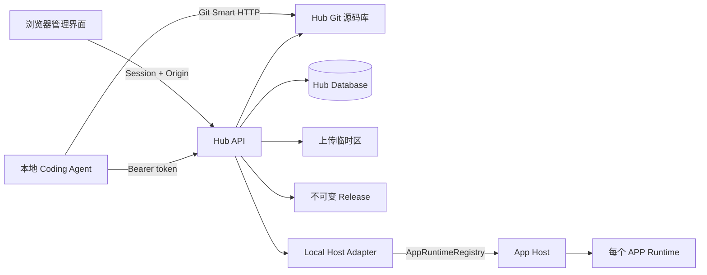
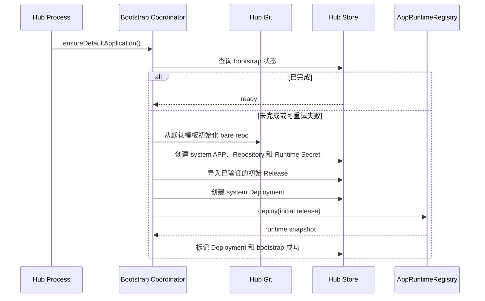
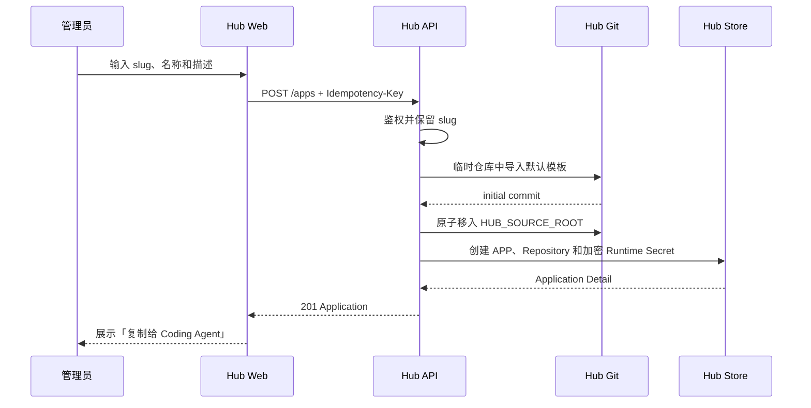
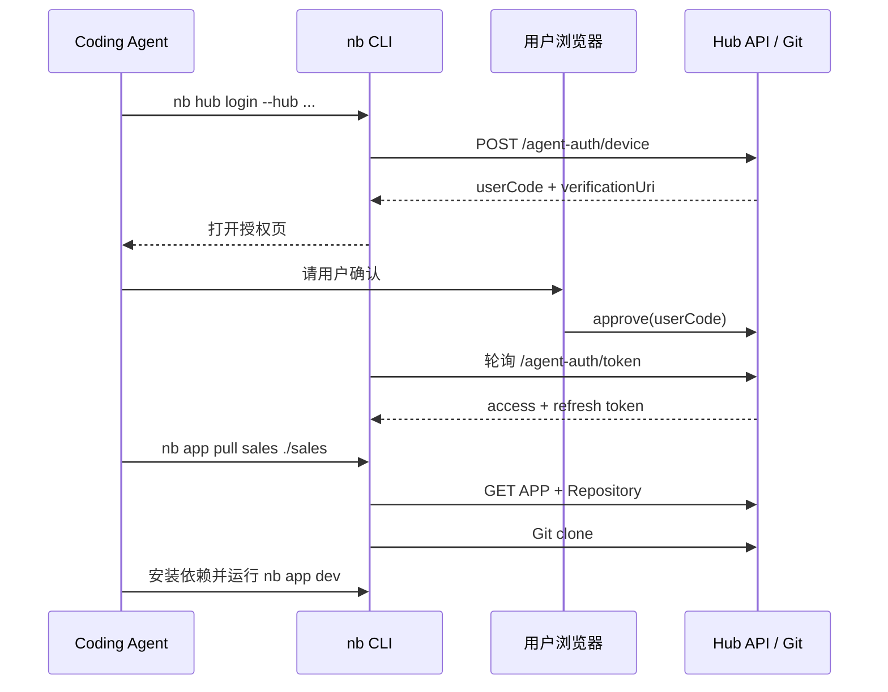
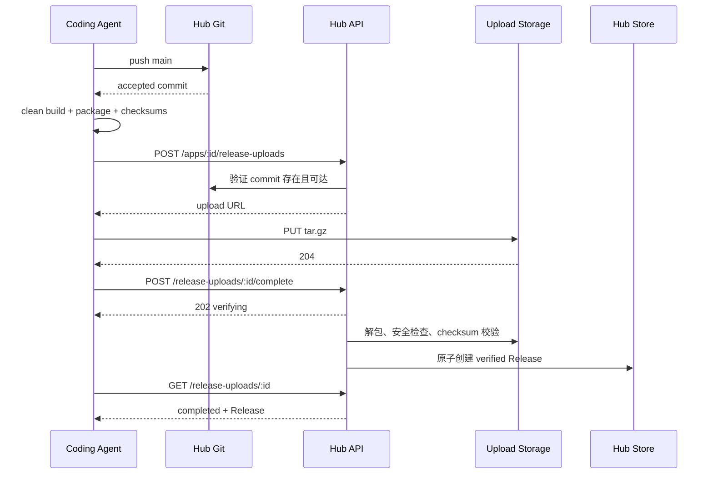
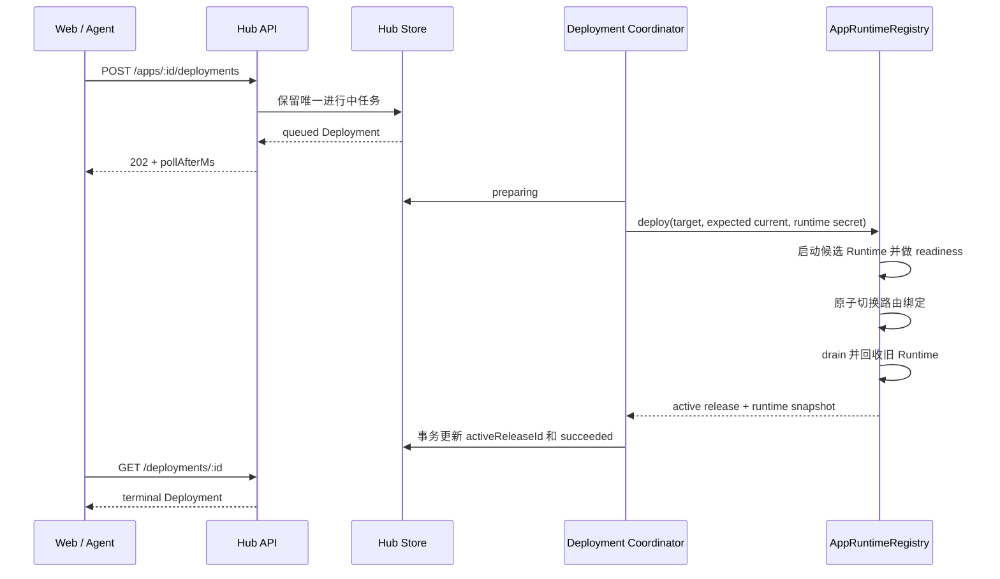

# Hub 应用管理 API 设计

## 评审状态

| 项目       | 值                                       |
| ---------- | ---------------------------------------- |
| 状态       | 已确认并进入实现                         |
| 基线       | `hub` 分支，`e3526f2`                    |
| 日期       | 2026-08-24                               |
| 实现状态   | 按本设计实现中                           |
| API 根路径 | `<APP_BASE_PATH>/api`，默认为 `/hub/api` |
| 版本策略   | 预发布阶段不增加 `/v1`                   |

## 目标

Hub 是用户安装 NocoBase 3 后管理 APP 的入口。一个 APP 从创建到运行会经过以下过程：

```text
默认模板 → Hub Git 源码库 → 本地 Coding Agent 开发
          → 构建并上传产物 → 不可变 Release
          → Deployment → App Host Runtime
```

API 需要让以下工作形成闭环：

- 首次启动时准备一个已创建、已发布的默认 APP
- 从默认模板创建新 APP 和独立源码仓库
- 让本地 Coding Agent 安全地 clone、pull 和 push 源码
- 上传构建产物，校验后生成不可变 Release
- 部署、重新部署、回滚和控制 Runtime
- 管理成员、角色和每个 APP 的权限
- 查看部署记录、审计日志、设置和存储使用情况
- 为每个 APP 生成和轮换独立的 Runtime 密钥

## 第一版边界

第一版使用一组刻意收窄的边界：

- 单 Hub 实例
- 只有一个内部 `default` 环境，界面不显示环境选择器
- Hub 必须使用 standalone 组装，与 App Host 同进程并共享 `AppRuntimeRegistry`
- 每个 APP 使用一个 Hub 托管的 Git 仓库
- 只支持默认模板，创建 APP 时不提供 `templateId`
- 只在开发者电脑上使用 Coding Agent，不提供浏览器远程工作区
- Agent 本地构建，Hub 验证身份、源码 commit 和产物完整性
- 只支持 APP 归档与恢复，不提供永久删除
- 使用内置角色和 APP 级角色绑定，暂不提供自定义角色 CRUD
- 部署状态通过轮询获取，第一版不增加 SSE

以下能力留到后续阶段：embedded Hub 控制平面、多环境、多 Host、远程 Host 协议、自定义角色、对象存储、分片续传、Hub 托管构建和浏览器 IDE。

## 现有能力与变更策略

### 保留的现有契约

现有 Hub 已经提供以下端点：

| 方法          | 路径                      |
| ------------- | ------------------------- |
| `GET`         | `/healthz`                |
| `GET`         | `/setup/status`           |
| `POST`        | `/setup/owner`            |
| `GET`, `POST` | `/auth/*`                 |
| `GET`         | `/me`                     |
| `GET`, `POST` | `/apps`                   |
| `GET`         | `/apps/:id`               |
| `GET`         | `/apps/:id/releases`      |
| `GET`, `POST` | `/apps/:id/deployments`   |
| `GET`         | `/deployments`            |
| `GET`         | `/deployments/:id`        |
| `GET`         | `/deployments/:id/events` |

设计保留统一响应包装、`limit/offset` 分页、Session 认证、同源 mutation 校验、越权资源隐藏为 `404` 以及异步 Deployment 模型。

### 已替换的现有契约

原 `POST /apps/:id/releases` 要求客户端先把产物写入 Hub 服务器本地目录，再提交 `storageKey`。本地 Coding Agent 无法靠这个契约向远程 Hub 发布。

该端点已移除，发布统一使用 Release Upload 会话。`storageKey` 是服务端内部字段，不出现在公开请求或响应中；调用旧端点返回 `404`。

### 不增加 API 版本段

Hub 仍处于预发布阶段，目前没有需要同时维护的多个稳定契约。所有管理 API 继续位于 `<APP_BASE_PATH>/api`，不增加 `/api/v1`。

同样，Hub 默认不保留 `/v2/api/*` 外部代理。只有显式配置 `NOCOBASE_API_PROXY_TARGET` 和 `NOCOBASE_API_PROXY_PATH` 时，才在指定的非默认路径开启代理。

## 总体架构

Hub 对外提供三个表面，对内保留一个 Host Adapter：

| 表面           | 根路径                             | 认证                                       | 用途                     |
| -------------- | ---------------------------------- | ------------------------------------------ | ------------------------ |
| 浏览器管理 API | `<APP_BASE_PATH>/api/*`            | Hub Session Cookie                         | 管理界面                 |
| Agent API      | `<APP_BASE_PATH>/api/*`            | Bearer access token                        | Coding Agent 和 `nb` CLI |
| Git Smart HTTP | `<APP_BASE_PATH>/git/<slug>.git/*` | HTTP Basic，password 为 Agent access token | clone、fetch 和 push     |
| Host Adapter   | 无 HTTP 路径                       | 进程内调用                                 | Hub 控制本地 App Host    |



### Hub 与 App Host 的边界

第一版不让 Hub 通过 `/__apps/*` 调用 App Host。这些现有 HTTP 端点没有认证，也不是远程 Host 协议。

第一版只支持 `packages/hub/server/standalone.ts` 的组装方式：Hub 和 App Host 虽然使用两个本地 HTTP listener，但位于同一进程，并把同一个 `AppRuntimeRegistry` 注入 Hub。当前 embedded Hub 拿不到全局 Registry，因此 `hostMode` 为 `unavailable`，不属于第一版部署方式。

Hub 通过内部 `HostAdapter` 使用这个 Registry：

```ts
interface HubHostAdapter {
  available(): boolean;
  getRuntime(application: HubApplication): Promise<HubRuntime>;
  prepare(
    application: HubApplication,
    release: HubRelease,
    runtimeSecret: string,
    enabled: boolean,
  ): Promise<void>;
  deploy(request: HubHostDeploymentRequest): Promise<HubHostDeploymentResult>;
  activate(
    application: HubApplication,
    release: HubRelease,
    runtimeSecret: string,
  ): Promise<HubRuntime>;
  evict(application: HubApplication): Promise<HubRuntime>;
  restart(
    application: HubApplication,
    release: HubRelease,
    runtimeSecret: string,
    operationId: string,
  ): Promise<HubRuntime>;
  unregister(application: HubApplication): Promise<void>;
}
```

`evict` 和 `unregister` 直接复用 Registry 已有方法。`restart` 和运行中的密钥轮换一律使用同 Release 的 `deploy()`，不使用缺少 readiness 和新 runtime config 的 `reload()`。

现有 Registry 还缺少「原子写入 definition 和私有 runtime config，但不启动」的能力。为了让恢复后的 APP 可以安全冷启动，并让 inactive Runtime 在不启动进程的情况下轮换密钥，设计增加第一个 App Host 导出 API：

```ts
interface ConfigureInactiveAppOptions {
  target: AppDefinition;
  runtimeConfig: Readonly<Record<string, unknown>> | null;
}

class AppRuntimeRegistry {
  configureInactive(
    id: string,
    options: ConfigureInactiveAppOptions,
  ): Promise<AppDefinition>;
}
```

它必须在 Registry 的 APP lock 内原子创建或替换 definition 和私有 runtime config；`null` 明确表示删除 config，避免用省略字段同时表达“保留”或“删除”。存在活动 Runtime 时返回 `409 APP_DEFINITION_ACTIVE`；`target.id` 不匹配时返回 `400 APP_DEFINITION_TARGET_INVALID`。它不激活 Runtime，也不在 snapshot、事件或日志中暴露 config。Hub Adapter 的 `prepare()` 是对该能力的封装。

现有 `register()` / `updateDefinition()` 只写 definition，无法写私有 runtime config；`unregister()` 又会同时删除二者，所以不能安全满足归档恢复。其他方案都有明显副作用：用 `deploy()` 后立即 `evict()` 会在“只恢复配置”时实际启动 APP 并执行启动副作用；只依赖进程内旧 config 则在重启后失效。`configureInactive()` 是最小的导出面扩展，不改变现有调用者行为，但会增加一个可写私有配置的核心入口，必须用活动 Runtime 拒绝、APP lock、secret 不可观测和声明文件契约测试约束。该 App Host API 变化需要在实现前单独确认。

当前 Registry readiness 只判断 `response.ok`，默认模板的 SPA fallback 也可能返回 HTML 200。为了让候选 Runtime 在切换前验证真实 health 响应，设计增加第二个向后兼容的导出契约：

```ts
interface AppReadinessResponseExpectation {
  contentType?: string;
  json?: Readonly<Record<string, string | number | boolean>>;
}

interface AppReadinessPolicy {
  timeoutMs?: number;
  intervalMs?: number;
  successThreshold?: number;
  expect?: AppReadinessResponseExpectation;
}
```

`contentType` 做不区分参数的 media type 比较；`json` 做顶层字段的严格子集匹配。Hub 每次 deploy / restart / rotation 都传 `expect: { contentType: "application/json", json: { ok: true } }`。未传 `expect` 的现有 App Host 调用保持原行为。validator 必须在 before-switch 和 after-switch 两次 readiness 中执行，失败沿用 `APP_READINESS_FAILED`。

批准后，App Host 侧只计划修改 `packages/app-host/src/app-types.ts`（新增 options / expectation 类型）、`packages/app-host/src/app-registry.ts`（新增方法和声明式 readiness 校验）和对应 package-root `tests/`；如果入口当前没有导出上述类型，再补 `packages/app-host/src/index.ts` 的类型导出。不会修改 `/__apps/*` 路由、`reload()`、远程通信协议或增加 deploy phase callback。

除此之外不增加 App Host HTTP API，也不增加 deploy phase callback。现有 `deploy()` 在候选 readiness、路由切换和旧 Runtime drain 全部完成后才返回，所以 Hub 对外只把这一段报告为一个 `activating` 阶段，不伪造实时的 checking / switching / draining 事件。

现有 `LocalHostAdapter` 把同一个 Hub `AUTH_SECRET` 传给所有 APP。实现时改为在取得同一 APP control operation lock 后，按 `applicationId` 解密当前 active Runtime Secret，并在调用 Host 前再次读取其 version。Deployment、Runtime control、归档和密钥轮换都使用这把锁，避免旧 Deployment 把刚轮换的密钥覆盖回去。

Hub standalone 不再把 `HUB_RELEASE_ROOT` 当成 App Host `DirectoryAppCatalog.appsDir`。App Host 使用专用且默认空的 `<HUB_RELEASE_ROOT>/.catalog`，所有受管 APP definition 都由 Hub Adapter 注册；否则当前目录扫描可能把历史 `app-dist/<slug>` 当成绕过 Hub 数据库、权限和 Release 的第二套权威来源。第一版不支持手工把 APP 拷进 catalog，与 Hub 管理的 APP 混用。

### 公网拓扑和 APP 地址

Hub listener 和 App Host listener 在进程内通信，但浏览器访问 APP 时不会经过 Hub API。服务端使用两个独立的权威 origin：

- `AUTH_BASE_URL` 的 origin + `APP_BASE_PATH`：Hub 管理界面、API 和 Git
- `APP_PUBLIC_ORIGIN` + `/<slug>/`：用户访问 APP

本地开发默认分别是 `http://127.0.0.1:13000/hub` 和 `http://127.0.0.1:3000/<slug>/`。生产环境可以把两个 origin 配成同一个域名，由 ingress 将 `<APP_BASE_PATH>/*` 转给 Hub、APP slug 路径转给 App Host。

App Host 必须只监听 loopback 或受保护的内部网络。公网 ingress 必须拒绝 `/__apps*`、`/__health*` 和 App Host 根管理页，只转发 APP 请求路径；不能因为设计不使用这些管理端点，就把现有无认证端点暴露到公网。第一版不在 Hub 内增加 APP 请求反向代理。

## 通用约定

### 路径和资源 ID

- 文档中的 API 路径都相对于 `<APP_BASE_PATH>/api`
- Application、Release、Deployment、Upload、用户和邀请等持久资源 ID 使用服务端生成的 UUID，客户端不得自定义
- `default` 是系统环境的稳定符号 ID，`system` 是系统 actor；Host `runtimeId` 是不透明字符串，不适用 UUID 约束
- APP `slug` 在创建后不可修改，同时用于 Git URL 和默认访问路径
- 存储目录、Git 目录和 Release `storageKey` 全部由服务端生成

### 成功响应

除 Git Smart HTTP、产物二进制上传和 CSV 导出以外，所有成功响应使用统一包装：

```json
{
  "data": {},
  "meta": {},
  "requestId": "89c354da-68b0-4b81-97b6-6115ab29fa2b"
}
```

`data` 是资源或资源列表。`meta` 只存放分页、幂等和轮询建议等响应元数据。

### 错误响应

```json
{
  "error": {
    "code": "VALIDATION_ERROR",
    "message": "Request validation failed.",
    "retryable": false,
    "issues": [
      {
        "path": "slug",
        "code": "invalid_format",
        "message": "slug must contain lowercase letters, numbers, or hyphens."
      }
    ]
  },
  "requestId": "89c354da-68b0-4b81-97b6-6115ab29fa2b"
}
```

- `code` 是可供程序判断的稳定值
- `message` 是英文诊断信息，界面根据 `code` 本地化
- `retryable` 表示在不修改请求的情况下，稍后重试是否有意义
- `issues` 只用于字段级校验错误
- `5xx` 响应不暴露堆栈、本地路径或密钥

### 分页、搜索和排序

列表端点继续使用 `limit/offset`：

| 参数     |       默认值 | 约束                                 |
| -------- | -----------: | ------------------------------------ |
| `limit`  |         `20` | `1..100`                             |
| `offset` |          `0` | 大于等于 `0`                         |
| `query`  |           无 | 匹配当前端点定义的文本字段           |
| `sort`   | `-createdAt` | 只能使用端点允许的字段，`-` 表示降序 |

列表响应的 `meta` 为：

```json
{
  "total": 56,
  "limit": 20,
  "offset": 20
}
```

界面页码按以下规则转换：

```text
offset = (page - 1) * pageSize
limit = pageSize
```

列表排序必须加上 `id` 作为稳定的次排序键，避免相同时间戳导致翻页抖动。

Deployment、审计、成员、邀请、Agent credential 和 APP access 表格都使用服务端分页。所有 APP 相关列表先计算以下交集，再应用筛选、排序、`total` 和分页：

```text
用户当前角色可见的 APP
∩ Agent credential 的 applicationScope（浏览器 Session 不受这一层限制）
∩ 请求筛选条件
```

因此 `meta.total` 永远是鉴权裁剪后的数量，不会泄露不可见 APP 的存在。资源级列表显式携带无权访问的 `applicationId` 时返回隐藏式 `404 APPLICATION_NOT_FOUND`；不指定 APP 的全局列表只返回交集内的数据。实现需要把 APP 级角色下推到列表查询，不能先要求全局 capability 再查询全部数据。

### 时间、大小和 checksum

- 时间使用 UTC ISO 8601，比如 `2026-08-24T08:30:00.000Z`
- 大小统一使用字节，字段名以 `Bytes` 结尾
- checksum 使用小写 `sha256:<64 lowercase hex>`
- 整数字节数必须在 JavaScript safe integer 范围内

`archiveChecksum` 是上传 gzip 原始字节的 SHA-256。Release `checksum` 使用 `packages/hub/README.MD` 已定义的 `nocobase-release-artifact-v1` 规范化文件树算法：路径转 POSIX、按 UTF-8 字节排序，hash 输入包含 domain prefix、路径、文件长度和每个文件内容 digest，不包含目录 metadata。第一版只有这一种算法；更换算法必须增加 manifest schema version，不能悄悄改变同一字段语义。

### HTTP 状态码

| 状态码 | 用途                                 |
| -----: | ------------------------------------ |
|  `200` | 成功查询、同步更新或已终态的幂等重放 |
|  `201` | 同步创建资源                         |
|  `202` | 已接受异步操作，或重放仍未终态的操作 |
|  `204` | 二进制上传成功，无 JSON 响应         |
|  `400` | JSON、query 或幂等键格式错误         |
|  `401` | 未认证或 token 无效                  |
|  `403` | 权限不足、Origin 不可信或 scope 不足 |
|  `404` | 资源不存在，或资源对当前身份不可见   |
|  `409` | 状态冲突、并发冲突或幂等键冲突       |
|  `410` | 上传会话或邀请已过期                 |
|  `412` | `If-Match` revision 与当前资源不一致 |
|  `413` | 归档或解包后产物超过限制             |
|  `415` | Content-Type 或归档格式不支持        |
|  `422` | 业务字段或产物校验失败               |
|  `428` | 缺少前置条件，或设备授权尚待批准     |
|  `429` | 认证轮询或请求频率过高               |
|  `500` | 内部错误                             |
|  `503` | App Host 或存储暂时不可用            |

## 资源模型

### 状态模型

APP 状态、仓库状态、Release、Runtime 和 Health 必须分开，不能用一个「正常 / 异常」概括。

| 维度                 | 可选值                                                                            | 含义                             |
| -------------------- | --------------------------------------------------------------------------------- | -------------------------------- |
| Application          | `active`, `archived`                                                              | 是否可继续开发和运行             |
| Repository           | `initializing`, `ready`, `failed`, `readOnly`                                     | 源码仓库状态                     |
| Release verification | `verified`                                                                        | 第一版只在验证成功后创建 Release |
| Upload               | `created`, `uploaded`, `verifying`, `completed`, `failed`, `expired`, `cancelled` | 产物上传和验证状态               |
| Deployment           | `queued`, `preparing`, `activating`, `succeeded`, `failed`, `cancelled`           | 一次发布或回滚任务               |
| Runtime              | `stopped`, `starting`, `running`, `stopping`, `failed`                            | 当前运行实例状态                 |
| Health               | `unknown`, `checking`, `healthy`, `unhealthy`                                     | 当前健康探测结果                 |

现有 `disabled` Application 状态不在第一版界面暴露，可保留为系统策略预留值。`pending` 和 `rejected` Release 也不会对外创建；失败状态留在 Upload 会话中。

### Application Summary

`GET /apps` 直接返回列表页需要的投影，避免为每个 APP 再请求 Repository、Release 和 Runtime。

```json
{
  "id": "a20381d3-3df2-4c1d-86b1-608f199b76d1",
  "slug": "sales",
  "name": "Sales CRM",
  "description": "Sales workspace",
  "status": "active",
  "isDefault": false,
  "revision": 12,
  "defaultEnvironmentId": "default",
  "repository": {
    "provider": "hub",
    "defaultBranch": "main",
    "headCommit": "95b5799ad8c628b73dd79a55a1c37d58b25a2a93",
    "status": "ready",
    "updatedAt": "2026-08-24T08:30:00.000Z"
  },
  "latestRelease": {
    "id": "e8a11780-bdd7-4a3c-9601-761b47b55a31",
    "version": "1.4.0",
    "sourceCommit": "95b5799ad8c628b73dd79a55a1c37d58b25a2a93",
    "createdAt": "2026-08-24T08:35:00.000Z"
  },
  "activeRelease": {
    "id": "66f7a492-0527-40c9-881c-8202243ef55b",
    "version": "1.3.0",
    "sourceCommit": "81d85dce4b3c480f52c808aa45584f642df7f958",
    "createdAt": "2026-08-23T09:20:00.000Z"
  },
  "runtime": {
    "state": "running",
    "health": "healthy",
    "releaseId": "e8a11780-bdd7-4a3c-9601-761b47b55a31",
    "lastCheckedAt": "2026-08-24T08:36:00.000Z"
  },
  "links": {
    "self": "/hub/api/apps/a20381d3-3df2-4c1d-86b1-608f199b76d1",
    "open": "https://apps.example.com/sales/"
  },
  "createdBy": "system",
  "createdAt": "2026-08-24T08:00:00.000Z",
  "updatedAt": "2026-08-24T08:35:00.000Z"
}
```

`links.open` 由服务端根据权威 `APP_PUBLIC_ORIGIN` 和 APP 固定 `basePath` 生成，不能从请求 Host、转发 header 或 Hub origin 猜测。第一版 `basePath` 始终是 `/<slug>`，Release manifest 只能声明相同值，不能覆盖它。未发布或已归档时 `links.open` 为 `null`。Runtime 被回收后仍可以打开 APP，首次请求会触发按需启动。

Summary 是 capability-aware projection。顶层 APP 字段和 `links` 需要 `hub.app:read`；`repository`、`latestRelease`、`activeRelease` 和 `runtime` 分别还需要 `hub.repository:read`、`hub.release:read` 和 `hub.runtime:read`。`latestRelease` 表示最新上传的版本，`activeRelease` 表示当前已部署版本；两者可以不同。获得 Release 读取权限但尚未部署时，`activeRelease` 为 `null`。浏览器 Session 按用户 capability 判断；Agent 还必须分别带 `source:read`、`releases:read` 和 `runtime:read` scope。未授权的嵌套字段直接省略，不返回占位数据，也不靠 `hub.app:read` 旁路细分权限。公开 Application 响应不返回内部 `activeReleaseId`。

### Application Detail

Application Detail 在 Summary 基础上把 `activeRelease` 扩展为完整 Release 投影：

```json
{
  "activeRelease": {
    "id": "e8a11780-bdd7-4a3c-9601-761b47b55a31",
    "version": "1.4.0",
    "checksum": "sha256:65e6...",
    "sizeBytes": 84211342,
    "sourceCommit": "95b5799ad8c628b73dd79a55a1c37d58b25a2a93",
    "verificationStatus": "verified",
    "createdAt": "2026-08-24T08:35:00.000Z"
  },
  "runtimeSecret": {
    "configured": true,
    "version": 1,
    "rotatedAt": null,
    "lastInjectedAt": "2026-08-24T08:35:20.000Z"
  }
}
```

`runtimeSecret` 只有同时具备 `hub.runtimeSecret:read` 的浏览器 Session 才返回；第一版 Agent 不提供 Runtime Secret scope，因此 Agent 响应始终省略该字段。

`activeRelease` 与 Summary 中的 `latestRelease` 使用相同的 Release 投影规则：浏览器 Session 还要具备 `hub.release:read`，Agent 还要具备 `releases:read` scope。缺少任一层时直接省略 `activeRelease`，不能仅凭 `hub.app:read` 读取 Release checksum、大小或 manifest。

### Release

```json
{
  "id": "e8a11780-bdd7-4a3c-9601-761b47b55a31",
  "applicationId": "a20381d3-3df2-4c1d-86b1-608f199b76d1",
  "version": "1.4.0",
  "checksum": "sha256:65e6...",
  "manifest": {
    "schemaVersion": 1,
    "basePath": "/sales",
    "client": { "rootDir": "dist/client" },
    "server": {
      "entrypoint": "dist/server/embedded.js",
      "healthPath": "/api/healthz"
    },
    "source": {
      "commit": "95b5799ad8c628b73dd79a55a1c37d58b25a2a93"
    }
  },
  "sizeBytes": 84211342,
  "sourceCommit": "95b5799ad8c628b73dd79a55a1c37d58b25a2a93",
  "verificationStatus": "verified",
  "retention": {
    "pinned": false,
    "pinnedBy": null,
    "pinnedAt": null
  },
  "createdBy": "6c2908cb-e815-4a53-a5c6-ac196c4f87c7",
  "createdAt": "2026-08-24T08:35:00.000Z"
}
```

`storageKey` 不再出现在公开 Release 模型中。

### Runtime

```json
{
  "applicationId": "a20381d3-3df2-4c1d-86b1-608f199b76d1",
  "environmentId": "default",
  "runtimeId": "sales:42",
  "state": "running",
  "health": "healthy",
  "releaseId": "e8a11780-bdd7-4a3c-9601-761b47b55a31",
  "releaseVersion": "1.4.0",
  "url": "https://apps.example.com/sales/",
  "startedAt": "2026-08-24T08:35:10.000Z",
  "lastSeenAt": "2026-08-24T08:36:00.000Z",
  "lastCheckedAt": "2026-08-24T08:36:00.000Z",
  "activeRequests": 2,
  "failure": null
}
```

`runtimeId` 可以由当前 Host snapshot 的 APP ID 和进程内 activation version 组成，只保证在当前 Hub 进程内标识一次激活，客户端不得解析或持久依赖其格式。`startedAt` 映射 Host `createdAt`，`lastSeenAt` 映射 `lastAccessedAt`，`failure` 来自安全脱敏后的 `lastError`。

`activeRequests` 是当前进程快照，不是持久化趋势。列表使用最近一次 Deployment、`start` 或 `restart` readiness 留下的 Health observation；没有 observation 或 observation 已过期时返回 `unknown`。`GET /apps/:id/runtime` 是无副作用查询，不做主动探测，也不触发冷启动。第一版不提供后台健康监控或历史趋势；如果后续需要实时探测，应另行设计 Host probe API 和 cadence，不能用一个看似只读的 GET 隐式启动 APP。

## 认证

### 浏览器 Session

管理界面继续使用 Hub 自己的 Better Auth Session。Hub 用户与各 APP 内的用户互相独立。

- 浏览器 Session 调用 `GET /me` 时，返回当前用户、全局角色和 APP 级 capabilities
- 浏览器 mutation 必须带 Hub 同源 `Origin`
- 带 JSON body 的 mutation 使用 `Content-Type: application/json`；无 body 的 `DELETE` 不要求 Content-Type
- 公开注册继续关闭

### Agent Device Authorization

Coding Agent 不应复用浏览器 Cookie，也不应把长期 token 写进「复制给 Agent」的指令。第一版使用类似 OAuth 2.0 Device Authorization Grant 的流程。

这里的 Device Authorization 只是 CLI 首次登录时授权本地身份，不会创建远程开发容器，也不是原型中已删除的「一次性开发会话」。

#### 创建设备授权

```http
POST /agent-auth/device
Content-Type: application/json
```

```json
{
  "clientId": "nb-cli",
  "clientName": "Codex on Apple-MacBook",
  "scopes": [
    "profile",
    "apps:read",
    "source:read",
    "source:write",
    "releases:read",
    "releases:publish",
    "deployments:read",
    "deployments:deploy",
    "deployments:rollback",
    "deployments:redeploy",
    "runtime:read",
    "runtime:control"
  ],
  "applicationScope": {
    "mode": "selected",
    "applicationIds": ["a20381d3-3df2-4c1d-86b1-608f199b76d1"]
  }
}
```

```json
{
  "data": {
    "deviceCode": "nbd_opaque_value",
    "userCode": "NB3-W7KM",
    "verificationUri": "https://hub.example.com/hub/agent-authorize",
    "verificationUriComplete": "https://hub.example.com/hub/agent-authorize#code=NB3-W7KM",
    "expiresIn": 600,
    "interval": 5
  },
  "meta": {},
  "requestId": "b207a33d-2ef7-4891-980a-11bb8f004f89"
}
```

`deviceCode` 和 `userCode` 都只在服务端存储 hash。`applicationScope.mode` 可以是 `selected` 或 `all-authorized`。`selected` 必须带非空 `applicationIds`；`all-authorized` 不带 `applicationIds`，表示动态访问当前用户有权使用的 APP。Hub 授权页必须把范围和「未来新增的授权也会生效」说明给用户。CLI 为单个已有 APP 发起登录时默认使用 `selected`，显式执行 `nb hub login` 时默认使用 `all-authorized`。

`profile` 是全局 scope，不受 `applicationScope` 过滤。`apps:create` 只允许与 `all-authorized` 一起申请，并仍受用户当前的全局 `hub.app:create` capability 限制；`selected + apps:create` 返回 `422 INVALID_SCOPE_COMBINATION`，避免创建一个当前 credential 随后无权读取的新 APP。所有针对具体 APP 的 scope 都要再与 `applicationScope` 求交集。`nb app create` 在没有合适凭据时必须发起 all-authorized 授权，并在批准页单独标明全局创建权限。

#### 浏览器查看并批准

| 方法   | 路径                                | 说明                                              |
| ------ | ----------------------------------- | ------------------------------------------------- |
| `POST` | `/agent-authorizations/resolve`     | 在 JSON body 中提交 `userCode`，返回待批准请求 ID |
| `POST` | `/agent-authorizations/:id/approve` | 在 JSON body 中提交批准的 scope 和 APP 范围       |
| `POST` | `/agent-authorizations/:id/deny`    | 拒绝请求                                          |

这三个端点使用浏览器 Session。`userCode` 通过 URL fragment 传给页面，再从 JSON body 发给 Hub，避免出现在反向代理 path 或 query 日志中。批准 body 可以收窄客户端请求的 scope 和 APP 范围，但不能扩大它们，也不会把用户当前没有的 capability 授给 Agent。

```http
POST /agent-authorizations/resolve
Content-Type: application/json

{"userCode":"NB3-W7KM"}
```

成功响应只返回一次待批准对象的 `id`、client name、requested scopes、requested application scope 和 `expiresAt`，不返回 `deviceCode`。批准请求使用该 ID：

```http
POST /agent-authorizations/7df2316c-dcfe-4ad7-9dbb-d911d5983846/approve
Content-Type: application/json

{
  "scopes": ["profile", "apps:read", "source:read", "source:write"],
  "applicationScope": {
    "mode": "selected",
    "applicationIds": ["a20381d3-3df2-4c1d-86b1-608f199b76d1"]
  }
}
```

`approve` 和 `deny` 在同一授权 ID 上都幂等；已进入相反终态时返回 `409 DEVICE_AUTHORIZATION_DECIDED`。

#### 轮询 token

```http
POST /agent-auth/token
Content-Type: application/json
```

```json
{
  "grantType": "urn:ietf:params:oauth:grant-type:device_code",
  "clientId": "nb-cli",
  "deviceCode": "nbd_opaque_value"
}
```

未批准时返回 `428 AUTHORIZATION_PENDING`，轮询过快时返回 `429 SLOW_DOWN`。批准后返回：

```json
{
  "data": {
    "credentialId": "7c9ad525-a8a3-4e06-bfd1-8767781e4d2f",
    "accessToken": "nba_only_shown_here",
    "tokenType": "Bearer",
    "expiresIn": 900,
    "refreshToken": "nbr_only_shown_here",
    "refreshExpiresIn": 2592000,
    "scope": "profile apps:read source:read source:write releases:read releases:publish deployments:read deployments:deploy deployments:rollback deployments:redeploy runtime:read runtime:control",
    "applicationScope": {
      "mode": "selected",
      "applicationIds": ["a20381d3-3df2-4c1d-86b1-608f199b76d1"]
    }
  },
  "meta": {},
  "requestId": "d9ea6f08-6fcc-4f8a-a6f7-00d87e0cf499"
}
```

access token 建议 15 分钟过期，refresh token 建议 30 天过期并在每次刷新时轮换。CLI 优先保存到操作系统 Keychain，不写入 APP 源码目录。

两种 token 都是至少 256-bit 随机的不透明值，数据库只存 hash。每次 JSON API 和 Git 请求都查询 credential 状态，从而支持撤销、成员停用和权限收回立即生效。refresh token 以 family 轮换；已使用 token 被再次提交时，整个 family 进入 revoked，要求用户重新登录。成功的 token 响应必须带 `Cache-Control: no-store` 和 `Pragma: no-cache`。

Agent scope 与 Hub capability 是两层约束：

| Agent scope            | 最大允许的 Hub capability |
| ---------------------- | ------------------------- |
| `profile`              | 查询当前 Agent 身份摘要   |
| `apps:create`          | `hub.app:create`          |
| `apps:read`            | `hub.app:read`            |
| `source:read`          | `hub.repository:read`     |
| `source:write`         | `hub.repository:update`   |
| `releases:read`        | `hub.release:read`        |
| `releases:publish`     | `hub.release:create`      |
| `deployments:read`     | `hub.deployment:read`     |
| `deployments:deploy`   | `hub.deployment:deploy`   |
| `deployments:rollback` | `hub.deployment:rollback` |
| `deployments:redeploy` | `hub.deployment:redeploy` |
| `runtime:read`         | `hub.runtime:read`        |
| `runtime:control`      | `hub.runtime:control`     |

一个请求只有在 scope 和用户当前 capability 都允许时才成功。

Bearer credential 使用 `profile` scope 调用同一个 `GET /me`。Agent 形式的响应包含用户 ID、credential ID / name、granted scopes、application scope 和当前交集后的 capability 摘要；不返回浏览器 Session、其他 credential 或 Runtime Secret 状态。

刷新 token 使用同一端点：

```json
{
  "grantType": "refresh_token",
  "clientId": "nb-cli",
  "refreshToken": "nbr_opaque_value"
}
```

#### 查看和撤销 Agent 凭据

| 方法     | 路径                     | 说明                                      |
| -------- | ------------------------ | ----------------------------------------- |
| `GET`    | `/agent-credentials`     | 列出当前用户已批准的设备                  |
| `DELETE` | `/agent-credentials/:id` | 撤销某台设备的所有 access / refresh token |
| `POST`   | `/agent-auth/revoke`     | CLI 撤销当前 refresh token                |

`GET /agent-credentials` 和 `DELETE /agent-credentials/:id` 只接受浏览器 Session，并且只能读取或撤销当前用户自己的凭据。列表支持 `query` 匹配 client name、`status=active|revoked|expired`、`sort=createdAt|-createdAt|lastUsedAt|-lastUsedAt`、`limit` 和 `offset`；响应只包含 credential ID、client name、granted scope、application scope、状态、创建时间、最后使用时间和到期时间，不返回 token hash 或 token family 标识。Bearer credential 即使带 `profile` scope 也不能用这两个端点管理自身。

`POST /agent-auth/revoke` 不依赖尚未过期的 access token。CLI 在 JSON body 中提交 `clientId` 和当前 refresh token，服务端验证 token hash 后撤销整个 refresh-token family；重复撤销返回 `200`，且不通过响应区分“不存在”和“已经撤销”。

```json
{
  "clientId": "nb-cli",
  "refreshToken": "nbr_opaque_value"
}
```

撤销后，Git 和 JSON API 都必须立即失效。Agent token 的 scope 是最大授权范围；每次请求还要根据用户当前的 Hub 角色和 APP 绑定重新鉴权。因此，管理员收回某 APP 权限后，不需要等 token 过期。

## Setup 和默认 APP

### `GET /setup/status`

在现有字段基础上增加默认 APP bootstrap 状态：

```json
{
  "data": {
    "setupRequired": true,
    "ownerConfigured": false,
    "defaultApp": {
      "status": "ready",
      "retryable": false,
      "errorCode": null
    }
  },
  "meta": {},
  "requestId": "e7089ccc-cc3b-4dbb-98f1-70298038c5ed"
}
```

`defaultApp.status` 是 `preparing`、`ready` 或 `failed`。只有 `failed` 才返回经过白名单过滤的 `errorCode` 和是否可重试；未登录端点不暴露 APP ID、仓库、Release、本地路径或内部错误信息。这样界面可以区分准备中和失败，而不是把两者都压成一个 `false`。

### 默认 APP bootstrap

Hub 发行包包含两个经过校验的资源：

- 默认模板源码包
- 与该源码 commit 对应的预构建初始 Release

源码包必须以 Git bundle 或等价的确定性 seed 交付，包含固定 author / committer metadata 和固定 initial commit；不能在每次启动时用当前时间重新生成 commit，否则预构建 Release 的 `sourceCommit` 无法匹配。新 APP 可以从同一 seed commit 建立自己的 bare repo，但从首次用户 commit 开始完全独立。

启动时执行幂等 bootstrap：

1. 生成 APP 独立 Runtime Secret
2. 从默认模板创建 bare Git 仓库和初始 commit
3. 创建 `createdBy: "system"` 的默认 Application
4. 校验并导入初始 Release
5. 创建系统 Deployment 并启动 Runtime

任意一步失败时，bootstrap 保留可重试的内部状态，不再创建第二个默认 APP。首个 Owner 登录后直接进入「APP」页；如果 bootstrap 还未完成，界面显示准备状态而不是空列表。

进程会对 `retryable: true` 的失败做有上限的退避重试。Owner 配置完成后还可以显式调用：

```http
POST /setup/default-app/retry
Idempotency-Key: 40e6ac5e-9377-48b5-b388-6a39bd11dc85
Content-Type: application/json

{}
```

该端点需要 `hub.app:create`。开始重试或重放仍在执行的 bootstrap operation 时返回 `202`；默认 APP 已经 `ready` 时返回 `200` 和 `meta.idempotent: true`。`failed` 且 `retryable: false` 时返回 `409 DEFAULT_APP_BOOTSTRAP_NOT_RETRYABLE`。未登录状态不提供可修改系统资源的 retry 端点。

默认 APP 使用固定 slug `default`，`isDefault: true`，并且是唯一可以由系统设置该字段的 Application。普通 `POST /apps` 不接受 `isDefault`。显示名称仍可以由 Owner / Admin 修改；客户端必须用 `isDefault` 显示「默认」标记，不能靠名称或 slug 猜测。

默认模板只用于创建时打样。创建后源码完全归 APP 所有，Hub 不提供「升级模板」操作，也不会用新模板覆盖用户代码。创建来源可以从初始 commit 和仓库内模板 package metadata 追溯，Hub 不对外增加 `templateId` 或 `templateVersion` 字段。

## Applications API

### 端点

| 方法    | 路径                | 权限              | 说明                                     |
| ------- | ------------------- | ----------------- | ---------------------------------------- |
| `GET`   | `/apps`             | `hub.app:read`    | 分页查询 APP Summary                     |
| `POST`  | `/apps`             | `hub.app:create`  | 创建 APP、Git 仓库和 Runtime Secret      |
| `GET`   | `/apps/:id`         | `hub.app:read`    | 查询 APP Detail                          |
| `PATCH` | `/apps/:id`         | `hub.app:update`  | 更新名称和描述                           |
| `POST`  | `/apps/:id/archive` | `hub.app:archive` | 归档 APP、回收 Runtime 并移除 definition |
| `POST`  | `/apps/:id/restore` | `hub.app:restore` | 恢复 APP 并准备冷启动 definition         |

`GET /apps` 支持：

- `query`：匹配 `name`、`slug` 和 `description`
- `status`：可重复传入 `active` 或 `archived`
- `sort`：`name`、`slug`、`createdAt`、`updatedAt`
- `limit` 和 `offset`

### 创建 APP

```http
POST /apps
Idempotency-Key: 7ee80b8d-dbc5-4942-a337-633509c3cb02
Content-Type: application/json
```

```json
{
  "slug": "sales",
  "name": "Sales CRM",
  "description": "Sales workspace"
}
```

请求不包含 `templateId`、源码路径、Git 路径或 Runtime Secret。第一版始终使用默认模板，所有存储位置由 Hub 决定。

`slug` 必须使用小写字母、数字和连字号，长度为 `1..128`，以字母或数字开头和结尾；连续连字号合法。Hub 当前 public base path 的第一段、`api`、`auth`、`git`、`__apps` 和 `__health` 是保留名，不能成为 APP slug。

创建过程是一个同步 saga：

1. 保留 `slug` 和幂等键
2. 在服务端临时目录初始化默认模板 Git 仓库
3. 创建固定的初始 commit，将 bare repo 原子移到 `HUB_SOURCE_ROOT/<application-id>.git`
4. 在数据库事务中创建 Application、Repository metadata 和加密 Runtime Secret
5. 记录审计日志

文件系统和数据库不能共享一个 ACID 事务，因此任意步骤失败后必须执行补偿清理。对客户端只有两种结果：完整的 `201` Application，或者错误响应。不应返回缺少仓库的「半成品 APP」。

新 APP 创建后只有源码，还没有 Release，所以 `links.open` 为 `null`。开发者完成开发并首次发布后才能直接访问。

### 更新 APP

```http
PATCH /apps/a20381d3-3df2-4c1d-86b1-608f199b76d1
If-Match: "rev-12"
Content-Type: application/json
```

```json
{
  "name": "Sales Workspace",
  "description": "Sales and partner workspace"
}
```

`slug`、`isDefault`、存储路径、默认分支和 `activeReleaseId` 不可通过此端点修改。

`GET /apps/:id` 返回 `ETag: "rev-<revision>"`。`PATCH /apps/:id` 必须带当前 `If-Match`；缺少返回 `428 PRECONDITION_REQUIRED`，revision 已变化返回 `412 REVISION_MISMATCH` 并要求刷新，防止两个管理页面静默覆盖。

### 归档和恢复

归档和恢复同样必须带 `GET /apps/:id` 返回的 `If-Match`，成功后递增 Application revision 并返回新的 `ETag`。如果 APP 已经处于目标状态，并且 `If-Match` 仍匹配当前 revision，则返回 `200` 和 `meta.idempotent: true`；过期的 revision 仍返回 `412 REVISION_MISMATCH`，不能用幂等语义绕过并发保护。

`POST /apps/:id/archive` 执行以下操作：

- 把 APP 设为 `archived`
- 回收运行实例并从 App Host 注册表移除 definition
- 禁止 Git push、Release publish、Deployment 和 Runtime control
- 保留 Git 源码、Release、Runtime 数据、Deployment 和审计记录

重复归档返回 `200` 和 `meta.idempotent: true`。

`POST /apps/:id/restore` 在同一 APP control operation lock 内执行：

1. 读取当前 `activeReleaseId` 和 active Runtime Secret
2. 有活动 Release 时，通过 `HostAdapter.prepare(..., enabled: true)` 原子写回 definition 和私有 runtime config，但不启动 Runtime
3. 把 APP 恢复为 `active`，重新允许 Git push、发布和访问

没有活动 Release 时只恢复 Application 和 Git 权限，`links.open` 仍为 `null`。Host prepare 或数据库提交失败时执行补偿并保持 `archived`；不能返回「数据库已恢复但访问仍 404」的半成品状态。恢复成功后首次访问会安全冷启动，`restore` 本身不启动 Runtime。重复恢复返回 `200` 和 `meta.idempotent: true`。

## Repository 和 Git API

### 源码存放策略

Hub 保存 bare Git 仓库，不保存开发工作区，也不在源码仓库中安装 `node_modules`。一般来说，bare repo 只包含 Git objects 和 refs，占用空间远小于完整工作区。

开发者电脑负责 clone 仓库、安装依赖和运行开发服务。开发完成后 push 回 Hub。下次在另一台电脑开发时，重新 clone 即可恢复源码。

构建产物与源码分开存储：

```text
HUB_SOURCE_ROOT/
  <application-id>.git/       # bare Git 仓库，无 node_modules

HUB_RELEASE_ROOT/
  <application-id>/
    <release-id>/             # 不可变构建产物
  .runtime/
    <application-id>/         # APP 可变数据
  .uploads/
    <upload-id>/              # 有期限的临时上传
```

上述目录是实现约定，不会通过 API 返回给客户端。

### 查询 Repository

```http
GET /apps/a20381d3-3df2-4c1d-86b1-608f199b76d1/repository
```

```json
{
  "data": {
    "applicationId": "a20381d3-3df2-4c1d-86b1-608f199b76d1",
    "provider": "hub",
    "cloneUrl": "https://hub.example.com/hub/git/sales.git",
    "defaultBranch": "main",
    "headCommit": "95b5799ad8c628b73dd79a55a1c37d58b25a2a93",
    "status": "ready",
    "initialCommit": "8a8b1bed52e5c470dec5405e7d9f6d11254b001a",
    "updatedAt": "2026-08-24T08:30:00.000Z"
  },
  "meta": {},
  "requestId": "c85da15a-ac32-43ce-a2dc-272ab78a8f90"
}
```

`GET /apps/:id/repository` 需要 `hub.repository:read`。返回的 `cloneUrl` 永远不嵌入 token。

### Git Smart HTTP

Hub 使用标准 Git Smart HTTP，不另行设计逐文件 REST 同步协议。

| 方法   | 路径                                                               | 权限                                           |
| ------ | ------------------------------------------------------------------ | ---------------------------------------------- |
| `GET`  | `<APP_BASE_PATH>/git/:slug.git/info/refs?service=git-upload-pack`  | `hub.repository:read` + `source:read` scope    |
| `POST` | `<APP_BASE_PATH>/git/:slug.git/git-upload-pack`                    | `hub.repository:read` + `source:read` scope    |
| `GET`  | `<APP_BASE_PATH>/git/:slug.git/info/refs?service=git-receive-pack` | `hub.repository:update` + `source:write` scope |
| `POST` | `<APP_BASE_PATH>/git/:slug.git/git-receive-pack`                   | `hub.repository:update` + `source:write` scope |

Git 客户端使用 HTTP Basic：

```text
username: oauth2
password: <Agent access token>
```

CLI 通过 credential helper 或临时 `GIT_ASKPASS` 提供 token，不把 token 写进 remote URL、shell history 或 Git config。

`main` 是受保护的默认分支：禁止删除和 non-fast-forward push。每次成功 push 更新 Repository `headCommit` 并写入审计日志。归档 APP 允许 clone / fetch，但禁止 push。

## Release Uploads API

### 发布流程

Release 发布分为四步：

1. `POST /apps/:id/release-uploads` 创建上传会话
2. `PUT /release-uploads/:uploadId/content` 上传一个 `.tar.gz`
3. `POST /release-uploads/:uploadId/complete` 启动验证
4. `GET /release-uploads/:uploadId` 轮询至 `completed` 并取得 Release

第一版一次 PUT 整个归档。如果上传中断，重新 PUT 整个对象。这样可以先保持协议简单；分片续传留到实际产物大小证明有必要时再设计。

创建、上传、complete 和查询四个主流程端点都要求 `hub.release:create`；Agent 还要有 `releases:publish` scope。Upload 绑定创建它的用户和 Agent credential（浏览器创建时 credential 为 `null`）：创建者可以上传、complete、查询和取消自己的会话。Owner / Admin 的浏览器 Session 可以查询和取消其他用户的会话，但不能替创建者覆盖 content 或 complete；其他发布者看到隐藏式 `404 UPLOAD_NOT_FOUND`。

### 创建上传会话

```http
POST /apps/a20381d3-3df2-4c1d-86b1-608f199b76d1/release-uploads
Authorization: Bearer <access-token>
Idempotency-Key: 464e066e-99d3-41af-a54b-51cb2b0503c3
Content-Type: application/json
```

```json
{
  "version": "1.4.0",
  "sourceCommit": "95b5799ad8c628b73dd79a55a1c37d58b25a2a93",
  "checksum": "sha256:65e6c24b5bde06738a8f779dc18d959609dc4a303085bef025b6ec3021482173",
  "sizeBytes": 84211342,
  "archiveChecksum": "sha256:9ca186fbcf3e1f1b6df6cbf7f78342fd6c1dce905995848147acb41ab7d60a4f",
  "archiveSizeBytes": 28911243,
  "archiveFormat": "tar.gz",
  "manifest": {
    "schemaVersion": 1,
    "basePath": "/sales",
    "client": { "rootDir": "dist/client" },
    "server": {
      "entrypoint": "dist/server/embedded.js",
      "healthPath": "/api/healthz"
    },
    "source": {
      "commit": "95b5799ad8c628b73dd79a55a1c37d58b25a2a93"
    }
  }
}
```

`checksum` 和 `sizeBytes` 表示解包后的规范化产物树。`archiveChecksum` 和 `archiveSizeBytes` 表示实际传输的 gzip 字节。

归档根目录必须只包含发布 manifest 和运行产物：

```text
nocobase-release.json
dist/
  client/
  server/
    embedded.js
  database/
  scripts/
  package.json
  node_modules/
```

`nocobase-release.json` 的语义必须与创建 Upload 时提交的 `manifest` 完全一致。服务端使用归档内的文件作为最终权威 manifest，同时校验客户端预声明，避免上传会话和产物内容不一致。

```json
{
  "data": {
    "id": "1ef086f8-c031-4505-b542-b250328c43d6",
    "applicationId": "a20381d3-3df2-4c1d-86b1-608f199b76d1",
    "status": "created",
    "version": "1.4.0",
    "sourceCommit": "95b5799ad8c628b73dd79a55a1c37d58b25a2a93",
    "upload": {
      "method": "PUT",
      "url": "https://hub.example.com/hub/api/release-uploads/1ef086f8-c031-4505-b542-b250328c43d6/content",
      "auth": {
        "mode": "hub-bearer"
      },
      "headers": {
        "Content-Type": "application/gzip"
      }
    },
    "expiresAt": "2026-08-24T10:30:00.000Z",
    "createdAt": "2026-08-24T08:30:00.000Z"
  },
  "meta": {},
  "requestId": "52f15530-e1c8-4180-a433-cb327a74ef28"
}
```

`upload.url`、`upload.auth` 和 `upload.headers` 是不透明的客户端契约。`auth.mode` 只有两种：

- `hub-bearer`：CLI 仅在 URL origin 与已配置 `AUTH_BASE_URL` 的 origin 完全一致时附带当前 Hub Bearer token；origin 不同必须拒绝，防止 token 外泄
- `provided-headers`：CLI 只发送响应给出的 headers，绝不附带 Hub token；这些 headers 按密钥处理，不打印日志

第一版返回 Hub 本身的上传 URL 和 `hub-bearer`；未来换成对象存储预签名 URL 时返回 `provided-headers`，CLI 流程无需改变。

首次创建 Upload 返回 `201`。相同 `Idempotency-Key` 和请求的重放返回 `200`、同一 Upload ID 和 `meta.idempotent: true`。

### 上传归档

```http
PUT /release-uploads/1ef086f8-c031-4505-b542-b250328c43d6/content
Authorization: Bearer <access-token>
Content-Type: application/gzip
Content-Length: 28911243

<binary tar.gz>
```

成功返回 `204 No Content`。该端点是 JSON mutation 规则的唯一业务例外；它必须验证 Bearer token、会话归属、`Content-Type`、`Content-Length` 和传输 checksum。

在 `complete` 之前，重复 PUT 会用新的完整对象原子替换旧临时对象。`verifying` 开始后不再允许覆盖。

### 完成并验证

```http
POST /release-uploads/1ef086f8-c031-4505-b542-b250328c43d6/complete
Authorization: Bearer <access-token>
Content-Type: application/json

{}
```

首次调用返回 `202` 和 `status: "verifying"`。验证仍在进行时重复调用继续返回 `202`；Upload 已进入 `completed` 或 `failed` 终态时重复调用返回 `200` 和同一个 Upload，并带 `meta.idempotent: true`。`expired` / `cancelled` 或没有成功上传 content 的会话不能开始验证。

服务端必须按顺序完成：

1. 重新计算归档 checksum 和大小
2. 解包到由服务端生成的临时目录
3. 拒绝绝对路径、`..`、symlink、hardlink、device、FIFO 和 socket
4. 限制文件数、单文件大小和解包后总大小，防止 archive bomb
5. 校验 Release manifest schema、相对路径和保留 base path
6. 确认 `dist/server/embedded.js` 存在且为普通文件
7. 第一版要求 `server.healthPath` 精确为默认模板的 `/api/healthz`，避免把 SPA fallback 的 200 当健康
8. 拒绝 `dist/.env` 和其他可能包含运行密钥的环境文件
9. 按 Hub canonical artifact checksum 规则重新计算 `checksum`
10. 确认 `sourceCommit` 在 APP Git 仓库中存在，且可从 `main` 到达
11. 确认 manifest `source.commit` 与请求 `sourceCommit` 一致
12. 原子移到 `HUB_RELEASE_ROOT/<application-id>/<release-id>`
13. 在数据库事务中创建 `verified` Release 并写入审计日志

第 12 和 13 步失败时必须补偿清理，后台清理任务也要可以识别无数据库记录的孤立目录。真实部署 E2E 还必须断言 health 响应是 `application/json` 且 body 中 `ok: true`；仅断言 HTTP 200 无法发现错误的 SPA fallback。

默认模板现有 build 脚本可以生成 `dist/.env`。Hub 发布模式必须在 CLI 打包时排除它，并由服务端再次拒绝，避免把开发者本地数据库密码或其他环境值发布到 Hub。第一版 Runtime 使用 Hub 提供的 APP 独立数据目录和 Runtime Secret，不提供任意环境变量编辑 API。如果后续需要外部数据库或第三方密钥，应该另行设计加密 Runtime Configuration 资源，不把密钥放进 Release。

### 查询和取消 Upload

| 方法     | 路径                         | 说明                               |
| -------- | ---------------------------- | ---------------------------------- |
| `GET`    | `/release-uploads/:uploadId` | 查询进度、失败原因或已创建 Release |
| `DELETE` | `/release-uploads/:uploadId` | 取消未完成会话并删除临时对象       |

取消端点使用上一节定义的创建者 / Owner / Admin 规则。它要求浏览器 Session 的 `hub.release:create`，或 Agent 的 `hub.release:create` + `releases:publish`；成功和重复取消都返回 `200`，已经 `completed` 的 Upload 返回 `409 UPLOAD_STATE_CONFLICT`。

完成后的 Upload 响应包含：

```json
{
  "data": {
    "id": "1ef086f8-c031-4505-b542-b250328c43d6",
    "status": "completed",
    "release": {
      "id": "e8a11780-bdd7-4a3c-9601-761b47b55a31",
      "version": "1.4.0",
      "checksum": "sha256:65e6c24b5bde06738a8f779dc18d959609dc4a303085bef025b6ec3021482173",
      "sourceCommit": "95b5799ad8c628b73dd79a55a1c37d58b25a2a93"
    },
    "completedAt": "2026-08-24T08:35:00.000Z"
  },
  "meta": {},
  "requestId": "af33cb3c-21da-49f3-96b8-b0dd54be28be"
}
```

### Releases 查询

| 方法   | 路径                                  | 说明                                                     |
| ------ | ------------------------------------- | -------------------------------------------------------- |
| `GET`  | `/apps/:id/releases`                  | 分页列出 Release                                         |
| `GET`  | `/apps/:id/releases/:releaseId`       | 查询一个 Release                                         |
| `POST` | `/apps/:id/releases/:releaseId/pin`   | 使用 `hub.release:update` 固定 Release，防止保留策略清理 |
| `POST` | `/apps/:id/releases/:releaseId/unpin` | 使用 `hub.release:update` 取消固定                       |

Release 查询需要 `hub.release:read`；Agent 还要有 `releases:read` scope。列表支持 `query`、`sourceCommit`、`sort=version|-version|createdAt|-createdAt`、`limit` 和 `offset`。

`version` 使用不带前缀 `v` 的 SemVer 2.0.0，长度不超过 64；`sort=version` 使用语义版本顺序而不是字符串顺序。同一 APP 的 `version` 必须唯一。如果同版本与同 checksum 重复完成，返回现有 Release 和 `meta.idempotent: true`；同版本但 checksum 不同时返回 `409 RELEASE_VERSION_CONFLICT`。

pin / unpin 需要 `hub.release:update`，body 是 `{}`，并且都是天然幂等操作。默认只有 Owner 和 Admin 拥有这个能力。正在活动或被 Deployment 引用的 Release 即使没有 pin 也始终受保护。

### Agent 构建的可信边界

第一版由 Coding Agent 在开发者电脑上构建。Hub 可以证明：

- 发布者的身份和权限
- Release 引用的 commit 真实存在且已 push
- 上传后的产物没有在存储中被篡改
- manifest 和必要运行文件符合规则

不过 Hub 还无法仅凭这些信息证明「产物必然由该 commit 构建而来」。真正的可重现构建需要 Hub 在受控的短期 Builder 中 clone 指定 commit 并构建，这是后续阶段。

## Deployments API

Deployment 表示「让某个已验证 Release 成为当前活动版本」的一次不可变操作记录。回滚不会改写旧历史，而是选择一个旧 Release 创建新 Deployment。

### 端点

| 方法   | 路径                      | 权限                  | 说明                              |
| ------ | ------------------------- | --------------------- | --------------------------------- |
| `GET`  | `/apps/:id/deployments`   | `hub.deployment:read` | 分页查询一个 APP 的 Deployment    |
| `POST` | `/apps/:id/deployments`   | 按 `type` 判断        | 发起部署、回滚或重新部署          |
| `GET`  | `/deployments`            | `hub.deployment:read` | 分页查询有权查看的全部 Deployment |
| `GET`  | `/deployments.csv`        | `hub.deployment:read` | 导出有权查看的 Deployment CSV     |
| `GET`  | `/deployments/:id`        | `hub.deployment:read` | 查询一个 Deployment               |
| `GET`  | `/deployments/:id/events` | `hub.deployment:read` | 查询有序阶段事件                  |

`GET /deployments` 和 `GET /apps/:id/deployments` 支持：

- `applicationId`：只用于全局列表
- `status`：可重复传入
- `type`：`deploy`、`rollback` 或 `redeploy`
- `requestedBy`
- `from` 和 `to`：按 `createdAt` 过滤
- `query`：匹配 APP 名称、slug、Release version 或 Deployment ID
- `sort`：`createdAt`、`startedAt`、`finishedAt`
- `limit` 和 `offset`

界面中的部署记录表格必须使用服务端分页，不应先加载一部分再在前端筛选。

`GET /deployments.csv` 复用全局 Deployment 列表的筛选和 `sort` 语义，但拒绝 `limit` / `offset`。导出上限为 10,000 行，超过时返回 `422 EXPORT_LIMIT_EXCEEDED`，不静默截断；每个用户每分钟最多请求 5 次，超过时返回 `429 RATE_LIMITED`。所有以 `=`, `+`, `-` 或 `@` 开头的单元格都必须做 CSV formula injection 转义。

### 创建 Deployment

```http
POST /apps/a20381d3-3df2-4c1d-86b1-608f199b76d1/deployments
Idempotency-Key: 9065b290-175c-49bc-a30a-cbde98f43379
Content-Type: application/json
```

```json
{
  "targetReleaseId": "e8a11780-bdd7-4a3c-9601-761b47b55a31",
  "type": "deploy"
}
```

`type` 与权限对应如下：

| `type`     | 权限                      | 校验                                            |
| ---------- | ------------------------- | ----------------------------------------------- |
| `deploy`   | `hub.deployment:deploy`   | 目标是该 APP 的已验证 Release                   |
| `rollback` | `hub.deployment:rollback` | 目标曾经是该 APP 成功 Deployment 的活动 Release |
| `redeploy` | `hub.deployment:redeploy` | 目标必须是当前 `activeReleaseId`                |

`Idempotency-Key` 必须位于 header，新契约不再接受 body 中的 `idempotencyKey`。

首次创建以及重放仍处于非终态的 Deployment 返回 `202`；重放已经终态的 Deployment 返回 `200` 和 `meta.idempotent: true`：

```json
{
  "data": {
    "id": "5ef41aad-a1c1-489c-ac51-b6d976c9f06b",
    "applicationId": "a20381d3-3df2-4c1d-86b1-608f199b76d1",
    "environmentId": "default",
    "targetReleaseId": "e8a11780-bdd7-4a3c-9601-761b47b55a31",
    "previousReleaseId": "66f7a492-0527-40c9-881c-8202243ef55b",
    "type": "deploy",
    "status": "queued",
    "requestedBy": "6c2908cb-e815-4a53-a5c6-ac196c4f87c7",
    "startedAt": null,
    "finishedAt": null,
    "failure": null,
    "createdAt": "2026-08-24T08:40:00.000Z"
  },
  "meta": {
    "idempotent": false,
    "pollAfterMs": 1000
  },
  "requestId": "e14a7104-f1c7-4973-8fc7-6ce8bf8718f2"
}
```

同一 APP 和 `default` 环境同时只能有一个非终态 Deployment。Hub 创建任务时记录 `previousReleaseId`。执行 Host 调用前必须在同一 APP control operation lock 内重新读取活动 Release 和 active Runtime Secret；如果活动 Release 已改变，任务以 `ACTIVE_RELEASE_CHANGED` 失败。密钥只允许在同一把锁内轮换，因此 Deployment 不能读取或重新注入锁外缓存的旧密钥。

Hub 数据库的 `activeReleaseId` CAS 与 Registry 的活动 Runtime CAS 是两个层次。Host Adapter 读取当前 Registry snapshot：Runtime 正在运行时，snapshot release 必须与数据库中的 `previousReleaseId` 一致，并把该值作为 `AppRuntimeRegistry.deploy()` 的 `expectedCurrentReleaseId`；Runtime 已停止时则传 `null`。Adapter 不能为了满足 CAS 先启动旧 Release。

如果 APP 访问触发的冷启动刚好抢在 deploy 前完成，第一次 Registry CAS 可能冲突。Adapter 只在重新读取的 snapshot release 仍等于数据库 `previousReleaseId` 时，用同一个 operation ID 和该 release ID 安全重试一次；snapshot 指向其他 Release 时返回 `ACTIVE_RELEASE_CHANGED`。这样可以容忍同一旧 Release 的冷启动竞态，同时不会覆盖未知 Runtime。

第一版不提供取消 Deployment 端点。`cancelled` 仅用于 Hub 关闭或恢复流程无法安全继续时的系统终态。

### Deployment Events

Events 按 `sequence` 升序返回，第一版每个 Deployment 最多 64 条且不分页。第一版没有 App Host phase callback，因此事件只记录 Hub 能真实观察到的 `queued`、`preparing`、`activating` 和终态边界；readiness、切换和 drain 可以作为 Host 完成后的摘要 details，不能伪装成实时阶段。

```json
{
  "id": "5aafcc3b-dc6f-44cd-95d2-a9883d5ebad7",
  "deploymentId": "5ef41aad-a1c1-489c-ac51-b6d976c9f06b",
  "sequence": 4,
  "type": "host.completed",
  "status": "activating",
  "message": "Host activation completed.",
  "hostId": "local",
  "runtimeId": "sales:43",
  "details": {
    "readiness": "passed",
    "binding": "switched",
    "previousRuntime": "drained"
  },
  "createdAt": "2026-08-24T08:40:05.000Z"
}
```

`details` 只放可以安全展示的结构化诊断，不放堆栈、密钥、token 或本地绝对路径。

## Runtime API

Runtime API 控制的是运行实例，不改变源码、Release 或 Deployment 历史。「停止」的准确含义是回收当前运行实例；APP definition、私有 runtime config 和活动 Release 仍保留。

| 方法   | 路径                        | 权限                  | 说明                            |
| ------ | --------------------------- | --------------------- | ------------------------------- |
| `GET`  | `/apps/:id/runtime`         | `hub.runtime:read`    | 查询当前 Runtime 和 Health 快照 |
| `POST` | `/apps/:id/runtime/start`   | `hub.runtime:control` | 使用当前活动 Release 启动       |
| `POST` | `/apps/:id/runtime/stop`    | `hub.runtime:control` | 回收当前运行实例                |
| `POST` | `/apps/:id/runtime/restart` | `hub.runtime:control` | 使用当前活动 Release 重启       |

三个 mutation 的 JSON body 都是空对象 `{}`。`start` 和 `stop` 是天然幂等的：已在目标状态时返回当前 Runtime 和 `meta.idempotent: true`。`restart` 必须带 `Idempotency-Key`。

`stop` 不是持久化的 desired state。APP 被访问、Hub 重新 reconcile 或显式 `start` 后都可以再次运行；管理界面应显示「回收运行实例」，不能承诺持续停机。以后若需要维护窗口或永久停止，需要单独增加 `desiredRuntimeState`，并让入口路由、冷启动和 reconcile 一起遵守。

`start` 在 APP lock 内读取活动 Release 和 active Runtime Secret，用 `expectedCurrentReleaseId: null` 执行同 Release `deploy()`，从而在对外返回前完成 readiness。`restart` 在 Runtime 已运行时同样使用同 Release `deploy()`；Runtime 已停止时只执行一次 `start`，返回 `meta.previousState: "stopped"`，不会先启动再重启。

第一版的 Runtime control 是同步命令，完成或失败后返回当前 Runtime 快照，不新增 Runtime Operation 资源。如果实际测量表明它会经常超过 HTTP 超时，再统一改成异步 Operation，不为第一版预造两种模型。

没有活动 Release 时调用 `start` 返回 `409 ACTIVE_RELEASE_REQUIRED`。归档 APP 返回 `409 APPLICATION_ARCHIVED`。有 Deployment 正在执行时返回 `409 RUNTIME_CONTROL_CONFLICT`。

## 每个 APP 的 Runtime Secret

Runtime Secret 用于一个 APP 自己的 Session 和签名。它与 Hub Session secret、Agent token 和 Git 凭据互相独立。

| 方法   | 路径                              | 权限                       | 说明                 |
| ------ | --------------------------------- | -------------------------- | -------------------- |
| `GET`  | `/apps/:id/runtime-secret`        | `hub.runtimeSecret:read`   | 只查询配置状态       |
| `POST` | `/apps/:id/runtime-secret/rotate` | `hub.runtimeSecret:rotate` | 生成新密钥并安全切换 |

`GET` 响应永远不返回原值：

```json
{
  "data": {
    "configured": true,
    "version": 3,
    "createdAt": "2026-08-20T06:00:00.000Z",
    "rotatedAt": "2026-08-23T06:00:00.000Z",
    "lastInjectedAt": "2026-08-23T06:00:03.000Z"
  },
  "meta": {},
  "requestId": "f4af0b60-54f2-410a-afb5-83bfb5e44cd2"
}
```

`POST /apps/:id/runtime-secret/rotate` 必须带 `Idempotency-Key`，body 为 `{}`。轮换会使该 APP 中已有 Session 失效，界面必须明确说明这个影响。

轮换与 Deployment、Runtime control、archive / restore 共用同一个 APP control operation lock。如果 Runtime 正在运行，Hub 执行一次同 Release 候选 Runtime 切换：

1. 生成加密的 pending secret
2. 用 pending secret 调用同 Release `deploy()`
3. Registry 完成候选 readiness、路由切换和旧 Runtime drain 后返回
4. Hub 把 pending secret 标记为 active

如果候选 Runtime 失败，Registry 保留原密钥和原 Runtime，Hub 把 pending 记录为 failed。如果 Runtime 已停止且已有活动 Release，Hub 使用 `configureInactive()` 原子替换 definition 和私有 runtime config，然后把 pending 标记为 active；该操作不启动 Runtime。没有活动 Release 时只切换加密存储，首次部署读取 active secret。

Host 成功后数据库提交仍可能失败。Hub 在 Host 调用前持久化 pending operation；其他 APP control operation 或重启恢复看到 pending 时，必须用同一个 pending secret 幂等地重新收敛 Host：运行中执行同 Release `deploy()`，停止时执行 `configureInactive()`，然后再提交 active。这样不需要从 Host 读回 secret 或猜测哪一版已生效。失败时恢复旧 active secret；旧 ciphertext 至少保留到 operation 进入终态，不能在 Host 返回前删除。

非 loopback 部署必须提供与 `AUTH_SECRET` 不同的 `HUB_SECRET_ENCRYPTION_KEY`。loopback 开发若未提供，Hub 在 `HUB_SECRET_ENCRYPTION_KEY_FILE` 指定的位置，或默认在 `HUB_DATABASE_PATH` 同目录，原子创建独立的 32-byte key 文件并设置 `0600`，以后重启复用；不能生成仅存在内存中的 key，也不能回退复用 `AUTH_SECRET` 或明文存储。数据库只存储带版本的 AEAD ciphertext、nonce 和 key ID，日志与审计不记录明文或 ciphertext。

## 权限模型

### Capability

授权单位保持 `resource:action` 形式，但需要从现有通用 `create` 动作拆出部署意图：

| Resource            | Actions                                          |
| ------------------- | ------------------------------------------------ |
| `hub.app`           | `create`, `read`, `update`, `archive`, `restore` |
| `hub.repository`    | `read`, `update`                                 |
| `hub.release`       | `read`, `create`, `update`                       |
| `hub.deployment`    | `read`, `deploy`, `rollback`, `redeploy`         |
| `hub.runtime`       | `read`, `control`                                |
| `hub.runtimeSecret` | `read`, `rotate`                                 |
| `hub.auditLog`      | `read`, `export`                                 |
| `hub.member`        | `create`, `read`, `update`, `delete`             |
| `hub.permission`    | `read`, `assign`                                 |
| `hub.setting`       | `read`, `update`                                 |

这项修改让管理员可以区分「上传 Release」与「把 Release 部署到 Runtime」，也可以区分首次部署、回滚和重新部署。

### 内置角色

| 角色        | 范围       | 主要能力                                                                |
| ----------- | ---------- | ----------------------------------------------------------------------- |
| `owner`     | 全局，唯一 | 所有能力，不能通过普通权限 API 移除                                     |
| `admin`     | 全局       | 除所有权转移外的全部能力                                                |
| `developer` | 全局或 APP | 查看 APP，读写源码，创建 Release，查看 Deployment / Runtime / APP 审计  |
| `deployer`  | 全局或 APP | 查看 APP / Release，部署、回滚、重新部署，控制 Runtime，查看 APP 审计   |
| `viewer`    | 全局或 APP | 只读 APP、Repository metadata、Release、Deployment、Runtime 和 APP 审计 |

原型中的 `Releaser` 改名为 `Deployer`。在这套模型中，Developer 负责「发布 Release」，Deployer 负责「部署 Release」。这两个动作不能用同一个「发布」概念混在一起。

`GET /roles` 返回上述内置角色、中英文 description key 和 capabilities。第一版角色是只读的，不提供 `POST /roles`、`PATCH /roles/:id` 或 `DELETE /roles/:id`。

关键操作矩阵如下。「APP 级」表示该角色可以绑定到指定 APP，不代表可以管理其他 APP。

| 能力                                      | Owner | Admin | Developer | Deployer | Viewer |
| ----------------------------------------- | ----: | ----: | --------: | -------: | -----: |
| 创建、修改、归档、恢复 APP                |     ✓ |     ✓ |         — |        — |      — |
| 查看 APP / Release / Deployment / Runtime |     ✓ |     ✓ |    APP 级 |   APP 级 | APP 级 |
| clone / push APP 源码                     |     ✓ |     ✓ |    APP 级 |        — |      — |
| 创建 Release                              |     ✓ |     ✓ |    APP 级 |        — |      — |
| deploy / rollback / redeploy              |     ✓ |     ✓ |         — |   APP 级 |      — |
| Runtime start / stop / restart            |     ✓ |     ✓ |         — |   APP 级 |      — |
| 查看 APP 审计                             |     ✓ |     ✓ |    APP 级 |   APP 级 | APP 级 |
| 导出审计                                  |     ✓ |     ✓ |         — |        — |      — |
| 管理成员和权限                            |     ✓ |     ✓ |         — |        — |      — |
| 查看 / 轮换 Runtime Secret 状态           |     ✓ |     ✓ |         — |        — |      — |
| 修改 Hub 设置                             |     ✓ |     ✓ |         — |        — |      — |

## 成员、邀请和 APP 权限 API

### 端点

| 方法     | 路径                             | 权限                    | 说明                                           |
| -------- | -------------------------------- | ----------------------- | ---------------------------------------------- |
| `GET`    | `/members`                       | `hub.member:read`       | 分页查询成员                                   |
| `GET`    | `/members/:id`                   | `hub.member:read`       | 查询成员和权限摘要                             |
| `PATCH`  | `/members/:id`                   | `hub.member:update`     | 启用或停用成员                                 |
| `GET`    | `/members/:id/access`            | `hub.permission:read`   | 查询全局和 APP 角色绑定                        |
| `PUT`    | `/members/:id/access`            | `hub.permission:assign` | 原子替换成员权限                               |
| `GET`    | `/apps/:id/access`               | `hub.permission:read`   | 分页查询一个 APP 的成员和角色                  |
| `PUT`    | `/apps/:id/access/:memberId`     | `hub.permission:assign` | 原子替换一个成员在该 APP 中的角色              |
| `GET`    | `/roles`                         | `hub.permission:read`   | 列出内置角色和 capabilities                    |
| `GET`    | `/invitations`                   | `hub.member:read`       | 分页查询邀请                                   |
| `POST`   | `/invitations`                   | `hub.member:create`     | 创建邀请                                       |
| `DELETE` | `/invitations/:id`               | `hub.member:delete`     | 撤销待使用的邀请                               |
| `POST`   | `/invitation-acceptance/resolve` | 公开、受频率限制        | 提交 token，只返回接受邀请需要的非敏感信息     |
| `POST`   | `/invitation-acceptance/accept`  | 公开、受频率限制        | 提交 token 和用户信息，创建 Hub 帐号并接受邀请 |

`GET /members` 支持 `query`、`status=active|disabled`、`role`、`applicationId`、`sort=name|-name|createdAt|-createdAt|lastActiveAt|-lastActiveAt`、`limit` 和 `offset`。

`GET /apps/:id/access` 支持 `query`、`status=active|disabled`、`role`、`sort=name|-name|createdAt|-createdAt`、`limit` 和 `offset`。`GET /invitations` 支持 `query`、`status=pending|accepted|expired|revoked`、`sort=createdAt|-createdAt|expiresAt|-expiresAt`、`limit` 和 `offset`。

Member 响应包含 `id`、`name`、`email`、`username`、`status`、角色摘要、可见 APP 数、`lastActiveAt`、`createdAt` 和 `revision`，不返回 password hash、Session 或 token。第一版 `PATCH /members/:id` 只接受：

```json
{
  "status": "disabled"
}
```

再次写入相同状态幂等。不能停用唯一 Owner；停用当前操作者自己需要显式 UI 确认，并在成功响应后立即使当前 Session 失效。

### 创建邀请

```http
POST /invitations
Idempotency-Key: 392928a7-c5cb-41bd-ae54-2909b0fa4d3b
Content-Type: application/json
```

```json
{
  "email": "developer@example.com",
  "expiresInDays": 7,
  "access": {
    "globalRoles": [],
    "applications": [
      {
        "applicationId": "a20381d3-3df2-4c1d-86b1-608f199b76d1",
        "roles": ["developer"]
      }
    ]
  }
}
```

响应中包含 `inviteUrl`，但只在创建时返回一次。token 放在页面 URL fragment 中，由页面通过 JSON body 提交给上述两个端点，避免出现在反向代理 path 日志中。Hub 服务端只存储邀请 token hash。向收件人发送邮件不是该 API 的隐式副作用；第一版由管理员复制链接。后续要集成邮件时，单独增加通知配置和发送状态。

邀请接受使用两步 JSON body，token 不进入 path / query：

```json
{ "token": "nbi_opaque_value" }
```

`resolve` 只返回脱敏 email、Hub display name、角色 / APP 名称摘要和 `expiresAt`。`accept` 在同一 token body 基础上增加 `name`、`username` 和 `password`，原子创建 Better Auth 用户与全部角色绑定；email 只能使用邀请中的值。成功返回 `201` 和成员摘要，但不自动创建浏览器 Session，用户随后通过正常登录页登录。token 只能成功使用一次。

### 替换成员权限

```http
PUT /members/6c2908cb-e815-4a53-a5c6-ac196c4f87c7/access
If-Match: "rev-7"
Content-Type: application/json
```

```json
{
  "globalRoles": [],
  "applications": [
    {
      "applicationId": "a20381d3-3df2-4c1d-86b1-608f199b76d1",
      "roles": ["developer"]
    },
    {
      "applicationId": "292f08eb-a46b-4bc4-a988-d4debd94353e",
      "roles": ["viewer"]
    }
  ]
}
```

`PUT` 表示用请求内容原子替换当前绑定，避免多个单条增删请求在中途失败。`GET /members/:id/access` 返回 `revision` 和相同 ETag；响应返回服务端归一化后的 access 和新 revision。

APP 详情页使用 `GET /apps/:id/access` 和服务端分页，不需要先获取所有成员再在前端计算。修改一个成员时可以只提交该 APP 的角色：

```json
{
  "roles": ["developer"]
}
```

`roles: []` 表示移除该成员在此 APP 的所有绑定，但不影响全局角色或其他 APP。

`PATCH /members/:id`、`PUT /members/:id/access`、`PUT /apps/:id/access/:memberId` 和 `PATCH /settings` 都必须带对应 GET 返回的 `If-Match`，并使用相同的 revision 冲突语义。`GET /apps/:id/access` 的 ETag 表示该 APP 整个 assignment set 的 revision。

权限更新必须满足：

- 不能移除唯一 Owner
- 不能给任何用户分配未知角色或不可见 APP
- Admin 不能创建或转移 Owner 角色
- 停用成员后，Session、Agent token 和 Git 访问立即失效
- 每次更新写入前后差异审计，不只记录「已保存」

第一版不对外暴露现有 `hubAppScopes.actions[]` 作为任意字符串编辑器。公开 API 只接收内置角色，服务端负责将角色展开为 capability。这样可以避免把当前内部存储形状变成难以调整的公开契约。

## 审计 API

审计日志回答四个问题：谁、在什么时间、从哪里、对什么执行了什么操作，结果如何。Deployment Events 用于机器执行阶段，Audit Log 用于管理行为和最终结果，两者不重复记录每个内部步骤。

| 方法  | 路径              | 权限                  | 说明                     |
| ----- | ----------------- | --------------------- | ------------------------ |
| `GET` | `/audit-logs`     | `hub.auditLog:read`   | 分页查询审计日志         |
| `GET` | `/audit-logs/:id` | `hub.auditLog:read`   | 查询安全脱敏的详情       |
| `GET` | `/audit-logs.csv` | `hub.auditLog:export` | 使用相同筛选条件导出 CSV |

`GET /audit-logs` 支持：

- `applicationId`
- `actorId`
- `action`：可重复传入，支持完整 action 名
- `resource`
- `resourceId`
- `result`：`success`、`failure` 或 `denied`
- `source`：`web`、`agent`、`git` 或 `system`
- `from` 和 `to`
- `query`：匹配操作者名称 / 邮箱、APP 名称 / slug、action 和资源 ID
- `sort`：`createdAt` 或 `-createdAt`
- `limit` 和 `offset`

审计列表和导出都必须按当前用户的 APP 可见范围过滤。界面表格使用服务端分页。CSV 导出复用列表的 filter 和 `sort` 语义，但拒绝 `limit` / `offset`，导出筛选范围内的全部结果。CSV 有独立的最大行数和频率限制；超过上限时返回 `422 EXPORT_LIMIT_EXCEEDED`，不静默截断。服务端还要对以 `=`, `+`, `-` 或 `@` 开头的单元格做 CSV formula injection 转义。

第一版 `action` 使用稳定的过去式事件名：

| 资源                  | actions                                                                                                 |
| --------------------- | ------------------------------------------------------------------------------------------------------- |
| Application           | `application.created`, `application.updated`, `application.archived`, `application.restored`            |
| Repository            | `repository.pushed`                                                                                     |
| Release               | `release.published`, `release.pinned`, `release.unpinned`                                               |
| Deployment            | `deployment.requested`, `deployment.succeeded`, `deployment.failed`                                     |
| Runtime               | `runtime.started`, `runtime.evicted`, `runtime.restarted`                                               |
| Runtime Secret        | `runtimeSecret.rotated`, `runtimeSecret.rotationFailed`                                                 |
| Identity / permission | `credential.authorized`, `credential.revoked`, `member.invited`, `member.updated`, `permission.updated` |
| Hub                   | `settings.updated`, `defaultApplication.bootstrapped`, `defaultApplication.bootstrapFailed`             |

筛选只接受 registry 中的完整 action。后续新增 action 是向后兼容扩展；重命名或改变现有语义属于 API 变更。

```json
{
  "id": "68a863b9-efcc-4bcb-b40f-8760edcc6009",
  "actor": {
    "type": "user",
    "id": "6c2908cb-e815-4a53-a5c6-ac196c4f87c7",
    "name": "Li Ming",
    "email": "developer@example.com"
  },
  "application": {
    "id": "a20381d3-3df2-4c1d-86b1-608f199b76d1",
    "name": "Sales CRM",
    "slug": "sales"
  },
  "action": "release.published",
  "resource": "release",
  "resourceId": "e8a11780-bdd7-4a3c-9601-761b47b55a31",
  "result": "success",
  "source": "agent",
  "client": {
    "credentialId": "7c9ad525-a8a3-4e06-bfd1-8767781e4d2f",
    "name": "Codex on Apple-MacBook",
    "ip": "203.0.113.10"
  },
  "details": {
    "version": "1.4.0",
    "sourceCommit": "95b5799ad8c628b73dd79a55a1c37d58b25a2a93"
  },
  "requestId": "af33cb3c-21da-49f3-96b8-b0dd54be28be",
  "createdAt": "2026-08-24T08:35:00.000Z"
}
```

Mutation 的失败和拒绝也可以写入审计，但必须在限流之后进行，防止攻击者用无限错误日志耗尽存储。拒绝日志不记录请求 body、Authorization header、Cookie、密钥或上传内容。

## Hub 设置 API

设置 API 只管理可以在运行时安全修改的产品策略。数据库路径、源码根目录、Release 根目录、public origin、监听端口、加密密钥和外部代理仍由环境变量控制，不提供 Web 写入 API。

| 方法    | 路径           | 权限                 | 说明                                  |
| ------- | -------------- | -------------------- | ------------------------------------- |
| `GET`   | `/settings`    | `hub.setting:read`   | 返回可编辑设置和来自环境的只读摘要    |
| `PATCH` | `/settings`    | `hub.setting:update` | 部分更新可编辑策略                    |
| `GET`   | `/system-info` | `hub.setting:read`   | 返回版本、Host 边界和安全脱敏运行信息 |

```json
{
  "data": {
    "releaseRetention": {
      "automaticCleanupEnabled": false,
      "keepPerApplication": 10,
      "minimumAgeDays": 30
    },
    "audit": {
      "recordDeniedMutations": true,
      "retentionDays": 365
    },
    "confirmation": {
      "rollback": true,
      "archiveApplication": true,
      "rotateRuntimeSecret": true
    },
    "readOnly": {
      "sourceStorage": "local",
      "releaseStorage": "local",
      "hostMode": "in-process",
      "environmentCount": 1
    },
    "revision": 8,
    "updatedAt": "2026-08-24T08:00:00.000Z"
  },
  "meta": {},
  "requestId": "9c57bfa3-0a01-498b-b335-fe96838011ad"
}
```

`PATCH /settings` 只接受 `releaseRetention`、`audit` 和 `confirmation` 中出现的可编辑叶子字段；`readOnly`、`revision` 和 `updatedAt` 出现在请求中返回 `422 VALIDATION_ERROR`。数值约束为 `keepPerApplication: 1..1000`、`minimumAgeDays: 0..3650`、`audit.retentionDays: 1..3650`。嵌套对象使用 merge-patch 语义，只更新明确提交的叶子字段，不接受 `null` 删除。

Release 自动清理永远保护：

- 当前活动 Release
- 上一个成功 Deployment 的 Release
- 非终态 Deployment 引用的 Release
- 人工固定的 Release
- 尚未超过 `minimumAgeDays` 的 Release

Phase 1–5 强制返回 `automaticCleanupEnabled: false`；Phase 6 在恢复测试通过后才允许将它设为 `true`。cleanup plan 始终可以预览，但不会因为读取设置或 plan 就删除数据。

`GET /system-info` 可以返回 `hubVersion`、`nodeVersion`、`databaseType`、`hostMode`、`hostAvailable`、`publicBasePath`、`startedAt` 和配置健康警告。它不返回绝对路径、DSN、环境变量值、用户名、密码或密钥。Host 可用性是系统诊断，不需要在 APP 列表页长期占用显眼位置。

## 存储 API

存储页的价值是在磁盘耗尽前说清「哪类数据在增长」和「哪些可以安全清理」，不只是展示一个总容量数字。

| 方法  | 路径                    | 权限               | 说明                            |
| ----- | ----------------------- | ------------------ | ------------------------------- |
| `GET` | `/storage`              | `hub.setting:read` | 查询 Hub 所在分区和已知分类用量 |
| `GET` | `/storage/cleanup-plan` | `hub.setting:read` | 预览可清理项，不修改任何数据    |

```json
{
  "data": {
    "filesystem": {
      "capacityBytes": 536870912000,
      "usedBytes": 124554051584,
      "availableBytes": 412316860416,
      "usedPercent": 23.2
    },
    "knownUsageBytes": 11059540787,
    "categories": [
      {
        "key": "sourceRepositories",
        "labelKey": "storage.sourceRepositories",
        "descriptionKey": "storage.sourceRepositories.description",
        "bytes": 1395864371,
        "reclaimableBytes": 0,
        "scope": "hub-managed",
        "accuracy": "exact"
      },
      {
        "key": "releaseArtifacts",
        "labelKey": "storage.releaseArtifacts",
        "descriptionKey": "storage.releaseArtifacts.description",
        "bytes": 3006477107,
        "reclaimableBytes": 751619276,
        "scope": "hub-managed",
        "accuracy": "exact"
      },
      {
        "key": "temporaryUploads",
        "labelKey": "storage.temporaryUploads",
        "descriptionKey": "storage.temporaryUploads.description",
        "bytes": 322122547,
        "reclaimableBytes": 322122547,
        "scope": "hub-managed",
        "accuracy": "exact"
      },
      {
        "key": "runtimeData",
        "labelKey": "storage.runtimeData",
        "descriptionKey": "storage.runtimeData.description",
        "bytes": 5261334938,
        "reclaimableBytes": 0,
        "scope": "local-only",
        "accuracy": "exact"
      },
      {
        "key": "logs",
        "labelKey": "storage.logs",
        "descriptionKey": "storage.logs.description",
        "bytes": 1073741824,
        "reclaimableBytes": 214748364,
        "scope": "hub-managed",
        "accuracy": "exact"
      },
      {
        "key": "otherFilesystemUsage",
        "labelKey": "storage.otherFilesystemUsage",
        "descriptionKey": "storage.otherFilesystemUsage.description",
        "bytes": 113494510797,
        "reclaimableBytes": null,
        "scope": "outside-hub",
        "accuracy": "derived"
      }
    ],
    "measuredAt": "2026-08-24T08:42:00.000Z"
  },
  "meta": {},
  "requestId": "78321318-8820-4b9d-aee0-8eb08a3d108e"
}
```

每一项的含义如下：

| `key`                  | 含义                                                                           | 默认可清理内容                       |
| ---------------------- | ------------------------------------------------------------------------------ | ------------------------------------ |
| `sourceRepositories`   | APP bare Git objects、refs 和 commit 历史；不包含本地工作副本或 `node_modules` | 无；源码是权威数据                   |
| `releaseArtifacts`     | 已验证的不可变构建产物                                                         | 保留策略选中且未被引用的历史 Release |
| `temporaryUploads`     | 未完成或失败的上传和解包临时目录                                               | 已过期、取消或失败且超过宽限期的会话 |
| `runtimeData`          | APP 本地数据库、附件和其他可变运行数据                                         | 无；不能当成缓存清理                 |
| `logs`                 | Hub、Deployment 和 APP 在 Hub 分区中的日志                                     | 超过日志保留期的文件                 |
| `otherFilesystemUsage` | 分区已用空间减去 Hub 已知分类                                                  | Hub 不管理                           |

如果 APP 使用外部数据库或对象存储，这部分不在本机磁盘上，`runtimeData` 不会伪造远端容量。`accuracy` 用来说明是精确扫描、估算还是差值推导。

`GET /storage/cleanup-plan` 返回候选项、原因、预计释放字节数和保护原因。它使用 `limit/offset`，默认 `20`、最大 `100`，按预计释放字节数降序后再按 resource ID 稳定排序；`totalReclaimableBytes` 和 `protectedCounts` 始终针对完整计划，`meta.total` 表示候选总数。第一版不提供手动「一键清理」 API，等删除策略、并发保护和恢复测试完成后再单独评审。

```json
{
  "data": {
    "totalReclaimableBytes": 1073741824,
    "candidates": [
      {
        "kind": "release",
        "applicationId": "a20381d3-3df2-4c1d-86b1-608f199b76d1",
        "resourceId": "e8a11780-bdd7-4a3c-9601-761b47b55a31",
        "bytes": 751619276,
        "reason": "outside-retention-window"
      }
    ],
    "protectedCounts": {
      "activeRelease": 3,
      "deploymentReference": 5,
      "pinned": 2
    },
    "measuredAt": "2026-08-24T08:42:00.000Z"
  },
  "meta": { "total": 1, "limit": 20, "offset": 0 },
  "requestId": "45aa0c75-3f53-4bc2-89e5-46925fd3127f"
}
```

用量扫描不能跟随 symlink，必须按受控根目录去重，避免把 Runtime 的 `public/storage` 链接重复计入 Release 或 Runtime data。

## 幂等与并发

### `Idempotency-Key`

`Idempotency-Key` 是客户端为一次逻辑操作生成的不透明字符串，建议使用 UUID。服务端按「身份 + 端点 + 资源范围 + key」存储 request fingerprint 和结果。

- 同一 key 与同一规范化请求重放时，返回同一资源 ID 和 `meta.idempotent: true`
- 同一 key 与不同请求重放时，返回 `409 IDEMPOTENCY_KEY_CONFLICT`
- key 长度为 `1..255` 个可打印 ASCII 字符，不记录为机密信息
- 与持久资源关联的 key 至少保留到资源删除；短期 Upload 和 Invitation key 至少保留 24 小时

| 操作                 | 规则                                       |
| -------------------- | ------------------------------------------ |
| 创建 APP             | 必须带 key                                 |
| 创建 Release Upload  | 必须带 key                                 |
| 上传 content         | 未开始验证前，同一 Upload 可用完整对象覆盖 |
| complete Upload      | Upload ID 本身幂等，重复返回同一 Release   |
| 创建 Deployment      | 必须带 key                                 |
| 创建 Invitation      | 必须带 key                                 |
| archive / restore    | 天然幂等                                   |
| Runtime start / stop | 天然幂等                                   |
| Runtime restart      | 必须带 key                                 |
| 轮换 Runtime Secret  | 必须带 key                                 |
| 更新成员 access      | 完整替换，请求本身幂等                     |
| pin / unpin Release  | 天然幂等                                   |

### 并发规则

- 同一 APP 和环境只能有一个非终态 Deployment
- Deployment 用 `expectedCurrentReleaseId` 做 compare-and-swap
- Runtime control 与 Deployment 互斥
- Runtime Secret 轮换与 Deployment、restart 互斥
- 归档与 Git push、Upload complete、Deployment 互斥
- 完成验证后的 Release 目录不得被覆盖或就地修改
- 清理任务删除 Release 前必须在同一锁内再次校验引用关系

## 错误码

### 通用与认证

|  HTTP | `code`                     | `retryable` | 含义                                |
| ----: | -------------------------- | ----------- | ----------------------------------- |
| `400` | `INVALID_JSON`             | `false`     | body 不是有效 JSON 对象             |
| `400` | `INVALID_QUERY`            | `false`     | query、sort 或分页参数无效          |
| `400` | `INVALID_IDEMPOTENCY_KEY`  | `false`     | 幂等键缺失或格式无效                |
| `401` | `UNAUTHORIZED`             | `false`     | 缺少认证                            |
| `401` | `TOKEN_INVALID`            | `false`     | access 或 refresh token 无效        |
| `401` | `TOKEN_EXPIRED`            | `false`     | access 或 refresh token 已过期      |
| `403` | `FORBIDDEN`                | `false`     | 当前身份缺少 capability             |
| `403` | `INSUFFICIENT_SCOPE`       | `false`     | Agent token 请求的 scope 不足       |
| `403` | `UNTRUSTED_ORIGIN`         | `false`     | 浏览器 mutation 不是可信同源        |
| `409` | `IDEMPOTENCY_KEY_CONFLICT` | `false`     | 同一 key 已用于不同请求             |
| `412` | `REVISION_MISMATCH`        | `false`     | `If-Match` 对应资源已被其他请求修改 |
| `415` | `UNSUPPORTED_MEDIA_TYPE`   | `false`     | Content-Type 不支持                 |
| `422` | `VALIDATION_ERROR`         | `false`     | 字段级校验失败                      |
| `428` | `PRECONDITION_REQUIRED`    | `false`     | 缺少操作必需的前置条件              |
| `429` | `RATE_LIMITED`             | `true`      | 请求过多，结合 `Retry-After` 重试   |
| `500` | `INTERNAL_ERROR`           | `true`      | 未预期的服务端错误                  |

### Device Authorization

|  HTTP | `code`                           | `retryable` | 含义                                |
| ----: | -------------------------------- | ----------- | ----------------------------------- |
| `404` | `DEVICE_AUTHORIZATION_NOT_FOUND` | `false`     | code 不存在                         |
| `410` | `DEVICE_AUTHORIZATION_EXPIRED`   | `false`     | 设备授权已过期                      |
| `428` | `AUTHORIZATION_PENDING`          | `true`      | 用户还未操作                        |
| `403` | `AUTHORIZATION_DENIED`           | `false`     | 用户已拒绝                          |
| `409` | `DEVICE_AUTHORIZATION_DECIDED`   | `false`     | 授权请求已进入相反终态              |
| `422` | `INVALID_SCOPE_COMBINATION`      | `false`     | scope 与 application scope 组合无效 |
| `429` | `SLOW_DOWN`                      | `true`      | token 轮询过快                      |

### Application 和 Repository

|  HTTP | `code`                                | `retryable` | 含义                                |
| ----: | ------------------------------------- | ----------- | ----------------------------------- |
| `400` | `INVALID_GIT_SERVICE`                 | `false`     | Smart HTTP service 缺失或不支持     |
| `404` | `APPLICATION_NOT_FOUND`               | `false`     | APP 不存在或当前用户不可见          |
| `409` | `APPLICATION_SLUG_CONFLICT`           | `false`     | slug 已存在                         |
| `409` | `APPLICATION_ARCHIVED`                | `false`     | 操作不允许用于已归档 APP            |
| `409` | `DEFAULT_APP_BOOTSTRAP_NOT_RETRYABLE` | `false`     | 默认 APP 的当前失败不能直接重试     |
| `500` | `REPOSITORY_INIT_FAILED`              | `true`      | 默认仓库初始化失败                  |
| `503` | `REPOSITORY_UNAVAILABLE`              | `true`      | Git 存储暂时不可用                  |
| `404` | `SOURCE_COMMIT_NOT_FOUND`             | `false`     | commit 不在该 APP 仓库中            |
| `422` | `SOURCE_COMMIT_NOT_REACHABLE`         | `false`     | commit 无法从默认分支到达           |
| `409` | `PROTECTED_BRANCH_UPDATE_REJECTED`    | `false`     | 删除或 non-fast-forward 更新 `main` |

### Upload 和 Release

|  HTTP | `code`                               | `retryable` | 含义                                      |
| ----: | ------------------------------------ | ----------- | ----------------------------------------- |
| `404` | `UPLOAD_NOT_FOUND`                   | `false`     | Upload 不存在或不可见                     |
| `410` | `UPLOAD_EXPIRED`                     | `false`     | Upload 已过期                             |
| `409` | `UPLOAD_STATE_CONFLICT`              | `false`     | 当前状态不允许该 Upload 操作              |
| `413` | `UPLOAD_SIZE_EXCEEDED`               | `false`     | 传输或解包后大小超过限制                  |
| `422` | `UPLOAD_CHECKSUM_MISMATCH`           | `false`     | 归档 checksum 不一致                      |
| `415` | `RELEASE_ARCHIVE_FORMAT_UNSUPPORTED` | `false`     | 不支持该归档格式                          |
| `422` | `RELEASE_ARTIFACT_UNSUPPORTED_ENTRY` | `false`     | 产物包含 symlink 或特殊文件               |
| `422` | `RELEASE_ARTIFACT_PATH_INVALID`      | `false`     | 产物路径绝对、越界或不规范                |
| `422` | `RELEASE_MANIFEST_INVALID`           | `false`     | manifest 格式或内容无效                   |
| `422` | `RELEASE_SERVER_ENTRYPOINT_MISSING`  | `false`     | 缺少 `dist/server/embedded.js`            |
| `422` | `RELEASE_ARTIFACT_SECRET_DETECTED`   | `false`     | 产物包含 `dist/.env` 或其他禁止的密钥文件 |
| `422` | `RELEASE_CHECKSUM_MISMATCH`          | `false`     | canonical artifact checksum 不一致        |
| `409` | `RELEASE_VERSION_CONFLICT`           | `false`     | 同版本已存在但 checksum 不同              |
| `404` | `RELEASE_NOT_FOUND`                  | `false`     | Release 不存在或不属于该 APP              |

### Deployment、Runtime 和 Host

|  HTTP | `code`                           | `retryable` | 含义                           |
| ----: | -------------------------------- | ----------- | ------------------------------ |
| `404` | `DEPLOYMENT_NOT_FOUND`           | `false`     | Deployment 不存在或不可见      |
| `409` | `DEPLOYMENT_IN_PROGRESS`         | `true`      | 同 APP 已有进行中的 Deployment |
| `409` | `ACTIVE_RELEASE_CHANGED`         | `true`      | 活动 Release 与任务预期不一致  |
| `409` | `ACTIVE_RELEASE_REQUIRED`        | `false`     | Runtime 操作需要已部署 Release |
| `409` | `RUNTIME_CONTROL_CONFLICT`       | `true`      | Runtime 存在互斥操作           |
| `503` | `RUNTIME_SECRET_RECOVERY_FAILED` | `true`      | pending 密钥操作暂时无法收敛   |
| `503` | `HOST_UNAVAILABLE`               | `true`      | 本地 App Host 不可用           |
| `503` | `RUNTIME_READINESS_FAILED`       | `true`      | 候选 Runtime 未通过 readiness  |
| `500` | `HOST_OPERATION_FAILED`          | `true`      | Host 返回未分类内部错误        |

HostAdapter 是稳定错误边界：`APP_DEPLOYMENT_CONFLICT` 映射为 `ACTIVE_RELEASE_CHANGED`，`APP_READINESS_FAILED` 映射为 `RUNTIME_READINESS_FAILED`，`APP_DEFINITION_ACTIVE` 映射为 `RUNTIME_CONTROL_CONFLICT`；其他 App Host 错误只记录内部 code，在外部统一为 `HOST_OPERATION_FAILED`，避免把 Registry 实现错误码变成 Hub 公共契约。

### 成员、邀请和设置

|  HTTP | `code`                            | `retryable` | 含义                     |
| ----: | --------------------------------- | ----------- | ------------------------ |
| `404` | `MEMBER_NOT_FOUND`                | `false`     | 成员不存在               |
| `409` | `LAST_OWNER_REQUIRED`             | `false`     | 操作会移除唯一 Owner     |
| `409` | `INVITATION_ALREADY_EXISTS`       | `false`     | 同邮箱已有有效邀请或成员 |
| `404` | `INVITATION_NOT_FOUND`            | `false`     | 邀请不存在               |
| `410` | `INVITATION_EXPIRED`              | `false`     | 邀请已过期或撤销         |
| `409` | `INVITATION_ALREADY_ACCEPTED`     | `false`     | 邀请已使用               |
| `422` | `EXPORT_LIMIT_EXCEEDED`           | `false`     | 审计导出超过行数上限     |
| `503` | `STORAGE_MEASUREMENT_UNAVAILABLE` | `true`      | 存储用量暂时无法测量     |

## 安全边界

### 认证与授权

- 浏览器 API 使用 Session Cookie，mutation 额外校验 Origin
- Agent API 使用 Bearer token，不要求 Origin，但必须同时校验 token scope 和当前用户 capability
- 认证中间件必须先判断请求使用 Session 还是 Bearer token；不能把现有面向浏览器的 Origin 校验无条件应用到 CLI
- Git Smart HTTP 复用同一 Agent token，服务端按 upload-pack / receive-pack 分开鉴权
- 密码、device code、邀请 token 和 Agent refresh token 只存储强 hash
- APP Runtime Secret 使用独立 key 做 AEAD 加密存储
- 权限不足的 APP 和其子资源继续返回隐藏后的 `404`

### 路径与产物

- 客户端不能提交绝对路径、Git 仓库路径、Release 目录或 `storageKey`
- 所有物理路径都从服务端生成的 UUID 推导，不直接用未校验 slug 拼接
- 解包时先逐条校验 archive entry，再写入随机临时目录
- 不跟随 symlink，不信任 tar 中的 owner、mode 或 mtime
- 完成的 Release 目录只读，部署前可以重新抽样或全量验证 checksum

### 日志与隐私

- 所有 mutation 写入审计，但高频失败先限流
- 日志和审计不记录 Authorization、Cookie、token、secret、邀请链接、归档内容或密码字段
- IP 地址是可选审计字段，应受保留周期和组织隐私策略约束
- `requestId`、Deployment ID、Upload ID 和 credential ID 用于排查，不用明文 token 做关联

### 网络与反向代理

- Hub 必须从 `AUTH_BASE_URL` 和 `APP_PUBLIC_ORIGIN` 获取权威地址，不盲信任意 `Forwarded` / `X-Forwarded-*`
- 非 loopback 部署必须使用 HTTPS
- App Host 只监听 loopback / 内网；公网 ingress 明确阻断 `/__apps*`、`/__health*` 和根管理页
- Git 上传、Release 上传、Device Authorization 和邀请接受分别限流
- CLI 只在 upload `auth.mode=hub-bearer` 且 origin 完全匹配时发送 Hub token
- 默认不开启 `/v2/api/*` 代理，外部代理必须通过环境变量显式设置目标和路径

## CLI 契约

`docs/cli/nb-app.md` 和 `docs/cli/nb-hub.md` 中的 `nb app deploy --hub ...` 目前尚未实现。新 CLI 应该直接对应这份 API，不再要求开发者手动复制构建产物到 `app-dist`。

### 命令分工

| 命令             | 作用                                            | 主要协议                 |
| ---------------- | ----------------------------------------------- | ------------------------ |
| `nb hub login`   | 用 Device Authorization 登录一个 Hub            | Agent Auth API           |
| `nb hub logout`  | 撤销本地凭据                                    | Agent Auth API           |
| `nb app list`    | 列出有权访问的 APP                              | `GET /apps`              |
| `nb app create`  | 在 Hub 中创建 APP，然后 clone 到本地            | Applications API + Git   |
| `nb app pull`    | clone 已有 APP 的 Hub Git 仓库                  | Repository API + Git     |
| `nb app dev`     | 在本地安装依赖并启动开发服务                    | 本地脚本，不调 Hub API   |
| `nb app publish` | push 源码、构建、上传并创建 Release             | Git + Release Upload API |
| `nb app deploy`  | 把一个已有 Release 部署到 APP                   | Deployments API          |
| `nb app status`  | 查看 Repository、Release、Deployment 和 Runtime | 多个只读 API             |

「发布 Release」和「部署 Release」是两个独立权限，因此 CLI 使用两个独立命令。如果用户需要一条命令完成两步，使用：

```bash
nb app publish --deploy
```

它依次调用 Publish 和 Deployment，但不将两者在 API 中合并成一个不可拆分的操作。如果用户只有 Developer 权限，Release 发布成功而 Deployment 返回权限错误；CLI 必须明确告诉用户 Release ID 已经生成，不要误报为整体未发布。

### 复制给 Coding Agent 的指令

APP 详情页的「开发」标签只需生成一条不带密钥的指令：

```text
请在本机使用 nb CLI 开发 Hub https://hub.example.com 中的 sales APP。
如果尚未登录，先执行 nb hub login --hub https://hub.example.com；
然后执行 nb app pull sales ./sales --hub https://hub.example.com，安装依赖并启动开发环境。
开发完成后，push 源码并执行 nb app publish --bump patch --deploy --non-interactive。
```

Agent 自己负责执行登录、clone、依赖安装、开发和发布。Hub 页面不需要向用户解释 Git、上传会话或产物校验的每个内部步骤。

### `nb app create`

```bash
nb app create sales \
  --name "Sales CRM" \
  --hub https://hub.example.com \
  --directory ./sales \
  --non-interactive \
  --json
```

执行顺序：

1. 检查目标目录不存在或为空
2. 检查 Hub 登录状态和 `hub.app:create`
3. 使用持久化的 operation UUID 作为 `Idempotency-Key` 创建 APP
4. 获取 `cloneUrl` 并 clone 到本地
5. 写入被 `.gitignore` 排除的本地 `.nocobase/app.local.json`，其中只包含 Hub URL、application ID 和 slug

如果第 4 步本地 clone 失败，Hub 中的 APP 已经完整创建，CLI 不应自动归档它。CLI 返回 APP ID 和可重试的 `nb app pull` 命令。

### `nb app pull`

```bash
nb app pull sales ./sales \
  --hub https://hub.example.com \
  --non-interactive \
  --json
```

命令查询 APP 和 Repository，通过 Git Smart HTTP clone `main`，然后写入被 `.gitignore` 排除的 `.nocobase/app.local.json`。它不在 Hub 服务器创建工作区，也不下载任何 Release 产物。

### `nb app publish`

```bash
nb app publish \
  --version 1.4.0 \
  --deploy \
  --hub https://hub.example.com \
  --non-interactive \
  --json
```

执行顺序：

1. 确认当前工作区没有未提交修改；第一版不允许发布 dirty tree
2. push 当前 commit 到 Hub `main`
3. 在清洁的本地构建进程执行 APP 定义的 build
4. 从构建结果中排除 `dist/.env`，生成 `nocobase-release.json`
5. 计算 artifact checksum、archive checksum 和大小
6. 创建 Upload、上传、complete 并轮询验证
7. 输出 Release ID、version、commit 和 checksum
8. 如果带 `--deploy`，创建 Deployment 并轮询至终态

`--version <semver>` 与 `--bump patch|minor|major` 二选一。`--bump` 从服务端最新 SemVer 计算下一版本，发生并发 `RELEASE_VERSION_CONFLICT` 时刷新一次并给出新的可复制命令，不静默循环。交互模式两者都不带时可以询问；`--non-interactive` 下两者都缺少时必须立即失败并给出完整正确命令，不能卡在 prompt。

### `nb app deploy`

```bash
nb app deploy \
  --app sales \
  --release 1.4.0 \
  --hub https://hub.example.com \
  --non-interactive \
  --json
```

在 APP 工作区内可以从 `.nocobase/app.local.json` 推断 `--app`；目录外执行时 `--app` 必填。`--release` 可以是 Release ID 或一个在该 APP 内唯一的 version。`--rollback` 表示创建 `type: "rollback"`，`--redeploy` 表示重新部署当前活动 Release，且不能同时指定互斥模式。

高风险回滚在交互模式中需要确认。自动化中必须同时使用 `--non-interactive --yes`；`--dry-run` 只检查权限、目标 Release 和当前状态，不创建 Deployment。

### 自动化约定

所有可自动化的命令必须：

- 所有必需输入都可以通过 flags 或 stdin 提供
- 支持 `--non-interactive`，禁止隐式 prompt
- 支持 `--json`，stdout 只输出一个结构化结果
- 每个子命令的 `--help` 只展示该命令的参数，并包含至少一个可直接运行的 Examples 区域
- 进度、警告和诊断输出到 stderr
- 为可重试 mutation 自动生成并复用 `Idempotency-Key`
- 网络错误只对 `retryable: true` 或安全幂等的请求自动重试
- 破坏性或高风险操作支持 `--dry-run` 和 `--yes`
- 成功时输出 APP ID、Release ID、Deployment ID、commit 和 APP URL 中的已知项
- 错误时输出 Hub `code`、`requestId`、可操作说明和一条可复制的正确命令

创建 APP、发布、部署、restart 和 Runtime Secret rotation 等多步 mutation 都接受可选的 `--operation-id <uuid>`。CLI 在解析出子命令和通用 flags 后、执行任何本地检查或远程请求前生成缺省 UUID，并立即写入操作系统的用户数据目录；因此带 `--json` 的本地校验失败、构建失败和远程失败都能返回 `operationId`。无法解析到具体子命令的纯参数错误仍使用普通 CLI usage 错误，不承诺 operation ID。

journal 保存 Hub URL、资源 ID、幂等键、checksum、本地缓存引用和当前步骤，不保存 token 或 Runtime Secret。`publish` 打包成功后把待上传 archive 放进 CLI 的 operation cache，journal 只保存其受控路径和 checksum；发送 Create Upload 前再次校验缓存。一次操作中的各个远程 mutation 使用这个 operation ID 作为对应端点的 `Idempotency-Key`。

网络中断或进程退出后，使用同一个 `--operation-id` 重跑会读取 journal，从已确认的步骤继续，并向服务端重放相同幂等键。Upload 已创建时，CLI 必须复用并重新校验 operation cache 中的同一个 archive；缓存缺失或 checksum 变化时立即返回 `LOCAL_OPERATION_ARTIFACT_MISSING` / `LOCAL_OPERATION_ARTIFACT_CHANGED`，提示用户使用新的 operation ID 重新发布，不能拿新产物覆盖旧 Upload。Upload 尚未创建时可以重新构建并更新 cache。

CLI 不得因为响应丢失就生成新的 APP、Upload 或 Deployment。成功和失败 JSON 都返回 `operationId`；终态 journal 和 archive cache 按有限保留期清理。没有本地 journal 时，只能安全重放单一远程 mutation；`publish` 这类多步命令必须拒绝盲目猜测中间状态，并提示用户查询 Hub 或使用新的 operation ID。

JSON 成功结果示例：

```json
{
  "ok": true,
  "operationId": "f88e4663-6d60-48f4-8703-8af26a9305e2",
  "application": {
    "id": "a20381d3-3df2-4c1d-86b1-608f199b76d1",
    "slug": "sales",
    "url": "https://apps.example.com/sales/"
  },
  "release": {
    "id": "e8a11780-bdd7-4a3c-9601-761b47b55a31",
    "version": "1.4.0",
    "sourceCommit": "95b5799ad8c628b73dd79a55a1c37d58b25a2a93"
  },
  "deployment": {
    "id": "5ef41aad-a1c1-489c-ac51-b6d976c9f06b",
    "status": "succeeded"
  }
}
```

JSON 失败结果示例：

```json
{
  "ok": false,
  "operationId": "f88e4663-6d60-48f4-8703-8af26a9305e2",
  "error": {
    "code": "FORBIDDEN",
    "message": "You can publish this release, but cannot deploy it.",
    "requestId": "af33cb3c-21da-49f3-96b8-b0dd54be28be",
    "retryable": false,
    "hint": "Ask a Deployer to run: nb app deploy --release 1.4.0 --app sales --hub https://hub.example.com"
  },
  "release": {
    "id": "e8a11780-bdd7-4a3c-9601-761b47b55a31",
    "version": "1.4.0"
  }
}
```

建议退出码：

| Exit code | 含义                             |
| --------: | -------------------------------- |
|       `0` | 成功                             |
|       `2` | CLI 参数、本地状态或产物校验错误 |
|       `3` | 未登录或凭据失效                 |
|       `4` | Hub 权限或 scope 不足            |
|       `5` | Hub 状态冲突                     |
|       `6` | 网络或暂时性 Hub / Host 错误     |
|       `7` | 构建失败                         |

## 核心时序

### 首次启动和默认 APP



bootstrap 与 Owner setup 可以并行，但 Owner 登录后必须看到「已就绪的默认 APP」或「明确的准备中 / 可重试失败」，不能看到无法解释的空列表。

### 从 Web 创建 APP



用户不在 Web 表单中填写「源码工作区」。Web 只创建远程权威仓库；开发者或 Agent 在执行 `nb app pull` 时选择本地目录。

### 本地 Coding Agent 开始开发



用户只需在首次登录或 scope 扩大时在浏览器确认。平时 pull、push 和 publish 都可以由 Agent 非交互执行。

### 发布 Release



创建 Upload 时先校验 commit 可以快速拒绝明显无效请求；complete 时必须再校验一次，防止两个阶段之间的 refs 变化。

### 部署和回滚



`type: "rollback"` 走完全相同的时序，差别只在意图、权限校验和审计 action。

## 存储和数据模型变更

下表是实现 API 所需的持久化资源，不是对外数据库 API。Hub 功能尚未发布，实现时直接修改未发布 schema，不为开发期临时数据增加兼容分支。

| 资源                       | 主要字段                                                                                                                                        |
| -------------------------- | ----------------------------------------------------------------------------------------------------------------------------------------------- |
| Repository                 | `applicationId`, `provider`, `defaultBranch`, `headCommit`, `status`, `initialCommit`, timestamps                                               |
| Release Upload             | `id`, `applicationId`, `version`, checksums, sizes, `sourceCommit`, `manifest`, `status`, `releaseId`, `failureCode`, expiry, actor, timestamps |
| Runtime Secret             | `applicationId`, `version`, `ciphertext`, `nonce`, `keyId`, `state`, operation ID, timestamps                                                   |
| Runtime Health Observation | `applicationId`, `environmentId`, `runtimeId`, `releaseId`, `health`, `failureCode`, `checkedAt`, `expiresAt`                                   |
| Agent Device Authorization | code hashes, client info, requested / granted scopes, application IDs, status, expiry, user ID                                                  |
| Agent Credential           | `id`, `userId`, client info, refresh token family hash, scopes, application IDs, status, last used, expiry                                      |
| Invitation                 | token hash, email, access JSON, status, inviter, expiry, accepted member, timestamps                                                            |
| Idempotency Record         | actor / credential, endpoint, scope key, idempotency key, request hash, response resource, status, expiry                                       |
| Release Retention          | `releaseId`, `pinned`, `pinnedBy`, `pinnedAt`                                                                                                   |
| Member status              | `userId`, `status`, `disabledAt`, `disabledBy`, `lastActiveAt`, `revision`                                                                      |
| Assignment revision        | global member assignment revision；per-APP assignment-set revision                                                                              |
| Hub settings               | editable settings JSON, `revision`, `updatedAt`                                                                                                 |

Application 表增加 `revision`。Health observation 只保存当前 Runtime 的最近一次有效观测，不作为历史监控数据；读取时必须同时匹配当前 `runtimeId` 和 `releaseId`，过期或不匹配就返回 `unknown`。成员全局权限集合、每个 APP 的 assignment set 和 Hub settings 分别维护独立 revision，供对应的 `ETag` / `If-Match` 契约使用。

现有 Audit Log 需要增加 `applicationId`、`result`、`source`、客户端摘要和有限的 failure code。现有 Role Assignment 增加 `developer`，授权引擎增加 Repository、Runtime Secret 和更精确的 Deployment actions。

### 服务端配置

| 环境变量                         |             必需 | 作用                                                 |
| -------------------------------- | ---------------: | ---------------------------------------------------- |
| `APP_BASE_PATH`                  |               是 | Hub public base path，默认设计值为 `/hub`            |
| `AUTH_BASE_URL`                  | 非 loopback 必须 | Hub Better Auth 权威 URL，同时确定 Hub origin        |
| `APP_PUBLIC_ORIGIN`              | 非 loopback 必须 | 生成 `links.open` 的 APP 权威 origin                 |
| `AUTH_SECRET`                    |               是 | 仅用于 Hub Session，不传给 APP                       |
| `HUB_DATABASE_PATH`              |               是 | Hub database                                         |
| `HUB_SOURCE_ROOT`                |               是 | Hub 托管 bare Git 仓库根目录                         |
| `HUB_RELEASE_ROOT`               |               是 | Release、Runtime data 和临时 Upload 受控根目录       |
| `APP_DIST_DIR`                   |               否 | standalone 固定为隔离 catalog，不能指向 Release root |
| `HUB_SECRET_ENCRYPTION_KEY`      | 非 loopback 必须 | 加密每 APP Runtime Secret                            |
| `HUB_SECRET_ENCRYPTION_KEY_FILE` |    loopback 可选 | 本地自动生成 key 的持久文件路径                      |
| `HUB_MAX_UPLOAD_BYTES`           |               否 | 单个 gzip 归档大小上限                               |
| `HUB_MAX_ARTIFACT_BYTES`         |               否 | 解包后产物总大小上限                                 |
| `HUB_UPLOAD_TTL_SECONDS`         |               否 | Upload 会话有效期                                    |

`HUB_SOURCE_ROOT` 和 `HUB_RELEASE_ROOT` 必须在启动时解析为两个受控根目录，不能是文件系统根目录或 Hub 整个项目目录。启动时检查权限和同分区原子 rename 能力；检查失败时不应继续接受发布请求。loopback 下 `APP_PUBLIC_ORIGIN` 缺省时可以从实际 App Host listener 地址生成；非 loopback 不允许从请求 header 推断。

`APP_PUBLIC_ORIGIN` 必须是只含 scheme、host 和可选 port 的 `http` / `https` origin，不允许 credentials、path、query 或 fragment。`AUTH_BASE_URL` 继续是完整 Better Auth URL，例如 `https://hub.example.com/hub/api/auth`；Hub origin 从它解析，但 API 和 Git path 始终由 `APP_BASE_PATH` 构造，不能拼接 Auth path。

Hub standalone 将 App Host catalog 固定为 `<HUB_RELEASE_ROOT>/.catalog`。第一版如果显式 `APP_DIST_DIR` 指向其他目录，启动时返回配置错误，而不是扫描手工 APP；保留该环境变量只用于非 Hub 的独立 App Host 入口。

## 完整端点索引

以下路径除 Git Smart HTTP 外，都相对于 `<APP_BASE_PATH>/api`。「现有」表示当前代码中已有路由，不代表其响应已满足本设计的最终模型。

### Setup、认证和当前用户

| 方法          | 路径                                | 状态                                          |
| ------------- | ----------------------------------- | --------------------------------------------- |
| `GET`         | `/healthz`                          | 现有，保留                                    |
| `GET`         | `/setup/status`                     | 现有，增加 `defaultApp` 状态                  |
| `POST`        | `/setup/owner`                      | 现有，保留                                    |
| `POST`        | `/setup/default-app/retry`          | 新增，Owner setup 后重试 bootstrap            |
| `GET`, `POST` | `/auth/*`                           | 现有，保留                                    |
| `GET`         | `/me`                               | 现有，扩展 capability 并接受 Bearer `profile` |
| `POST`        | `/agent-auth/device`                | 新增                                          |
| `POST`        | `/agent-auth/token`                 | 新增                                          |
| `POST`        | `/agent-auth/revoke`                | 新增                                          |
| `POST`        | `/agent-authorizations/resolve`     | 新增                                          |
| `POST`        | `/agent-authorizations/:id/approve` | 新增                                          |
| `POST`        | `/agent-authorizations/:id/deny`    | 新增                                          |
| `GET`         | `/agent-credentials`                | 新增                                          |
| `DELETE`      | `/agent-credentials/:id`            | 新增                                          |

### Applications、Repository、Release 和 Runtime

| 方法     | 路径                                  | 状态                                  |
| -------- | ------------------------------------- | ------------------------------------- |
| `GET`    | `/apps`                               | 现有，扩展列表查询和 Summary          |
| `POST`   | `/apps`                               | 现有，增加仓库 / 密钥初始化和幂等     |
| `GET`    | `/apps/:id`                           | 现有，扩展 Detail                     |
| `PATCH`  | `/apps/:id`                           | 新增                                  |
| `POST`   | `/apps/:id/archive`                   | 新增                                  |
| `POST`   | `/apps/:id/restore`                   | 新增                                  |
| `GET`    | `/apps/:id/repository`                | 新增                                  |
| `GET`    | `/apps/:id/releases`                  | 现有，扩展筛选并移除公开 `storageKey` |
| `GET`    | `/apps/:id/releases/:releaseId`       | 新增                                  |
| `POST`   | `/apps/:id/releases/:releaseId/pin`   | 新增                                  |
| `POST`   | `/apps/:id/releases/:releaseId/unpin` | 新增                                  |
| `POST`   | `/apps/:id/release-uploads`           | 新增，取代现有 Release 注册 mutation  |
| `PUT`    | `/release-uploads/:uploadId/content`  | 新增                                  |
| `POST`   | `/release-uploads/:uploadId/complete` | 新增                                  |
| `GET`    | `/release-uploads/:uploadId`          | 新增                                  |
| `DELETE` | `/release-uploads/:uploadId`          | 新增                                  |
| `GET`    | `/apps/:id/runtime`                   | 新增                                  |
| `POST`   | `/apps/:id/runtime/start`             | 新增                                  |
| `POST`   | `/apps/:id/runtime/stop`              | 新增                                  |
| `POST`   | `/apps/:id/runtime/restart`           | 新增                                  |
| `GET`    | `/apps/:id/runtime-secret`            | 新增                                  |
| `POST`   | `/apps/:id/runtime-secret/rotate`     | 新增                                  |

### Deployments、成员、审计和设置

| 方法     | 路径                             | 状态                     |
| -------- | -------------------------------- | ------------------------ |
| `GET`    | `/apps/:id/deployments`          | 现有，扩展筛选           |
| `POST`   | `/apps/:id/deployments`          | 现有，收紧幂等与权限契约 |
| `GET`    | `/deployments`                   | 现有，扩展筛选           |
| `GET`    | `/deployments.csv`               | 新增，复用列表筛选和排序 |
| `GET`    | `/deployments/:id`               | 现有，保留               |
| `GET`    | `/deployments/:id/events`        | 现有，保留               |
| `GET`    | `/members`                       | 新增                     |
| `GET`    | `/members/:id`                   | 新增                     |
| `PATCH`  | `/members/:id`                   | 新增                     |
| `GET`    | `/members/:id/access`            | 新增                     |
| `PUT`    | `/members/:id/access`            | 新增                     |
| `GET`    | `/apps/:id/access`               | 新增                     |
| `PUT`    | `/apps/:id/access/:memberId`     | 新增                     |
| `GET`    | `/roles`                         | 新增                     |
| `GET`    | `/invitations`                   | 新增                     |
| `POST`   | `/invitations`                   | 新增                     |
| `DELETE` | `/invitations/:id`               | 新增                     |
| `POST`   | `/invitation-acceptance/resolve` | 新增                     |
| `POST`   | `/invitation-acceptance/accept`  | 新增                     |
| `GET`    | `/audit-logs`                    | 新增                     |
| `GET`    | `/audit-logs/:id`                | 新增                     |
| `GET`    | `/audit-logs.csv`                | 新增                     |
| `GET`    | `/settings`                      | 新增                     |
| `PATCH`  | `/settings`                      | 新增                     |
| `GET`    | `/system-info`                   | 新增                     |
| `GET`    | `/storage`                       | 新增                     |
| `GET`    | `/storage/cleanup-plan`          | 新增                     |

### Git Smart HTTP

| 方法   | 路径                                                               | 状态             |
| ------ | ------------------------------------------------------------------ | ---------------- |
| `GET`  | `<APP_BASE_PATH>/git/:slug.git/info/refs?service=git-upload-pack`  | 新增，read 权限  |
| `GET`  | `<APP_BASE_PATH>/git/:slug.git/info/refs?service=git-receive-pack` | 新增，write 权限 |
| `POST` | `<APP_BASE_PATH>/git/:slug.git/git-upload-pack`                    | 新增，read 权限  |
| `POST` | `<APP_BASE_PATH>/git/:slug.git/git-receive-pack`                   | 新增，write 权限 |

`info/refs` 的 `service` 是必填枚举，缺少或使用其他值返回 `400 INVALID_GIT_SERVICE`。它虽然落到同一个路由，但必须在返回 refs 前按 service 执行对应的 read / write 鉴权。

## 现有契约迁移表

| 现有契约                                                 | 提议后                                            | 原因                                     |
| -------------------------------------------------------- | ------------------------------------------------- | ---------------------------------------- |
| API 位于 `<APP_BASE_PATH>/api`                           | 保留                                              | 没有必要增加 `/v1`                       |
| 默认无 `/v2/api/*` 代理                                  | 保留                                              | 代理只由环境变量显式启用                 |
| 统一 success / error envelope                            | 保留                                              | 已经稳定且适合 Web / Agent               |
| `limit/offset`                                           | 保留并增加筛选 / sort                             | 满足表格页码分页，不增加第二套分页协议   |
| `POST /apps` 只写 Application                            | 同步创建模板 Git 仓库和 Runtime Secret            | 避免缺仓库的半成品 APP                   |
| `GET /apps` 只返回 Application                           | 返回 Summary projection                           | 避免列表 N+1 请求                        |
| `GET /apps/:id` 只返回 Application                       | 返回 Detail projection                            | 满足详情页首屏                           |
| Application 响应公开 `activeReleaseId`                   | 改由 `activeRelease` 投影表达                     | 避免客户端再查一次 Release               |
| 默认 APP 只能靠 slug / name 判断                         | 增加只读 `isDefault`                              | 名称可编辑，客户端不能靠展示文本猜测     |
| `POST /apps/:id/releases` 接收服务器本地 `storageKey`    | 移除，改为 Release Upload 会话                    | 支持远程 Agent，隐藏服务器路径           |
| Release 响应包含 `storageKey`                            | 移除公开字段                                      | 该字段是存储实现细节                     |
| Deployment 可从 body 接收 `idempotencyKey`               | 只接收 `Idempotency-Key` header                   | 使所有 mutation 幂等约定一致             |
| Deployment 响应公开 `idempotencyKey` / `hostOperationId` | 移除公开字段                                      | 两者是恢复与存储实现细节                 |
| Deployment 使用 `failureCode` / `failureMessage`         | 合并为 `failure: { code, message }`               | 与 Runtime 和统一错误模型一致            |
| Deployment 暴露 Host 内部细阶段                          | 收窄为真实可观察阶段                              | 当前 Registry 没有实时 phase callback    |
| `hub.deployment:create`                                  | `deploy`, `rollback`, `redeploy`                  | 区分不同风险的操作权限                   |
| Hub `AUTH_SECRET` 注入所有 APP                           | 每 APP 加密 Runtime Secret                        | 避免一个 APP 密钥泄漏影响全部 APP 和 Hub |
| `owner`, `admin`, `deployer`, `viewer`                   | 增加 `developer`，重新定义 `deployer`             | 区分源码 / Release 与 Deployment 权限    |
| Release / Runtime data 路径使用 APP slug                 | 新数据改用不可变 Application UUID                 | slug 保留给 URL，不成为物理存储边界      |
| Hub 把 `HUB_RELEASE_ROOT` 直接交给 DirectoryAppCatalog   | 改用隔离的空 `.catalog`                           | 避免手工目录成为第二套 APP 权威来源      |
| App Host 只有 definition 更新和 deploy                   | 增加进程内 `configureInactive()`                  | 安全保存私有配置且不激活 Runtime         |
| App Host `/__apps/*`                                     | 不作为 Hub 公开契约                               | 第一版继续进程内 Registry 调用           |
| CLI 文档中的 `nb app create` 只创建本地源码              | 带 `--hub` 时先创建 Hub APP 再 clone              | Hub 是源码权威入口，本地目录只是工作副本 |
| CLI 文档中的 `nb app deploy` 隐含构建和部署              | `publish` 创建 Release，`deploy` 选择已有 Release | 分离 Developer / Deployer 权限           |
| CLI 文档中的 `nb app destroy`                            | 第一版不实现；管理端只 archive / restore          | 避免不可恢复地删除源码与运行数据         |

由于 Hub 是未发布新功能，上述替换不需要为开发期临时请求和数据增加 legacy endpoint、双写或 backfill。

## 实现分期

### Phase 0：契约冻结和测试骨架

- 以文档末尾的 API 决策记录为契约基线
- 将资源 schema、错误码、幂等和权限矩阵写成契约测试
- 为文件系统 saga、并发锁和审计事务准备可注入的接口

### Phase 1：身份、Git 和 APP 创建

- Device Authorization 和 Agent credential
- Repository 存储、Git Smart HTTP 和分支保护
- 从默认模板原子创建 APP
- App Host `configureInactive()` 和 Hub APP control operation lock
- 每 APP secret 加密、Adapter 注入和 loopback key file

### Phase 2：Release publish

- Upload 会话、单 PUT、过期和清理
- tar 安全解包、manifest、commit 和 checksum 校验
- 不可变 Release 原子创建
- pin / unpin 与 cleanup plan

### Phase 3：Deployment、Runtime 和 Secret rotation

- 保留并收紧现有 Deployment coordinator
- App Host 声明式 readiness expectation，校验 JSON Content-Type 和 `{ ok: true }`
- Runtime 快照和 start / stop / restart
- Runtime Secret 候选实例轮换
- 在上述生命周期闭环后启用默认 APP bootstrap 和预构建初始 Release

### Phase 4：权限和治理

- Developer / Deployer 权限分离
- 成员邀请、停用和 APP role binding
- 完整 mutation audit、分页查询和 CSV 导出
- Settings、system info、storage 统计和 cleanup plan

### Phase 5：CLI 和管理界面

- `nb hub login/logout`
- `nb app create/pull/dev/publish/deploy/status`
- `--json`、`--non-interactive`、`--dry-run`、退出码和端到端失败恢复
- APP 列表 / 详情、部署、审计、成员角色和设置页对接

### Phase 6：自动清理

- Release 保护引用图和并发复检
- dry-run 结果与实际执行一致性测试
- 孤立文件补偿清理和故障恢复测试
- 默认仍关闭，管理员显式开启

## 验收和测试要求

实现每个 Phase 时先写行为测试，确认它因预期缺口失败，再实现最小完整修复。至少覆盖：

| 边界        | 必须验证的场景                                                                                                   |
| ----------- | ---------------------------------------------------------------------------------------------------------------- |
| 认证        | Device approve / deny / expire / slow-down，refresh rotation，revoke 立即生效                                    |
| 权限        | 五个角色的正反权限，APP scope 隔离，concealed `404`，唯一 Owner 保护                                             |
| Agent scope | `selected` / `all-authorized` 范围，`selected + apps:create` 拒绝，列表与嵌套投影按 scope 裁剪                   |
| APP 创建    | 重试幂等，slug 竞态，Git / DB 任一步失败后无半成品                                                               |
| Git         | clone / fetch / push，token 撤销，APP 归档，禁止删除 / force-push `main`                                         |
| Upload      | 重传、过期、Content-Length、checksum、archive bomb、路径穿越、特殊文件、`dist/.env`、两种 auth mode 不泄漏 token |
| Release     | commit 不存在 / 不可达，manifest 不匹配，entrypoint 缺失，同版本同 / 不同 checksum                               |
| Deployment  | 幂等重放，单 APP 互斥，active release compare-and-swap，HTML 200 被 JSON readiness 拒绝，切换后失败回复          |
| Runtime     | start / stop 幂等，restart 重放，Deployment 互斥，Host 不可用，Health observation 过期或错配返回 `unknown`       |
| App Host    | `configureInactive()` 不启动 APP、活动 Runtime 拒绝、私有 config 不可观测、`.catalog` 与 Release root 隔离       |
| Secret      | 每 APP 隔离，API 不回显，候选 Runtime 失败不切换，旧 Session 失效                                                |
| 并发写入    | APP、成员 / APP 权限和 settings 的 ETag 缺失、匹配、冲突及 revision 单调递增                                     |
| 审计        | 成功 / 失败 / 拒绝，APP 可见范围，分页，导出，敏感信息不落盘                                                     |
| 存储        | 分类含义、外部数据不伪报，清理保护引用，并发二次检查                                                             |
| CLI         | 交互 / 非交互，JSON stdout，stderr 进度，退出码，断网 / 崩溃续跑，cache checksum，publish 成功但 deploy 无权限   |

只要修改 `packages/hub`，就至少运行该 package 的 `lint`、`typecheck`、`test` 和 `build`。如果修改 `packages/app-host` 内部契约，再运行 App Host 同等检查和 Hub 回归测试。端到端验收需要真实 Git client、真实二进制上传、真实 App Host 和完整浏览器 Session，不能只用 mock 证明闭环。

## API 决策记录

下表记录本设计采用的契约方案及其主要取舍。具体实现严格以已经过 API 负责人确认的范围为准；本轮已经确认并实现 Deployment CSV、Application `activeRelease` 投影，以及由 Release Upload 会话替换旧 Release 注册端点。

|   # | 决策                      | 设计采用方案                                                                                           | 可选方案与代价                                                                                                    |
| --: | ------------------------- | ------------------------------------------------------------------------------------------------------ | ----------------------------------------------------------------------------------------------------------------- |
|   1 | API 路径是否增加版本段    | 继续使用 `<APP_BASE_PATH>/api`，不加 `/v1`                                                             | 现在就加 `/v1` 可以预留多版本，但在尚无稳定外部消费者时增加了路由和文档噪声                                       |
|   2 | APP 源码的权威位置        | 每 APP 一个 Hub 托管 bare Git 仓库                                                                     | 使用 GitHub / GitLab 会引入外部帐号、Webhook 和密钥管理；仅在本地保存则无法在多台电脑继续开发                     |
|   3 | Coding Agent 认证         | Device Authorization + 短期 access token + 轮换 refresh token                                          | 把长期 token 放进开发指令最简单，但容易泄漏；浏览器 Cookie 不适合 CLI                                             |
|   4 | Git 传输协议              | Smart HTTP，复用 Agent token                                                                           | SSH 需要单独的 key 生命周期和端口；逐文件 REST 会重新发明一套不完整 Git                                           |
|   5 | 创建 APP 时是否返回半成品 | 同步 saga，只返回完整 APP                                                                              | 异步 Application Operation 对大模板更强，但第一版增加了额外资源和恢复页                                           |
|   6 | 默认 APP 创建时机         | Hub 启动时幂等 bootstrap，Owner 前就准备                                                               | Owner setup 后才创建更容易展示错误，但首次体验更慢，且 Owner 操作与系统默认资源耦合                               |
|   7 | 第一版模板契约            | 固定默认模板，不传 `templateId`，不提供模板升级                                                        | 现在暴露 `templateId` 会过早冻结模板 Registry 和版本契约                                                          |
|   8 | Release 传输              | Create Upload + 单 PUT + Complete                                                                      | multipart 或分片续传对超大产物更好，但需要 part 状态、合并和更复杂的清理                                          |
|   9 | Release 本地路径          | 移除公开 `storageKey`，完全由服务端生成                                                                | 保留它只适合 Hub 本机手工拷贝，无法安全支持远程 Agent                                                             |
|  10 | Release 构建信任          | 第一版 Agent 构建 + commit / checksum 验证                                                             | Hub-side Builder 可以达到更强的可重现性，但需要容器隔离、依赖缓存、资源配额和供应链策略                           |
|  11 | Runtime 环境配置          | 第一版只由 Hub 注入 data directory 和 Runtime Secret，禁止 `dist/.env`                                 | 立即支持任意 env / secret 需要新的加密配置资源、权限、脱敏和轮换契约                                              |
|  12 | APP 访问路径              | 固定 `/<slug>`，Release 不得改变                                                                       | 允许每 Release 改 base path 会让 APP URL、Cookie path、路由切换和回滚变得不稳定                                   |
|  13 | Runtime Secret            | 每 APP 自动生成、AEAD 存储；生产用独立 env key，本地持久化独立 key file                                | 让用户自己输入容易复用或误显示；只在内存生成加密 key 会导致重启后无法解密                                         |
|  14 | Deployment 状态更新       | 第一版轮询                                                                                             | SSE 能降低延迟，但需要断线续传、反向代理和长连接运维                                                              |
|  15 | Runtime control 模型      | 第一版同步返回 snapshot；stop 仅回收实例，允许再次冷启动                                               | 持续停止需要 `desiredRuntimeState`，入口路由和 reconcile 都必须遵守                                               |
|  16 | 角色                      | 内置 Owner / Admin / Developer / Deployer / Viewer，第一版只读                                         | 自定义角色可以更精细，但需要角色 CRUD、能力版本和删除引用规则                                                     |
|  17 | Deployer 命名             | 用 `deployer`，不用原型的 `releaser`                                                                   | `releaser` 容易被理解为创建 Release，与 Developer 的 publish 权限冲突                                             |
|  18 | 成员权限写入              | 原子 PUT 完整替换角色绑定                                                                              | 逐条 assignment CRUD 更细，但界面保存需要处理多请求中途失败                                                       |
|  19 | APP 删除                  | 第一版只归档 / 恢复；恢复 prepare definition 但不启动                                                  | 永久删除需要源码、Release、Runtime data、审计和合规的独立保留策略                                                 |
|  20 | Hub 与 App Host           | standalone 进程内 Adapter；新增 `configureInactive()` 和声明式 readiness expectation，无 Host HTTP API | 不改 Registry 就会在恢复时实际启动 APP、重启后丢失私有 config，且 HTML 200 可能被误判健康；远程 Host 另需安全协议 |
|  21 | 环境                      | 第一版固定内部 `default`，不提供环境 API                                                               | 多环境会影响 Release promotion、独立密钥、URL、Runtime 和权限，需要单独设计                                       |
|  22 | 存储清理                  | 先提供用量和 cleanup plan，自动删除放到 Phase 6                                                        | 立即提供删除 API 实现快，但在引用图和恢复测试前风险过高                                                           |
|  23 | APP 公网地址              | 独立 `APP_PUBLIC_ORIGIN`；生产 ingress 只转发 APP path 并阻断 Host 管理路由                            | 从 Hub origin 猜测在双 listener 拓扑下不可用；让 Hub 代理全部 APP 流量还要处理 WebSocket 和流式响应               |
|  24 | Upload 认证               | 返回 `hub-bearer` / `provided-headers` auth mode，CLI 严格按 origin 发 token                           | CLI 永远附带 Bearer 会在未来预签名对象存储时泄漏 Hub token                                                        |
|  25 | APP Summary 投影          | 按 capability 和 Agent scope 省略未授权嵌套字段                                                        | 让 `hub.app:read` 隐式包含全部 metadata 会使细分 capability 和最小 scope 失去意义                                 |
|  26 | 管理写入并发              | APP、成员权限和设置使用 revision + `If-Match`                                                          | last-write-wins 更简单，但多个管理员会静默覆盖彼此修改                                                            |
|  27 | CLI 发布语义              | `publish` 生成 Release，`deploy` 只部署已有 Release，完整流程用 `publish --deploy`                     | 单个 deploy 命令更短，但无法分离角色权限，也难表达“已发布但未部署”                                                |
|  28 | CLI 中断恢复              | 每次命令使用 operation ID 和本地 journal；Upload 创建后只复用 checksum 一致的 operation cache          | 每次重跑都新建资源会产生重复 APP / Release / Deployment；静默重建后复用旧 Upload 会破坏 checksum 契约             |

### 后续需要单独评审的能力

以下能力不隐式包含在本设计的实现授权中：

- 远程 / 多 App Host 网络协议
- 多环境、Release promotion 和每环境密钥
- Hub-side 或云端 Builder
- 任意 Runtime 环境变量和加密 secret 管理
- 对象存储和 multipart 续传
- 自定义角色 CRUD
- 永久删除 APP 和 Runtime data
- 浏览器远程开发工作区
- SSE / WebSocket 任务推送
- 历史监控趋势和指标存储

## 相关代码和文档

- Hub 现有路由：`packages/hub/server/hub/api.ts`
- Hub 现有资源类型：`packages/hub/server/hub/types.ts`
- Hub 现有权限引擎：`packages/hub/server/hub/authorization.ts`
- Hub 现有数据表：`packages/hub/server/hub/migrations/202608210001_create_hub_tables.ts`
- Hub 本地 Host Adapter：`packages/hub/server/hub/local-host-adapter.ts`
- Hub 与 App Host 进程内组装：`packages/hub/server/standalone.ts`
- App Host Runtime Registry：`packages/app-host/src/app-registry.ts`
- APP build 输出：`packages/app-template-default/scripts/build.mjs`
- 现有 CLI 设计文档：`docs/cli/nb-app.md` 和 `docs/cli/nb-hub.md`
