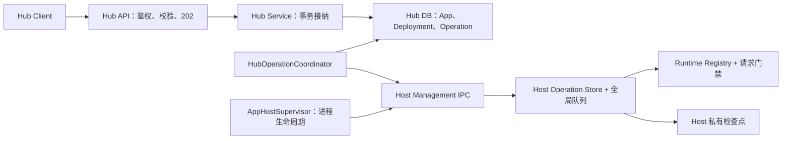

# Hub 部署与运行可靠性设计

## 1. 评审摘要

本文是**待评审的实施方案**，不是已交付能力说明。目标是在现有单 Hub、单机受管 Host、进程内 App 架构上，补齐部署结果确认、重启恢复和 Stop 安全门禁，不新建部署平台。

### 1.1 建议结论

建议采用以下方案：

- Hub 持久化用户意图和操作历史，Host 执行操作并保存执行证据；
- 增加 Hub 专用 Operation 表，统一跟踪 Deploy、Rollback、Start、Stop；
- 增加 Host 私有执行检查点，避免只依赖进程内 Promise 或内存 Registry；
- 增加后台 `HubOperationCoordinator`，负责提交、查询、确认和恢复；
- 同一 App 的控制写操作串行，结果未确认时不允许新操作越过旧操作；
- Stop 由 Host 在请求入口和 Runtime 激活入口执行，不依赖页面按钮状态。

### 1.2 能保证什么

| 场景 | 方案结果 |
| --- | --- |
| IPC 响应丢失 | 查询原操作，不因超时直接判失败，也不重复执行 |
| Host 已成功、Hub 写库失败 | 依据 Host 的成功检查点补齐 Hub 事务 |
| Hub 或 Host 重启 | 从数据库目标和 Host 检查点恢复，不批量把未完成操作改成失败 |
| 旧结果迟到 | 通过 App 实例、控制版本和 fingerprint 拒绝覆盖新状态 |
| Stop 后直接访问 | HTTP、静态资源、WebSocket 和内部激活入口统一拒绝再次激活 |
| 无法证明切换结果 | 保留现场并进入 `needs-attention`，由人员确认，不盲目重试 |

本方案不承诺业务副作用的 exactly-once。Runtime 启动可能执行 migration、插件初始化或外部写入，这些行为无法与 Hub 数据库和 Host 文件检查点组成跨系统事务。

## 2. 背景与现状

当前 Hub 的部署流程由 `app-plugin-hub/server/services/hub.ts` 创建 Deployment，然后通过 Supervisor/IPC 调用 Host。Host 的 `ManagedReconciler` 使用全局串行队列，结果主要通过原 IPC 请求 Promise 返回；Host Operation Registry 和跨进程结果恢复尚未建立。

当前存在四类风险：

1. Host 已切换成功，但 IPC 或 Hub 数据库失败，Hub 可能误报失败；
2. Hub/Host 重启后，原进程 Promise 和内存状态消失；
3. 新旧操作或恢复快照可能交错，迟到结果可能覆盖新版本；
4. Stop 销毁 Runtime 后，保留的定义可能被直接访问再次 lazy 激活。

本方案沿用现有 App、Release、Deployment、Runtime 产品模型：Deployment 仍是发布/回滚历史，Runtime 仍以 Host 实时状态为准，lazy 尚未激活不等于用户 Stop。

## 3. 目标与范围

### 3.1 本阶段目标

- 将控制操作从“等待一次 Promise”改为“持久化意图、独立执行、查询结果、协调收尾”；
- 保证同一 App 的操作顺序和结果不被旧操作覆盖；
- Hub/Host 重启后继续安全确认可证明的结果；
- 对确认安全的临时故障自动退避重试；
- 对切换结果不确定的场景提供明确人工处理路径；
- 让 Stop 成为 Host 服务端的实际禁用状态。

### 3.2 本阶段包含

- Deploy、Rollback、Start、Stop 的 Operation 记录、幂等提交、查询和确认；
- Host 实例识别、执行检查点、App 版本 fence 和结果清理；
- Hub 启动恢复、Host 重启恢复、IPC 超时/断线和数据库提交失败处理；
- App 级控制写入互斥、页面状态和后台协调；
- HTTP、静态资源、WebSocket 和 Runtime 激活门禁；
- Migration、故障注入、真实子进程和数据库事务测试。

### 3.3 本阶段不包含

- CLI 发布、API Token、远程 Host、多 Host、多 Hub 主动写入；
- 通用任务队列、分布式调度、零停机部署；
- 进程/Worker backend、数据库 migration 自动回滚；
- 活动部署取消、完整配置版本管理、Secret Store；
- Remove 的自动重试和完整删除补偿方案。

Restart、配置发布和 Remove 保留现有入口。它们需要接入 App 级写入互斥和结果核验，但不获得部署操作的自动重放语义；特别是 Remove 结果不确定时禁止自动重复删除。

## 4. 总体设计

职责边界：

| 组件 | 负责 | 不负责 |
| --- | --- | --- |
| Hub Service | App/Release/Deployment、用户意图、操作接纳和历史 | 直接判断 Host 内部执行阶段 |
| Coordinator | 提交、查询、重试、终局事务、恢复调度 | 替代数据库事务或执行 Runtime |
| Host Management | 校验、排队、执行、检查点和操作结果 | 读取 Hub 数据库或决定业务历史指针 |
| Supervisor | Host 子进程启动、退出、健康检查和重启预算 | 保存业务部署快照或执行恢复决策 |
| Runtime Registry | 定义、Runtime、App 锁和请求激活 | 依赖前端按钮保证安全 |

### 4.1 一次 Deploy 的流程

1. Hub 校验输入并准备独立配置文件。
2. Hub 在数据库事务中递增 App `controlRevision`、占用 `activeOperationId`，写入 Operation 和 Deployment。
3. API 返回 202；Coordinator 读取不可变请求快照并提交 Host。
4. Host 原子登记操作，再准备制品、配置和候选 Runtime。
5. Host 保存执行结果；Coordinator 查询并校验 ID、版本、attempt、fingerprint。
6. Hub 在终局事务中更新 Deployment、`currentDeploymentId` 和 `enabled`，释放执行权。
7. Hub 写库成功后 acknowledge Host，Host 才清理不再被引用的详细结果和文件。

IPC 超时进入 `reconciling`，不直接判失败。实际 IPC disconnect 时，当前架构的 Host 会关闭并退出，因此恢复路径是等待旧进程退出后启动新实例，不设计“重连或收养旧 Host”。

## 5. 核心状态模型

### 5.1 Hub 状态

| 状态 | 含义 | 是否释放 App 写入权 |
| --- | --- | --- |
| `queued` | 已入库，尚未提交 Host | 否 |
| `running` | Host 已接纳或正在执行 | 否 |
| `reconciling` | 结果或数据库收尾待确认 | 否 |
| `needs-attention` | 结果不明或自动恢复不安全 | 否 |
| `succeeded` | 已证明操作完成 | 是 |
| `failed` | 已证明操作未完成且未改变成功指针 | 是 |
| `closed` | 人工结束，原结果仍不能证明 | 是，但需记录处置审计 |

Deployment 对外继续表示发布/回滚历史；Start/Stop 不伪造 Deployment。页面同时展示操作状态和 Runtime 实时状态：一次 Deployment `succeeded` 不等于当前 Runtime 一定 Running。

### 5.2 版本和身份

- `appInstanceId`：App 创建时生成的 UUID，防止删除后重建同名 App 受到旧操作影响；
- `controlRevision`：App 控制写入的单调版本，Deploy、Rollback、Start、Stop 共用；
- `operationId`：Deploy/Rollback 直接使用 Deployment ID，Start/Stop 使用新的 UUID；
- `attempt`：一次可重试执行的次数，IPC 轮询和重发不递增；
- `fingerprint`：规范化目标内容的 SHA-256，Host 必须重新计算；
- `hostInstanceId`：Host 进程实例身份，不等于 IPC session。

旧操作必须同时匹配 App 实例、控制版本、操作 ID、attempt 和 fingerprint。新版本不能抢占仍在执行的旧版本；首期返回 409，避免引入取消和回滚竞态。

## 6. 主要技术决策

### 6.1 Hub 持久化 Operation

新增 `hubAppOperations`，记录操作身份、不可变请求快照、状态、attempt、Host 实例、调度时间、结构化错误、结果和 acknowledge 状态。`hubApps` 增加 `appInstanceId`、`controlRevision`、`activeOperationId`、`lastOperationId`、`lastReconciledAt`、`recovery` 和脱敏错误摘要。

创建操作时使用条件更新：只有 `activeOperationId IS NULL` 且 `controlRevision` 仍等于读取值时，才能递增版本并占用 App。失败、不可重试错误和人工结案都必须释放执行权；只有 `reconciling`、`needs-attention` 保留执行权。

Deployment 与对应 Operation 的状态更新在同一数据库事务中完成。数据库异常后先回读，区分“事务已提交但响应丢失”和“事务未提交”，不能把数据库连接错误写成部署失败。

### 6.2 不可变请求快照

快照固定保存操作类型、App 实例、控制版本、Release checksum、backend、basePath、启动策略、目标 enabled、前一成功 Deployment 和配置引用/hash。重试只使用该快照，不能重新读取最新 Settings 拼出另一份请求。

真实配置正文不入 Operation 数据库；Hub/Host 使用私有、权限受限、原子写入的配置文件，操作完成且无引用后再清理。外部配置模式只能保存声明信息，不能声称已经校验外部正文。

### 6.3 Host 检查点

Host 在任何部署副作用前记录 `accepted`；在停止旧 Runtime、导入 App 入口或激活候选前记录 `switching`；执行结束并成功写入结果后记录 `succeeded` 或明确 `failed`。检查点按 App 使用单一 JSON 文档原子更新，不能将版本、阶段和结果拆成互不一致的文件。

只读查询、制品下载、校验、展开和配置准备可以自动重试。候选激活、Runtime fallback、migration、外部写入、Restart、配置 reload 和 Remove 的结果无法确认时不自动重放。

### 6.4 新 Host 恢复

新 Host 先取得本地私有目录所有权，再读取检查点；应用请求暂不开放，管理查询和 liveness 可用。Hub 生成带 Host 实例和 bootstrap ID 的初始化清单，Host 先登记每个 App 的版本和操作身份，再逐 App 恢复。

恢复不创建新的 Deployment，也不把已成功历史改为失败：

- 无活动操作：恢复数据库当前成功目标；stopped App 只恢复禁用定义，不激活；
- 已成功但 Hub 未收尾：先补齐历史事务，再恢复已应用目标；
- 准备阶段中断：清理可识别 staging 后安全续办；
- switching 阶段中断：进入 `needs-attention`，不自动重做候选初始化；
- 明确 reverted：完成失败历史，按正常重启约定恢复旧目标；
- 检查点/快照损坏或结果 unknown：暂停该 App，等待人工处理。

Hub 就绪不等待所有 App 恢复；恢复期间 App 请求返回 `503 APP_RECOVERING`。单个 App 失败不阻止其他 App 恢复，也不应触发整个 Host 因应用恢复失败而自动重启。

## 7. Start、Stop 与访问安全

`enabled` 表示用户期望，Runtime 是否存在表示当前观察状态。lazy 尚未激活、idle eviction 和 capacity eviction 不得被误判为 Stop。

Start/Stop 在数据库事务中递增 `controlRevision` 并创建 Operation。Deploy/Rollback 成功后按现有产品语义将目标设为 running；Start 是显式立即激活，不改变 startupMode。Deploy、Rollback、Start、Stop 双向互斥。

Stop 的线性化点是 Host 在 App 锁内关闭准入并将定义设为 disabled；之后销毁 Runtime。HTTP、静态资源、WebSocket upgrade、`ensureActiveHandle()` 和内部激活入口必须统一检查 enabled：

- stopped 返回 503 `APP_STOPPED`；
- 恢复中返回 503 `APP_RECOVERING`；
- 状态不确定返回 503 `APP_STATE_UNCERTAIN`；
- 已进入处理的请求按现有 drain 流程处理；
- Stop 销毁失败也保持 disabled，不自动改回 enabled。

不能通过“锁外检查 enabled → 等待 → 激活”实现门禁。必须保证检查和取得分发资格在同一 App 临界区完成，且返回已有 Runtime 前也要检查 enabled。

## 8. 人工处理和升级边界

`needs-attention` 提供两种受控动作：

| 动作 | 前提 |
| --- | --- |
| 重试同一目标 | 旧执行者已退出、快照完整、用户确认可能发生的业务副作用；以原 ID、新 attempt 执行 |
| 结束并保持停止 | 当前 Host 确认无 Runtime、准入已关闭；记录 `closed` 和处置审计，不前移成功指针 |

动作必须经过服务端权限校验、controlRevision 条件更新、显式确认和处置审计；响应丢失时重复请求无副作用。不能通过直接清空 `activeOperationId` 代替核验。

Migration 新增表和字段时使用新的、明确的、自包含 migration，不修改已合并 migration，不导入运行时定义。已有 queued/deploying 记录没有可靠接纳凭证时，升级后进入 `needs-attention`，不能按时间直接取消或盲重试。首次升级停止旧 Hub/Host，不允许运行新旧协调器。

Host 目录使用本地独占所有权和管理检查点；新实例发现活 owner 时等待，无法证明旧进程已退出时 fail closed，不按过期时间强制删除锁。删除后重建同名 App 生成新的 `appInstanceId`，旧操作和旧 ack 全部拒绝。

## 9. 实施阶段与验收重点

| 阶段 | 交付内容 |
| --- | --- |
| 1 | Host Operation 协议、去重、版本 fence、checkpoint 和单实例原型 |
| 2 | Runtime Registry 门禁、Stop 线性化和 Supervisor 退出边界 |
| 3 | Hub migration、接纳/终局事务、Coordinator 和恢复流程 |
| 4 | API/Client 状态、人工处理入口、配置/缓存引用保护 |
| 5 | 真实子进程、数据库事务、Hub Template 和发布产物验证 |

必须覆盖：响应丢失、Host 登记前断线、Host 成功后 DB 失败、Hub/Host 重启、preparing/switching 检查点中断、旧结果迟到、并发控制写入、lazy/eager/stopped、Stop 与四类访问入口并发、checkpoint 损坏、锁竞争、同名 App 重建和两轮幂等协调。

详细字段、接口草案、故障决策表、migration 兼容规则、测试矩阵和代码影响范围见：

`internal-docs/hub-deployment-runtime-reliability-technical-details.md`

## 10. 需要同事确认的事项

| 议题 | 本稿建议 | 需要确认的代价 |
| --- | --- | --- |
| 持久化 | Hub Operation 表 + Host 私有 checkpoint | 增加 migration、文件清理和备份要求 |
| 并发 | 同一 App 控制写入完全互斥，不做抢占 | 未确认期间不能直接发新 Deploy/Stop |
| 重试 | 只自动重试可证明安全的阶段 | switching 中断需要人工确认 |
| 不确定结果 | 提供“重试同一目标”或“结束并保持停止” | 不能承诺业务副作用 exactly-once |
| 即时操作 | Restart/配置/Remove 保留现有 API，接入互斥核验 | Remove 不自动重放，配置不扩展为版本产品 |
| 升级 | 首次升级停旧进程，旧未完成记录人工核验 | 需要一致备份 DB、配置和 Host 状态目录 |

确认上述取舍后再进入编码。本文和技术附录均为评审稿，尚未实施，也未同步到飞书。
