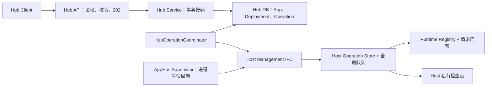

# Hub 部署与运行可靠性设计

> 文档状态：待评审、未实施。
>
> 本文合并了 Hub 部署与运行可靠性主方案及技术附录，统一用于方案评审、开发拆分和验收。所有“支持”“保证”均指设计目标，不代表当前代码已经具备该能力。

## 1. 一页评审摘要

### 1.1 建议结论

在现有“单 Hub、单机受管 Host、进程内 App”架构上补齐可靠性机制，不新建部署平台：

- Hub 持久化用户意图、不可变请求快照和操作历史；
- Host 执行控制操作，并持久化执行检查点和结果证据；
- 新增 Hub 专用 Operation 表，统一跟踪 Deploy、Rollback、Start、Stop；
- 增加后台 `HubOperationCoordinator`，负责提交、查询、确认、重试和恢复；
- 同一 App 的控制写操作完全串行，旧结果未确认时新操作不能越过旧操作；
- Stop 由 Host 在请求入口和 Runtime 激活入口执行服务端门禁，不依赖页面按钮状态。

### 1.2 方案能保证什么

| 故障或场景 | 设计结果 |
| --- | --- |
| IPC 响应丢失 | 查询原 `operationId`，不因超时直接判失败，也不重复执行同一 attempt |
| Host 已成功、Hub 写库失败 | 依据 Host 成功检查点补齐 Hub 终局事务，不重新执行切换 |
| Hub 或 Host 重启 | 从 Hub 目标、Host 检查点和实例身份恢复，不批量把未完成操作改为失败 |
| 旧结果迟到 | 通过 `appInstanceId`、`controlRevision`、attempt 和 fingerprint 拒绝覆盖新状态 |
| Stop 后再次访问 | HTTP、静态资源、WebSocket upgrade 和内部激活入口统一拒绝重新激活 |
| 切换结果无法证明 | 保留现场，进入 `needs-attention`，由人员选择受控处置，不盲目重试 |

本方案不承诺业务副作用 exactly-once。Runtime 启动可能执行 migration、插件初始化或外部写入，这些副作用无法与 Hub 数据库及 Host 文件检查点组成跨系统事务。

### 1.3 需要评审确认的取舍

| 议题 | 本稿建议 | 成本或边界 |
| --- | --- | --- |
| 持久化 | Hub Operation 表 + Host 私有检查点 | 增加 migration、存储格式、清理和备份要求 |
| 同 App 并发 | 控制写入完全互斥，不做抢占 | 未确认期间不能直接发新 Deploy/Stop |
| 自动重试 | 仅重试可证明安全的阶段 | `switching` 中断需人工确认 |
| 不确定结果 | 支持“重试同一目标”或“结束并保持停止” | 不伪造成功，不承诺业务副作用 exactly-once |
| 即时操作 | Restart、配置发布、Remove 保留现有入口并接入互斥核验 | Remove 结果不确定时禁止自动重复删除 |
| 升级 | 首次升级停旧 Hub/Host，再由新版本恢复 | 旧未完成记录需核验，不能新旧协调器并行写入 |

## 2. 背景、现状与目标

### 2.1 当前流程

当前 Hub 由 `app-plugin-hub/server/services/hub.ts` 创建 Deployment，再通过 Supervisor/IPC 调用 Host。Host 的 `ManagedReconciler` 使用全局串行队列，结果主要依赖原 IPC 请求 Promise；Host Operation Registry 和跨进程结果恢复尚未建立。

### 2.2 当前风险

1. Host 已切换成功，但 IPC 或 Hub 数据库失败，Hub 可能误报失败；
2. Hub/Host 重启后，原进程 Promise 和内存状态消失；
3. 新旧操作或恢复快照交错，迟到结果可能覆盖新版本；
4. Stop 销毁 Runtime 后，保留的定义可能被访问再次 lazy 激活；
5. 配置文件、Runtime 和数据库状态无法通过单一事务同时提交。

### 2.3 本阶段目标

- 将控制操作从“等待一次 Promise”改为“持久化意图、独立执行、查询结果、协调收尾”；
- 保证同一 App 的操作顺序和结果不会被旧操作覆盖；
- Hub/Host 重启后继续确认可证明的结果；
- 对可证明安全的临时故障自动退避重试；
- 对结果不确定的场景提供明确人工处理路径；
- 让 Stop 成为 Host 服务端真实的禁用状态。

### 2.4 范围

包含 Deploy、Rollback、Start、Stop 的 Operation 记录、幂等提交、查询、确认、恢复、权限、页面状态和测试；包含 Host 实例识别、执行检查点、版本 fence、结果清理、Supervisor 退出边界，以及 HTTP/静态资源/WebSocket/Runtime 激活门禁。

不包含 CLI 发布、API Token、远程 Host、多 Host、多 Hub 主动写入、通用任务队列、分布式调度、零停机部署、进程/Worker backend、migration 自动回滚、活动部署取消、完整配置版本管理和 Secret Store。

Restart、配置发布和 Remove 保留现有入口，但必须接入 App 级写入互斥与结果核验；Remove 不获得自动重放语义。

## 3. 总体架构与职责



| 组件 | 负责 | 不负责 |
| --- | --- | --- |
| Hub Service | 鉴权、参数校验、目标状态、Deployment/Operation 事务接纳 | 不把 IPC Promise 当作唯一事实来源 |
| Hub DB | 用户意图、操作状态、成功 Deployment 指针、审计 | 不记录无法保护的运行时瞬时状态 |
| Coordinator | 投递、查询、确认、恢复、退避、终局收尾 | 不执行 Runtime 业务逻辑 |
| Host Management | 实例身份、去重、版本 fence、操作队列、检查点 | 不自行改变 Hub 成功历史 |
| Runtime Registry | Runtime 生命周期、请求准入、Stop 门禁 | 不决定 Hub 的业务目标 |
| Supervisor | 子进程启动、退出、重启预算、所有权边界 | 不绕过 Operation 协议直接改状态 |

## 4. 核心状态与身份模型

### 4.1 Hub 操作状态

建议状态：

`queued` → `submitting` → `accepted` → `preparing` → `switching` → `succeeded`

异常路径包括：`retryable`、`failed`、`needs-attention`、`closed`。

- `queued`：已持久化用户意图，尚未取得 Host 执行权；
- `accepted`：Host 已接纳并完成幂等登记；
- `preparing`：正在准备制品、配置或候选 Runtime；
- `switching`：正在切换定义、Runtime 或准入状态；
- `succeeded`：Hub 已完成终局事务并可证明目标生效；
- `retryable`：故障可安全重试，按退避时间再次协调；
- `needs-attention`：结果或副作用无法证明，必须人工处置；
- `closed`：人工结束但不伪造成功或确定失败。

`reconciling` 和 `needs-attention` 不是终局，仍保留执行权；终局事务必须条件清空 `activeOperationId`。

### 4.2 版本与实例 fence

每个 App 使用以下隔离字段：

- `appInstanceId`：App 删除重建后必须变化，隔离旧操作和旧 ack；
- `controlRevision`：用户控制意图的单调版本，阻止旧操作覆盖新意图；
- `operationId`：一次用户意图的稳定身份；
- `attempt`：同一操作的执行尝试号；同一 attempt 在 Host 存活期间不得重复执行；
- `fingerprint`：规范化请求快照的 SHA-256 指纹；
- `hostInstanceId`：Host 进程/实例身份，旧实例结果不得写入新实例状态。

所有 Hub 写入、Host 接纳、结果确认和恢复目标都必须带条件校验，不能仅依赖时间顺序。

## 5. 一次 Deploy 的完整流程

1. Hub 在事务中校验 App、Release、权限和当前控制版本，生成不可变 `requestSnapshot`；
2. Hub 创建 Operation，递增 `controlRevision`，设置 `activeOperationId`，返回 `202` 和 `operationId`；
3. Coordinator 按 App 锁读取 Operation，投递 Host 请求；
4. Host 校验 `appInstanceId`、`expectedHostInstanceId`、`controlRevision`、fingerprint 和 attempt；
5. Host 将请求写入持久 Operation Store，重复请求返回已登记结果，不重新执行；
6. Host 按 `preparing`、`switching`、成功/失败检查点推进，更新 Runtime Registry 和定义；
7. Coordinator 在响应丢失时查询原 Operation，不创建替代操作；
8. Host 返回可验证结果后，Hub 在条件事务中更新 Operation、Deployment、成功指针和 enabled；
9. Hub 事务成功后 acknowledge Host；ack 丢失时重复 ack 必须无副作用；
10. 终局后清理仍未被活动操作或未确认结果引用的快照和临时文件。

### 5.1 Rollback

Rollback 创建新的 Operation 和新的 Deployment 历史，不修改旧成功 Deployment。它固定目标 Release、配置和前一成功目标；不能重新读取最新 App Settings 拼出不同 payload。Rollback 成功后更新当前成功指针；失败保留原成功指针。

### 5.2 Start 与 Stop

Start/Stop 在数据库事务中递增 `controlRevision` 并创建 Operation，和 Deploy/Rollback 双向互斥。Start 是显式立即激活，不改变 `startupMode`；Deploy/Rollback 成功后按现有产品语义设置运行目标。

## 6. Hub 数据模型与事务规则

### 6.1 App 新字段

建议增加：

- `appInstanceId`；
- `controlRevision`；
- `activeOperationId`；
- `desiredEnabled` 或等价的用户目标状态；
- `lastOperationId`；
- 运行时观察状态、恢复状态和最近错误摘要。

### 6.2 `hubAppOperations`

核心字段建议包括：

| 字段 | 用途 |
| --- | --- |
| `id` | 稳定操作身份 |
| `appId` / `appInstanceId` | App 与生命周期隔离 |
| `type` | `deploy`、`rollback`、`start`、`stop`，以及受控即时操作类型 |
| `status` | 协调状态机 |
| `controlRevision` | 写入 fence |
| `attempt` | 执行尝试号 |
| `requestSnapshot` | 不可变目标快照或安全引用 |
| `fingerprint` | 请求语义指纹 |
| `hostInstanceId` | Host 执行实例 |
| `hostCheckpointRef` | Host 结果证据引用 |
| `retryAt` / `retryCount` | 退避重试 |
| `errorCode` / `errorSummary` | 用户可见错误摘要 |
| `closedReason` / `audit` | 人工结案依据 |
| `createdAt` / `updatedAt` | 审计和协调 |

### 6.3 接纳事务

在一个数据库事务中：锁定 App、检查没有活动控制操作、校验 `controlRevision`、创建 Operation、保存快照、递增 revision、设置 `activeOperationId`。重复提交必须使用幂等键或原 `operationId` 返回已有 Operation，不能重复创建目标。

### 6.4 终局事务

确认 App 实例、revision、attempt、fingerprint 和 Host 结果均匹配后：

- 成功：更新 Operation、Deployment、`currentDeploymentId`、enabled 和观察状态；
- 确定失败：更新 Operation/Deployment，保留部署前成功指针；Start/Stop 的用户期望按操作语义处理；
- 成功和失败都必须释放 `activeOperationId`；
- 数据库异常后先回读，处理“事务已提交但客户端未收到成功”；
- 写库成功后才 acknowledge Host；确认失败不反向修改已提交结果，下次继续确认；
- 人工终结只使用 `closed`，记录处置原因和复核结果，不伪造 `succeeded` 或已证明的 `failed`。

Remove 删除数据库记录时可在同一事务终结自身 Operation，但外部目录清理失败必须保留未完成清理项，不能报告为完全成功，也不能由协调器自动重复删除。

## 7. 不可变快照、配置与文件安全

### 7.1 快照内容

快照固定保存协议版本、操作类型、App ID、`appInstanceId`、控制版本、Release ID/key/checksum、backend、basePath、激活策略、目标 enabled、前一成功 Deployment 引用及配置模式/快照引用/hash。

Stop 不需要 Release 或配置正文，只固定 App 实例、控制版本和禁用目标。

请求 fingerprint 不包含 `requestId`、`hostInstanceId`、attempt 和临时路径。Host 必须重新计算 fingerprint，校验配置内容 hash 和实际制品 checksum；“当前定义内容指纹”只用于漂移诊断，不能据此推定某次部署成功。

### 7.2 文件规则

- Hub 私有 `app-configs` 根目录保存操作专用配置；目录 `0700`、文件 `0600`；
- 先写临时文件，再原子替换；路径只能由受信根目录和已校验 ID 构造；
- 活动操作、当前生效配置和未确认 Host 结果引用的文件不得删除；
- Hub 事务提交及 Host acknowledge 完成后才清理旧快照；
- 历史部署不是配置版本库；主动 Rollback 仍创建新快照和新操作。

### 7.3 即时配置发布

配置发布占用同一 App 执行权，不能修改活动部署使用的快照。保留“先保存 Hub 目标文件，再发布 Host 运行配置”的行为；配置保存成功但 Runtime reload 失败必须显式可见。响应丢失先查询原操作；文件 hash 相同不能证明 reload 已完成。

## 8. Host Management 协议

接口草案：

```ts
interface HostOperationRequest {
  protocolVersion: 1;
  expectedHostInstanceId: string;
  operationId: string;
  appId: string;
  appInstanceId: string;
  controlRevision: string;
  attempt: number;
  fingerprint: string;
  type: 'deploy' | 'rollback' | 'start' | 'stop';
  requestSnapshot: unknown;
}

interface HostOperationResult {
  operationId: string;
  appInstanceId: string;
  hostInstanceId: string;
  attempt: number;
  fingerprint: string;
  status: 'accepted' | 'running' | 'succeeded' | 'failed' | 'unknown';
  checkpoint?: string;
  observedState?: unknown;
}
```

### 8.1 接纳与去重

Host 先验证实例和版本 fence，再持久化 Operation 登记。相同 `operationId + attempt + fingerprint` 返回已有状态；相同 ID 但 fingerprint 不同必须拒绝；旧 revision、旧 App 实例和旧 Host 实例结果必须拒绝。

### 8.2 执行检查点

至少支持：

- `accepted`：已登记请求；
- `preparing`：候选制品/配置/Runtime 准备中；
- `switching`：正在改变定义、准入或 Runtime；
- `succeeded`：目标已应用，包含定义和观察结果摘要；
- `failed`：确定失败，包含清理结果；
- `unknown`：无法证明切换结果，禁止自动重放。

检查点必须持久化到 Host 私有目录/存储，不能只放在内存 Registry 或 Promise 中。检查点引用和配置 hash 受保护，损坏时 fail closed。

## 9. Coordinator 与故障恢复

### 9.1 协调循环

Coordinator 为每个 App 获取互斥执行权，读取活动 Operation，执行：

1. 检查是否已终局或已被新 revision 淘汰；
2. 查询 Host 原操作和 checkpoint；
3. 对可证明安全阶段执行有限次数指数退避；
4. 对可验证成功结果先补 Hub 终局事务，再 acknowledge；
5. 对结果不确定的状态转 `needs-attention`；
6. 仅在终局或人工结案后释放执行权。

协调循环必须幂等。Hub 重启后可以重复协调，但不能产生新的 Deployment、不能重复切换、不能删除仍有引用的文件。

### 9.2 Hub 启动恢复

- 无活动操作：恢复数据库当前成功目标；stopped App 只恢复禁用定义，不激活 Runtime；
- 已成功但 Hub 未收尾：先补齐历史事务，再恢复已应用目标；
- `preparing` 中断：清理可识别 staging 后安全续办；
- `switching` 中断：进入 `needs-attention`，不自动重做候选初始化；
- 明确 reverted：完成失败历史，按正常重启约定恢复旧目标；
- 检查点/快照损坏或结果 unknown：暂停该 App，等待人工处理。

Hub 就绪不等待所有 App 恢复；恢复中的 App 返回 `503 APP_RECOVERING`，状态不确定返回 `503 APP_STATE_UNCERTAIN`。单个 App 失败不阻止其他 App 恢复，也不因单 App 恢复失败自动重启整个 Host。

### 9.3 Host 重启恢复

新 Host 必须先确认目录所有权和 `hostInstanceId`，读取私有检查点，向 Hub 查询活动 Operation，再恢复 Runtime。旧 Host 未实际退出或活跃 owner 无法证明已释放时等待或 fail closed，不能按过期时间强制删除锁。

旧清单晚到、新操作先完成时，按 App 实例和 revision 拒绝旧清单；初始化失败只隔离该 App。lazy 尚未激活、idle eviction 和 capacity eviction 不得误判为 Stop。

## 10. Supervisor、所有权与重启预算

- 同一 App 目录只能由一个 Host 实例拥有；使用本地独占所有权和管理检查点；
- 新实例发现活 owner 时等待；无法证明旧进程退出时 fail closed；
- 受管子进程的启动、退出和 SIGKILL 都必须落入 Operation/检查点协议；
- 重启受预算、退避和熔断限制，不能通过重启绕过 `needs-attention`；
- Host 管理目录、候选目录、配置引用和结果证据需按引用关系清理；
- 删除后重建同名 App 必须生成新的 `appInstanceId`，旧操作和 ack 全部拒绝。

## 11. Start、Stop 与访问安全

### 11.1 期望与观察分离

`enabled` 表示用户期望；Runtime 是否存在表示当前观察状态。lazy 未激活不等于 Stop，Runtime eviction 也不等于用户禁用。

### 11.2 Stop 的线性化点

Stop 在线程/进程内 App 锁中关闭准入，将定义设为 disabled，再销毁 Runtime。不能采用“锁外检查 enabled → 等待 → 激活”的方式；检查 enabled 和取得分发资格必须在同一 App 临界区完成。返回已有 Runtime 前也要再次检查 enabled。

生效点之后：

- HTTP 请求返回 `503 APP_STOPPED`；
- 静态资源访问拒绝进入已停止 App 的激活路径；
- WebSocket upgrade 被拒绝；
- `ensureActiveHandle()` 和内部激活入口拒绝重新激活；
- 已进入处理的请求按现有 drain 流程处理；
- destroy 失败仍保持 disabled，不自动改回 enabled。

恢复中的 App 返回 `503 APP_RECOVERING`；状态不确定返回 `503 APP_STATE_UNCERTAIN`。

## 12. API、权限与页面体验

### 12.1 API 兼容

现有部署接口改为创建 Operation 并返回 `202`，保留响应中的 App/Deployment 兼容字段；新增 Operation 查询、确认、人工处置和恢复状态接口。所有接口均执行服务端权限校验和 App/revision 条件更新，不能仅靠前端隐藏按钮。

建议错误码：

`APP_OPERATION_ACTIVE`、`APP_RECOVERING`、`APP_STOPPED`、`APP_STATE_UNCERTAIN`、`OPERATION_STALE`、`OPERATION_FINGERPRINT_MISMATCH`、`HOST_INSTANCE_MISMATCH`、`CHECKPOINT_CORRUPTED`。

### 12.2 页面状态

页面展示 Operation 时间线、当前阶段、attempt、重试时间、最近错误、目标 Release、恢复状态和人工处理入口。轮询或刷新不能丢失原 `operationId`，也不能用过时快照覆盖新状态。

`needs-attention` 明确显示“需要处理”，提供：

1. **重试同一目标**：旧执行者已退出、快照完整，用户确认可能发生的副作用；使用原 ID、新 attempt；
2. **结束并保持停止**：Host 确认无 Runtime 且准入已关闭；记录 `closed` 和审计，不前移成功指针。

## 13. Migration、升级与兼容

- 新表和字段使用新的、自包含、明确的 migration；不导入运行时定义，不修改已合并 migration；
- migration 测试执行真实数据库的 up/down，验证物理 schema、索引和 metadata；
- 升级前先停止旧 Hub/Host，备份 Hub DB、配置和 Host 状态目录；
- 没有可靠接纳凭证的旧 `queued`/`deploying` 记录进入 `needs-attention`，不能按时间直接取消或盲重试；
- 首次升级禁止新旧协调器同时写入业务目录；
- 若 checkpoint、快照或历史 Deployment 冲突，先隔离异常 App，不阻止 Hub 启动。

## 14. 实施拆分

| 阶段 | 交付内容 |
| --- | --- |
| 1 | Host Operation 协议、去重、版本 fence、checkpoint、单实例所有权原型 |
| 2 | Runtime Registry 门禁、Stop 线性化、Supervisor 退出和重启预算 |
| 3 | Hub migration、接纳/终局事务、Coordinator 和启动恢复 |
| 4 | API/Client 状态、人工处理、配置/缓存引用保护、权限接入 |
| 5 | 真实子进程、数据库事务、Hub Template、发布产物和故障注入验证 |

主要影响范围：`@nocobase/app-host`、`app-plugin-hub`、Hub Template，以及相关共享 Host Management API 的消费者。实施前再次核对 develop 基线和已合并权限接口；不要把未合并代码写成当前能力。

## 15. 验收测试矩阵

必须覆盖以下故障和并发场景：

| 场景 | 预期 |
| --- | --- |
| IPC 响应丢失 | 查询原操作，调用次数不增加 |
| Host 登记前断线 | 可重投递；不产生重复切换 |
| Host 成功后 Hub DB 失败 | 重启后补齐成功历史，不重做切换 |
| Hub/Host 重启 | 依据 DB、checkpoint 和实例身份恢复 |
| `preparing` 中断 | 清理 staging 后安全续办 |
| `switching` 中断 | `needs-attention`，不盲重做 |
| 旧结果迟到 | 被 revision、instance、fingerprint 拒绝 |
| 两个并发 Deploy | 只有一个取得执行权，另一个可安全再次接纳 |
| Deploy 与 Start/Stop 交错 | 完全互斥，顺序可解释 |
| stopped/lazy/eager/eviction | Stop 保持禁用；lazy 不被强制拉起 |
| Stop 与 HTTP/静态/upgrade/ensureActive 并发 | 生效点后无新准入或激活 |
| Stop destroy 失败 | 仍保持 disabled，错误可见 |
| checkpoint 损坏 | fail closed，进入人工处理 |
| 状态目录锁冲突 | 不强制删除活 owner，不启动第二实例 |
| 同名 App 重建 | 新 `appInstanceId` 不受旧操作影响 |
| ack 丢失 | 重复 ack 无副作用 |
| 人工重试/结案响应丢失 | 同一处置只生效一次，审计完整 |
| Remove 响应丢失 | 不自动重复删除，显示未完成清理项 |
| 连续两轮协调 | 已收敛时无新增部署、切换或无引用文件 |

测试原则：断言 Operation ID、调用次数、真实 Runtime/定义状态和数据库结果，不只断言“没有抛错”。使用真实受管子进程覆盖 IPC disconnect 和进程终止；测试只操作测试 PID 与临时目录。

建议验证命令：

```sh
pnpm --filter @nocobase/app-host check
pnpm --filter @nocobase/app-plugin-hub check
pnpm --filter @nocobase/app-template-hub check
node scripts/validate-changesets.mjs
```

设计稿阶段不把上述命令描述成已运行。实现发布后，按实际修改范围补充 `lint`、`typecheck`、`test`、`build`，并为受影响的 publishable package 添加 changeset。

## 16. 评审结论与下一步

进入编码前需要确认：

1. 是否接受 Hub Operation 与 Host checkpoint 的双层持久化；
2. 是否接受同一 App 控制写入完全互斥；
3. 是否接受 `switching` 不确定时人工确认，而不是自动重试；
4. 是否接受 Stop 失败也保持 disabled；
5. 是否接受 Remove 不自动重放；
6. 是否接受首次升级停旧进程并人工核验无凭证历史操作。

确认后按第 14 节分阶段实施，优先完成 Host checkpoint、独占所有权和故障注入原型，再实现 Hub Coordinator 与页面。方案、实施任务、migration、测试矩阵和发布说明必须保持同一套状态语义。
