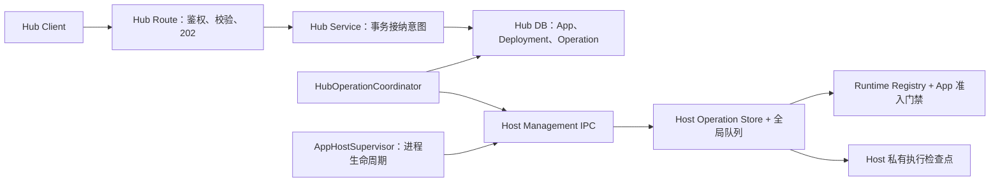

# Hub 部署与运行可靠性设计：技术附录

> 本文是主评审方案的技术附录。主方案用于确认目标、边界和关键决策；本文用于实现评审、故障分析和测试设计。

主方案：`hub-deployment-runtime-reliability-design.md`

## 1. 评审摘要与阅读指引

> **方案建议：** 在现有 Hub/Host 架构上补齐“操作记录、执行结果查询、异常恢复、Stop 禁用门禁”，不新建部署平台。可以证明安全的故障自动恢复；切换中断且结果不明确时保留现场，交由操作人员确认。

本文为**待评审的实施方案，不代表功能已经实现**。

### 1.1 本次要解决什么

- **已确认的部署结果可恢复：** Host 已持久化成功结果，即使响应丢失或 Hub 写库失败，也能查明结果；切换成功但结果尚未落盘时，不误报失败或直接重复部署。
- **重启后有恢复依据：** Hub 保存“要做什么”，Host 保存“已经做到哪一步”，双方对照后继续处理。
- **停止后不会被访问拉起：** Stop 不仅销毁 Runtime，还要由 Host 拒绝新请求和再次激活。

**为此增加的机制：** Hub 专用 Operation 表、Host 私有执行检查点、后台协调器，以及同一 App 的控制操作互斥。

**需要接受的取舍：** 同一 App 的部署、启停等操作不能并行；操作结果尚未确认时不能直接发起新操作；涉及无法确认的业务初始化副作用时，需要人工处理，而不是盲目重试。

### 1.2 建议怎么读

| 阅读目的 | 建议章节 |
| --- | --- |
| 快速判断方向和范围 | 第 1、2、4 节，再看第 15 节的待确认决策 |
| 评审技术实现 | 第 3 节了解现状，第 5～9 节检查数据、协议和恢复规则 |
| 确认用户体验与权限 | 第 10、11 节 |
| 安排开发、升级和测试 | 第 12～14 节 |

第 5～9 节属于详细技术设计，首次阅读可以跳过字段和接口定义。文中的“当前行为”与“本次建议”分开表述；所有新增机制均需实施和测试后才能视为已支持。

### 1.3 代码基线

- 核对日期：2026-09-09（Asia/Shanghai）。
- 本稿固定基线为 develop `741d0ebae1cee8883cb06514ba6e1951c6a3ac03`（2026-09-09 21:17:48 +08:00，`chore: move AI knowledge base plugin to Pro (#169)`）。此前已通过 `git fetch origin develop` 核对；后续文字修订不代表重新确认了远端最新提交。
- 方案以该 develop 提交为准，不以 `feat/hub-users-and-permissions` 工作区中尚未合并或正在修改的代码为已交付能力。
- **用户与细粒度权限改造尚不属于本次核对的 develop。** 基线 Hub Route 仍要求 `system-administrator`；如实施前权限 PR 已合并，沿用其 action 检查，不把本方案写成依赖未合并接口的实现。
- 产品语义依据 `internal-docs/application-hub-product-requirements.md`；实现约束依据根 `AGENTS.md`、仓库内 `.agents/skills/nocobase-plugin-development/` 及 `internal-docs/development/plugin-development/`。不采用 NocoBase 2 的插件、Portal 或 CLI 方案。

实施开始前再次核对 develop。若基线之后改变了 Host 生命周期、配置发布或权限接口，应先更新本文对应章节，而不是直接套用旧接口。

## 2. 目标、保证与范围

### 2.1 目标

把当前“请求发出后等 Promise”的部署流程，改为“持久化意图、独立执行、查询结果、协调收尾”。异常后能够解释并收敛以下三种状态：

1. Hub 记录的目标及当前成功 Deployment；
2. Host 安装的定义、配置和实际 Runtime；
3. 页面显示的操作进度与运行状态。

同时让 Stop 成为 Host 服务端执行的禁用状态，而不只是销毁 Runtime 或禁用页面按钮。

### 2.2 本阶段保证

- 同一 Host 存活期间，同一操作的相同 attempt 不重复执行；响应丢失可以查询和重发。
- Host 已记录成功检查点、Hub 尚未写库时，协调器能够补齐数据库，不再次执行该次切换。
- Hub/Host 重启后，依据数据库和 Host 检查点选择恢复路径，不把全部未完成部署直接判失败。
- 新旧操作有可比较的顺序，旧提交、旧结果及旧恢复目标不能覆盖新状态。
- Stop 生效后，新 HTTP、静态资源、WebSocket 握手以及内部激活入口均不能重新激活 App。
- 临时故障自动退避重试；无法证明安全的情况明确显示“需要处理”，不伪装成成功，也不无限盲重试。

**不承诺业务副作用的 exactly-once。** Runtime 启动可能执行 migration、插件初始化或外部写入，Host 文件检查点与这些副作用之间没有跨系统事务。切换中断且结果无法证明时，必须保守处理，见第 8 节。

### 2.3 范围

| 包含 | 不包含 |
| --- | --- |
| Deploy、Rollback、Start、Stop 的持久化操作与协调 | CLI 发布、API Token、远程管理传输、多 Host、多 Hub 主动写入 |
| Host 结果查询、轻量执行检查点、实例识别 | 通用任务队列、分布式调度平台 |
| 启动恢复、断线和写库失败处理 | 零停机、进程/Worker backend、业务 migration 自动回滚 |
| Stop 门禁、配置与其他写操作的互斥 | 完整配置版本产品、Secret Store、完整日志查询页面 |
| 页面状态、故障注入及数据库 migration 测试 | 活动部署取消、Remove 的自动重试与删除事务设计 |

Restart 和配置发布保留即时 API；Remove 保留现有破坏性操作语义。本次只要求它们接入同一互斥和结果核验，不增加自动重放；尤其不能自动重试 Remove。配置版本管理、删除补偿等仍不在本期范围内。

### 2.4 前置条件

本方案适用于单 Hub、单机受管 Host、进程内 App，以及持久的本地私有存储目录。Hub 数据库、目标配置、Host 检查点和原始 Release 必须按各自职责保留；磁盘损坏或不同时间点备份混用不属于普通进程重启。

App 必须支持正常重启，且自行保证 migration、初始化和外部任务的重入安全。Host 只能控制“是否再次调用”和“调用到哪一步”，不能替 App 撤销已发生的业务副作用。对不满足正常重启约定的 App，不承诺自动恢复 Runtime。

## 3. 当前架构与必须沿用的约束

| 位置 | develop 当前职责/行为 | 本次处理 |
| --- | --- | --- |
| `app-plugin-hub/server/services/hub.ts` | App/Release/Deployment 数据、配置文件、进程内锁、部署 runner、恢复 | 保留领域入口，拆出持久化操作存储和协调器 |
| `app-plugin-hub/server/providers/hub.ts` | 注册 `hubServiceToken`，初始化 Supervisor，启动恢复，关闭 Service 和 Host | 继续由 Provider 管理生命周期，不在模块导入时启动任务 |
| `app-host/src/supervisor.ts` | 启动受管子进程、IPC client、健康检查、崩溃重启限流 | 只管理进程和连接，不读取 Hub 表、不缓存业务部署集合 |
| `app-host/src/management/ipc.ts` | 父子进程 IPC；接受确认和最终响应绑定原 `requestId` | 增加独立操作提交/查询/确认协议 |
| `app-host/src/management/managed-reconciler.ts` | 全局串行队列、完整 Set、单 App 部署及启停 | 复用执行流程，增加版本检查和执行检查点 |
| `app-host/src/app-registry.ts` | App 级锁、lazy 激活、stop-first 替换、候选失败时尝试恢复旧 Runtime | 增加定义禁用和统一准入；不把 stop 当成 idle eviction |
| `app-host/src/artifact-resolver.ts` | 校验/展开 Release；managed 按 checksum 缓存 3 个 revision；restore 依赖本地已安装 revision | 增加待确认引用保护，恢复缓存缺失时采用受控重建 |
| `app-host/src/deployment/volume-manager.ts` | 私有配置文件、原子写入、App storage | 保持配置不入库，扩展快照引用与安全清理 |

需要特别纠正的两个假设：

1. **IPC 超时不等于 IPC 断开。** 同一连接仍在时可查询；实际 `disconnect` 时，`app-host/src/index.ts` 已关闭 IPC 并退出 Host。当前协议不支持重新连接或收养旧子进程，不能设计成“Hub 重启后重连原 Host”。
2. **没有 Runtime 不等于用户 Stop。** lazy 尚未访问和 idle/capacity eviction 都允许再次激活；用户 Stop 才禁止激活。协调器不能看到 `enabled=true` 且无 Runtime 就不断 Start，否则破坏 lazy 和空闲回收。

其他不变约束：Release 不可变；Deployment 每次新建；当前成功指针只在成功后前移；部署采用 stop-first；历史 Rollback 仍用目标 Release、模板和用户确认的配置创建新 Deployment，不声称自动恢复历史配置正文。

## 4. 方案总览与关键决策

### 4.1 职责划分

**Hub 决定目标并保存操作历史；Host 执行操作并保存执行证据；协调器负责核对结果和补齐状态。** Supervisor 只负责 Host 进程的启动与退出，不承担业务恢复决策。



### 4.2 一次部署如何完成

1. **接纳：** Hub 在一个事务中创建操作和 Deployment，锁定该 App 的控制写入，向页面返回 202。
2. **提交：** 协调器向 Host 提交带有固定 ID 和请求快照的操作。
3. **执行：** Host 先保存接纳记录，再准备制品、切换 Runtime，并保存执行结果。
4. **确认：** 协调器查询结果；确认成功后，事务更新当前成功 Deployment 并释放执行权。
5. **收尾：** Hub 通知 Host 结果已入库，Host 才能清理不再被引用的详细结果和资源。

如果中途通信或写库失败，进入“正在确认结果”，从已有记录继续核对，**不把整条流程从头再做一遍**。具体故障分支见第 8 节。

### 4.3 关键决策

**先区分两个结论：部署成功是历史事实，Runtime 是否运行是当前事实。** 一次已成功的部署不会因后续 Host 重启或启动失败而变成失败；当前运行状态必须另外查询和展示。

本方案作出以下明确选择：

1. **一个 App 同时只有一个控制写操作。** 部署与启停双向互斥，不在首期设计抢占/取消。长时间 reconciling 时冲突操作返回 409，而非越过旧操作。
2. **采用统一 `controlRevision`。** Deploy、Rollback、Start、Stop 及即时控制写入共用 App 级单调版本，不再维护互相独立的部署版本和启停版本。
3. **新增 Hub 专用 Operation 表。** Deployment 保留业务历史；Start/Stop 不伪造 Deployment。不是通用任务系统。
4. **Host 增加私有轻量检查点。** 纯内存 Registry 无法覆盖 Host 重启和记录清理后的去重，本次不再采用“只加内存 Map”的方案。检查点不是第二套 Hub 数据库。
5. **按 App 恢复，初始化登记与实际启动分离。** 不在运行中反复重放可能过期的完整 Deployment Set。
6. **部署保留现有激活语义。** Deploy/Rollback 成功后 App 期望为 running；首次/无 Runtime 时沿用 startupMode，有运行实例时仍执行 stop-first 替换。Start 显式立即激活，但不修改 startupMode。

新增 Operation 表和 Host 检查点是本方案的主要成本。只扩充 Deployment 表会让启停和其他控制写入缺少统一身份；只保存内存结果无法处理进程退出。为减少额外复杂度，本期不引入消息中间件、通用任务调度或跨 Host 一致性协议。

### 4.4 关键术语

| 术语 | 本文含义 |
| --- | --- |
| Deployment | 一次发布或回滚的业务历史，不代表当前 Runtime 一定正在运行 |
| Operation | 一次需要跟踪结果的控制操作；部署、启动、停止都可以是 Operation |
| 请求快照 | 操作创建时固定的目标参数；重试时不改用最新设置 |
| 执行检查点 | Host 保存到磁盘的执行阶段和结果；不等于业务数据库的事务日志 |
| controlRevision / fence | App 的操作顺序号，以及拒绝旧操作覆盖新状态的版本检查 |
| 协调 / 收敛 | 对照 Hub 目标与 Host 事实，补齐差异；达到一致后不重复执行 |

## 5. 数据模型与事务规则

### 5.1 `hubApps` 新字段

| 字段 | 建议类型与含义 |
| --- | --- |
| `appInstanceId` | 非空 UUID；创建 App 时生成，区别删除后重新创建的同名 App |
| `controlRevision` | 非空 bigInt，默认 0；每次接纳控制写入递增，失败也不回退 |
| `activeOperationId` | 可空 UUID 字符串；当前独占写操作 |
| `lastOperationId` | 可空 UUID 字符串；最近操作，用于查询错误/结果 |
| `lastReconciledAt` | 可空 datetime；最近实际协调时间 |
| `reconcileError` | 可空 JSON；脱敏后的恢复错误，不包含配置正文 |
| `recovery` | 可空 JSON；按第 8.3 节保存目标 Host、目标版本、进度与调度摘要，不充当实时 Runtime 状态 |

保留 `enabled`、`currentDeploymentId`、`startupMode`。`enabled` 表示已接纳的启停期望：Start/Stop 在接纳事务中更新；Deploy/Rollback 的 running 目标先存在操作快照内，成功事务才更新 `enabled=true`，失败保留原值。

数据库 bigInt 经 API/IPC 编码为十进制字符串并校验，避免 JavaScript number 精度丢失。现有 `HostDeploymentSet.revision` 不作为新的业务版本来源。

### 5.2 新增 `hubAppOperations`

| 字段组 | 内容 |
| --- | --- |
| 身份 | `id`、`appId`、`appInstanceId`、`controlRevision`、`kind`、可空 `deploymentId` |
| 不可变请求 | `requestVersion`、`requestSnapshot`、`operationFingerprint` |
| 状态 | `status`、`phase`、`attempt`、`reconcileAttempts` |
| Host 绑定 | 可空 `hostInstanceId`，仅代表本次派发所绑定实例 |
| 调度 | `nextAttemptAt`、`lastReconciledAt`、`createdAt`、`updatedAt`、`finishedAt` |
| 结果 | 脱敏 `result`、结构化 `error`、可空 `acknowledgedAt` |
| 处置审计 | `resolutions` JSON；追加处置 ID、操作者、原因、前后 attempt、时间及核验结果，不覆盖先前处置 |

`kind` 包括 `deploy / rollback / start / stop`；即时入口使用 `restart / publish-config / remove / update-settings`。同表记录不代表相同的执行策略：

| 操作 | 执行与恢复策略 |
| --- | --- |
| Deploy / Rollback / Start / Stop | 协调器驱动，可查询；只有已证明安全的失败才自动重试 |
| Restart / 配置发布 | 原请求可等待操作结果；断线后只查询，不自动再次执行 |
| Remove | 原请求执行现有删除流程；不确定时冻结同 App 写入，禁止自动重放 |
| Settings | 与控制版本更新同一个数据库事务完成，不经 Host 执行队列；仍只改变下次恢复策略 |

Operation 同时保存 `appInstanceId`。历史操作不可因 App 删除而失去审计和去重依据；Remove 完成前不清理自己的操作记录。

索引：主键 `id`；唯一 `(appInstanceId, controlRevision)`；扫描索引 `(status, nextAttemptAt)`；App 历史索引 `(appInstanceId, createdAt)`。`deploymentId` 非空时必须对应本 App；由 Service 在事务内验证，不用跨数据库不一致的部分索引表达核心互斥。

Deploy/Rollback 的 operation ID 直接等于新 Deployment ID。Deployment 与 Operation 状态在同一数据库事务中同步；Deployment 列表仍读原表，补充操作摘要，不让两者独立流转。

### 5.3 接纳事务

1. 校验权限、Release/App 归属、输入和当前操作；准备唯一 ID 对应的不可变配置文件。
2. 开启事务，重新读取 App；确认该 App 不在恢复中，以 `activeOperationId IS NULL AND controlRevision = 已读取版本` 条件更新 App：递增版本、占用操作 ID。
3. 验证条件更新只影响一行，否则回滚并返回 409；同时写 Operation，Deploy/Rollback 写 Deployment。Start/Stop 同事务写 `enabled`。
4. 提交后返回 202 并唤醒协调器。禁止先发 IPC 再写数据库。

文件先写、数据库后引用。事务失败产生的无引用文件允许延迟清理，不能反过来让数据库引用一个尚不存在的文件。文件准备期间状态发生变化时，本次接纳失败，不静默换成其他目标。

上述 202 流程适用于四类异步操作。即时入口也先取得数据库执行权，再调用 Host；Settings 在同一事务内完成后立即释放，不留下等待协调的任务。进程内锁用于减少竞争，不能代替条件更新；条件更新冲突和数据库死锁按数据库事务规则处理，不在持锁事务内等待 IPC。

恢复开始与控制写入接纳必须使用同一 App 临界区和条件更新，不能在检查 `recovery` 后释放锁再占用操作。首期只支持一个 Hub 写入者；若未来支持多 Hub，须另行引入持久租约/领导者协议，不能把本地锁当成分布式保证。

### 5.4 终局事务

确认 `activeOperationId`、`controlRevision`、attempt 和当前持有的 Host 结果匹配后：

- 成功：更新 Operation；部署同时更新 Deployment 和 `currentDeploymentId`、`enabled`。
- 确定失败：更新 Operation/Deployment，保留部署前的成功指针；Start/Stop 的用户期望不回滚。
- 两者均条件清空 `activeOperationId`，更新 `lastOperationId`。失败也必须释放，不能永久 409。
- `reconciling` 和 `needs-attention` 不是终局，保留执行权。
- 写库成功后才 acknowledge Host；确认失败不反向修改已提交结果，下次重试确认。

数据库异常后先回读，处理“事务已提交但客户端未收到成功”的情形。不能把数据库连接错误另写成部署失败。

人工终结无法确定原结果的操作使用独立 `closed` 状态，并记录处置原因和复核结果；不伪造 `succeeded` 或已证明的 `failed`。Deployments 页面同步提供“人工结束”标签。

Remove 的数据库删除步骤是该通用规则的例外：在同一事务中删除 App/Release/Deployment 记录并终结自己的 Operation；Operation 保留 appInstanceId 和删除结论，不级联删除。数据库外制品/目录清理仍按现有顺序执行，失败要显示未完成的清理项，不把部分删除报告为完全成功，也不由协调器自动重复删除。

## 6. 不可变快照与配置生命周期

### 6.1 快照内容

`requestSnapshot` 固定保存：协议版本、操作类型、App ID、appInstanceId、控制版本、Release ID/key/checksum、backend、basePath、激活策略、目标 enabled、前一成功 Deployment 引用及配置模式/快照引用/hash。Stop 也固定其适用的控制版本，不临时读取新版目标。

Snapshot 按操作类型定义，不强制所有字段同时存在：Stop 只需 App 实例、控制版本和禁用目标，不能因为 Release/配置文件丢失而无法停止 App。配置为 external 时只能固定配置模式和声明信息，不能声称已校验外部系统里的配置正文。

重试不得重新读取最新 App Settings 拼出另一份 payload。操作 fingerprint 覆盖规范化后的这些语义字段；不覆盖传输 `requestId`、hostInstanceId、attempt 和临时文件路径。共享规范化和 SHA-256 函数由 `@nocobase/app-host/management` 导出，并带协议版本。

Host 重新计算 fingerprint，校验配置内容 hash 和实际制品 checksum，不能信任调用方提供的 hash。把“请求指纹”与“当前定义内容指纹”分开：后者不含操作类型/操作 ID，且**仅用于漂移诊断，不据此推定某次部署成功**。

### 6.2 文件和安全

- 真实配置正文不入数据库。Hub 在现有私有 `app-configs` 根下保存 operation 专用文件，目录 `0700`、文件 `0600`，先写临时文件再原子替换。
- Host 同样把操作配置固定到私有 volume 配置文件，checkpoint 只记录受限引用及 hash。所有路径必须由受信根目录和已校验 ID 构造，不接受任意绝对路径。
- 活动操作、当前生效配置和未确认 Host 结果引用的文件不得删除。数据库提交及 Host acknowledge 完成后，再按引用清理旧快照。
- 操作终局后不永久保留历史明文配置，因此不改变现有“历史部署不是配置版本库”的产品约定。主动 Rollback 仍创建新配置。
- 配置读取 API 保留原权限和禁止缓存；指纹、内部路径和 Snapshot 不原样暴露给前端。

### 6.3 即时配置发布的最低改动

配置发布占用同一 App 执行权，不能修改活动部署正在使用的操作快照。保留现有“先保存 Hub 目标文件，再发布 Host 运行配置”的行为；目标文件仍可编辑，但已经被 Operation 引用的配置必须是独立不可变副本。本期不引入新的“当前配置版本”指针或历史配置恢复产品。

Host 通过同一操作身份记录发布结果，并更新定义的配置内容指纹。保留“配置已保存但 Runtime reload 失败”的可见错误，不声称发布具有跨文件/Runtime 原子性。若响应丢失则先查询原结果；只有执行结果确实无法确认才进入 `needs-attention`，不因为一次超时就要求人工处理。文件 hash 相同不能证明运行中的 reload 已完成。

## 7. Host Management 技术协议

### 7.1 接口草案

以下类型用于确定职责和必需字段，不是可直接编译的完整接口文件：

```ts
interface HostOperationRequest {
  protocolVersion: 1;
  expectedHostInstanceId: string;
  operationId: string;
  appId: string;
  appInstanceId: string;
  controlRevision: string;
  attempt: number;
  fingerprint: string;
  command: HostOperationCommand;
  retryAuthorization?: HostManualRetryAuthorization;
}

interface HostOperationSnapshot {
  operationId: string;
  appId: string;
  appInstanceId: string;
  controlRevision: string;
  fingerprint: string;
  attempt: number;
  executionHostInstanceId: string;
  reportingHostInstanceId: string;
  status: 'queued' | 'running' | 'succeeded' | 'failed' | 'interrupted' | 'closed';
  phase: 'accepted' | 'preparing' | 'switching' | 'completed';
  result?: HostOperationResult;
  error?: HostOperationError;
}

submitOperation(input: HostOperationRequest): Promise<HostOperationSnapshot>;
getOperation(operationId: string): Promise<HostOperationSnapshot | null>;
acknowledgeOperation(input: HostOperationAcknowledgement): Promise<void>;
```

`HostOperationResult` 是操作专属结果，不返回作为历史结果的整份动态 HostStatus：包括实际应用的控制版本、Deployment 引用、定义指纹、cacheHit、完成时间及 fallback 结果。实时 Runtime 单独查询 `getStatus()`。

`HostOperationError` 包含稳定 `code`、安全 `message`、`retryable`、`outcome`（`not-applied / reverted / unknown`）。必须区分“候选失败且旧版恢复成功”和“两者都失败”。`reverted` 只描述 Runtime/定义恢复，不代表数据库或外部副作用已回滚，不能单凭它自动重试候选初始化。

`acknowledgeOperation` 必须携带 App 实例、operationId、controlRevision、attempt 和 fingerprint，精确确认该结果；迟到确认不能删除新 attempt 或新操作的数据。重复确认无副作用，不要求旧执行 Host 仍存活。

人工重试另带 Hub 已持久化的 `retryAuthorization`，记录处置 ID、原 attempt、新 attempt 和确认类型；它位于请求信封，不改变目标 fingerprint。Host 只在受信 IPC 上验证原操作是 interrupted、旧执行已终止且 attempt 连续递增时接受。该授权不是新的 API Token，也不允许更改原目标。

### 7.2 接纳、去重与顺序

Host 启动生成新的 `hostInstanceId`；IPC session 继续鉴别父子连接，不混用为操作身份。提交必须针对预期实例，实例不符返回 `HOST_INSTANCE_CHANGED`。

Host 在持久化接纳后立即返回，不等待切换结束。对同一 App 的接纳登记和执行检查串行化：

- 相同 ID、fingerprint、attempt：返回已有状态，不重复安排。
- 相同 ID 不同 fingerprint：`OPERATION_CONFLICT`。
- 明确可重试失败：只接受下一个 attempt；attempt 在 Hub 提交事务后发送。
- interrupted：默认只查询；只有携带有效人工确认的重试才接受新 attempt，不与普通自动重试混用。
- closed：只返回结案结果，不允许复用该操作重新执行；之后的用户操作必须新建 ID 和更高控制版本。
- 已成功：返回原成功结果；已清理详细结果则返回 `RESULT_PRUNED`，绝不重新执行。
- 小于已接受最高 `controlRevision` 的请求：拒绝过期；相等版本必须匹配原操作 ID 和 fingerprint。
- 高版本不能抢占仍执行中的操作；首期返回 `APP_BUSY`。真正执行前再次检查 fence，不只在入队时检查。

Host 从磁盘恢复接纳记录后沿用已有 attempt。没有检查点时不得凭空以较大 attempt 建立全新操作；该情况按状态目录丢失处理。首次登记必须为 attempt 1。排序和去重均以 `appInstanceId` 为范围；旧实例请求即使 App ID 相同也不能作用于重建后的 App。

### 7.3 持久化执行检查点

在 Host 私有存储根下新增 `management/`，不放在 revision 缓存、App 公开静态资源或业务 `storage` 中。记录格式有独立 `formatVersion`；写入采用临时文件、flush、原子 rename，必要时同步目录；损坏/未知版本 fail closed，不清空后继续执行。

每个 App 持久化：

- 接纳最高控制版本及对应操作身份；
- 活动操作的快照引用、attempt 和 phase；
- 最近已应用目标、配置引用及终局结果；
- 未确认结果及已完成操作的最小去重标记。

登记 `accepted` 在任何部署副作用之前；`switching` 在停止旧 Runtime、导入 App 执行入口或激活候选之前；`succeeded` 在执行完成且结果检查点成功写入之后。`preparing` 只能做可重入的下载、校验、展开和配置文件准备，不执行 App 代码。Host 写检查点失败时，不对 Hub 报成功，也不重做切换；保留内存状态并封锁该 App，进入可诊断的不确定状态。

一个 App 的版本上限、阶段、结果和确认状态采用同一 checkpoint 文档原子更新；不能分别写多个文件，却假设它们同时提交。活动与未确认结果不得主动回收；配置文件先落盘再引用，文件夹垃圾回收不能越过这些引用。

确认后的详细历史可按数量/时间清理，但 App 最高版本和同版本操作身份不得随历史清理。Hub 对没有记录但版本已过期的操作不重放，也不通过“指纹相同”补造成功历史。Host 不缓存日志或配置正文到结果中。

同一 App 的新操作可以在上一次业务终局后接纳，但不得覆盖尚未确认的旧结果。未确认结果达到容量上限时暂停新接纳并告警，而不是删除结果或无限增长；Hub 的确认扫描独立于活动操作扫描，因此能够解除背压。

这是持久结果和执行边界记录，不是业务事务日志：无法把 Runtime 内部 migration 或外部调用纳入原子提交。

## 8. 协调状态机与故障恢复

### 8.1 Hub 状态

| 状态 | 含义 | 释放 App 执行权 |
| --- | --- | --- |
| `queued` | 已入库，尚未提交 Host | 否 |
| `running` | Host 已接纳/执行 | 否 |
| `reconciling` | 传输或数据库收尾待确认，自动查询/安全重试 | 否 |
| `needs-attention` | 结果无法证明、前置条件损坏或恢复不安全 | 否 |
| `succeeded` / `failed` | 已证明的终局结果 | 是 |
| `closed` | 人工结束，原执行结果仍不能证明；有独立处置记录 | 是，但恢复门禁仍须单独解除 |

Deployment 对外沿用 `deploying` 映射 Operation 的 `running`，增加 `reconciling`、`needs-attention` 和 `closed`。所有“活动部署”判断、查询和按钮逻辑包含前四个非终局状态。人工结束不等于取消正在执行的操作：必须先证明执行者已退出。首期不新增运行中取消；旧 `cancelled` 如有仅保留历史兼容。

### 8.2 协调循环

`HubOperationCoordinator` 由 Hub Service 拥有，通过 Provider 生命周期启动/关闭。使用单一非重入循环和每 App 调度去重；数据库为待办来源，进程内 Promise 不作为恢复依据。每轮有限批量地处理已到期任务，不在全局循环中等待某个 App 的退避。

扫描不仅包含未完成 Operation，也包含未 acknowledge 的终局结果和 App 恢复任务。Hub 停止时先禁止接纳新控制写入、取消定时唤醒并有界等待当前数据库收尾，再由 Provider 关闭 Supervisor。关闭过程不把未完成操作批量改为失败。

`needs-attention` 只更新只读观察信息，不自动转回执行态；`closed` 不进入执行重试队列。没有活动操作时，也不因为某个 App 当前无 Runtime 就创建 Start：自动恢复由 Host 换代或明确的恢复任务触发，而非“看到未运行就拉起”。

每轮读取到期操作，绑定当前 Host 实例，查询后按下表处理。默认退避建议 1、2、5、10、30 秒，之后每 30 秒，加入少量 jitter；`nextAttemptAt` 入库。查询重试次数与执行 attempt 分开。数据库不可用时不得继续发送新的副作用操作。

| 场景 | 决策 |
| --- | --- |
| 同一 Host、能查询到 queued/running | 继续查询，不重复执行，不增加 attempt |
| 同一 Host、无记录且该版本尚未接纳 | 重发完全相同请求；覆盖“写库后、Host 登记前断线” |
| 同一 Host、成功结果，Hub 写库失败 | 回读数据库后重试终局事务，不再次切换 |
| 查询显示可重试失败，且属于安全重试白名单 | 持久化下一个 attempt 后提交；前一执行必须已停止 |
| 校验失败、配置非法、不支持 backend | 终局 failed；保留当前成功指针并释放执行权 |
| IPC 请求超时但连接仍在 | reconciling，查询该操作；不重启 Host |
| IPC 实际断开或进程退出 | 等 Supervisor 处理旧进程，再走新实例恢复；没有“重连旧 IPC”步骤 |
| 结果已清理、版本已被后续操作超过 | 不重新执行；以数据库已提交历史为准，矛盾时 needs-attention |
| 数据库/文件检查点矛盾、Snapshot 丢失、结果 unknown | needs-attention，暂停该 App 的自动写入，不猜测成功或失败 |

确认成功前校验结果的 operationId、fingerprint、controlRevision、attempt。`executionHostInstanceId` 表示历史执行者，`reportingHostInstanceId` 表示当前报告者，二者可能不同。

**历史结果与恢复分别收尾。** 新实例读到与 Hub 活动操作完全匹配的成功 checkpoint，可先补齐原 Deployment 成功事务；随后以该目标恢复当前定义/Runtime。恢复失败只影响 App 的恢复状态，不把旧部署改回失败，也不为此再次执行部署切换。

操作成功不等于当前 Running。页面必须同时返回当前报告 Host 的实时状态；等待恢复期间显示 Recovering/Unknown。只有旧进程内存响应、没有可核验的持久记录时，不据此跨实例补记成功。

安全自动重试白名单限于：尚未执行 App 代码的准备失败、只读查询/结果确认，以及目标已禁用且能够确认前次销毁调用结束的 Stop 收敛。普通候选启动失败、Runtime fallback、Restart、配置 reload 和删除不因 `reverted` 或超时自动重放；稳定错误 code 必须映射到这份白名单。

### 8.3 新 Host 的恢复顺序

不再固定执行“先启动数据库旧版，再重做未完成部署”。候选可能已改变数据库结构，盲目启动旧版有风险。改为：

1. Host 获取独占实例所有权，读取检查点；应用请求暂不开放，管理查询和 liveness 可用。
2. Hub 从数据库生成初始化清单：每 App 的控制版本、当前成功目标、enabled/startupMode、活动操作身份和引用。清单带本次实例 ID 和 bootstrap ID，不靠内容 fingerprint 判断新旧。
3. Host 只接纳一次初始化清单；相同 bootstrap ID 可重试，不同 ID 的旧清单不能在初始化结束后替换状态。初始化阶段暂不接受普通控制写入。
4. 完成全部 App 的身份/版本登记后解除全局初始化屏障；逐 App 恢复排队，尚未恢复的 App 门禁返回 `503 APP_RECOVERING`。单个 App 的恢复错误不阻止其他 App 恢复。
5. 无活动操作：恢复数据库当前成功目标；有活动操作：依据下表确定恢复目标，不先启动旧版。

| 新实例读到的持久状态 | 恢复路径 |
| --- | --- |
| Hub 有 queued 操作，Host 从未接纳 | 以原快照首次提交，不需要先启动旧 Runtime |
| accepted/preparing，尚未进入 switching | 清理属于该操作的未完成 staging，安全续办准备步骤 |
| succeeded，Hub 尚未收尾 | 先补齐原操作成功历史，再恢复已应用目标；恢复失败另行展示 |
| failed 且明确 reverted | 完成候选失败历史；按正常重启约定恢复原目标，不自动再次尝试候选初始化 |
| switching 期间退出、无持久终局 | 标记 interrupted/needs-attention；不自动启动旧版，也不自动重复候选业务初始化 |
| Hub 已终局，但 acknowledge 丢失 | 验证数据库与检查点一致后重发 acknowledge，继续恢复当前目标 |

同一数据库操作没有变化、仅 Host 换代，不增加业务 attempt；已经成功的操作不重新执行“部署切换”，新 Runtime 的启动归类为恢复。新的恢复失败记录在 App 协调状态中，不篡改已提交的成功历史。

无 Runtime 的 stopped App 只需恢复禁用目标和引用，不导入 App 代码；操作为 Stop 且新 Host 确认没有该 Runtime 时，可以直接补齐停止成功结果。Start/Deploy 的 switching 中断则不能套用这一判断。

初始化清单必须从一致的数据库视图生成。生成与登记期间新控制写入返回 `409 HOST_INITIALIZING`；只阻塞这段元数据登记，不等待全部 App 激活。恢复请求仍携带 App 控制版本，执行时检查，不能越过随后接纳的新版本。对于仍恢复中的同一 App，控制写入返回 `409 APP_RECOVERING`。

初始化和恢复作为两个独立 Management 能力实现：`initializeManagedState()` 只固定本实例的身份、版本和目标清单；`restoreApp()` 执行单 App 恢复。清单规范化后固定 fingerprint，相同 bootstrap ID 但内容不同应拒绝；数据量超限时明确失败，不能接纳部分清单后开放写入。

恢复身份为 `restore:<hostInstanceId>:<appInstanceId>:<controlRevision>`，同实例相同目标只调度一次；它不递增业务控制版本，也不创建 Deployment。恢复进度和错误放在 App 的 `recovery` 摘要中，至少包括目标 Host、目标控制版本、状态、重试次数和下次协调时间。Host 执行前校验基线，新业务版本使旧恢复失效。

初始化登记要区分“数据库授权的待办版本”和“Host 已实际接纳的版本”：有待办但从未提交时只登记预期操作身份，不能制造成功记录，也不能因版本相等而拒绝合法首次提交。数据库版本高于 Host 可能来自未派发操作或纯 Settings 更新；Host 版本超出数据库授权范围、实例身份不符或状态回退时则暂停写入并核验。

同一恢复目标失败后，只读/准备阶段可以退避重试；恢复时 App 初始化异常不能无限自动重启。把恢复 attempt、执行阶段和中断结论一并纳入 Host 检查点，沿用第 8.2 节的安全白名单及人工确认规则。

Hub 自身就绪不等待 Host 或所有 App 恢复：读接口可展示最后记录及 Unknown；依赖 Host 的写入受上述屏障限制。Supervisor 只等待 Host 的 `/__live` 与 IPC 协议握手，不能等待依赖 App 恢复的 `/__ready`，避免“等就绪才能下发恢复”的循环依赖。`/__ready` 继续描述应用恢复结果，单个 App 失败不应触发整个 Host 的自动崩溃重启。

### 8.4 人工处理与自动恢复边界

`needs-attention` 必须有可执行的退出路径，而不是只能手工改数据库：

| 处理动作 | 前提与结果 |
| --- | --- |
| 重新执行同一目标 | 原执行者已退出；快照完整；用户确认初始化可能已发生。持久化处置记录，以原 ID、新 attempt 提交，不改变目标 |
| 结束并保持停止 | 原执行者已退出，当前 Host 确认无 Runtime 且准入关闭。Host 先记录 closed 结果；Hub 事务记录处置、enabled=false、原 Operation/Deployment=closed，并释放执行权，不前移成功指针 |
| 重新检查恢复条件 | 文件/配置/权限问题已由运维修复。重新执行只读核验，满足条件后继续原协调流程；不能用它绕过损坏 checkpoint |

新增 App 范围的 `retryOperation` 和 `resolveOperation` Service 能力及相应 Route。请求必须带期望 controlRevision、attempt、处置类型和原因；服务端重新查询当前事实并条件更新。处置 ID 固定，响应丢失后查询原处置，不生成第二次。界面按状态只显示当前可执行动作。

“结束并保持停止”不取消仍在运行的代码，也不执行数据库回滚。之后可以新建 Deploy/Start/Rollback，但旧版与业务 schema 是否兼容需操作人员先确认。新 App 恢复为禁用定义时不得导入旧版 App 代码。

权限沿用原操作所属 action；保持停止的处置还需 stop 权限。记录人员、时间、原因、目标及核验结论。配置发布/Remove 不复用部署重试：完整已保存结果可直接补齐；涉及部分删除、磁盘损坏等情况先完成专项运维核验，再通过类型受限的 resolve 流程结案，禁止裸清 `activeOperationId`。

## 9. Supervisor、进程退出和缓存边界

### 9.1 禁止两个 Host 同时拥有相同目录

现有 `stopManagedChild()` 超时发送 SIGKILL 后就清空引用；本次改为等待实际 exit，再允许替换实例。异步 exit 回调必须确认退出的是当前 child，不能清掉后来的 child。

Hub 崩溃后新 Supervisor 不持有旧 child 句柄，不能仅靠“上次启动端口”证明旧 Host 已退出。Host 在打开业务目录前必须获取本机独占所有权：在稳定的私有管理目录原子创建 owner 锁目录，写入 PID、实例 ID 和随机 owner token；持有者退出时只释放自己 token 的锁。

新进程发现活 owner 时等待，不启动 Runtime；仅在本机确认 owner 进程不存在时才允许受控清理和重建。权限不足、元数据不完整或身份无法证明时 fail closed，提示人工处理；PID 存在但无法核实是否为原进程时也不能回收，不能按文件过期时间抢锁。检查 token 与删除锁之间必须防止另一个回收者插入，不能采用无条件 `rm -rf` 后重建。

这不是已验证的跨平台文件锁实现。编码首阶段必须先完成“双启动、owner 崩溃、空锁目录、PID 存活/权限不足、回收竞争”的验证；若无法证明安全，保留锁并要求人工处理，不扩大自动接管承诺。启动初始化检查点和 owner 路径固定于同一个持久存储根，本期不支持网络共享目录上的多机锁。

这是崩溃安全所需的单实例约束，不是多 Hub 支持；部署仍要求一个 Hub 管理一个存储根。旧版本 Host 不识别锁，因此首次升级必须先停止旧 Hub/Host。

### 9.2 卡住与重启预算

IPC disconnect 后立即关闭新请求准入，再开始有界 drain/shutdown；当前 `server.close()` 和 Runtime disposer 可能等待，必须有总退出上限。父进程仍在时由 Supervisor 终止已识别的 child 并等待 exit；父进程已经退出时，Host 自身设置退出 deadline。若 App 阻塞了整个事件循环，deadline 也可能无法执行，此时新实例不得抢锁，需要系统进程管理器或人工终止旧进程。

保留已有自动重启次数/窗口/退避配置。Coordinator 不通过反复 `ensureStarted()` 绕过 Supervisor 的崩溃重启预算；预算耗尽显示 Host 需要处理，显式运维恢复后才能重新尝试。

进程内 backend 的代码可能卡住整个 Host。首期接受全局队列的队头阻塞；不能仅用 Promise 超时就把仍执行的操作标记 retryable。执行 watchdog 到期应先进入不确定状态；若需要回收 Host，提示将影响所有 App，并经过进程退出与 interrupted 恢复流程。

### 9.3 恢复资源与清理

- `artifact.commit()` 不再只保护“最新 Runtime revision”：当前成功目标、未确认操作和恢复所需旧目标都纳入引用保护，必要时暂时超过 3 个缓存。
- Hub 终局事务完成且 Host acknowledge 后才释放操作引用；保留缓存数是性能策略，不是正确性的前提。
- restore 发现本地 revision 缺失时，可从 Hub 持久 Release 引用经 Drive 重新校验/展开，不创建新 Deployment；原始制品不存在则需要处理，不能恢复成空定义。
- Stop 保留定义；首次恢复 stopped App 也必须保留足以 Start 的目标及配置引用，不能走当前只 evict、不注册定义的短路。
- 管理检查点不被 revision prune 删除；Remove 只在无活动引用时进入，确认删除结果前保留最小防重放标记。删除未结案时拒绝同名创建；明确删除成功后重建同名 App 会生成新的 appInstanceId，旧命令、旧确认及恢复请求全部拒绝。

## 10. Start/Stop、lazy 与请求准入

### 10.1 期望与观察分离

| 用户/运行事件 | 数据库期望 | Host 行为 |
| --- | --- | --- |
| Start | enabled=true；新增控制版本/操作 | 启用定义并立即激活，不改变 startupMode |
| Stop | enabled=false；新增控制版本/操作 | 禁用准入，再销毁 Runtime，保留定义与数据 |
| Deploy/Rollback 成功 | enabled=true；前移当前成功指针 | 应用候选定义；按现有部署语义激活 |
| lazy 恢复、idle/capacity eviction | 不变 | 保持 enabled；无 Runtime 也可视为目标已登记，不自动反复 Start |
| 启动明确失败 | 保留用户期望 | 显示失败；可重试错误自动重试，确定错误由用户修复后再 Start |

重复 Start/Stop：存在同类活动操作且目标相同，返回原 operationId；相反目标或其他控制写入返回 409。操作已结束后，再次 Start 可新建控制版本以重试失败；已停止且确认没有 Runtime 时 Stop 可直接返回已收敛状态，不制造无效历史。

### 10.2 Stop 何时真正生效

202 表示期望已接纳，**不代表 Runtime 已停止**。Host 实际处理 Stop 时，在 App 锁内先关闭准入并禁用定义，这是 Stop 的生效点；随后释放登记锁/进入销毁流程，但保持禁用，销毁成功后操作才成功。

统一准入方法覆盖 HTTP 动态请求、静态文件、WebSocket upgrade、`ensureActiveHandle()` 和内部 `ensureActive()`。必须在返回已有 Runtime 之前检查禁用，不能仅在创建 Runtime 时检查。

准入检查与请求取得 dispatch/静态响应/upgrade 资格应在同一 App 临界区中完成；准入后已经进入处理的请求归为在途请求，按现有 drain 处理。不能让“锁外检查 enabled → 等待 → 开始分发”形成新的竞态。流式响应和 WebSocket 生命周期不持有 App 锁。

- 已停止：HTTP 和静态资源返回 503，错误码 `APP_STOPPED`；WebSocket 握手拒绝 503。
- 恢复/状态不确定：503 `APP_RECOVERING` 或 `APP_STATE_UNCERTAIN`，不尝试 lazy 激活。
- 不存在的 App 仍返回 404；不能改变未注册 App 的路由语义。
- Stop 后销毁失败：保持禁用，报告 Stopping/Failed，不重新 enabled。已有连接可能尚未关闭，不承诺进程内代码已被强制终止。
- disabled 状态下 Restart 必须拒绝；配置 reload 不得隐式激活；idle eviction 不得设置 disabled。

实现时还需处理现有 `InProcessAppHandle` 将部分 disposer 异常记为事件而不抛出的行为：通过明确的销毁结果/告警摘要报告资源清理问题，不能只凭 `destroy()` Promise resolved 就断言“所有资源已回收”。本期 Stop 成功至少表示准入关闭且 Runtime 已从注册表退出；清理告警单独可见，无法确认退出则仍非成功。

## 11. API、权限和页面

### 11.1 API 兼容策略

保留现有路由位置，由现有 Route 层执行身份/权限检查；本次不另建对外 Host HTTP 管理 API。

| 入口 | 调整 |
| --- | --- |
| Deploy/Rollback | 仍返回 202 和 Deployment ID，补充 operationId（相同 ID） |
| Start/Stop | 异步受理返回 202、operationId、desiredState；已收敛 no-op 可返回 200 |
| App 详情 | 增加 activeOperation、recovery 状态、最后错误及协调时间 |
| Deployment 列表/详情 | 增加 reconciling/needs-attention/closed、执行 attempt、查询次数、最近确认时间 |
| 操作处理 | 增加 App 范围的确认重试与结案入口，仅允许第 8.4 节定义的安全路径 |
| Restart/配置发布/Remove/Settings | 保留即时响应；接入同一互斥，有冲突返回 409，结果不确定保留写标记 |

Start/Stop 返回结构从同步详情改为受理信息是 contract 变化，必须同步 `server/tokens.ts`、响应序列化、Client API 类型、调用方和测试；不能只改 HTTP status。

基线按 system-administrator 限制访问。如果用户权限 PR 先合并，则逐入口沿用对应 action，并给操作查询结果施加同 App 的读取权限；不扩大 Host status 或配置访问权限。后台恢复执行已接纳意图，不依赖用户会话仍有效。

### 11.2 页面状态

操作状态与 Runtime 状态分开展示：

- `reconciling`：正在确认结果，显示已持续时间、最后确认时间与错误，不按前端超时判失败。
- `needs-attention`：需要处理，显示原因和可执行的处理入口。
- `closed`：人工结束，显示结案原因；不使用成功图标，也不宣称原操作已回滚。
- enabled=false 且无 Runtime：Stopped；停止未完成：Stopping。
- enabled=true、无 Runtime、lazy/已正常回收：仍可沿用 Stopped 展示，但增加“允许按需启动”说明，不显示为用户已禁用，也不持续轮询/自动 Start。
- 显式 Start 或 eager 恢复尚未完成：Starting；Host 不可达：Unknown，不以缓存值冒充实时 Running。

沿用当前按 App 详情及选中 tab 取数方式，不新增全 Applications 列表永久轮询。活动操作和恢复期间短间隔轮询，长期等待退避；切换 App/卸载停止轮询。错误保留复制能力，中英文 locale 同步，样式遵守 Hub theme tokens。

## 12. Migration、升级与兼容

1. 在 `app-plugin-hub/database/migrations/` 新增不可变、自包含 migration：明确创建 Operation 表、字段、索引和元数据操作；不修改已合并 migration，不导入运行时定义。
2. 先为每个已有 App 一次性回填唯一 appInstanceId，再设为非空；无活动操作的 App 初始化 controlRevision=0。现有成功 Deployment 不伪造新部署历史，首次恢复时建立控制基线。
3. 旧 queued/deploying 没有可靠接纳凭证，**不能直接按时间取消旧记录或当作可安全重试**。首次启动将其纳入 needs-attention；同 App 多条异常记录保持可审计，阻止自动选一条执行，由运维核对后建立唯一活动操作。
4. 旧 config binding 是可变文件引用，不声称能恢复当时请求。仅在文件可读且人工确认目标后补建请求快照；不可验证则不自动执行。
5. Hub 插件和 Host 协议同批升级；握手不支持协议版本时失败并提示版本不兼容，不降级到旧无幂等副作用接口。
6. 首次升级停旧 Hub/Host，备份 Hub DB、私有配置和 Host 管理状态根，再应用 migration；不支持新旧协调器并行运行。
7. migration down 用于测试/明确停机回退，按逆序删除新增结构；生产回退必须先处理活动操作并备份。旧代码会误处理未完成记录，禁止直接降级二进制后继续运行。

操作表是业务调度数据，不可在升级时整体清空。Host 状态目录和 Hub DB 的备份需一致；仅恢复其中一个导致版本/操作不匹配时进入 needs-attention。

上述旧记录隔离在开启 API 控制写入前完成；异常 App 设置 `recovery=needs-attention`，即使尚未建立 activeOperationId 也不能执行新操作。migration 只执行固定 schema/数据转换，不连接 Host 或读取运行中的 collection 定义；运维核验与快照补建由升级后的 Service 完成。

## 13. 实施拆分与影响范围

| 阶段 | 主要文件/模块 | 交付条件 |
| --- | --- | --- |
| 1. Host 协议与结果存储 | `app-host/src/management/{types,manager,ipc,managed-reconciler}.ts`；新增 operation-store/checkpoint 模块 | 可提交、查询、去重、确认；崩溃阶段可辨别；版本 fence 与锁原型验证通过 |
| 2. 生命周期与准入 | `app-host/src/{supervisor,index,app-registry,in-process-app-handle,errors}.ts` | 等待退出、单实例所有权、Stop 门禁及清理告警测试通过 |
| 3. Hub 持久化与协调 | `app-plugin-hub/server/services/hub.ts`；新增 operation-store/coordinator；`server/{tokens,providers/hub,config}.ts`；新 migration | 接纳/终局事务、恢复决策、双向互斥及故障注入通过 |
| 4. 资源与即时写边界 | `app-host/src/{artifact-resolver,deployment/volume-manager}.ts`；Hub 配置/移除入口 | 引用保护、配置快照、缓存重建、不确定 Remove 禁止重放 |
| 5. API 与页面 | Hub `server/routes/`、`client/`、中英文 locale | 新响应和状态闭环；权限继承；处理入口可用 |
| 6. 集成与文档 | 两包 tests、Hub Template tests、README 和产品需求文档 | 实际子进程故障测试、构建产物运行验证和产品文档同步 |

继续使用现有 `hubServiceToken`，协调器若无跨插件消费者就保持内部类，不为每个 helper 新建 Token。不创建新插件；不把运行状态放入 Users/Authorization；不迁移到通用 QueueManager，避免 Hub 恢复依赖尚未恢复的 App 任务运行时。

以上是实现顺序，不是可分别对外启用的六个版本。协议、Hub 协调和门禁必须作为完整能力交付；managed 模式下旧 `applyDeployment* / startDeployment / stopDeployment` 等写入口必须改为统一协议适配或明确拒绝，不能留下绕过操作 ID 和版本检查的通道。只读查询与 standalone 接口按兼容策略保留。

改动以 managed mode 为界；standalone 的目录发现、管理 API、lazy 和进程生命周期必须回归。若只改 Hub 插件/Host，不机械复制到 Default/Examples；若实际改到公共模板框架、构建或 agent 文档，则按根 AGENTS.md 同步所有适用模板，并说明不适用项。

正式实现需为 `@nocobase/app-host`、`@nocobase/app-plugin-hub` 添加 changeset；若 Hub Template 发布内容也改变则一并覆盖。本设计文档本身不影响发布产物，无需 changeset。新增依赖依其实际运行侧声明，内部身份敏感运行时遵守 peer 约束；默认不新增第三方任务/锁依赖。

## 14. 验证与验收

### 14.1 必测故障矩阵

| 测试 | 必须观察到的结果 |
| --- | --- |
| DB 接纳后、IPC 登记前故障 | 原操作可继续提交，不永久 queued，不新增 Deployment |
| 接纳响应/完成响应分别丢失 | 同一 attempt 的切换计数为 1，Hub 最终收尾 |
| Host 成功后 DB 写入失败/提交响应丢失 | 回读事务结果，无重复 Runtime 切换，无错误 failed |
| 相同 ID 不同内容；已清理结果后的旧提交 | 协议冲突/过期拒绝，不回切旧版 |
| 两个并发 Deploy；Deploy 与 Start/Stop 互相交错 | 仅一个取得执行权；失败后可再次接纳 |
| Host 在 preparing/switching/成功检查点后分别被终止 | 分别安全续办/needs-attention/补齐成功历史后恢复目标 |
| 成功历史补记后，新 Host 恢复失败 | Deployment 仍成功；App 显示恢复失败，不重做原部署 |
| Hub 重启、真实 IPC disconnect、Supervisor SIGKILL | 无旧 IPC 重连假设；旧进程实际退出后新实例才写业务目录 |
| 初始化旧清单晚到、新操作先完成 | 旧清单拒绝，不覆盖新控制版本；单 App 失败不阻塞其他恢复 |
| stopped/lazy/eager、idle/capacity eviction 后恢复 | Stop 保持禁用；lazy 不被协调器强制拉起；eager 按策略启动 |
| Stop 与 HTTP/静态/upgrade/ensureActive 并发 | 生效点后无新准入/激活，已有连接按 drain 处理 |
| Stop destroy 失败、候选及旧 Runtime 均启动失败 | 门禁保守关闭，错误不冒充已停止/已恢复 |
| 配置修改、快照丢失、checkpoint 损坏、状态目录锁冲突 | 不使用变化后的 payload、不静默清空状态、不执行危险重试 |
| revision 被淘汰、待确认配置清理、ack 丢失 | 引用仍受保护，必要时从 Release 重建，重复 ack 无副作用 |
| Remove/Restart/配置发布期间部署；即时操作响应丢失 | 互斥生效，不自动重放删除，不提前释放不确定写入 |
| 人工重试/结案响应丢失、并发处置、越权请求 | 同一处置只生效一次；审计完整；原结果未知时只标 closed |
| 删除后重建同名 App，旧操作/旧 ack 迟到 | appInstanceId 隔离生效，新 App 不受影响 |
| 未确认结果达到上限、旧版写接口绕过提交 | 背压而非丢弃；旧写接口不能绕过 fence |
| 旧部署多条冲突、Host ready 与恢复互相等待 | 先隔离异常 App；Hub 可启动，不出现循环等待 |
| 重启预算耗尽、长时间 Host 不可用 | Coordinator 不绕过预算，Hub 页面可用且显示准确原因 |
| 连续两轮协调/恢复/清理 | 已收敛时无新增部署、无重复切换、无新增无引用文件 |

### 14.2 测试层次与命令

- Host 单元/集成测试放 `packages/app/app-host/tests/`；Hub 测试放 `packages/plugins/app-plugin-hub/tests/`，命名 `*.test.ts(x)`。为持久状态机提供可注入时钟、存储和故障点。
- 新 migration 在真实测试数据库执行 up、down，验证物理 schema、索引及 metadata；按仓库已有数据库测试夹具覆盖事务竞争，不能只 mock query builder。
- 使用真实受管子进程覆盖 IPC disconnect 和进程终止；测试期间只操作测试 PID/临时目录，不能终止开发环境 Host。
- Hub Template 集成验证 Provider 生命周期、API contract、lazy/eager、页面轮询和权限；构建后运行发布目录验证管理子路径导出与 checkpoint 路径，不只依赖源码 workspace 解析。
- 断言操作 ID/调用次数/真实状态和数据库结果，不仅断言“没有抛错”；不写死工作区 package version。

正式实现按修改范围执行：

```sh
pnpm --filter @nocobase/app-host check
pnpm --filter @nocobase/app-plugin-hub check
pnpm --filter @nocobase/app-template-hub check
node scripts/validate-changesets.mjs
```

共享 Host API 的其他实际消费者按引用分析补充验证；不默认 workspace-wide test。变更依赖时同步 lockfile，发布前执行相应依赖约束和 tarball 检查。设计稿阶段只检查文档，不把上述命令描述成已运行。

## 15. 评审需要确认的决策

| 议题 | 本稿建议 | 需要接受的成本或边界 |
| --- | --- | --- |
| 持久化范围 | Hub Operation 表 + Host 私有检查点 | 增加 migration、存储格式、引用清理和一致备份要求 |
| 同 App 并发 | 控制写入完全互斥，不做抢占 | 未确认期间不能直接 Stop/重新 Deploy；紧急终止 Host 会影响其他 App |
| 自动重试范围 | 仅对已证明安全的故障自动重试 | switching 中断需要确认；提供“重试同一目标”或“结束并保持停止” |
| 即时操作 | 保留现有 API，统一互斥和结果核验 | 不做配置版本产品，不自动重放 Remove；部分删除可能需要运维处理 |
| 部署与升级 | 单机、单 Hub 写入者；首次升级停旧进程 | 旧未完成记录要核验；文件锁、检查点耐久性须先验证 |
| 权限接入 | 按实施时已合并的权限接口对接 | 权限 PR 影响 action 和页面接入，不改变本方案的执行协议 |

**进入编码的条件：** 确认以上取舍，并先通过 Host 检查点与独占所有权的故障原型验证。若希望进一步缩小首期，应明确降低对应恢复保证，而不是删除机制后继续保留同样承诺。

本稿仍是评审建议，未实施，也未同步到飞书。定稿后同步方案、实施任务和验收项，避免三者口径不一致。
