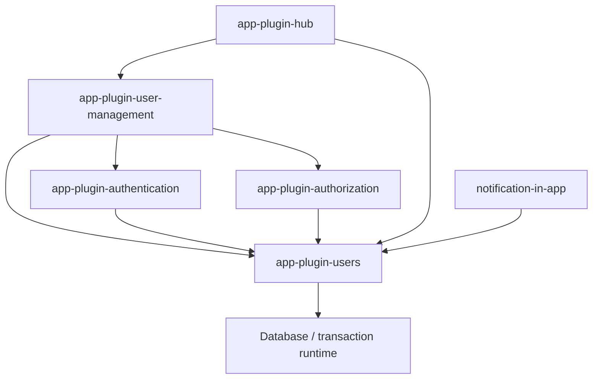

# 用户领域与认证职责拆分方案

> 状态：待审计，尚未实施。本文中的接口、目录和行为变更均为方案，不代表当前已有能力。
>
> 日期：2026-09-20。代码基线：`origin/develop`，提交 `9dbe2252326b5df7d3a6a0f9f2ca7bd0a868bab6`。工作分支：`refactor/users-auth-separation`。

> 修订：第二版。补齐接口行为映射、生命周期唯一执行位置、实施顺序、应用升级清单及技术验证关卡。本文为待审计的实施规格；技术验证关卡尚未执行，不代表已批准改动数据库运行时或迁移系统。

## 1. 目标与决策摘要

用户模型和存储由 `app-plugin-users` 拥有，`app-plugin-authentication` 通过适配器依赖用户基础能力。Better Auth 继续负责注册、登录、OAuth、邮箱验证、密码和会话等认证流程。用户管理操作与认证操作共享底层用户约束，但各自保留流程。

当前 `user-administration.ts` 同时承担用户数据管理和认证操作，必须拆解，不能整体换目录。由于现有 users 插件已经依赖 authentication 和 authorization，本方案明确拆出 `app-plugin-user-management`，避免包级循环依赖。

| 决策 | 建议 |
| --- | --- |
| 用户数据归属 | users 拥有 User 类型、字段定义、存储、身份约束和后续用户表变更 |
| 管理能力归属 | 现有管理页面、管理 API、管理 DTO、分页搜索、角色编排迁入 user-management |
| 认证能力归属 | 密码、凭据、会话、认证缓存和 Better Auth hooks 留在 authentication |
| 数据表 | 保留一张 `user` 表，不复制用户，不改变已有 ID |
| 跨插件协作 | users 定义生命周期契约，其他插件主动注册自己的检查和处理 |
| 事务 | 用户、凭据、授权、API Key 的数据库变更加入同一事务；外部副作用在最外层事务提交后执行 |
| 实施次序 | 先验证存储适配边界，再迁移上层管理和生命周期，最后单独完成迁移历史交接 |
| 兼容策略 | 保留管理 URL、API 路径及业务结果；公开包导入路径变化通过发布说明和模板同步处理 |

### 1.1 主线与后续交付边界

主线交付是运行时职责拆分：三插件无环、用户读写归 users、管理和认证流程完整、生命周期和事务一致、新安装的组合应用及已有应用升级可用。users 单独安装及迁移基线机制作为独立后续交付，不作为主线的前置工作；主线仍保留历史 authentication 建表链，并在安装文档明确这项限制。主线完成不能表述成“用户表历史初始化已经完全脱离 authentication”。

提交后处理必须纳入主线，但不预先指定新增 outbox 或通用任务系统。先执行第 10 节技术验证，选择能满足嵌套事务、回滚和失败可观测要求的最小实现。持久化可靠投递需要额外能力时，单独列出变更及验收，不能在编写用户服务时隐式扩大范围。以下设计仍待本文审计。

### 1.2 本次不顺带改变的业务规则

- 不新增第二张用户表，不改用户 ID 的格式或已有取值。
- 不调整邮箱必填要求，不顺带支持无邮箱用户或手机号主身份。
- 保留当前软删除后邮箱和用户名继续占用的规则。
- 不更换 Better Auth，不重做注册、登录和 OAuth 协议。
- 不重做用户管理页面视觉设计。
- 不添加现有适配器不支持的 join 能力。
- 不修改已合并、已发布迁移的内容、名称或校验和。

上述约束不意味着保留已确认的安全缺陷。例如已删除用户仍可被认证查询命中、事务未提交就断连，必须在对应阶段修正，并作为显式行为变化验证。

## 2. 当前实现与依据

以下路径相对本仓库根目录，均是上述代码基线下的实现依据。实施前如 develop 有变化，需要重新核对，不能套用其他工作树的旧结论。

| 文件 | 当前事实 | 对改造的影响 |
| --- | --- | --- |
| [authentication/server/user-administration.ts](../packages/plugins/app-plugin-authentication/server/user-administration.ts) | 定义管理 DTO；实现用户查询、身份规范化、密码用户创建、密码重置、会话撤销、状态变更、软删除和用户锁 | 需要按职责拆解 |
| [users/server/services/users.ts](../packages/plugins/app-plugin-users/server/services/users.ts) | 注入 `UserAdministrationService`；创建用户和分配角色使用数据库事务；禁用、删除调用角色扩展及 `assertSubjectRemovable` | 管理编排已有基础，应迁移并改接独立服务 |
| [users/server/providers/users.ts](../packages/plugins/app-plugin-users/server/providers/users.ts) | 注册管理服务、授权资源、用户主体类型和默认 Permission Set 选择器 | 需要拆分管理 UI 集成与用户主体基础集成 |
| [users/server/tokens.ts](../packages/plugins/app-plugin-users/server/tokens.ts) | `UserRoleScope` 包含 `assertCanDelete`、`onDelete`、`assertCanDisable` | 角色接口混入用户生命周期 |
| [authentication/server/better-auth/database-adapter.ts](../packages/plugins/app-plugin-authentication/server/better-auth/database-adapter.ts) | 直接读写各模型；支持条件、字段选择、大小写比较、批量操作、消费与递增操作；事务中重新构建适配器 | 必须完整盘点操作面，不可用管理 CRUD 简单替换 |
| [authentication/server/auth.ts](../packages/plugins/app-plugin-authentication/server/auth.ts) | 使用 Better Auth 用户类型；注册用户附加字段；部分会话检查直接查询 `user`；提供 `administrationContext` 和 `forConnection` | 不仅适配器，认证内部直接读用户的路径也要改接 users |
| [authentication/server/providers/authentication.ts](../packages/plugins/app-plugin-authentication/server/providers/authentication.ts) | 注册认证服务和用户管理底层服务 | 移除用户管理服务注册，增加认证操作服务及生命周期注册 |
| [hub/server/authorization.ts](../packages/plugins/app-plugin-hub/server/authorization.ts) | 角色扩展中检查操作者、最后管理员和应用归属，并删除用户 API Key | 角色职责与生命周期职责分开，保留已有保护语义 |
| [hub/server/providers/hub-authorization.ts](../packages/plugins/app-plugin-hub/server/providers/hub-authorization.ts) | 注册 Hub 角色作用域 | 增加独立生命周期处理器注册及注销 |
| [notification-in-app/server/providers/in-app-notification.ts](../packages/plugins/app-plugin-notification-in-app/server/providers/in-app-notification.ts) | 从 authentication 解析用户管理服务，只为检查用户是否存在 | 改为依赖 users 查询能力，不应依赖管理插件 |
| [db/src/database/internal/knex/connection.ts](../packages/libs/db/src/database/internal/knex/connection.ts) | 事务创建连接并处理元数据失效；当前实现未提供这里所需的公开提交后回调机制 | 需要明确事务完成机制，不能假设现成 afterCommit 可用 |
| [db/src/migration/loader.ts](../packages/libs/db/src/migration/loader.ts) | 跨迁移来源按迁移名称排序 | 插件注册顺序不能替代迁移执行顺序设计 |
| [db/src/migration/migrator.ts](../packages/libs/db/src/migration/migrator.ts) | 校验执行记录、来源包及校验和 | 直接挪历史迁移会造成升级兼容风险 |

### 2.1 当前文件中需要特别处理的行为

1. `create` 要求密码，并通过 Better Auth internal adapter 创建用户和 credential account；不能将这个实现原样变成 users 的基础创建接口。
2. `list` 和 `get` 过滤 `deletedAt`，通用 Better Auth 数据适配器没有相同的统一过滤；共享存储后必须明确哪些查询可看到删除记录。
3. `remove` 同时写删除标记、删除 session、删除 account、调用实时断连。当前实时断连可能发生在调用方外层事务提交之前。
4. 管理服务通过角色接口是否提供删除方法判断删除是否配置，拆生命周期时不能悄悄失去这道边界。
5. develop 已通过 `permissionSets.assertSubjectRemovable` 保护受约束的授权关系，不能用一套新写的管理员数量检查替代它。
6. 现有用户表的 `name`、`email` 非空，`username` 和 `email` 有唯一索引；公共唯一性校验必须有数据库约束兜底。

### 2.2 知识库参考的边界

已查阅工作区知识索引及 `manifest.json`。认证文档来源为 [NocoBase 3 认证](https://nocobase.feishu.cn/wiki/TIDVwt1IEisdEgk6f75c3q5wnGg)，采集时间 `2026-09-15T12:56:16.330Z`；Hub 文档来源为 [Application Hub 用户与权限技术方案](https://nocobase.feishu.cn/wiki/YA09wfEl8ibeZ9kidzacP5MVn7d)，采集时间 `2026-09-15T13:03:10.079Z`。两份均标记为 `rendered_snapshot_partial`，不能据此推断缺失内容不存在。Hub 文档描述的是认证拥有用户基础数据的旧边界，本方案是在调整该边界，不把旧文档当作新架构的确认。

Payload 仅作为“用户领域独立于认证实现”的方向参考；本轮未核验 Payload 源码，不据此声称两者适配接口或事务实现兼容。知识库原始导入内容保持在工作区本地，不复制进本仓库。

## 3. 目标架构



图示只表达本次涉及的主要依赖，不是完整包图。authorization 对 users 的集成仅在启用用户能力时注册；应核验 authorization 独立使用场景，避免将通用权限能力强制绑定到用户管理 UI。若需保持插件可选性，使用可选 peer 与独立集成入口，不能让 users 反向导入 authorization。

### 3.1 app-plugin-users

- 定义 User 及持久化字段契约，维护运行时字段定义和后续用户表迁移。
- 提供内部存储接口、可信服务器用户服务、生命周期注册接口。
- 执行标识规范化、输入校验、唯一性错误转换、删除过滤和状态写入约束。
- 提供事务绑定及用户锁能力。
- 不提供密码操作，不导入 Better Auth，不挂载管理页面及管理 API。
- 服务是可信服务器能力，不自动意味着调用者拥有操作权限；外部 API 必须在入口鉴权。

### 3.2 app-plugin-authentication

- 保留 Better Auth 的流程、配置、认证 hooks、account/session/verification 存储。
- 将逻辑 user 模型操作翻译为 users 存储调用。
- 提供可信服务器凭据和会话操作契约。
- 用户禁用或删除时，参加生命周期处理。
- 不再导出 `UserAdministrationService`、管理分页 DTO 或用户锁。

### 3.3 app-plugin-user-management

- 承接原 users 的管理页面、API、管理 DTO、搜索、分页、权限选择器及角色作用域。
- 组合 users、authentication 和 authorization 执行管理用例。
- 保留“不能删除自己”、管理入口授权、删除配置检查等操作策略。
- 不直接写 user、account、session 等内部表。
- 维护管理展示字段白名单，不能因为存储支持自定义字段就把全部用户字段返回给前端。

### 3.4 主体类型与权限资源拆分

用户主体是否存在、是否启用，是授权领域执行保护检查所需的基础集成，应由 authorization 的用户集成调用 users。用户选择器、管理分页与 `user/read` 等管理资源由 user-management 接入。同一个主体类型不能由两个插件重复注册；实施时需确认现有主体注册 API 是否支持独立追加管理元数据，若不支持，增加明确扩展契约，而不是重复 `define('user')`。

## 4. 公共契约草案

以下名称与操作语义作为拟实施契约。条件类型与字段映射的具体 TypeScript 表达由阶段 1 的适配契约测试收敛；实现不得自行改变本节的空结果、事务、错误和状态变更语义。公共导出必须有完整显式类型，不能以 `any` 或任意字符串字段集合代替字段注册契约。

### 4.1 用户存储与领域服务分开

| 契约 | 主要能力 | 调用者 |
| --- | --- | --- |
| `UserStore` | 有类型的条件查询、字段选择、计数、创建、更新及删除语义；绑定指定事务 | 认证适配器、users 服务、管理查询层 |
| `UserService` | 基础创建、资料更新、启用、禁用、软删除；执行生命周期 | 管理服务、可信服务器集成 |
| `UserLifecycleRegistry` | 注册检查、事务内处理及提交后处理；支持注销和重复注册检测 | authentication、authorization、Hub |
| `UserAuthenticationService` | 创建/更新密码凭据、重置密码、撤销会话、清理认证数据 | 管理服务及认证生命周期处理器 |

`UserStore` 不暴露 Better Auth 的 `Where`、`CustomAdapter`、internal adapter 或 hooks。认证层负责转换为 users 自己的条件表示或数据库查询表达式。不能通过返回裸数据库连接让认证层继续任意写 user 表，绕过公共约束。

### 4.2 状态写入与生命周期覆盖

创建、更新及批量更新都执行相同的数据约束。凡涉及 `disabledAt`、`deletedAt`、`deletedBy` 的写入，必须进入同一个状态转换实现并执行生命周期，不能只有 `UserService.disable()` 生效、适配器直接更新却绕过保护。

底层实际持久化方法保持私有。普通资料更新不接受任意状态字段；认证适配器的可信字段写入也不能把来自 HTTP 的字段直接当作可信参数。管理入口不能直接设置 `emailVerified`。

### 4.3 操作者与扩展数据

```ts
// Design sketch; these are not existing repository APIs.
type UserOperationContext = {
  source: 'management' | 'authentication' | 'system';
  actorId?: string;
  requestId?: string;
};

type UserLifecycleContext = {
  operation: 'disable' | 'delete';
  userId: string;
  actor: UserOperationContext;
  transaction: UserTransactionContext;
};
```

操作者上下文由已鉴权入口构建，不信任请求体中的 `actorId` 或 `source`。允许系统操作没有用户操作者，但处理器可以要求额外可信条件；“system”不能成为跳过管理员保护的默认开关。

自定义用户字段通过已注册的字段契约进入存储。保留字段的输入可写性、输出可见性和 Better Auth 映射，不能使用任意键值对象作为对外资料更新接口。

### 4.4 契约方法及结果约定

| 接口方法 | 输入和返回约定 | 事务及约束 |
| --- | --- | --- |
| `UserStore.withConnection(connection)` | 返回新绑定实例，不修改原实例 | 保留生命周期注册表与事务上下文，不重新解析默认数据库 |
| `UserStore.findOne(query)` | 返回请求字段投影或 `null` | 默认只查未删除用户；省略 select 使用明确字段集合 |
| `UserStore.findMany(query)` | 返回投影数组，空匹配为 `[]` | offset 下保留稳定排序；条件、排序及 select 仅接受注册字段 |
| `UserStore.count(query)` | 返回非负 number | 与 findMany 同条件和删除过滤，不接受分页影响计数 |
| `UserStore.create(record, options)` | 返回创建后的请求投影 | 接受可信调用方 ID；省略 ID 时使用 users 配置的生成器；不替换已有 ID |
| `UserStore.updateOne(query, patch, context)` | 返回更新后记录或 `null` | 状态字段进入统一生命周期；保留适配器单条更新的无条件保护 |
| `UserStore.updateMany(query, patch, context)` | 返回匹配并完成写入的数量 | 批量状态变更稳定加锁，任一保护失败整批回滚 |
| `UserStore.softDelete(query, context)` | 返回新转为删除状态的数量 | 不物理删除；需合法操作上下文；重复删除返回 0 |
| `UserService.get(userId)` | 返回基础 User 或 `undefined` | 已删除返回 undefined；适配器自行转换为 null |
| `UserService.create(input, context)` | 输入不含密码、角色，返回 User | 补默认状态和时间；可信认证创建保留验证结果及允许的扩展字段 |
| `UserService.updateProfile(userId, input, context)` | 返回 User，不存在抛 `USER_NOT_FOUND` | 仅资料字段，不接受密码、角色或任意状态标记 |
| `UserService.disable/enable(userId, context)` | 返回 User，不存在抛 `USER_NOT_FOUND` | 幂等状态设置；首次状态变更触发生命周期，失败任务使用原操作 ID 重试 |
| `UserService.remove(userId, context)` | 返回 void，重复删除成功 | 管理自删策略由入口检查，底层不可绕过删除就绪与领域保护 |
| `lockUser(connection, userId)` | 返回 void | 仅事务内调用，与 Hub 资源创建共享锁协议；不同时负责鉴权 |

`UserQuery` 至少表达完整布尔条件树、比较模式、select、sortBy、limit、offset，支持现有 eq/ne/lt/lte/gt/gte/in/not_in/contains/starts_with/ends_with。认证层将 Better Auth 的线性 AND/OR 输入翻译成条件树。默认查询不暴露 `includeDeleted` 给普通管理调用，审计读取使用单独可信入口，避免一个布尔参数意外关闭认证过滤。

`UserService` 未绑定事务时为写操作创建事务；绑定事务时加入调用方事务。涉及跨插件写入必须具备事务完成上下文。对于无法跟踪提交的外部原始事务，明确拒绝相关写操作，不降级成立即执行外部副作用；纯读取不受此限制。

### 4.5 认证服务与错误契约

| 方法 | 行为 |
| --- | --- |
| `UserAuthenticationService.withConnection(connection)` | 绑定同一连接和事务上下文，保留认证配置与缓存服务 |
| `createPasswordCredential(userId, password)` | 校验策略并创建 credential；凭据已存在时明确冲突，不隐式重置密码 |
| `resetPassword(userId, password)` | 保留现有“有凭据更新、无凭据创建”的结果，更新后统一撤销会话 |
| `revokeSessions(userId)` | 撤销数据库及缓存路径的会话；提交后安排断连，支持幂等重试 |
| 认证生命周期私有处理器 | 禁用时执行会话失效；删除时再清理 account，不重新发起用户删除 |

密码哈希准备可在事务外执行，但账号唯一性和用户状态仍在事务内验证。准备结果只在可信服务器内部传递，不新增浏览器提交“已哈希密码”的接口。

users 使用 `UserError` 承载现有 `USER_NOT_FOUND`、`USER_EMAIL_CONFLICT`、`USER_USERNAME_CONFLICT`、`USER_IDENTITY_CONFLICT`。authentication 使用 `UserAuthenticationError` 承载 `PASSWORD_TOO_SHORT`、`PASSWORD_TOO_LONG` 及新增凭据冲突。管理路由保留现有 HTTP 映射：不存在 404、身份冲突 409、密码输入错误 400。`PermissionSetLastAssignmentError` 继续映射 `LAST_ASSIGNMENT`/409。生命周期策略错误使用 users 所有的 `UserLifecycleError(code, message, status)`，Hub 不再依赖管理层错误类表达基础生命周期拒绝。

只有识别出的唯一约束异常才转换为身份冲突；未知数据库异常继续向上传播，不能吞掉事务失败。

## 5. Better Auth 适配设计

### 5.1 模型分流

使用 Better Auth 提供的逻辑模型解析能力识别 user，不能只判断物理模型名是否等于字符串 `user`。字段映射在 authentication 边界完成，避免自定义模型名或字段名导致查询落回通用数据库分支。

| 操作 | users 路径要求 |
| --- | --- |
| create | 统一规范化和唯一性约束；保留调用方生成的 ID；按 select 返回 |
| findOne / findMany | 保留条件组合、字段选择、排序、offset/limit；默认排除软删除 |
| count | 与对应查询使用同一过滤语义 |
| update / updateMany | 统一约束；无匹配返回值及影响行数与既有协议一致；状态变更走生命周期 |
| delete / deleteMany | 明确 user 删除为领域软删除；不能直接物理删除 |
| consumeOne | 先核实是否用于 user；不能把用户当一次性令牌消费。若无合理领域语义，对 user 明确拒绝，对其他模型保留原能力 |
| incrementOne | 保留合法用户扩展数值字段的原子条件更新；身份和状态字段不得通过此接口绕过约束 |
| transaction | 创建绑定同一事务连接的 users store 和认证存储；不得回退到默认连接 |

需验证 AND/OR 组合不会让 `deletedAt IS NULL` 被 OR 分支绕过；删除过滤应包在整个调用方条件之外。大小写查询中间查询也必须使用同一个连接和字段映射。

### 5.2 hooks 与认证流程

- 注册、OAuth 首次登录、邮箱验证仍由 Better Auth 发起。
- users 仅执行用户约束和领域生命周期，不调用 Better Auth 认证 hooks。
- 认证生命周期处理器只操作自己的凭据和会话，不再次调用 Better Auth 的整用户删除入口，避免递归。
- 盘点 Better Auth 的公开删除端点、插件 API 和 internal adapter 删除顺序。如果框架先在事务外清理 account，再调用 user delete，不能只改最后一个适配方法就宣称原子性成立；必须在认证入口统一事务或明确关闭不满足领域约束的删除路径。
- 管理创建不再依赖认证的 user-create hooks。若现有应用借这些 hooks 实现公共用户业务，应迁入 users 扩展并记录兼容变化，不能隐式重复调用两套 hooks。

### 5.3 身份规范化与邮箱验证

保留当前管理操作的 trim、邮箱小写、用户名小写规则，并与 Better Auth username 插件及 OAuth 回传数据进行兼容验证。唯一性预检查负责给出友好错误，数据库唯一索引负责并发兜底；默认不复用软删除身份。

本次结构拆分默认保留当前管理邮箱更新行为，不顺带重置 `emailVerified`，并用回归测试记录这一事实。普通管理输入仍不能直接指定验证状态。“改邮箱后自动清除验证状态”作为独立行为修复建议另行审计，不混入结构迁移；认证验证流程继续提交明确的验证结果。不得在迁移时批量改写既有用户邮箱或验证状态。

## 6. 管理用例

### 6.1 管理员创建密码用户

1. 管理 API 完成鉴权、输入校验和角色作用域校验。
2. authentication 校验密码策略并准备哈希，尽量避免长时间占用数据库锁。
3. 打开事务，users 创建基础用户。
4. authentication 在同一事务创建该用户的 credential account。
5. authorization/角色作用域在同一事务分配角色。
6. 提交后通知授权缓存或订阅者，再返回管理 DTO。

任一步数据库操作失败，用户、凭据和角色均不可残留。管理 API 仍可以要求密码，但 users 基础创建不能要求密码。

### 6.2 用户资料更新

管理 API 校验可写字段，users 在锁和事务保护下完成更新并返回结果。唯一性、软删除限制在 users 执行。角色不是普通资料字段；密码不是用户资料字段；如邮箱发生变化，按审计确认的验证状态规则执行。

### 6.3 禁用用户

授权保护处理器获得保护检查所需锁，检查受保护授权；users 获得目标用户锁并写入禁用状态；authentication 撤销数据库会话并登记后续失效处理；提交后执行缓存失效与断连。两阶段状态检查和锁顺序需与已有登录、角色调整路径对齐。

### 6.4 删除用户

管理入口先检查删除能力是否完整配置并拒绝自删。事务内检查操作者资格、授权保护和应用归属，写软删除与禁用状态，并清理凭据、会话、授权关系及 API Key。提交后更新缓存和断开连接。重复删除保持幂等，不重复制造副作用。

存在应用归属时继续拒绝删除，要求先转移或删除应用；本次不自动转移资产。用户记录保留审计标记，普通业务与认证查询均不能将其当作活跃用户。

### 6.5 重置密码与撤销会话

管理服务调用 authentication 的密码/会话契约；authentication 通过 users 检查用户并绑定事务，不拥有用户管理列表。数据库会话删除与其他数据库变更一起回滚，外部缓存及断连遵守提交后语义。

## 7. 生命周期、事务与并发

### 7.1 生命周期阶段

| 阶段 | 内容 | 失败行为 |
| --- | --- | --- |
| before | 授权保护、应用归属、参与者就绪检查 | 整体拒绝，不进入后续处理 |
| transactional | 状态写入及各插件数据库清理 | 整体回滚 |
| afterCommit | 认证/授权缓存失效、实时断连 | 记录明确的提交后失败，进入重试；不能谎报数据库回滚 |

扩展使用稳定名称，重复注册报错，shutdown 时注销。处理顺序应明确且可测试，不能依赖插件偶然导入顺序。多个用户批量处理必须使用稳定 ID 排序和一致锁顺序。

### 7.2 唯一执行位置与注册约束

| 动作 | 唯一执行位置 | 其他层禁止重复做的事 |
| --- | --- | --- |
| 管理入口鉴权、禁止自删、输入校验 | user-management 路由/服务 | 不把前端按钮状态当成服务端保护 |
| 用户字段规范化、唯一性及状态写入 | users 私有写入管线 | 认证或管理服务不另写 user 表 |
| 受保护授权检查与授权清理 | authorization 注册的用户生命周期处理器 | 管理服务和 Hub 不再重复调用同一删除/禁用保护 |
| Hub 操作者资格、应用归属及 API Key 清理 | Hub 注册的用户生命周期处理器 | UserRoleScope 不保留相同处理 |
| 禁用/删除后的会话撤销、删除凭据 | authentication 注册的生命周期处理器 | 管理服务调用 users.disable/remove 后不再手动撤销或清理 |
| 创建密码用户和分配角色 | 管理服务在一个事务中调用三个所属服务 | users 的创建生命周期不默认创建凭据或自动赋予管理角色 |
| 重置密码和主动撤销会话 | authentication 的认证操作服务 | 不通过虚构一次 disable 操作来触发清理 |

管理层“完整流程”指鉴权、选择用例、开启共享事务、调用领域服务并组装响应，不表示它重复执行各插件的生命周期步骤。`UserService` 和认证适配器的状态更新都进入 users 同一私有状态管线；users 自己的服务不能再经公共 store 入口递归触发同一次转换。

注册分两步：Provider.register 阶段注册 token 和惰性处理器工厂；所有相关 Provider.boot 完成后校验参与者是否就绪，再接受请求。处理器只在执行时解析认证或授权服务，避免构造 Auth 时构造 UserStore，又立刻解析 Auth 的运行时循环。shutdown 注销处理器；每个应用使用独立 registry，不使用进程全局可变列表。

删除就绪不再通过“某个角色作用域碰巧有两个方法”判断。引入服务器配置 `UserDeletionPolicy`，显式声明删除是否启用及必需参与者 ID；已启用 authentication、authorization 或 Hub 的应用必须将对应清理处理器纳入验证。显式启用删除但缺少必要处理器时启动检查报错且删除拒绝；未启用删除的应用正常启动，保持删除不可用。纯 users 应用允许显式启用基础软删除，但这一安装组合属于后续独立安装交付。

### 7.3 最外层事务与提交后任务

现有 `DatabaseConnection.transaction` 没有本方案所需的公开事务完成契约。本方案建议在数据库事务层增加统一的提交后登记机制，使嵌套事务在 savepoint 成功时合并任务，在 savepoint 回滚时丢弃任务，仅在根事务提交后调度。具体命名与签名须结合数据库公共接口审查。

该能力不能只存在于管理服务的局部 callback 数组中：Better Auth 自己创建事务、用户服务接收外部连接、Hub 事务内调用等路径也必须遵守它。提交后 callback 失败不能让调用方误以为数据库没有提交；需要明确的结果或错误类型表达“已提交，后续处理失败”。

最小实现先同步等待根提交后的处理，并尝试有界重试；每项任务必须携带操作 ID、用户 ID、处理器 ID，日志区分“事务回滚”和“已提交但处理失败”。任何错误日志不得包含密码、会话 token 或 OAuth 凭据。对于多实例断连或缓存失效，内存 callback 不能保证进程崩溃后的交付，不能将“提交后 enqueue”描述成可靠交付。

技术验证先核验 queue 是否支持同库事务入队。如果已有可用机制则复用；如果没有，持久化 outbox 是需单独审计的补充，必须覆盖稳定幂等键、有限重试和失败查询。未采用持久化交接时，要明确记录进程崩溃可能丢失断连任务的限制，并用每次请求的有效性检查保证安全；如果旧会话有效性仍依赖这项可丢失任务，则主线验收失败，不能带着限制交付。

### 7.4 提交成功但后续处理失败的返回协议

正常成功沿用现有 HTTP 状态与响应结构。提交后任务重试仍失败时，服务抛专门的 `UserPostCommitError`，携带 `committed: true`、`operationId`、失败处理器 ID；这类错误不得触发数据库事务重试或再次创建用户。独立的任务重试只针对原操作，不重复主写入。

管理 API 将该错误映射为 HTTP 202，响应明确包含 `code: USER_POST_COMMIT_FAILED`、`committed: true`、`operationId` 及可读取的当前用户结果；删除操作返回已删除状态。管理客户端必须识别并提示“变更已保存，后续处理失败”，刷新实际状态，不能提示整次保存失败并自动重发。202 不承诺存在后台自动重试；若配置了持久化任务，另返回 `retryScheduled: true`，否则为 false。该响应是新增失败协议，需要同步客户端和 API 契约测试。

Better Auth 自身协议不直接套用管理 API 的 202 约定。它触发用户状态转换时，必须在认证边界将提交后失败转成兼容的明确错误，并保证不会把已撤销会话或已删除用户签发给调用方；此映射列入技术验证 G2。不能将管理路由的错误处理器当作 Better Auth hooks 的默认错误处理器。

### 7.5 认证失效的安全边界

缓存、cookie 中的会话数据不能绕过用户禁用/删除检查。现有 `Auth.getSession` 会回查用户状态，改造后改接 users 并覆盖 deletedAt。还需核验 Better Auth 自身端点、插件 API、会话创建前后检查、实时连接鉴权以及缓存命中路径。实时断连失败不能使后续受保护请求继续通过。

密码重置后的旧会话撤销不能只依赖用户禁用标记，必须验证 secondary storage 命中时是否还能接受旧 token。如现有存储结构无法可靠撤销，需要专门的会话有效性机制；不得只以“断连成功”作为验收。

### 7.6 并发与死锁

- 继续复用 `permissionSets.assertSubjectRemovable`，核验其保护锁覆盖禁用、删除、撤销角色三条路径。
- 锁住单个用户不足以保护“最后一个管理员”；相关请求必须共享授权保护锁。
- Hub 创建应用/API Key 与删除用户必须使用相同的用户锁协议，防止检查无归属后又新增资源。
- 先盘点当前锁顺序，再确定统一顺序；不能仅把 `lockUserForAdministration` 改名搬到 users。
- 验证一个登录请求与删除并发时，不会在清理完成后重新留下可用 session。

## 8. 迁移历史与用户表交接

### 8.1 已确认的限制

历史迁移 `202608200001_create_authentication_tables` 一次创建 user、session、account、verification，down 也一次删除四张表。后续 `202609080001_add_user_disabled_at` 和 `202609170002_add_user_deletion_record` 仍在 authentication。迁移加载器按名称排序，迁移器核验来源包和校验和。

因此，下列做法不可接受：直接把旧迁移搬到 users；让 users 先建表再原样执行旧认证建表迁移；伪造旧迁移已执行记录；修改旧迁移加 `if exists`；只调整插件注册顺序便声称解决迁移顺序。

### 8.2 过渡阶段：运行时归属先交接

主线保留历史 authentication 迁移来源。新安装的组合应用仍先执行原历史建表链，再执行 users 的新增用户表迁移。已有应用保留原记录并正常验证，只执行新迁移。若本次没有实际新增用户字段或索引，不为表名归属仪式性新增一个空迁移。未来 users 迁移使用晚于既有链的唯一名称，并执行来源和校验和检查，不能只按目录位置推断顺序。users 的运行时代码已经独立于认证，但主线不宣称支持 users 单独完成生产安装。

此阶段不添加与历史建表链冲突的 users 独立建表迁移；纯 users 存储测试可使用明确的测试 schema fixture，测试 fixture 不作为安装能力的证明。

### 8.3 最终交接：单独审计迁移基线能力

若最终要求 users 独立安装，建议为迁移系统引入明确的历史链与新基线选择机制：空数据库使用 users 用户基线和 authentication 认证表基线；已升级数据库继续保留并校验历史链；两种路径从相同的后续迁移开始汇合。

这个机制当前未证实存在，属于独立实施项，不能用文件移动替代。它必须满足：

1. 通过明确的迁移状态识别选择路径，不仅检查是否存在 `user` 表。
2. 新基线是新的、自包含的不可变迁移，不引用实时字段定义。
3. 历史迁移继续可定位、可验证；只显式声明被基线替代的历史链不在空库重复执行，不通用跳过未知迁移。
4. 已有记录不能冒充执行过另一条基线；迁移历史应能说明真实安装路径。
5. 数据不完整、缺字段、缺索引或历史不匹配时停止升级并报告，不能将半初始化识别成成功。
6. users 单独安装后再加入 authentication，只建立认证相关表，不再创建或覆盖 user。
7. 明确 rollback 支持范围，防止回滚 authentication 的旧 down 删除已由 users 接管的用户表。

若审计认为迁移基线机制超出本次范围，可以先交付运行时拆分，但必须在发布说明中保留“用户表历史初始化仍由认证迁移链提供”的限制，不将整个归属交接标为完成。

### 8.4 升级与回退策略

优先采用应用版本回退和数据库前向修复，不把 destructive down 当作常规应用回退手段。升级前后核对用户数、ID、唯一索引、身份字段、状态标记及角色/凭据引用。测试在隔离数据库执行，不能对现有开发应用或生产库直接试迁移。

## 9. 消费者与发布兼容

| 消费者 | 调整 |
| --- | --- |
| authentication | 依赖 users 契约；移除用户管理注册与导出 |
| 原 users 客户端与服务器管理入口 | 迁入 user-management；保留现有 URL/API 行为 |
| authorization 用户集成 | 使用 users 判断主体状态和执行生命周期保护，核验可选依赖场景 |
| Hub | 用户锁、存在性和生命周期从 users 导入；管理角色 UI 从 user-management 导入 |
| notification-in-app | 仅依赖 users 查询，不依赖管理服务 |
| default、examples、Hub 模板 | 更新客户端/服务端插件注册、依赖、配置、构建和相关测试 |
| 认证及用户种子、应用初始化 | 盘点创建管理员等直接写 user/account 的路径，按新服务或明确历史种子职责处理 |
| 插件 Skills 和开发文档 | 更新公开导入、安装组合、初始化和升级限制 |

不在 users 重新导出管理插件实现来维持旧路径，那会重新引入循环依赖。公开导入变更属于兼容变化，需同步 source/publish exports、peerDependencies、锁文件、changeset 和发布说明。管理页面 route ID、locale namespace 等字符串是否迁名应逐项核对；没有必要时保留稳定标识，不能全局替换包名导致权限或导航失效。

不能只更新模板就认为已有应用自动升级完成。需要提供旧组合到新组合的明确调整清单；若现有升级工具不能自动完成，发布前说明所需操作及检测方式。

### 9.1 旧接口到新接口映射

以下均为拟新增/迁移后的公共入口，当前文件存在不等于入口已经发布。新 token 只在所属包定义一次；类型导出与运行时导出分别检查，不通过 users 兼容转发管理实现。

| 旧入口或符号 | 新入口或替代调用 |
| --- | --- |
| authentication 的 `userAdministrationServiceToken` | 删除；读用户改 `users/server` 的 `userServiceToken`，管理查询改 `user-management/server` 的 `userAdministrationQueryToken`，凭据操作改 authentication 的 `userAuthenticationServiceToken` |
| `createUserAdministrationService` | 删除；管理服务组合 `createUserService`、`createUserAuthenticationService` 和管理查询服务 |
| `UserAdministrationService.list` | `UserAdministrationQuery.list`；保留 page=1、pageSize=20、上限 100、搜索、状态及 userIds 过滤语义 |
| `UserAdministrationService.get/update/enable/disable/remove` | `UserService.get/updateProfile/enable/disable/remove`；上下文由可信调用方提供 |
| `UserAdministrationService.create` | 管理服务执行基础用户创建、密码凭据创建和角色分配，不再有含密码的基础 users.create |
| `UserAdministrationService.resetPassword/revokeSessions` | `UserAuthenticationService.resetPassword/revokeSessions` |
| authentication 的 `AdministratedUser`、`AdministratedUserPage`、`ListAdministratedUsersInput` | 移至 `user-management/server`；管理 DTO 通过明确白名单从基础 User 映射，不泄漏全部新增字段 |
| `CreateAdministratedUserInput`、`UpdateAdministratedUserInput` | 迁入管理包保留管理输入语义；基础 users 另定义不含密码的创建和资料输入 |
| `lockUserForAdministration` | `users/server` 的 `lockUser`；Hub 三处调用同步迁移 |
| `UserAdministrationError` | 拆成 users 的 `UserError` 和 authentication 的 `UserAuthenticationError`；管理路由按第 4.5 节映射 |
| 原 `users/server` 的 `userManagementServiceToken`、`userRoleScopeRegistryToken` 与管理类型 | 改从 `user-management/server` 或 `user-management/server/tokens` 导入 |
| 原 `users/client`、`users/client/plugin`、`users/client/routes`、`users/client/user-client` | 改为 user-management 的同名子路径；保留 `UsersClientOptions`、路由工厂和 HTTP 客户端功能 |
| `UserRoleScope.assertCanDelete/onDelete/assertCanDisable` | 删除，分别迁至授权或 Hub 生命周期处理器；角色操作仍保留 replace/get/findUserIds |
| `Auth.administrationContext` | 改成仅供认证包内部凭据实现使用的 `credentialContext`；管理包和 users 不导入 Better Auth context |

上表不能机械替换整个旧 token：原 users provider 的主体启用过滤改用 users 的批量查询，管理选择器改用管理查询服务，通知检查只需 `UserService.get`。这些调用不能全部继续依赖一个改名后的“大服务”。

### 9.2 文件级迁移清单

| 当前文件或目录 | 拟实施操作 | 验证重点 |
| --- | --- | --- |
| `app-plugin-users/client/**`、`server/routes/**`、`server/locales/**` | 移入 user-management，调整包导入及错误处理 | 页面路径、角色抽屉、componentLoader 覆盖、错误提示 |
| `app-plugin-users/server/services/users.ts` | 移入 user-management 后改注入用户服务、管理查询、认证服务 | 不重复清理，不直接操作内部表 |
| `app-plugin-users/server/services/permission-set-scope.ts` | 移入 user-management，保留角色选择能力 | 角色选项与已有权限保持一致 |
| `app-plugin-users/server/providers/users.ts` | 管理注册迁入管理包，主体基础过滤移到授权用户集成；users 新增纯基础 provider | 不重复注册主体类型；不构造依赖循环 |
| `app-plugin-authentication/server/user-administration.ts` | 按第 9.1 节分拆，阶段 3 最后删除 | 所有运行时及测试旧消费者清零 |
| `app-plugin-authentication/server/auth.ts`、`better-auth/database-adapter.ts`、`providers/authentication.ts`、`tokens.ts`、`index.ts` | 接入 user store、认证操作服务和生命周期，删除管理出口 | 注册/OAuth/验证及缓存会话行为 |
| `app-plugin-hub/server/services/hub.ts`、`services/api-keys.ts` | 改用 users 用户锁，保留资源创建与删除的竞争保护 | 同事务连接、锁顺序和归属检查 |
| `app-plugin-hub/server/authorization.ts`、`providers/hub-authorization.ts` | 角色工厂与生命周期工厂分开，分别注册 | 最后管理员、有应用拒删、API Key 清理 |
| `app-plugin-notification-in-app/server/providers/in-app-notification.ts` | 替换旧 token，并调整插件 peer | 接收人存在性及软删除行为保持一致 |
| 三个模板 `client/plugins.ts`、`server/plugins.ts`、`package.json` | 注册新组合并同步依赖 | 真实打包安装，不能只验证 workspace 源码解析 |
| Hub 模板 `server/config/users.ts` | 仅迁移 `UsersConfig` 类型导入至管理包，保留配置键及 `permissionSets: false` | 不意外添加默认 app 权限作用域 |
| 各受影响包的 tests、README、skills、exports、publishConfig | 同步新归属及版本变更 | 发布入口、token 单实例、升级说明 |

`authentication/database/seeds` 的现有默认用户种子直接写 user/account；该文件属于有历史记录的初始化任务，先核对种子历史和重放策略，不把运行时改造当作改写历史任务的授权。主线保留已发布种子并明确为历史初始化例外，新增可信运行时用户创建不得复制这种直接写表方式。种子归属的彻底交接与独立安装基线一起审计。

### 9.3 已有应用升级步骤

1. 在测试应用记录当前用户数、ID、角色关系、管理 URL 和插件组合，不先运行任何 destructive down。
2. 同步升级 users、authentication、user-management 及受影响的 Hub/通知/授权包版本并更新锁文件；部署不能混用新版基础 users 与旧版认证或管理消费者。
3. 服务端保留 users 基础插件注册，新增 user-management；核验所有 provider 注册完成后再 boot，生命周期就绪后才对外服务。客户端将 users 工厂导入改为 user-management，保留原 `mount`、`path`、`title`、`componentLoader` 配置。
4. 管理 server token、client 子路径和 `UsersConfig` 导入按第 9.1 节替换；保留应用配置键 `users.permissionSets`，本次不同时改配置名称。
5. 保留 `/api/users` 和各子操作路径、`page/users/access` 权限含义及已有 role scope key。现有路由覆盖使用 `@nocobase/app-plugin-users:users` 标识，新插件需显式兼容该标识；locale 旧 namespace 也要显式注册或建立别名，不能假设更换包名会自动保留。
6. 在测试数据库执行原历史迁移链加新增迁移，重复执行一次应无额外 schema 或数据变化；不修改历史记录包名。
7. 验证登录、用户管理、Hub 角色/删除及通知接收人查询；构建发布产物后从产物运行烟测。
8. 校验通过后交付升级说明。旧客户端入口和旧 administration token 不在新 users/authentication 内反向兼容导出，遗漏旧导入应在构建或启动前检查时报清晰错误。

正常 API 的 GET options/list、POST create、PATCH update、DELETE remove、POST disable/enable/reset-password/revoke-sessions、PUT role-scopes 保持原方法和路径。新增提交后失败响应按第 7.4 节处理。角色选项或页面入口不能因为注册插件改名而重建现有授权数据。

发布前新增静态检查，禁止 users 源码及发布声明导入 authentication、Better Auth、authorization 或 user-management；禁止旧 administration 标识继续出现在运行时调用中；历史文档和明确兼容测试不计为运行时消费者。`package.json` 的 peer/runtime 分类沿用仓库规则。

## 10. 分阶段实施与退出标准

### 阶段 0：方案审计与实施技术关卡

本轮仅完善本文，不执行下面的代码实验。实施获准后先在隔离测试环境完成 G1、G2、G3，输出可复现命令、测试结果及选定实现；不能仅凭阅读代码把关卡标成通过。G4 是后续独立安装工作，不阻塞主线。

| 关卡 | 要查什么、做什么实验 | 通过标准 | 不通过时 |
| --- | --- | --- | --- |
| G1 事务完成契约 | 沿 DatabaseConnection、Knex 连接、policy-bound connection 检查嵌套传播；编写外层回滚、内层回滚被捕获、成功提交及 callback 异常测试；检查 queue 公共派发接口是否接收事务 | 选择一个覆盖所有连接包装的实现；提交后错误不误报回滚；外部事务无静默降级 | 阻塞生命周期切换；形成数据库运行时最小补丁设计，不用局部数组绕过 |
| G2 Better Auth 边界 | 在锁定依赖版本检查 user 各方法、模型映射、公开删除/插件删除顺序及 secondary storage；模拟清理失败和已提交失败 | 所有用户写入可统一约束；删除清理可回滚；旧会话不会因缓存继续有效；hooks 无重复 | 记录具体不兼容入口并补事务包装/适配；未经批准不关闭现有对外功能 |
| G3 主线安装与注册 | 先在空库及基线数据库运行现有迁移链并检查 seeds；用最小隔离组合验证惰性 token 与主体注册方案；新包形成后再复验三个模板 | 原历史任务内容不变，迁移重复执行无变化；试验无构造循环，后续真实新入口可解析、主体只注册一次 | 阻塞主线发布，修复组合或迁移顺序；不伪造历史 |
| G4 独立安装基线 | 验证显式历史链替代、校验和、异常历史及 users 后加认证 | 第 8.3 节七项条件全部通过 | 保持后续状态，不引入试探性的独立建表迁移 |

G1 的优先级是复用可证明的现有事务能力，其次增加最小公共完成契约；持久化任务另评估。G2 必须使用真实 Better Auth 流程加可控 OAuth/邮件替身，不能只 mock 一个 `createUser` 调用。

### 阶段 1：依赖拆分与存储适配验证

- 将现有管理代码移入 user-management，为 users 留出无反向依赖的基础入口；这个结构迁移先保持行为，不同时重写管理流程。
- 建立 users 存储、用户类型和公共约束，接通 Better Auth user 模型分流。
- 认证用户查询改接 users；历史迁移链暂时保留。
- 注册、OAuth 用户创建、邮箱验证、适配器字段/条件语义、事务回滚和软删除测试通过后，才能进入阶段 2。
- 阶段内允许管理插件暂时调用旧 authentication administration 服务作为过渡，但该接口必须在后续阶段删除，不能将中间状态当成最终交付。
- 过渡期管理 DTO 仍可暂留 authentication；禁止为了提前搬 DTO 而新增 authentication → user-management 导入。先让管理消费者切到管理包自有 DTO，认证端旧 DTO 随阶段 3 删除，不留跨包运行时别名。

### 阶段 2：先接通生命周期和认证操作

- 按 G1 确认的实现接通事务完成机制，再创建 users 生命周期与 authentication 凭据/会话服务。
- 逐个状态操作切换到新管线：替代处理器生效的同一变更中移除对应旧清理，绝不同时执行新旧两条链。
- 若阶段 1 的适配器仍接收旧管理服务的状态更新，使用私有过渡桥接保留完整旧流程；新生命周期未就绪前不开放新状态写入接口。桥接不能成为公开的跳过保护参数。
- 将角色接口的禁用/删除职责迁到处理器，并同步管理层删除能力检查、Hub 注册与授权保护；尚未迁移的操作继续使用完整旧实现。
- 验证禁用、删除、密码重置、缓存撤销、跨插件回滚、提交后失败和管理员并发。每个操作的退出标准都是“只有一条执行链且行为测试通过”。
- 此阶段保留旧 administration 出口作为过渡调用入口；已迁移方法只委托新服务，不再拥有第二套数据库或清理实现。

### 阶段 3：切换管理流程与消费者，最后删除旧接口

- 将管理 DTO、分页搜索接入管理查询服务；管理创建组合用户、凭据、角色并验证失败回滚。
- 按第 9 节逐个迁移通知、Hub、管理 provider、模板、错误处理及测试调用。
- 保持历史 seeds 原样，新增初始化运行时使用新服务；明确历史例外，不把旧种子直接读写计为未迁移运行时消费者。
- 运行静态扫描，确认所有旧 token、锁、DTO 的运行时导入已替换；检查发布声明也不残留旧路径。
- 只有阶段 2 行为验收、消费者扫描和包构建全部通过，才删除 `user-administration.ts`、旧 token、旧导出及私有桥接。删除这一变更本身再次执行管理和认证回归。

### 阶段 4：主线兼容验证与发布准备

- 验证组合应用的新安装、当前版本升级、重复升级，历史迁移/种子校验不变。
- 验证三个模板的客户端入口、服务器注册、locale/route ID 兼容和用户管理操作。
- 更新文档、Skills、锁文件、changesets 和逐项升级说明；标明独立 users 初始化尚属后续。
- 运行依赖方向、相关包检查及发布产物验证后审查最终 diff。所有主线关卡通过才可宣称“运行时拆分完成”；提交和发布另按用户授权执行。

### 后续交付：独立安装与历史初始化归属

只在 G4 和迁移基线设计审计通过后实施第 8.3 节；补 users 独立安装、后加 authentication 及对应种子初始化测试。不得把此后续尚未完成的状态掩盖成主线的自动兼容能力。

### 阶段依赖与中间版本限制

顺序为 `G1/G2/G3 → 阶段 1 → 阶段 2 → 阶段 3 → 阶段 4`，G4 独立开展。阶段内可以先写测试或迁移纯展示文件，但不能跨越行为关卡先删除实现。阶段 1 至阶段 3 是开发中间状态，不单独发布到现有应用；如果需要拆成多个 PR，必须保证每个合入状态可构建、旧行为完整且中间包组合不会误发。

## 11. 验证矩阵

| 类别 | 必测场景 | 期望 |
| --- | --- | --- |
| 基础用户 | 无密码创建、更新、启停、重复删除 | users 可独立执行基础操作，状态和幂等语义明确 |
| 身份约束 | 大小写、空白、并发重复邮箱/用户名、软删除身份冲突 | 管理与认证使用同一约束，数据库索引兜底 |
| 注册 | 邮箱注册、用户名注册、重复身份 | 路由结果正确，最终写入 users |
| OAuth | 模拟提供方首次回调、再次登录、已有账号关联 | 不依赖真实外部账号；用户只创建一次，凭据引用正确 |
| 邮箱验证 | 发起验证、有效令牌、重复/过期令牌、修改邮箱 | 验证状态正确，用户写入经过 users，hooks 不重复 |
| 适配器 | select、字段映射、AND/OR、大小写比较、排序、分页、count、批量操作 | 输出和计数协议保持一致，删除过滤无绕过 |
| 回滚 | 用户写入后凭据失败、凭据成功后角色失败、生命周期清理失败 | 不留下部分数据库状态 |
| 嵌套事务 | 内层成功外层失败、内层失败被捕获、外部事务调用 | 只为真正提交的操作执行副作用 |
| 软删除 | 管理列表、认证查询、OAuth、公开删除端点、重复删除 | 已删除用户不可登录，身份复用规则一致，无物理误删 |
| 会话 | 数据库会话、secondary storage、cookie 缓存、登录与禁用/删除并发 | 撤销后所有受保护入口拒绝旧身份/会话 |
| 并发权限 | 两个管理员互相禁用、删人与撤角色并发 | 最后一个受保护主体不丢失 |
| Hub | 用户有应用、删人与创建应用/API Key 并发 | 有资产时拒绝删除，无删除后的孤立资源 |
| 副作用 | 缓存不可用、断连失败、进程中断、重试；持久化实现另测重复投递 | 提交状态明确，安全检查不依赖可能丢失的通知；可靠投递范围如实标注 |
| API 边界 | 未登录、无权限、伪造 actorId、越权字段、直接服务集成 | 入口鉴权和公共不变量同时成立 |
| 主线迁移 | 空库组合安装、当前版本升级、重复升级、异常历史 | 一张用户表、相同用户 ID、历史校验完整 |
| 后续迁移 | 独立 users 安装后加认证及基线汇合 | 通过 G4 后实施和验收，不计入主线已完成能力 |
| 发布 | 包入口、token 单实例、依赖无环、模板安装及构建 | 开发工作区与发布安装结果一致 |

验证应以行为和数据库结果为准，不仅检查某个 mock 方法被调用。真实数据库至少覆盖现有 SQLite 集成场景；涉及通用事务运行时或锁语义时，按仓库数据库测试规范扩展到 PostgreSQL、MySQL 及相应方言契约，不能用 SQLite 结果代替跨数据库并发证明。

修改包运行 lint、typecheck、test、build；相关消费者和三个模板执行适用检查。依赖检查与发布打包检查按仓库命令执行。本文阶段尚未运行这些实现验证，不能视为已经通过。

## 12. 风险与待审计决策

| 编号 | 待审计项 | 推荐方案 | 未决定时的边界 |
| --- | --- | --- | --- |
| D1 | 是否拆独立管理插件 | 拆分，避免现有包级反向依赖 | 不采用只拆目录的最终结构 |
| D2 | users 独立安装 | 主线保留历史链，独立安装列后续 G4 | 不宣称初始化归属完全交接 |
| D3 | 修改邮箱后的验证状态 | 主线保持现有行为，重置验证另作行为修复 | 不混入未批准的业务变化 |
| D4 | Better Auth 的用户删除 | 统一进入领域软删除和生命周期 | 不允许保留绕过领域保护的物理删除入口 |
| D5 | 无管理插件时的授权保护 | authorization 用户集成仍注册基础保护 | 不能只在管理页面/管理服务检查 |
| D6 | 提交后处理可靠性 | G1 决定最小实现，按第 7.4 节区分已提交失败；持久化另审计 | 安全不得依赖可丢失任务，否则主线阻塞 |
| D7 | 管理创建原有认证 hooks 兼容 | 公共用户业务迁到 users 扩展 | 不自动双调 hooks，需盘点使用方 |
| D8 | 删除能力配置 | 保留显式就绪检查及服务端拒绝策略 | 不能因拆掉 UserRoleScope 方法而默认放开删除 |

## 13. 完成定义

- users 运行时和公共类型不依赖 Better Auth、authentication、authorization 或管理插件。
- authentication 的所有运行时 NocoBase 用户读写通过 users，认证协议和凭据/会话归属保持完整；不可变的历史迁移及种子按第 8、9 节作为显式初始化例外保留。
- 原 `user-administration.ts` 及旧 administration 服务出口已移除，全部消费者使用所属插件的新契约。
- 管理用户创建、禁用、删除和角色处理保持完整事务边界，认证和业务入口无法绕过公共约束。
- 数据库回滚不触发提交后断连；提交后的外部失败可观测并有明确恢复路径。
- 用户表只有一张，已有 ID、身份字段和关系未丢失，历史迁移可验证。
- 独立安装若尚未完成，明确标记阶段限制，不宣称完整改造完成。
- 相关测试、模板、包契约、文档、Skills、锁文件和发布说明同步。

## 14. 当前实现状态（阶段性）

本轮已在新分支实现阶段 1 的基础能力：users 基础服务、用户存储契约、Better Auth user 模型分流、事务提交后效果收集器，以及 user-management 包的代码迁移骨架。认证、users、user-management、Hub、通知包的类型检查或相关测试已执行并记录在任务进展中。旧 `user-administration.ts`、旧 token 和管理消费者仍保留为过渡层，管理流程与生命周期全部迁移尚未完成；因此当前不能宣称最终依赖方向、删除流程或迁移归属交接已经完成。后续必须按阶段 2 和阶段 3 先切换管理服务与生命周期，再删除旧接口；遇到行为或迁移边界不确定时停止扩展范围并补验证。
