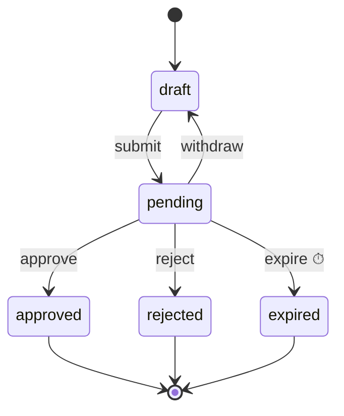

# Guide

A leave request taken from definition to page, then recipes by scenario, a checklist before going live, and troubleshooting. The package is `@nocobase/lifecycle`, with `/jobs`, `/hono`, `/react` and `/testing` entries.

## Quick start: a leave request

An employee submits a request into `pending`; the approver approves or rejects it; a request nobody handles for 72 hours expires; entering `pending` notifies the approver.



### 1. Declare the types

Four type members: the record, its states, the parameters an administrator may override, and the services guards and effects use.

```ts
import type { LifecycleRecord } from '@nocobase/lifecycle';

export type LeaveState =
  'draft' | 'pending' | 'approved' | 'rejected' | 'expired';

export interface Leave extends LifecycleRecord {
  readonly status: LeaveState;
  readonly applicantId: string;
  readonly approverId: string;
  readonly days: number;
}

export interface LeaveTypes {
  record: Leave;
  state: LeaveState;
  parameters: { expireAfterHours: number };
  services: {
    mail: { send(to: string, subject: string, key: string): Promise<void> };
  };
}
```

### 2. Write the effect and the lifecycle

```ts
import {
  defineEffect,
  defineLifecycle,
  type Lifecycle,
  type TransitionContext,
} from '@nocobase/lifecycle';

const notifyApprover = defineEffect<LeaveTypes>({
  name: 'leaves.notifyApprover', // stored on every effect run: keep it stable
  retry: { attempts: 3, backoffMs: 5_000, factor: 2 },
  run: ({ record, services, idempotencyKey }) =>
    services.mail.send(
      record.approverId,
      'A leave request awaits you',
      idempotencyKey,
    ),
});

const applicantOnly = ({ record, actor }: TransitionContext<LeaveTypes>) =>
  actor.id === record.applicantId || {
    code: 'applicantOnly',
    message: 'Only the applicant can do this.',
  };

const approverOnly = ({ record, actor }: TransitionContext<LeaveTypes>) =>
  actor.id === record.approverId || {
    code: 'approverOnly',
    message: 'Only the approver can decide.',
  };

export const leaveLifecycle: Lifecycle<LeaveTypes> =
  defineLifecycle<LeaveTypes>({
    name: 'leaves', // also the default collection name
    initial: 'draft',
    states: [
      'draft',
      'pending',
      { name: 'approved', title: 'Approved', final: true },
      { name: 'rejected', title: 'Rejected', final: true },
      { name: 'expired', title: 'Expired', final: true },
    ],
    parameters: { expireAfterHours: 72 },
    transitions: {
      submit: {
        title: 'Submit',
        from: 'draft',
        to: 'pending',
        guard: applicantOnly,
      },
      withdraw: {
        title: 'Withdraw',
        from: 'pending',
        to: 'draft',
        guard: applicantOnly,
      },
      approve: {
        title: 'Approve',
        from: 'pending',
        to: 'approved',
        guard: approverOnly,
      },
      reject: {
        title: 'Reject',
        from: 'pending',
        to: 'rejected',
        guard: approverOnly,
        validate: (input) =>
          input.reason ? [] : [{ field: 'reason', message: 'Give a reason.' }],
        accept: ['reason'], // written onto the record with the state
      },
      expire: {
        from: 'pending',
        to: 'expired',
        guard: ({ actor }) =>
          actor.system === true || {
            code: 'systemOnly',
            message: 'The system expires a request once the wait has passed.',
          },
      },
    },
    onEnter: { pending: [notifyApprover] },
    triggers: {
      expireStale: {
        transition: 'expire',
        when: 'pending',
        after: ({ expireAfterHours }) => expireAfterHours * 3_600_000,
      },
    },
  });
```

The definition is checked when the module loads: a state with no way out, an unreachable state, or a final state with a transition leaving it throws `INVALID_DEFINITION`.

### 3. Write the migration

The library ships no migration. The record's collection needs three columns, and the plugin creates the two log collections itself; the full field list is in [design.md](design.md#storage), and `packages/examples/app-plugin-lifecycle-example/database/migrations/` is the shape to copy.

```ts
await builder.createCollection('leaves', (table) => {
  table.bigInt('id').primary().autoIncrement().notNull();
  table.string('applicantId').notNull();
  table.string('approverId').notNull();
  table.integer('days').notNull();
  table.string('reason');
  table.string('status').notNull(); // the state
  table.datetimeTz('statusChangedAt').notNull(); // what the trigger sweep reads
  table.integer('lifecycleVersion').notNull().defaultTo(0); // concurrency
  table.index(['status', 'statusChangedAt']);
});
// Then lifecycleTransitions and lifecycleEffectRuns, with a unique index on
// (lifecycle, recordId, version) and one on (lifecycle, recordId, requestId)
// under a `requestId IS NOT NULL` predicate where the dialect supports it.
```

### 4. Assemble the runtime in a provider

```ts
import {
  createRepositoryLifecycleStore,
  LifecycleRuntime,
} from '@nocobase/lifecycle';
import { createLifecycleJobs } from '@nocobase/lifecycle/jobs';

const executors = container.resolve(jobExecutorServiceToken);
const jobs = createLifecycleJobs({
  jobs: executors.getJobExecutor(PACKAGE_NAME),
  schedule: executors.getScheduleExecutor(PACKAGE_NAME),
  jobName: `${PACKAGE_NAME}/effect`, // stored with every queued task: keep it stable
  sweepEveryMs: 60_000,
  onSweep: async () => {
    await runtime.prune({ olderThan: new Date(Date.now() - 7 * 86_400_000) });
  },
});
const runtime = new LifecycleRuntime({
  store: createRepositoryLifecycleStore(
    container.resolve(databaseManagerToken),
  ),
  dispatcher: jobs,
  logger,
});
runtime.register(leaveLifecycle, { services: { mail } });

// In start(): registers the effect job, opens the executors, schedules the
// sweep (reclaim, triggers, onSweep) and recovers what an earlier process left.
await jobs.start(runtime);
// In shutdown():
await jobs.shutdown();
```

Without a dispatcher, effects run in process before `fire()` returns, which is fine while developing. `createLifecycleJobs()` is what to use once the jobs service is there; see the checklist below for what it takes care of.

### 5. Mount the standard routes

Keep the path in `shared/`, so the server's router and the client's hook read the same constant:

```ts
// shared/routes.ts
export const LEAVE_LIFECYCLE_ROUTES: string = 'leaves/lifecycles';
```

```ts
import { createLifecycleRoutes } from '@nocobase/lifecycle/hono';

router.use('/leaves/*', authentication.required());
router.route(
  `/${LEAVE_LIFECYCLE_ROUTES}`,
  createLifecycleRoutes(runtime, {
    lifecycles: ['leaves'],
    actor: (c) => ({ id: String(c.get('auth')?.user.id) }),
    authorize: (access) => access.action !== 'operate', // the default; plug access control in here
  }),
);
// Lists and creation stay with the plugin's own routes; creation calls runtime.create().
```

### 6. Use the hook on the page

Configure the hook once for the plugin's routes, then call it with a lifecycle and a record:

```ts
// client/lib/lifecycle.ts
import { useApiClient } from '@nocobase/app-client';
import {
  createLifecycleHook,
  type UseRecordLifecycle,
} from '@nocobase/lifecycle/react';

import { LEAVE_LIFECYCLE_ROUTES } from '../../shared/routes.js';

export const useLeaveLifecycle: UseRecordLifecycle = createLifecycleHook({
  useTransport: useApiClient,
  basePath: LEAVE_LIFECYCLE_ROUTES,
});
```

```tsx
import { LifecycleRequestError } from '@nocobase/lifecycle/react';

import { useLeaveLifecycle } from '../lib/lifecycle.js';

function LeaveDetail({ id }: { id: string }) {
  const { view, busy, fire } = useLeaveLifecycle('leaves', id);
  if (!view) return null;
  return view.available.map((t) => (
    <Button
      key={t.name}
      disabled={!t.allowed || busy}
      title={t.blockers[0]?.message}
      onClick={() =>
        fire(t.name).catch(
          (e) => e instanceof LifecycleRequestError && toast(e.message),
        )
      }
    >
      {t.title}
    </Button>
  ));
}
```

`fire` sends a fresh request key and the version on screen. The hook refreshes every 4 seconds, so the page follows effects that finish in the background. A third argument adds query parameters to every request, `useLeaveLifecycle('leaves', id, { tenant })`; the hook builds its client once per transport and query, so the object can be written inline. `client` on the result fires on a record the page has not selected, such as one it has just created.

### 7. Write the tests

```ts
import { createLifecycleTestKit } from '@nocobase/lifecycle/testing';

it('expires a request nobody handles', async () => {
  const kit = createLifecycleTestKit(leaveLifecycle, {
    services: { mail: fakeMail },
  });
  const leave = await kit.start(
    { applicantId: 'lin', approverId: 'wang', days: 2 },
    { actor: 'lin' },
  );
  await kit.fire(leave, 'submit', {}, { actor: 'lin' });
  kit.advance({ hours: 73 });
  await kit.runTriggers();
  expect(kit.get(leave).status).toBe('expired');
  expect(await kit.history(leave)).toEqual(['$create', 'submit', 'expire']);
});
```

## By scenario

Each recipe below is a paragraph; [examples.md](examples.md) has the code for most of them.

**Never write the state field directly.** The library does not protect it. Writing `status`, `statusChangedAt` or `lifecycleVersion` through an ordinary Repository or SQL bypasses the guards, the log, the effects and the version check, and leaves no trace of who did it. Change state with `runtime.fire()`, create with `runtime.create()`, and write a data fix as a transition only the system may fire.

### Tell the person why a button is greyed out

A guard returns `true` to allow, or `false`, a message, or `{ code, message }` to refuse. `view().available[i].blockers` and the `blockers` on the `LifecycleError` that `fire()` throws are the same list. A stable `code` lets the page translate the reason; the example plugin's client does this through its locale files. When the state is wrong, `can()` answers with a blocker whose `source` is `state`.

### Validate input and write fields onto the record

`validate(input)` returns `[{ field, message }]`, a message, or `null`. A refusal has code `INVALID_INPUT` and lists the problems, so the page can mark each field. `accept: ['reason']` copies those input fields onto the record as they are; `set` runs after it and wins on the same field. The state, timestamp and version fields cannot be accepted.

### One button, several destinations

Write `to` as an array and `route(context)` to pick one. The expense report's `submit` goes straight to `approved` or to `awaitingManager` depending on the amount. `set` receives `to`, so it can write fields per destination.

### Record a change without changing the state

A self-transition has the same `from` and `to`: handing an approval to someone else, an escalation, a follow-up reply. The version still increments and `statusChangedAt` is still updated, so a trigger starts its wait again.

### Start from almost any state

`from: '*'` means every non-final state; `from: { except: ['draft', 'approved'] }` means every non-final state but those.

### Act on a timeout

Declare a trigger: `when` is the state, `after(parameters)` returns milliseconds. The transition it fires runs as the system (`actor.system === true`); usually give it a guard that refuses everyone else, so a person cannot click it.

### Call an external system, retry, then move on

Write an effect. `retry`, `timeoutMs` and `shouldRetry` control the retries; pass `idempotencyKey` to the external system; `onSuccess: 'paid'` fires the next transition as the system with the run's result as input, and `accept: ['paymentRef']` on that transition writes the result onto the record. `onFailure` receives `{ error }`.

### Refuse duplicate submissions and stale pages

Calling the runtime directly, pass `requestId` and `expect: { version }`; the React hook sends both on its own. A webhook uses the sender's delivery id as its `requestId`.

### Create a record

Use `runtime.create(name, values, { actor, state? })` rather than an insert. It writes the `$create` log entry, starts the version at 1 and runs the initial state's `onEnter` effects. When `initial` lists several states, `state` picks one. Who may create a record, and what it must hold, belongs in the definition's `create: { validate, guard }` rather than in a route: `runtime.create()` checks the values, then the guard, inside its transaction and refuses with the same `INVALID_INPUT` and `GUARD_REJECTED` a transition does, so an import or a script meets the rule the form does. Being allowed to create a draft is not being allowed to submit it; that stays the submitting transition's guard.

### Let another plugin veto an action

`runtime.addGuard('expenses', ['approve'] | '*', guard)` adds a guard without touching the definition; its refusals join the other blockers, and the returned function removes it.

### Write other tables with the state

Put `onTransition(context)` on the transition. It runs in the same transaction after the record and the log entry are written; `context.transactionHandle` is the transaction, and throwing rolls everything back. Nothing that reaches outside the database belongs here — that is an effect.

### Read other tables from a guard

Register the services as a factory, `(handle) => services`, so the services a guard, `route` or `set` receives are bound to the transaction. On SQLite anything else deadlocks.

### Subscribe to changes

`runtime.on('completed', { lifecycle, transition }, listener)` fires once per transition and creation; `'entered'` filters by the state entered; `'announce'` fires once per transition the new state allows, which is what a to-do list needs. The returned function unsubscribes. Delivery is best effort.

### Operate: list, retry, cancel, prune

`listEffectRuns({ status: 'failed' })` finds the failed runs; `retryRun(id)` runs a `failed`, `dead` or `cancelled` run again with a fresh budget of attempts; `cancelRun(id)` gives up on a `queued` or `running` one; `prune({ olderThan })` deletes old `succeeded` and `cancelled` runs. The retry and cancel routes are `operate` actions, refused unless `authorize` allows them.

### Draw the state diagram

`toMermaid(runtime.describe('leaves'))` produces a Mermaid state diagram: ⏱ marks a trigger, ✓ and ✗ mark an effect's `onSuccess` and `onFailure`. `GET /:lifecycle` on the standard routes already includes it as `diagram`.

## Before going live

| Item                                 | Requirement                                                                                                                                                               | If missed                                                                                                                                                                                            |
| ------------------------------------ | ------------------------------------------------------------------------------------------------------------------------------------------------------------------------- | ---------------------------------------------------------------------------------------------------------------------------------------------------------------------------------------------------- |
| A dispatcher that honours `runAfter` | `createLifecycleJobs()` waits out a retry's backoff before queueing the job; a dispatcher of your own must do the same with the `runAfter` it is given                    | Retries have no backoff and burn through their attempts in milliseconds                                                                                                                              |
| Register the job before consuming    | `createLifecycleJobs().start()` registers the effect job before `setup()`; a dispatcher of your own must too                                                              | Tasks an earlier process queued find no handler                                                                                                                                                      |
| Sweep on a schedule                  | `start()` schedules `reclaim()`, `runTriggers()` and `onSweep` every `sweepEveryMs`, which must be well below the shortest `after`. Several instances may sweep at once   | Timeouts never fire, and an attempt whose process died stays claimed until a restart                                                                                                                 |
| Recover on start                     | `start()` runs `recover()` after both executors are open                                                                                                                  | Runs queued before a restart never run                                                                                                                                                               |
| Prune                                | Put `runtime.prune()` in `onSweep`, deleting `succeeded` and `cancelled` runs older than a week or so                                                                     | The effect run table grows without bound                                                                                                                                                             |
| `timeoutMs` below `leaseMs`          | `leaseMs` is five minutes by default. Every effect's `timeoutMs`, and the real running time of an effect without one, must stay under it; the runtime does not check this | `reclaim()` takes back an attempt that is still running and runs it again. The old attempt's result is fenced out, but the external call may have happened twice; only the idempotency key saves you |
| Idempotency keys on external calls   | Pass `idempotencyKey` to payments, mail and the like, or use it as the unique key of your own ledger                                                                      | Retries and recovery pay or send twice                                                                                                                                                               |
| An index for the sweep               | `(status, statusChangedAt)` on the record's collection                                                                                                                    | Every sweep is a full table scan                                                                                                                                                                     |
| Services bound to the transaction    | Register them as `(handle) => services`                                                                                                                                   | Deadlocks on SQLite                                                                                                                                                                                  |
| `authorize` on the routes            | Distinguish at least `read`, `fire` and `operate`. Guards express business rules, not permissions                                                                         | Any signed-in user can view and operate. The examples' `authorize: () => true` is for the demo only                                                                                                  |

## Troubleshooting

| Symptom                                   | Cause                                                                                                                                                                                                                               | What to do                                                                                                                                                                                                                     |
| ----------------------------------------- | ----------------------------------------------------------------------------------------------------------------------------------------------------------------------------------------------------------------------------------- | ------------------------------------------------------------------------------------------------------------------------------------------------------------------------------------------------------------------------------ |
| Frequent `CONFLICT`                       | The record changed while the page was open (`expect.version` no longer matches), or two requests really arrived together                                                                                                            | Expected. Tell the person the record changed, reload, and let them decide again; do not retry automatically. If the conflicts come from a trigger or a continuation, check whether they compete with people for the same state |
| A request hangs on SQLite                 | A guard, `route`, `set` or `onTransition` reads or writes through the database manager and waits for the connection the transaction holds                                                                                           | Switch to a services factory and read through the `transactionHandle`                                                                                                                                                          |
| An effect run stays `queued`              | (1) this process has not registered the effect: `registered: false` in `listEffectRuns()` and "is not registered; it stays queued" in the log, usually after a rename; (2) the dispatch was lost; (3) `runAfter` has not come       | (1) register the old name again, or cancel the runs; (2) `reclaim()` on the sweep hands it over once it has been due for a lease, and `recover()` at the next start; (3) wait                                                  |
| An effect run becomes `dead`              | Every attempt ended without recording an outcome: the process crashed or was killed mid-attempt, or the outcome write failed each time                                                                                              | Find out why the process stops on this effect — memory, a timeout — then `retryRun()`                                                                                                                                          |
| A run is `failed` and the record is stuck | The attempts ran out, or `shouldRetry` said no, and the effect has no `onFailure`                                                                                                                                                   | Fix the cause and `retryRun()`; success fires `onSuccess` as usual. For an automatic fallback, add `onFailure` to a state a person handles                                                                                     |
| A trigger never fires                     | (1) nothing calls `runTriggers()`; (2) the record was not created through `runtime.create()` and `statusChangedAt` is empty; (3) a self-transition restarted the wait; (4) the guard refuses the trigger, which is skipped silently | Check each. For (4), `can(name, id, transition, SYSTEM_ACTOR)` shows the blockers                                                                                                                                              |
| The sweep throws `AggregateError`         | A transition failed for a reason other than a state race or a guard: a broken definition or a failing store. The other records were handled                                                                                         | Read the "Trigger … could not fire …" log lines and fix each                                                                                                                                                                   |
| `INVALID_SET` on create                   | `values` set the state, timestamp or version field                                                                                                                                                                                  | Remove them. To start in a non-default initial state, pass `create(..., { state })`                                                                                                                                            |
| `INVALID_DEFINITION` on load              | An unreachable state, a final state with a way out, a non-final state without one, or `accept` naming a field the lifecycle manages                                                                                                 | Fix the definition; a state that genuinely has no way out is `final: true`                                                                                                                                                     |
| A duplicate submission got through        | The caller generates a new `requestId` each time, for example `client.fire()` inside a retry loop                                                                                                                                   | Reuse one `requestId` for the retries of one user action; webhooks use the sender's delivery id                                                                                                                                |

Changing a definition that is already in production is covered in [design.md](design.md#changing-a-definition).

## Error codes

`LifecycleError` carries `code`, `message`, `blockers` and `problems`. The standard routes map codes to HTTP statuses as below, and `LIFECYCLE_ERROR_STATUS` from `@nocobase/lifecycle/hono` is the same table for a plugin's own routes.

| Code                                                                               | HTTP | When                                                                                                    |
| ---------------------------------------------------------------------------------- | ---- | ------------------------------------------------------------------------------------------------------- |
| `GUARD_REJECTED`                                                                   | 403  | A guard refused; `blockers` says why                                                                    |
| `INVALID_STATE`                                                                    | 409  | The current state does not allow the transition, or a run is not in a state the operation allows        |
| `CONFLICT`                                                                         | 409  | A concurrent change, or `expect` not met (a stale page)                                                 |
| `INVALID_INPUT`                                                                    | 400  | `validate` refused; `problems` lists the fields                                                         |
| `INVALID_ROUTE` / `INVALID_SET`                                                    | 400  | `route` returned a state not in `to` / `set` or `create` wrote a field the lifecycle manages            |
| `UNKNOWN_LIFECYCLE` / `UNKNOWN_TRANSITION` / `UNKNOWN_EFFECT` / `RECORD_NOT_FOUND` | 404  | Nothing by that name here; `UNKNOWN_EFFECT` is a retry of a run whose effect this process does not know |
| `INVALID_DEFINITION`                                                               | 500  | A broken definition, thrown when the module loads                                                       |

## The standard routes

`createLifecycleRoutes(runtime, { actor(c), authorize?(access, actor, c), lifecycles? })` returns a Hono app. A refusal answers `{ code, message, blockers, problems }`. Without `authorize`, only `operate` is refused; the routes do not authenticate, and an `actor` that throws refuses the request.

| Request                                                                               | `access.action` | Answer                                 |
| ------------------------------------------------------------------------------------- | --------------- | -------------------------------------- |
| `GET /:lifecycle`                                                                     | `describe`      | `{ description, parameters, diagram }` |
| `GET /:lifecycle/:id`                                                                 | `read`          | `RecordView`                           |
| `POST /:lifecycle/:id/fire` with `{ transition, input?, requestId?, expectVersion? }` | `fire`          | `RecordView & { replayed }`            |
| `POST /:lifecycle/:id/runs/:runId/retry`                                              | `operate`       | `RecordView`                           |
| `POST /:lifecycle/:id/runs/:runId/cancel`                                             | `operate`       | `RecordView`                           |

`@nocobase/lifecycle/react` wraps them. `createLifecycleHook({ useTransport, basePath, refreshMs })` returns a hook, `(lifecycle, id, query?) => …`, that a page calls once; it is built on two lower-level pieces kept for tests and for code outside a component: `createLifecycleClient({ transport, basePath, query })`, which needs only a `request({ method, path, query, json })` function such as the application's API client, and `useLifecycle(client, lifecycle, id, { refreshMs })`. The hook returns `{ client, description, view, error, busy, fire, retryRun, cancelRun, reload }`. A refusal rejects with a `LifecycleRequestError` carrying `code`, `blockers` and `problems`.
