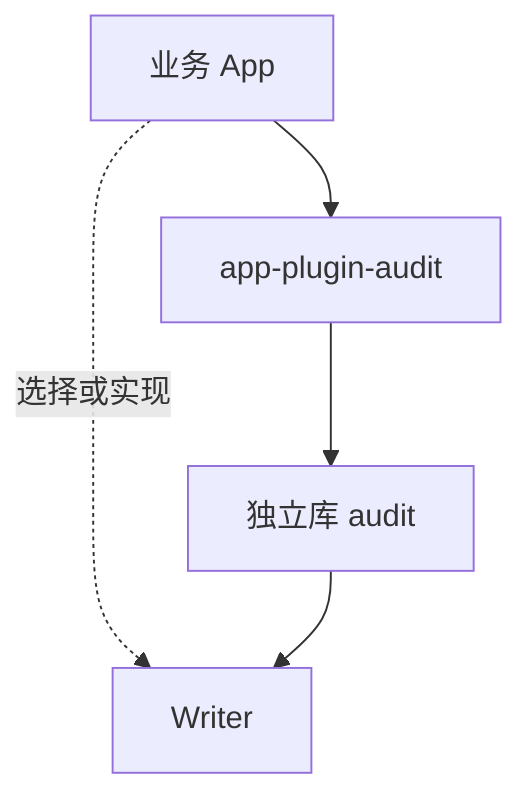
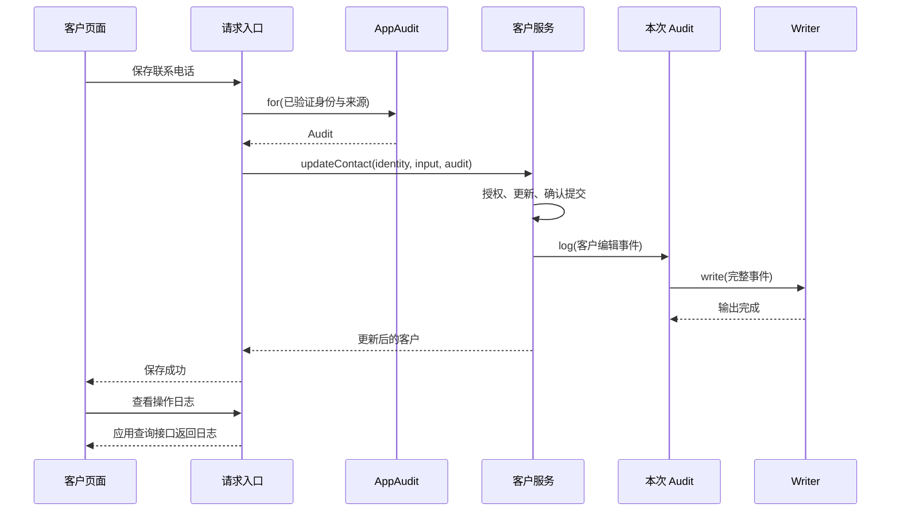

# 审计能力设计

**状态：首版实现说明。** 本文说明模块分工、主要接口和协作过程；短代码为关键伪代码，可运行实现见 `packages/examples/app-plugin-audit-example`。使用步骤见[使用手册](../README.md)。

## 1. 提供什么能力

审计记录业务事实：谁，在什么时候，对什么对象，做了什么，结果如何。业务显式调用 `audit.log()`，基础能力补充公共信息并输出到指定存储；应用决定记录哪些事实、哪些字段，以及怎样展示。

以客户管理页面为例：用户修改客户联系电话并保存。服务端完成更新后记录“编辑客户”；用户打开自己的操作日志，可以看到操作人、客户、时间和脱敏后的号码变化。新增、删除以及业务特有的操作使用同一入口。


该能力不替业务执行更新，也不会通过观察数据库变化猜测操作含义。例如，“编辑客户”和“批量修正客户资料”可能执行相同的数据库更新，却需要不同的动作名称、来源和摘要。一条业务操作可以产生一条或多条事件，由业务调用点表达。对 Code Agent 而言，主要工作是找到事实确认的位置，取得本次 Audit，构造记录并调用。

首版交付完整的记录基础能力与 NocoBase 接入：独立脚本能使用同一事件协议和 Writer，App 能把它接入真实业务，应用自己的页面能读取落库结果。它不以开启自动采集开关作为使用方式，也不要求先建立一套全平台执行上下文。

## 2. 模块与对象关系



| 模块                | 负责                                                                                     |
| ------------------- | ---------------------------------------------------------------------------------------- |
| `@nocobase/audit`   | Audit、事件协议、createAudit、校验、快照、公共字段、错误和可替换的输出适配               |
| `app-plugin-audit`  | AppAudit、原始 auditServiceToken、Provider 装配、执行绑定、入口接入与失败处理帮助、Skill |
| 业务 App / 业务插件 | 事件名称与调用点、内容选择及脱敏、业务授权与事务、存储映射、查询和页面                   |

lib 的核心可以独立使用，不依赖 App、Hono、认证或 Workflow。首版提供可复用的 Repository、Drive 与本地 JSONL 输出适配，通过按需子入口组织；具体表名、字段映射与连接由应用提供。使用 Repository 本身不是必须把适配器放进业务 App 的理由。

插件将这些能力接入宿主的容器、认证结果和生命周期，提供入口接入示例、失败处理帮助及 Agent Skill。它不拥有客户模型，也不要求所有业务采用同一张表。具体 App 可以直接使用 lib，选择插件是为了复用 NocoBase 装配与接入方式。

Server 容器中的 `auditServiceToken` 对应 `AppAudit`，每个 App 一个实例。共享的是 Writer 和装配信息；`appAudit.for()` 返回本次执行独有的 `Audit`，绑定身份与来源，交给业务函数使用。

```ts
interface AppAudit {
  for(context: AppAuditContext): Audit;
}
interface Audit {
  log(input: AuditInput): Promise<void>;
}
interface AuditWriter {
  write(event: AuditEvent): Promise<void>;
}
interface CreateAuditOptions {
  context(): AuditContext;
  write(event: AuditEvent): Promise<void>;
}
declare function createAudit(options: CreateAuditOptions): Audit;
```

Token 从插件 `./server` 导出，消费者导入原始对象。for 只绑定、校验和隔离上下文，不执行认证，不写日志；请求 Audit 不保存进跨用户共享的 Service。Client 没有额外审计 Service，页面使用宿主 API Client 访问应用查询接口。

AppAudit 与 lib 的连接如下。`snapshotAuditContext` 是 lib 提供的上下文校验、复制与冻结函数，业务无需重复实现。宿主 appName 不能被调用参数覆盖。

```ts
const appAudit: AppAudit = {
  for(input) {
    const bound = snapshotAuditContext({ ...input, appName: app.appName });
    return createAudit({
      context: () => bound,
      write: (event) => writer.write(event),
    });
  },
};
```

`context()` 是 lib 取得公共上下文的同步契约，每次 log 调用时读取并捕获；App 接入中始终返回本次执行已绑定的上下文。独立使用者也可以提供它，但不能依赖跨并发任务共享的可变“当前用户”。Writer 对象经 write 回调接入内核，因此 lib 无需解析容器或寻找数据库。

## 3. 主要调用与事件内容

入口验证身份后绑定一次，业务沿参数取得 Audit。下面假定客户更新已完成，示例仅展示审计调用：

```ts
const appAudit = app.container.resolve(auditServiceToken);
const audit = appAudit.for({
  actor: { type: 'user', id: session.user.id },
  source: { type: 'http', requestId },
});
await audit.log({
  action: 'crm.customer.updated',
  target: { type: 'crm.customer', id: 'C-1001' },
  result: 'success',
  data: { changedFields: ['phone'] },
});
```

log 返回 `Promise<void>`，等待 Writer 完成本次约定的输出，失败向调用方传播。它不返回客户记录，不自动刷新页面，也不要求先注册 action。action 是稳定业务标识，页面再将它翻译成“编辑客户”；target.type 同样采用业务标识，不绑定物理表名，数据库调整不会改变既有事件含义。

| 字段                                      | 来源与含义                                                       |
| ----------------------------------------- | ---------------------------------------------------------------- |
| `id`、`schemaVersion`、`occurredAt`       | 内核生成的 UUID、协议版本、调用时的 UTC 时间                     |
| `appName`                                 | App 接入时由宿主补充；独立使用时由调用方提供                     |
| `actor`                                   | 实际执行者，如 `{ type: 'user', id: 'u-17' }`                    |
| `source`                                  | HTTP、WS、Job 及其请求、消息、任务标识                           |
| `tenantId?`、`initiator?`、`operationId?` | 可信租户、原始发起者及业务关联号                                 |
| `action`、`target?`                       | 业务动作及对象 `{ type, id }`；对象未确定时可省略 target         |
| `result`                                  | success、denied 或 failure，描述业务结果                         |
| `data?`                                   | 应用自定义 JSON；可以是变化字段、脱敏前后值或原因码，缺省为 `{}` |

业务只能提交 action、target、result 和 data，不能覆盖已绑定身份。actor 与 initiator 可以不同，例如“用户发起、后台服务执行”。operationId 用于关联多个事件，不是业务幂等键；事件 id 标识一次记录，不能据此推断一次业务只执行过一次。关联标识由入口传入，跨请求或任务时由应用显式延续。

AuditInput 是业务描述，AuditContext 是执行背景，AuditEvent 是两者经过校验并补齐公共字段后的独立记录。三个对象分开，使客户服务无需理解 HTTP 请求，而输出适配器也无需反查当时的用户和客户状态。occurredAt 表示 log 被调用的时间，不是事务开始时间或存储确认时间。

字段选择和脱敏使用业务自己的普通函数，在调用 log 前形成可记录的内容；不要求声明字段规则或注册统一处理器。这个函数可由客户模块内的多个调用点复用，切换 Writer 不需要改它。原始表单、会话和完整数据库记录不自动进入日志。

可选字段缺省时直接省略；JSON 中的 undefined 不被静默忽略。内核在第一个异步输出前完成上下文读取、输入校验和独立快照，补齐 ID、时间等公共字段，再交给 Writer。调用方之后修改原对象不能改变已提交的事件；Writer 接收只读事件，不反向修改业务输入。data 只接受普通 JSON 值，循环引用、函数和 ORM 实例等无效输入在输出前失败，不能靠序列化静默丢字段。

一条事件只调用一次 write。多条事件之间的顺序、批量汇总及多个输出目的地由具体业务或 Writer 决定，内核不自动拆事件、不自动重试。这样业务描述、记录形成与外部输出有清楚的分工，而无需增加必填 process 管线。

## 4. Writer、装配与可选接入

Writer 只接收完整事件并完成输出。通用 Repository 适配器负责调用 createOne，应用提供 repository 和事件到列值的映射；手册直接展示这段映射，便于看清实际入库内容。各输出适配器接收相同事件，不再解析身份或脱敏。首版交付 Repository、Drive 与本地 JSONL；Logger 和其他外部服务可由应用另行实现。

| 输出方式       | write 完成表示什么                           | 应用仍需负责什么                         |
| -------------- | -------------------------------------------- | ---------------------------------------- |
| Repository     | 当前写入按连接契约完成；独立提交时可据此查询 | 表结构、映射、索引、迁移和读取           |
| Drive          | 配置存储盘的 put 已确认本次对象写入          | 复用宿主存储配置、保留策略及对象检索     |
| Logger / JSONL | 事件已按适配器约定交给日志系统或完成文件写入 | 明确缓冲、flush 与落盘保证，接入检索系统 |
| 外部服务       | 已获得约定的远端确认                         | 认证、超时、限流及外部查询方式           |

Drive Writer 复用 `@nocobase/drive` 已配置的 FS 或 S3 存储盘（含兼容 endpoint），不另建云存储配置。对象存储没有通用追加接口，因此每条事件写一个含单行 JSON 的独立对象，路径按前缀、base64url 编码的应用名、UTC 日期与事件 UUID 分区；多实例无需竞争同一文件。等待 put 确认，不增加内存缓冲或 Writer 重试；驱动自身的重试仍遵循其契约。代价是一条事件一次对象写入，批量合并与归档不在首版实现。请求 private 可见性；禁用 ACL 的存储由桶策略控制访问；FS 需选私有盘，目录权限与静态访问由应用管理。本地 JSONL 仍用于直接追加本机文件。

write resolve 不统一等于“永久落盘”。每个适配器必须说明完成点；特别是 Logger 接受事件不等于传输完成。基础 log 不承诺跨多个输出的原子性。共享字段选择发生在输出之前，因此切换存储不会绕过业务的脱敏逻辑。

Provider 在注册阶段提供 AppAudit 门面，启动时调用 `audit.createWriter(services)`。工厂返回 `{ writer, dispose? }`，允许异步准备；未完成启动时不接受绑定。路由和任务随后取得服务。请求只创建绑定对象，不重复创建连接。停止时先拒绝新写入，再等待已接收的写入结束，最后调用一次 `dispose`；只有工厂自建资源需要此回调，借用的 DatabaseManager 或 Logger 仍归宿主管理。工厂是装配位置，不是动态配置管理功能。

审计是可选依赖，但是否使用必须在应用装配时确定。需要审计的应用缺少 Writer 或服务注册时应暴露装配错误；明确不需要审计的部署可在业务组合处注入无操作的 Audit。输出故障属于运行错误，不能被当作“未启用”自动降级。业务服务始终接收同一个小接口，是否安装插件不会迫使它依赖容器或添加分散的开关判断。

## 5. 从保存到查看日志



客户示例使用 App 自有的 `auditExampleOperations`。它保存事件字段，并将 target 拆为 targetType/targetId 便于查询；id 为主键，时间使用 datetimeTz。示例额外保存 ownerId，以当前认证用户隔离客户与日志；删除后仍依据日志 ownerId 授权。表名、索引和保留策略由 App 决定，迁移由示例业务插件拥有。协议字段不等于每个存储必须采用同名列。

以 u-17 修改 C-1001 为例，客户表更新一行，日志表新增一行：action 为 crm.customer.updated，result 为 success，data 中保留 phone 的脱敏前后值。新增客户使用创建结果中的 ID；删除客户仍保存原目标 ID，日志不因客户行删除而级联消失。没有实际变化时不产生 updated 成功事件。

读取由 App 使用现有 Repository 和路由能力完成。示例接口一次返回最多 100 条时间倒序记录，页面同时展示动作、执行者 ID、来源和 data；暂未实现分页和单独详情接口。页面复用已有 API Client。Writer 不承担查询，替换输出目标也不会自动获得一个新的日志页面。数据查询仍受 App 授权控制，无需为审计新增另一套权限系统。

应用已有客户历史模型时，可以把事件映射进去，或者让日志与历史按目标及关联号连接。操作时间线可以复用审计事件；完整字段版本、状态重建与恢复需要另行定义数据完整性，不能从一份选择性记录且已脱敏的 data 推导出来。

## 6. 三类执行入口与记录覆盖

三类入口都沿用一条路径：**入口取得可信信息 → for 绑定本次 Audit → 传给业务服务 → 业务确认结果后 log**。下列伪代码中的 appAudit 是应用共享服务，identity 和 input 已由各入口准备、校验；客户服务沿用手册中的更新与记录过程。

**HTTP：每次请求绑定，身份来自已验证的会话。**

```ts
const audit = appAudit.for({
  actor: { type: 'user', id: session.user.id },
  source: { type: 'http', requestId },
});
await customers.update(identity, input, audit);
```

**WS：每条业务消息绑定，使用当前有效的连接身份与服务端消息标识。** 仅适用于 App 自有、已认证的业务消息处理器；内置 Realtime 订阅协议不增加业务写入口。

```ts
const audit = appAudit.for({
  actor: { type: 'user', id: principal.userId },
  source: { type: 'ws', connectionId, messageId },
});
await customers.update(identity, input, audit);
```

**Job：每次任务尝试绑定，this.context 来自 worker，执行者为后台服务。**

```ts
const audit = appAudit.for({
  actor: { type: 'service', id: 'customer-maintenance' },
  initiator: { type: 'user', id: trustedOwnerId },
  source: {
    type: 'job',
    jobId: this.context.jobId,
    attempt: this.context.attempt,
  },
});
await customers.update(identity, input, audit);
```

用户发起的后台执行可另带可信 initiator，不能直接信任任务参数中的 userId。跨进程重新绑定 Audit；WS 不将首条消息的 Audit 缓存到整个连接。

**覆盖由业务事实决定，记录放在共同业务服务中，入口不重复 log。**

| 业务事实               | 记录位置                  | 动作与结果                             |
| ---------------------- | ------------------------- | -------------------------------------- |
| 新增客户               | 创建提交后，已取得真实 ID | crm.customer.created / success         |
| 修改客户               | 更新提交后，且确有变化    | crm.customer.updated / success         |
| 删除客户               | 删除提交后，保留原目标 ID | crm.customer.deleted / success         |
| 拒绝或失败，按需求接入 | 对应业务分支              | 对应 action / denied 或 failure        |
| 后台修正客户           | 同一客户服务的提交位置    | updated / success，source 区分任务来源 |
| 取消编辑或内容未变     | 不记录编辑成功            | 无 updated 事件                        |

三类入口遵守同一完成约定：成功事件在最外层提交后记录；审计错误区分无效输入与输出失败，应用决定处理方式。手册采用尽力记录并受控诊断，不因审计失败重跑已经完成的业务；首版仍有提交后漏记窗口。

插件的示例、测试和 Skill 应覆盖“保存 → 写入 → 查看”、HTTP 与 Job 的真实接入、一个 App 自有 WS 消息处理示例的身份隔离，以及 Writer 替换。敏感权限修改、登录失败等由对应模块维护覆盖清单并接入。

提交后调用采用 `logAuditBestEffort(audit, input, report)`：只诊断安全错误码及事件 ID，诊断本身出错也不改变已提交结果。普通 `audit.log()` 仍向调用者抛错。首版允许提交后输出失败造成漏记，不宣称业务与审计原子提交。

## 7. 首版不实现

| 不实现或不作为首版路径                             | 对应边界                                                                 |
| -------------------------------------------------- | ------------------------------------------------------------------------ |
| Workflow 适配                                      | 首版不修改 Workflow 执行器或执行选项，不提供 Workflow 接入帮助与验收示例 |
| `addRepositoryRule()`、`addHttpRule()` 和规则引擎  | 不自动采集全部 CRUD、请求或响应；业务显式 log                            |
| App Server 统一执行上下文、公开 `runtime.run()`    | 审计不要求先建设全平台执行设施                                           |
| ALS 自动取得当前 Audit                             | 首版只提供显式绑定主路径，不同时维护两套业务入口                         |
| 强制统一审计表或强制历史表                         | 应用选择存储和映射；不为了数据历史立即拆出另一插件                       |
| 版本历史、字段回放、恢复                           | 日志中的变化摘要不等于完整历史版本                                       |
| 通用日志查询 API、统一管理 UI                      | App 按自身存储和业务视角提供读取与页面                                   |
| 事件注册 DSL、必填字段规则和处理管线               | 业务使用普通代码选择字段、脱敏和表达事实                                 |
| 自动重试补偿、可靠发件箱、跨输出原子性、防篡改证明 | 基础 log 不提供这些保证                                                  |
| 引入 CAP 等外部审计框架的运行时                    | 参考其事件与输出分工，不引入整套框架依赖                                 |

这些范围限制不排除以后按真实需求扩展。首版保留的完整主线是：独立库与 Writer、App 接入、可信身份绑定、业务显式记录，以及应用自己的读取路径。
